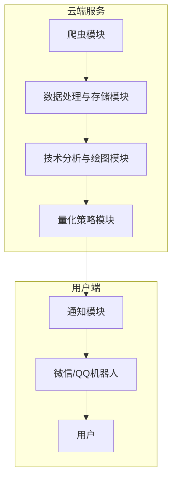
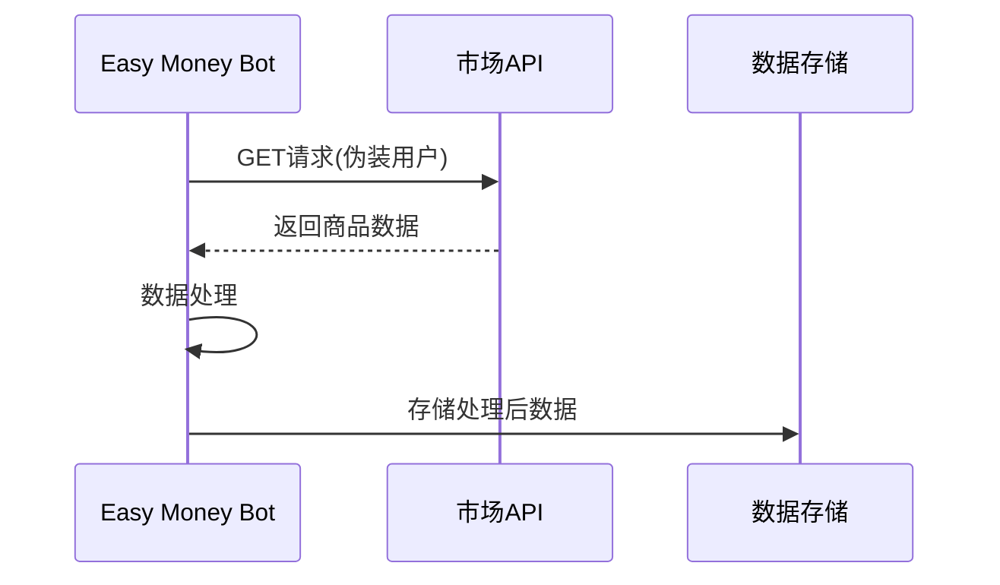
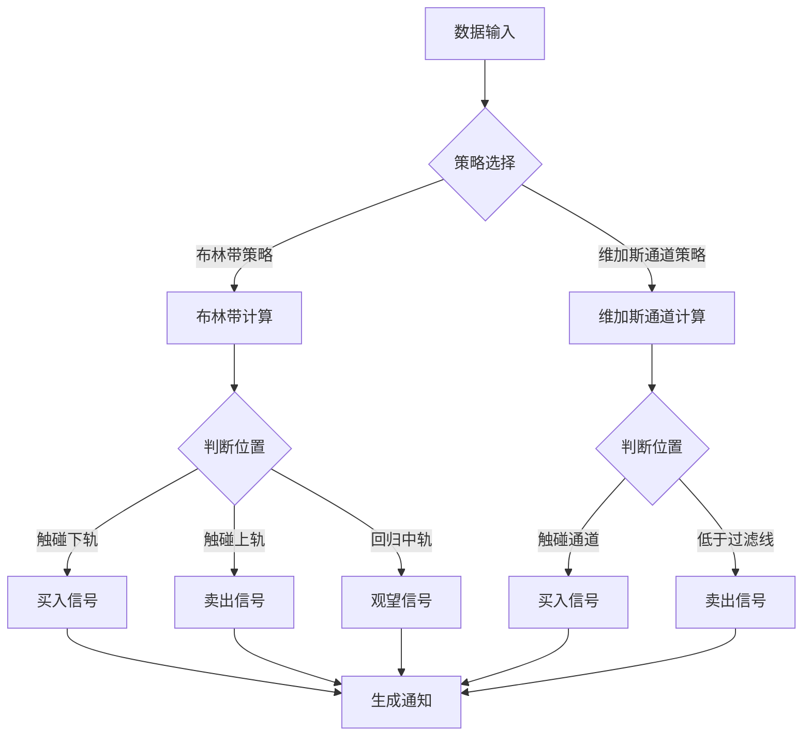

# Easy Money Bot - CS2市场数据爬虫与分析系统

## 项目概述

Easy Money Bot是一个基于Python的爬虫系统，专为CS2市场数据收集、分析和量化交易策略设计。系统通过定期抓取市场API数据，进行技术分析，应用量化策略，并通过聊天机器人向用户推送交易建议。

## 系统架构



## 功能模块

### 1. 爬虫模块
- 托管在云端服务器（GitAction）
- 每4小时执行一次爬取
- 伪装用户请求获取数据
- 支持多商品、多时间段数据获取
- 数据范围：300天历史数据



### 2. 数据处理与存储模块
- 数据清洗与标准化
- SQLite数据库存储
- 支持JSON/TXT备份

### 3. 技术分析与绘图模块
- K线图绘制
- 布林带指标（周期：20天，标准差：2）
- 维加斯通道指标（EMA1: 12, EMA2: 144, EMA3: 169）

### 4. 量化策略模块
- 策略1：基于布林带的买卖信号
  - 触碰下轨：买入信号
  - 触碰上轨：卖出信号
  - 回归中轨：观望信号
- 策略2：基于维加斯通道的买卖信号
  - 触碰通道：买入信号
  - 低于过滤线：卖出信号



### 5. 通知模块
- 微信机器人集成
- 交易信号推送
- 图表分享功能

## 技术栈

### 爬虫框架
- **requests**: HTTP请求库，用于API数据获取
- **fake-useragent**: 用户代理伪装

### 数据处理与分析
- **pandas**: 数据处理与分析
- **numpy**: 数学计算支持

### 数据可视化
- **matplotlib**: 基础绘图库
- **mplfinance**: 金融数据可视化

### 数据存储
- **sqlite3**: 轻量级数据库
- **json**: JSON数据处理

### 量化分析
- **ta-lib** 或 **pandas-ta**: 技术分析指标计算

### 通知系统
- **itchat** 或 **WeChatPy**: 微信机器人集成

### 部署与自动化
- **GitHub Actions**: 自动化部署与定时任务

## 项目配置

主要参数配置：
- `CATEGORY_MONTH`: 300（获取的历史数据天数）
- 爬虫执行频率: 每4小时一次
- 布林带参数: 周期20天，标准差倍数2
- 维加斯通道参数: EMA1 12，EMA2 144，EMA3 169

## 环境配置与安装

### 系统要求
- Python 3.10+
- Conda 包管理器
- Git

### 安装步骤

1. 克隆仓库
```bash
git clone https://github.com/yourusername/easy-money-bot.git
cd easy-money-bot
```

2. 使用Conda创建环境
```bash
conda env create -f environment.yml
```

> **注意**：项目已配置清华大学开源软件镜像站作为conda源，可大幅提高在中国大陆地区的包下载速度。如果您在其他地区，可能需要修改`environment.yml`文件中的channels配置。

3. 激活环境
```bash
conda activate easy-money-bot
```

4. 配置环境变量
创建`.env`文件，填入必要的配置信息：
```
# API配置
API_URL=https://xxx.xxx.com/user/steam/category/v1/kline
FAV_URL=https://xxx.xxx.com/user/fav/url
PLATFORM=steam
DATA_TYPE=default

# 策略参数
CATEGORY_MONTH=300
BOLLINGER_PERIOD=20
BOLLINGER_STD=2
VEGAS_EMA1=12
VEGAS_EMA2=144
VEGAS_EMA3=169

# 爬虫配置
CRAWL_INTERVAL=4  # 小时
```

5. 初始化数据库
```bash
python src/storage/init_db.py
```

### 目录结构
```
easy-money-bot/
├── config/               # 配置文件
│   └── settings.py       # 全局设置
├── data/                 # 数据存储
│   └── db.sqlite         # SQLite数据库
├── src/                  # 源代码
│   ├── crawler/          # 爬虫模块
│   ├── storage/          # 数据存储模块
│   ├── analysis/         # 技术分析模块
│   ├── strategy/         # 量化策略模块
│   └── notification/     # 通知模块
├── tests/                # 测试代码
├── .github/              # GitHub Actions配置
│   └── workflows/        
│       └── crawler.yml   # 爬虫定时任务
├── environment.yml       # Conda环境配置
├── requirements.txt      # 依赖管理
└── README.md             # 项目说明
```

### 依赖库说明

本项目使用以下主要库：

- **requests & fake-useragent**: 网络请求与用户代理模拟
- **pandas & numpy**: 数据处理与分析
- **matplotlib & mplfinance**: 数据可视化与金融图表
- **pandas-ta**: 技术分析指标计算
- **itchat**: 微信机器人接口
- **schedule**: 定时任务调度
- **pyecharts**: 交互式图表生成
- **python-dotenv**: 环境变量管理

## 后续开发计划

1. 实现基础爬虫模块
2. 完成数据处理与存储功能
3. 实现技术分析与绘图功能
4. 开发量化策略模块
5. 集成微信机器人通知系统
6. 部署到GitHub Actions
7. 系统测试与优化