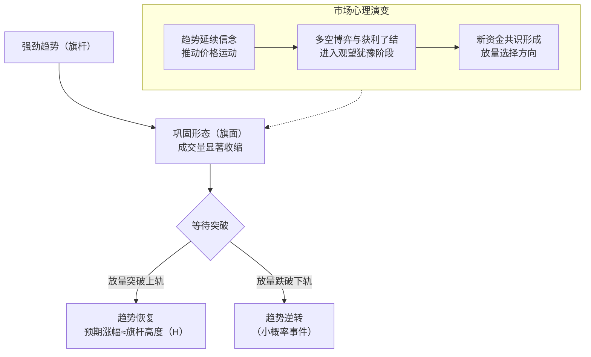
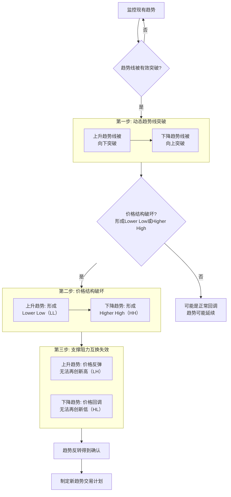
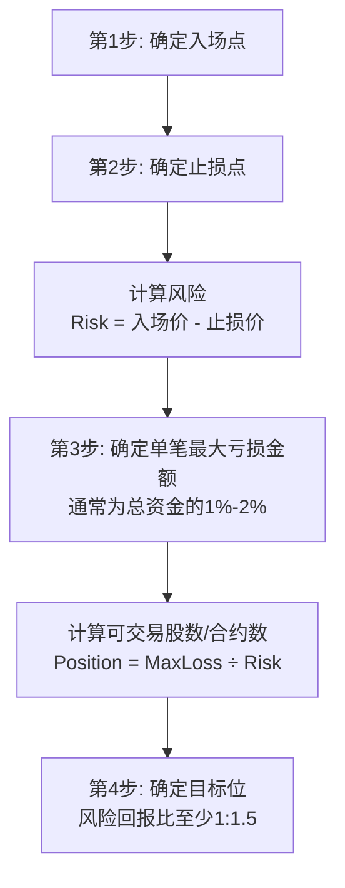
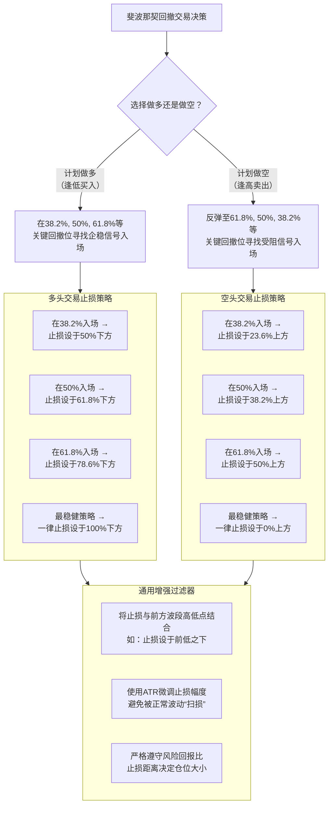

# 交易笔记
> 2025.9.15 \
> 因为感觉光看书不输出，知识进不了脑子，所以再开一个笔记，用来记录读书笔记，总结方法论。\
> 内容采用自己输出+AI总结，格式与之前学习编程不保持一致。

[TOC]

## 交易定式

## 穷爸爸，富爸爸

## 日本蜡烛图技术

## 专业投机原理

## 股市趋势技术分析
> 把这本书误以为是《高级趋势技术分析》了，跟着B站老师看了一部分，感觉也挺不错，比《高级》要好入门很多。决定先把这个看完，再补《高级》。

### 趋势的三个阶段

趋势是一个非常核心的高级技术分析概念。它源于**道氏理论（Dow Theory）**，是所有趋势分析的基石。定义为下：

1.  **主要趋势（Primary Trend）**
    *   **定义**：又称**大趋势**或**长期趋势**，是市场整体性的、主导性的方向性运动。它是投资者需要识别和遵循的最重要的趋势。
    *   **时间跨度**：通常持续**一年到数年**。
    *   **比喻**：海洋的**潮汐（Tide）**。它决定了海水是涨潮还是退潮的大方向。

2.  **次级趋势（Secondary Trend）**
    *   **定义**：又称**中期趋势**或**修正趋势**，它发生在主要趋势的过程中，是对主要趋势的**反向修正**。
    *   **时间跨度**：通常持续**三周至三个月**，偶尔更长。
    *   **幅度**：通常会**回撤掉**其之前的主要趋势波段（牛市中的上涨或熊市中的下跌）的 **1/3 到 2/3**，最常见的是**50%**（斐波那契回撤的38.2%, 50%, 61.8%是关键位置）。
    *   **比喻**：潮汐中的**波浪（Wave）**。在涨潮中，会有退回的波浪；在退潮中，也会有涌来的波浪。

3.  **小型趋势（Minor Trend）**
    *   通常指持续**不到三周**的短期波动。道氏认为这类趋势缺乏规律性，**易受人为操纵**，且可能对主要和次级趋势产生“噪音干扰”，因此在分析长期趋势时应**忽略**。

#### 牛市中的表现

一个完整的牛市由一个**主要上升趋势**和数个**次级下跌趋势（回调）** 构成。

*   **主要趋势（向上）**：
    *   **表现**：整体结构是**一系列更高的高点（HH）和更高的低点（HL）**。经济面向好，投资者信心不断增强，资金持续流入。
    *   **技术特征**：价格长期运行在200日等长期移动平均线之上，均线呈多头排列。

*   **次级趋势（向下回调 - Correction）**：
    *   **表现**：发生在主要上升趋势中**暂时性的、方向向下的价格下跌**。
    *   **成因**：通常是投资者**获利了结**所致。可能由短期利空消息触发，但不会改变经济的根本向好趋势。
    *   **技术特征**：
        *   价格会跌破短期均线（如20日、50日），但通常会在**长期均线（如200日）或前期重要支撑位**找到支撑。
        *   **成交量**：在下跌回调时，成交量通常会**逐渐萎缩**。这表明抛压是有限的，并非恐慌性出货。
        *   **动能指标**：RSI、MACD会从超买区回落至中性甚至超卖区，为下一次上涨蓄积动能。
    *   **结局**：回调结束后，市场会重拾升势，并**突破前一个高点（HH）**，从而确认主要上升趋势的恢复。

**牛市示意图**：`上升（主要）-> 回调（次级）-> 上升（创新高，主要）-> 回调（次级）-> ...`

##### 牛市的特征

牛市，或称多头市场，是一个主要趋势向上的长期价格运动过程。

**第一阶段：积累期（或吸筹阶段）**

*   **市场心理**：**绝望 → 怀疑 → 犹豫**
    *   这是熊市末尾和牛市开始的过渡阶段。市场情绪依然被悲观和绝望笼罩，最后的弱势持有者因失望而抛售筹码。但聪明的资金（Smart Money）和先知先觉的投资者已经认识到价值，开始悄然买入。坏消息仍然出现，但市场不再创新低，开始“对利空麻木”。
*   **价格行为**：
    *   价格结束下跌趋势，开始构筑**底部形态**，如头肩底、双重底、圆弧底等。
    *   波动性逐渐降低，交易区间收窄。
    *   价格开始小幅上移，但会频繁出现反复和拉锯。
*   **成交量特征**：
    *   在下跌尾声**抛售高潮**（Selling Climax）中出现巨量，之后成交量逐渐萎缩。
    *   在价格上涨时成交量温和放大，回调时成交量萎缩，显示出初步的吸筹迹象。
*   **技术信号**：长期移动平均线（如200日均线）开始走平，价格尝试向上突破长期均线。

**第二阶段：大众参与期（或主升浪）**

*   **市场心理**：**希望 → 乐观 → 确信**
    *   经济数据好转，企业盈利提升，利好消息开始出现。公众投资者意识到趋势已经转变，信心不断增强并大规模涌入市场。这是趋势最强劲、最持久的阶段。
*   **价格行为**：
    *   价格呈现**一系列更高的高点和更高的低点**。
    *   上涨幅度大、时间长，回调短暂而轻微。
    *   趋势明确，易于识别和跟随。
*   **成交量特征**：
    *   **价涨量增，价跌量缩**——这是健康上升趋势的典型量价配合。
    *   在突破关键阻力位时，成交量会显著放大。
*   **技术信号**：所有移动平均线呈完美的多头排列，价格沿短期均线上行。动能指标（如RSI、MACD）在强势区域运行，即使出现超买也可能持续很久。

**第三阶段：扩散期（或派发阶段）**

*   **市场心理**：**自信 → 狂热 → 自满**
    *   市场被极度乐观的情绪主导，媒体铺天盖地都是利好消息，散户投资者疯狂入市，认为“这次不一样”。然而，内部人士和聪明资金正在利用这种狂热气氛，将手中的股票派发给最后一批接盘者。
*   **价格行为**：
    *   上涨动能减弱，出现**动能背离**（价格创新高，但RSI等指标未创新高）。
    *   价格波动加剧，出现宽幅震荡，形成诸如**头肩顶**、**双重顶**等顶部形态。
    *   市场广度下降，虽然指数可能还在创新高，但许多个股已提前见顶回落。
*   **成交量特征**：
    *   在疯狂上涨时可能出现**天量**，但后续难以维持，表明购买力已枯竭。
    *   在下跌时成交量放大，反弹时成交量缩小，量价关系出现恶化。
*   **技术信号**：价格与长期均线的乖离率极大，多次出现假突破和顶部反转形态。

#### 熊市中的表现

一个完整的熊市由一個**主要下降趋势**和数个**次级上升趋势（反弹）** 构成。

*   **主要趋势（向下）**：
    *   **表现**：整体结构是**一系列更低的高点（LH）和更低的低点（LL）**。经济面恶化，投资者信心低迷，资金不断流出。
    *   **技术特征**：价格长期被压制在200日等长期移动平均线之下，均线呈空头排列。

*   **次级趋势（向上反弹 - Rally）**：
    *   **表现**：发生在主要下降趋势中**暂时性的、方向向上的价格上涨**。
    *   **成因**：通常是**技术性超卖**后的“空头回补”或投资者“抄底”行为所致。可能是由短期利好消息刺激，但无法扭转经济的衰败趋势。
    *   **技术特征**：
        *   价格会突破短期均线，甚至挑战中期均线（如50日、100日），但通常会在**长期均线（200日）或前期重要阻力位（如前一个LH点）** 遭遇强大阻力并回落。
        *   **成交量**：在反弹上涨时，成交量可能**初期放大，但难以持续**，或者整体量能不足。这表明买盘力量是短暂的，并非真正的资金入场。
        *   **动能指标**：RSI、MACD会从超卖区反弹至中性甚至超买区，为下一次下跌做准备。
    *   **结局**：反弹结束后，市场会恢复下跌，并**跌破前一个低点（LL）**，从而确认主要下降趋势的恢复。这种反弹在华尔街被称为 **“死猫反弹”（Dead Cat Bounce）** 。

**熊市示意图**：`下跌（主要）-> 反弹（次级）-> 下跌（创新低，主要）-> 反弹（次级）-> ...`

##### 熊市的特征
熊市，或称空头市场，是一个主要趋势向下的长期价格运动过程。它本质上是牛市的镜像。

**第一阶段：派发期（或分配阶段）**

*   **市场心理**：**自满 → 怀疑**
    *   这正是牛市的第三阶段。市场在狂欢中见顶。聪明的资金开始卖出，但公众仍然沉浸在牛市的幻想中，将每一次下跌视为买入机会。
*   **价格行为**：
    *   形成大型**顶部反转形态**。
    *   价格跌破关键趋势线支撑。
*   **成交量特征**：反弹时缩量，下跌时放量。

**第二阶段：恐慌性下跌期（主跌浪）**

*   **市场心理**：**希望破灭 → 恐惧 → 恐慌**
    *   经济恶化，盈利下滑，坏消息接踵而至。投资者意识到情况不妙，恐慌性抛售涌现。“多杀多”和强制平仓导致价格出现**瀑布式下跌**。
*   **价格行为**：
    *   价格呈现**一系列更低的高点和更低的低点**。
    *   下跌非常迅猛，反弹微弱而短暂（“死猫反弹”）。
*   **成交量特征**：
    *   在暴跌中**成交量急剧放大**，这是恐慌盘的标志。
    *   暴跌末期可能出现“**抛售高潮**”（Selling Climax），表现为巨量长阴线，这往往是阶段见底的信号。
*   **技术信号**：所有均线呈空头排列，价格远离长期均线向下运行。

**第三阶段：绝望期（或吸筹阶段的开始）**

*   **市场心理**：**恐慌 → 绝望 → 麻木**
    *   经过惨烈下跌，投资者信心彻底崩溃。即使股价已很低，悲观情绪仍导致最后的持有者因绝望而卖出。坏消息满天飞，但市场下跌动能逐渐衰竭，不再对利空做出反应。价值投资者和聪明资金开始再次悄然买入，为下一个牛市周期做准备。
*   **价格行为**：
    *   下跌速度放缓，从急跌转为**阴跌**或横盘震荡。
    *   开始构筑**底部形态**。
*   **成交量特征**：
    *   **成交量极度萎缩**，表明抛压已经枯竭。
    *   如果出现放量上涨，可能是新资金入场的早期迹象。
*   **技术信号**：RSI、MACD等指标出现**底背离**（价格创新低，指标未创新低）。长期移动平均线开始走平。

#### 游戏市场的表现

趋势主要分为三种，长期的主要趋势，中期的次要趋势和短期的小趋势。三种趋势分别代表了不同时间尺度下市场可能的走向。

游戏市场是长期向好的，很少看到有的品一夜之间价格归零（抽象神车、贴纸韭菜盘除外）。据自己观察，游戏市场中许多品都是上升空间大于下降空间。形成价格锚定后，哪怕是黄盾级别的末日，也只是一个小小的次级趋势，事情一过去，又会回到主升浪中，继续走出新高度。

在游戏市场中吃米，最关键的就是顺应趋势。上面提到的牛市，熊市三个阶段，实际上就对应了鱼头，鱼身和鱼尾。在游戏市场中，没有那么多复杂的、费力的规则，只要稍稍关注下板块拉伸的情况，就能知道现在处于哪一个阶段。情绪也是一个参考因素：**如果哪一天看到大家都吃米了，自己也想忍不住冲里面，那大概率就是牛市的最后一轮；如果看到大家都在亏米，叫苦连天，讨论从买入那个饰品，到什么时候解套，那也大概率意味着熊市的开始**。

##### 通过回撤判断趋势
按自己理解，游戏市场中牛市的回调，大概率是会这样走（以黄盾之后为参考）：

1. 轻度回调，价格回撤到斐波那契的0.236-0.382左右，可能踩到0.382，就会马上弹回去。这在一轮牛市开始的时候，尤为常见。有些品甚至会横盘，由此可见庄家和背后资金量强度。
2. 中度回调，价格回撤到斐波那契的0.382-0.5左右。这种情况个人觉得相对少见，因为游戏市场是情绪主导的市场，大量散户看到崩盘的可能，会恐慌抛售，此时一般回撤力度会大很多。
3. 高度回调，价格回撤到斐波那契的0.5-0.618左右。恐慌，或者爆拉后的回调，较大概率落在这个区间。当然在这个区间可以入场，但是止损会更低，需要放到趋势开始的地方。更合理的做法是配合重叠区，K线结构来定夺。
4. 末日回调，价格回撤到斐波那契的0.786左右。仅仅作为黄盾级别的末日的参考而言。五一大崩盘直接A下来，更加夸张。二者是有区别的，区别在于五一末日是资金硬拉+情绪火热，上涨没有结构可言。黄盾前的末日，是标准的牛市走向，因此没有直接A到底。

### 重要反转形态
#### 一、头部反转形态（预示上升趋势结束，下降趋势开始）

##### 1. 头肩顶（Head and Shoulders Top） - **王者形态**

*   **表现**：
    *   **左肩**：一段强劲上涨后的一次新高，伴随大量成交，随后正常回调。
    *   **头部**：再次上涨，创出比左肩更高的高点，但**成交量通常低于左肩**（首次警示信号），随后回调至前次低点附近。
    *   **右肩**：第三次上涨，**无力创出新高**，高点低于头部，成交量明显萎缩，再次回落。
    *   **颈线**：连接左肩和头部回落的低点形成一条支撑线。颈线可以是水平、向上或向下倾斜的（斜率可能暗示了多头方力量的衰弱）。
*   **验证条件**：
    1.  **颈线突破**：价格**有效跌破颈线**是最终的确认为号。未跌破颈线前，形态可能失败。
    2.  **成交量确认**：**突破颈线时必须伴有成交量显著放大**。这是卖压强劲的证明，是形态有效的核心。
    3.  **反抽**：跌破颈线后，价格经常会对颈线进行一次**反抽测试**，此时颈线已变为阻力位。反抽时成交量应萎缩，这是最后的做空机会。

*   **目标测算**：从头部最高点到颈线的垂直距离（H），从颈线突破点向下投射同等距离（H）。

**示例：**

- 探员索尔曼的头肩顶形态。后续出现的末日级别下跌，是因为黄盾导致，但即使没有黄盾，后续探员走势也是逐渐变弱。
  

---

##### 2. 双重顶（Double Top） - "M顶"

*   **表现**：
    *   价格两次上攻**大致相同的高点**后回落，形成两个显著的峰值。
    *   第一个峰伴随大量成交，第二个峰成交量**显著萎缩**，表明买方力量衰竭。
*   **验证条件**：
    1.  **颈线突破**：**有效跌破两个峰值之间的谷底（即颈线）**。
    2.  **成交量确认**：跌破颈线时成交量放大，增加有效性。

*   **目标测算**：从峰值高点到颈线的垂直距离（H），从颈线突破点向下投射同等距离（H）。

**示例：**
- 大盘指数：五一的顶和现在的顶，能够看出到了五一的顶之后，出现了比较大的抛压（也可能是黑蛋暴雷导致的）。
  

- 面具男聒噪：以前炒的飞起的探员，由此套牢了一堆人，所以后续探员行情都不能上桌。
  
---

##### 3. 圆弧顶（Rounding Top）

*   **表现**：
    *   价格在一段长期上涨后，上升动能逐渐消失，走势由向上转为横向，再缓慢转为向下，形成一个圆弧状的顶部。
    *   **成交量**：也呈现圆弧状，顶部区域成交量萎缩，开始下跌时成交量放大。
*   **验证条件**：
    1.  **趋势线突破**：有效跌破连接圆弧起始点的长期上升趋势线。
    2.  **成交量确认**：下跌加速时伴随成交量增加。

**示例：**
- 面具男聒噪：游戏里按日线来，很少出现圆弧顶，所以这里还是用小丑举例，只是换成了时线，仅供形态参考。
  

---

#### 二、底部反转形态（预示下降趋势结束，上升趋势开始）

##### 1. 头肩底（Head and Shoulders Bottom） - **头肩顶的镜像**

*   **表现**：与头肩顶相反。
    *   **左肩**：下跌后的一个低点，随后反弹。
    *   **头部**：再次下跌，创出**新低**，但成交量萎缩，随后反弹。
    *   **右肩**：第三次下跌，**未创新低**，成交量进一步萎缩。
    *   **颈线**：连接左肩和头部的反弹高点。
*   **验证条件**：
    1.  **颈线突破**：价格**有效放量突破颈线**是最终确认信号。**底部形态对成交量放大的要求比顶部形态更严格**。
    2.  **回踩**：突破后常有回踩颈线（现已成为支撑）的动作。

*   **目标测算**：与头肩顶相同。

**示例：**
- 飞贼波兹曼：阴跌+末日之后走出了头肩底形态，随后突破颈线，强势上涨。
  

---

##### 2. 双重底（Double Bottom） - "W底"

*   **表现**：价格两次下探**大致相同的低点**后反弹，形成两个显著的谷底。
    *   第二个底形成时，成交量通常**极度萎缩**，表明抛压枯竭。
*   **验证条件**：
    1.  **颈线突破**：**有效放量突破两个谷底之间的峰值（即颈线）**。这是形态成立的唯一标准。
    2.  **成交量确认**：**突破时成交量必须急剧放大**，这是资金入场的铁证。

*   **目标测算**：与双重顶相同。

**示例：**
- 面具男聒噪：在强势上升后开始不断回调，最后底部几乎落在同一个地方，斐波那契回撤0.618左右。
  
---

##### 3. 圆弧底（Rounding Bottom） - **“炒锅底”**

*   **表现**：
    *   价格长期下跌后，跌势逐渐减缓，走势由向下转为横向，再缓慢转为向上，形成一个圆弧状的底部。
    *   **成交量**：在底部时呈地量，随着价格右半部上升，成交量持续温和放大。
*   **验证条件**：
    1.  **颈线突破**：有效放量突破连接圆弧起始点的阻力位（颈线）。
    2.  **成交量确认**：右半部上涨过程伴随有序的放量。

---

#### 三、其他重要反转形态

相比之下，这些形态在游戏市场里基本很难看到，或者不会产生作用。

##### 1. 上升/下降楔形（Rising/Falling Wedge）

*   **表现**：
    *   **上升楔形（看跌）**：价格在两条**收敛且向上倾斜**的趋势线内震荡，但上涨动能减弱，成交量持续萎缩。它通常发生在趋势末尾。
    *   **下降楔形（看涨）**：价格在两条**收敛且向下倾斜**的趋势线内震荡，但下跌动能减弱，成交量萎缩。它是常见的底部形态。
*   **验证条件**：
    1.  **突破方向**：**上升楔形通常向下突破**，**下降楔形通常向上突破**。突破方向与形态之前的短期趋势相反。
    2.  **成交量确认**：突破时成交量放大。

##### 2. 岛形反转（Island Reversal）

*   **表现**：
    *   一个密集交易区间前后各出现一个**缺口**，使该区间K线在图表上像一个“孤岛”。
    *   **顶部岛形**：先是向上缺口（耗尽性缺口），后是向下缺口（突破性缺口）。
    *   **底部岛形**：先是向下缺口，后是向上缺口。
*   **验证条件**：
    1.  **第二个缺口**：第二个缺口的出现是确认信号。
    2.  **成交量**：岛形区间内成交量较大，第二个缺口突破时成交量也很大。

---

#### **高级验证的核心原则（超越单一形态）**

1.  **成交量是生命的呼吸**：**所有底部形态的突破必须有无可争议的成交量放大来确认**。顶部形态的突破也需放量，但要求可稍低。
2.  **市场背景（趋势）**：反转形态必须发生在**一个明确的现有趋势之后**。没有趋势，则无所谓反转。一个“头肩顶”如果出现在横盘整理中，就毫无意义。
3.  **形态的规模与持续时间**：**形态越大（宽度）、持续时间越长，一旦突破后的潜力就越大**。月线图上的头肩顶远比5分钟图上的头肩顶重要。
4.  **支撑/阻力转换**：颈线被突破后，其角色会发生转换（支撑变阻力，阻力变支撑）。后续的**反抽/回踩测试是增强信号有效性的重要环节**。
5.  **多时间框架共振**：在日线图上看到一个潜在的双重底，再去周线图上看是否出现了趋势衰竭的信号（如底背离），去小时图上看突破时是否量价齐升。多时间框架确认能极大提高胜率。
6.  **与技术指标的共振**：观察RSI、MACD等动量指标在形态形成过程中是否出现**背离**（如价格创新低而指标未创新低），这是隐藏在形态背后的强大动能确认信号。

**总结**：永远记住——**“未经突破确认的形态，都只是潜在的形态”**。耐心等待价格完成对关键位置（颈线、趋势线）的有效突破，并辅以成交量的验证，是运用反转形态进行交易而不被假信号欺骗的铁律。

### 中继形态
三角形形态是技术分析中极其重要且常见的一类形态，它们既可以作为**持续形态**，也可以作为**反转形态**，但更多情况下被视为**持续形态**。

它们代表了市场的**犹豫不决和 consolidation（盘整）**，是多空双方力量暂时达到平衡的时期，为下一次趋势运动积蓄能量。

以下是四种重要的三角形形态及其详细分析：

---

#### **1. 对称三角形（Symmetrical Triangle）**

*   **表现**：
    *   **结构**：由一条**逐渐下降的上趋势线**（阻力）和一条**逐渐上升的下趋势线**（支撑）构成。两条趋势线呈收敛对称状态，意味着高点不断降低，低点不断抬高。
    *   **市场心理**：表明多空双方力量势均力敌。买方在价格回落时愿意买入（推高低点），卖方在价格反弹时愿意卖出（压低高点）。这种平衡导致波动范围越来越小，最终等待消息或动力来选择方向。
    *   **成交量**：在形态形成过程中，**成交量应持续萎缩**。这反映了市场参与者的犹豫和观望情绪。

*   **验证与交易信号**：
    1.  **突破方向**：对称三角形本身是**中性形态**，没有固有的方向性倾向。**关键在于等待价格伴随成交量有效突破任何一条趋势线**。突破方向即为后续趋势方向。
    2.  **成交量确认**：**突破时必须伴有成交量的显著放大**，尤其是向上突破时。向下突破时，成交量放大最好，但不是绝对必须（因为下跌可以无需量能推动）。
    3.  **时间限制**：突破通常发生在三角形横向宽度的 **1/2 到 3/4** 处。如果价格波动至三角形顶端才突破，则信号较弱，可能是假信号。
    4.  **反抽**：突破后，价格常会反抽至被突破的趋势线（此时已转化为支撑/阻力位），这是二次入场的机会。

*   **目标测算**：
    *   测量三角形最**宽处的高度**（AB两点的垂直距离）。
    *   从突破点（C点）开始，向上或向下投射同样的垂直距离（CD）。

**示例：**

- 渐变M9：一个清晰的三角收敛，最后选择向上突破
  

---

#### **2. 上升三角形（Ascending Triangle）**

*   **表现**：
    *   **结构**：由一条**水平的阻力线**和一条**上倾的支撑线**构成。价格的高点基本处于同一水平，而低点不断抬高。
    *   **市场心理**：这通常是一个**看涨**形态。水平阻力线代表固定的供给区域（卖压），但每次回落的低点都更高，表明买方越来越急于入场，需求强劲，正在逐步吸收卖压。最终，需求战胜供给，价格向上突破。
    *   **成交量**：形态内成交量萎缩。**在向上突破时，必须伴有巨量成交**，这是确认信号的关键。

*   **验证与交易信号**：
    1.  **预期方向**：**强烈偏向看涨突破**。大部分情况下出现在上升趋势中作为中继形态。
    2.  **突破确认**：**必须等待价格放量突破上方水平阻力线**。未突破前，可能会失败。
    3.  **假信号**：极少数情况下会向下突破上倾的支撑线，这通常意味着形态失败，是趋势转弱的强烈信号。

*   **目标测算**：与对称三角形相同。测量三角形最宽处的高度，从突破点向上投射。

**示例：**
- 探员索尔曼：上升三角形在游戏里也不是很容易看到，大量爆拉决定了这种形态难以发生。这里抓到了一个，看起来和横盘一样，确实属于中继形态。
  

---

#### **3. 下降三角形（Descending Triangle）**

*   **表现**：
    *   **结构**：与上升三角形相反。由一条**水平的支撑线**和一条**下倾的阻力线**构成。价格的低点基本处于同一水平，而高点不断降低。
    *   **市场心理**：这通常是一个**看跌**形态。水平支撑线代表固定的需求区域（买盘），但每次反弹的高点都更低，表明卖方越来越积极，供给旺盛，正在逐步击穿买盘。最终，供给战胜需求，价格向下破位。
    *   **成交量**：形态内成交量萎缩。向下突破时，成交量放大可增强有效性，但并非绝对必要。

*   **验证与交易信号**：
    1.  **预期方向**：**强烈偏向看跌突破**。常见于下跌趋势中作为中继形态，也可出现在顶部作为反转形态。
    2.  **突破确认**：**必须等待价格跌破下方水平支撑线**。
    3.  **假信号**：若价格反而向上突破下倾的阻力线，则是看涨信号，表明买方最终赢得了战斗。

*   **目标测算**：测量三角形最宽处的高度，从突破点向下投射。

**示例：**
- 探员索尔曼：这大概就是所谓阴跌阶段的形态，游戏里同样难见。大多数就是一泻千里，和下降楔型很类似，但不代表游戏里能涨。
  

---

#### **4. 扩散三角形（Broadening Formation / Megaphone Top）**

*   **表现**：
    *   **结构**：与收敛三角形相反。由一条**上倾的阻力线**和一条**下倾的支撑线**构成，形成一个开口放大的“喇叭形”。价格的高点越来越高，低点越来越低。
    *   **市场心理**：反映市场情绪**失控、混乱和非理性**。买方和卖方都变得非常情绪化，一方疯狂地买，另一方疯狂地卖，导致波动性急剧增加。这通常出现在市场的主要顶部，是**反转形态**，预示着趋势的终结。
    *   **成交量**：成交量在形态内也呈**扩散状态**，即价格大幅摆动时放量，回调时缩量。

*   **验证与交易信号**：
    1.  **倾向性**：**通常看跌**，常见于牛市末期。但任何方向的突破都可能发生。
    2.  **突破确认**：由于形态的疯狂特性，**交易难度较大**。更安全的策略是等待价格最终跌破**第三个低点**（或更低点）形成的下倾支撑线，并伴随成交量增加。
    3.  **风险**：这是一个**高风险形态**，因为其波动性极大，止损很难设置。

*   **目标测算**：难以精确测算，但通常跌幅会很大。

#### **5. 矩形形态**

矩形形态，又称**箱体整理**，是一种典型的**持续形态**。它表示市场在一段时间内处于**多空双方力量均衡**的状态，价格在两条平行的水平直线之间上下波动，上方阻力位和下方支撑位都难以被有效突破，形成了一个像“箱子”或“走廊”一样的交易区间。

**市场心理解读：**
*   价格到达区间上轨时，卖方认为价格过高而抛售，形成阻力。
*   价格到达区间下轨时，买方认为价格划算而买入，形成支撑。
*   在这个过程中，市场正在进行 **“换手”** 。看好的新资金和获利了结的旧资金在此进行交换，为下一次趋势运动积蓄能量。最终，当一方力量耗尽，另一方将主导市场并实现突破。

---

##### **矩形形态的识别与交易要点**

| 特征项           | 具体描述                                                                                                                   | 图示说明（想象）                                                             |
| :--------------- | :------------------------------------------------------------------------------------------------------------------------- | :--------------------------------------------------------------------------- |
| **形态结构**     | 至少需要**两个基本一致的高点**和**两个基本一致的低点**，从而连接成两条平行的水平线。                                       | `--- 阻力线 ---`   `│    │    │`   `│    │    │`   `--- 支撑线 ---` |
| **成交量特征**   | 形态内的典型特征是**成交量逐渐萎缩**。价格在区间内来回波动时，成交量会减少。**关键信号在于突破时的成交量：必须显著放大！** | 突破时成交量柱突然增高                                                       |
| **形态性质**     | 主要作为**持续形态**（中继），即原有趋势暂停整理后，大概率沿原方向突破。少数情况下也可作为**反转形态**。                   |                                                                              |
| **突破方向预测** | **本身无方向倾向**。最终突破方向决定了后续走势。统计上，与**原有主要趋势方向一致**的突破概率稍高。                         |                                                                              |
| **目标测算**     | 经典理论：突破后的最小价格目标为 **矩形箱体的垂直高度（H）**。从突破点算起，向上突破则加H，向下突破则减H。                 | 目标位 = 突破点 ± H                                                          |

---

##### **何时需要密切关注矩形的形态改变？**

矩形形态并非一成不变，它可能演化或失败。在以下关键时刻，你必须高度警惕：

###### **1. 突破的关键时刻**

这是最需要关注的时刻，因为很多突破可能是“假”的。

*   **有效突破的确认**：
    *   **价格收盘价**：必须关注**收盘价**是否成功站在区间之外，而不仅仅是盘中刺破。一根坚定的K线（长阳线/长阴线）收盘在区间外是重要信号。
    *   **成交量**：**向上突破必须伴有成交量的急剧放大**，这是需求强劲入场的铁证。向下突破时，成交量放大最好，但不是绝对必要。
    *   **突破幅度**：通常要求突破幅度超过箱体高度的3%（或其他个人设定的阈值），或连续两根K线收在区间外，以避免假信号。

*   **警惕假突破**：
    *   价格短暂突破区间后，**迅速拉回区间内**继续震荡，这就是假突破。
    *   假突破往往是**主力资金设置的陷阱**，旨在清洗止损单或引诱反向交易者。一旦遇到假突破，应立即调整策略，这意味着震荡可能持续，甚至可能向相反方向真突破。

##### **2. 形态内部的演变**

*   **成交量异常**：如果在形态内部，某次反弹至阻力位时成交量异常巨大，但价格却无法突破，这可能意味着**派发**，暗示后续向下突破的概率增大。反之，如果在支撑位下跌时缩量，反弹时微微放量，可能意味着**吸筹**。
*   **区间结构变化**：如果价格不再能触及某一条边线（例如，连续几次反弹都无力碰到上轨），这可能表明力量平衡正在悄悄改变，一方力量正在减弱，是趋势可能提前改变的早期预警。

##### **3. 突破后的行为**

*   **回抽确认**：价格突破后，经常会**再次回踩**被突破的支撑线（ now 变为阻力线）或阻力线（ now 变为支撑线）。这个回抽动作是**二次入场或加仓的绝佳机会**。
*   **回抽后再度跌破/升破**：如果价格在回抽时，**不是止步于支撑/阻力位，而是又回到了矩形区间内部**，那么这个突破很可能失败，形态宣告无效。这是非常重要的**止损或反向操作信号**。

##### **交易策略与风险控制**

1.  **入场**：
    *   **激进型**：在矩形下轨附近买入，上轨附近卖出。这是一种逆势操作，风险较高，要求区间足够稳定。
    *   **稳健型**：**等待突破确认后入场**。这是推荐的主流做法。
2.  **止损**：
    *   如果做多，止损位设在矩形区间的下轨下方。
    *   如果做空，止损位设在矩形区间的上轨上方。
    *   如果是根据突破入场，可以将止损设在矩形区间的**中间位置**，甚至是另一侧边线，以过滤噪音。
3.  **止盈**：
    *   首要目标位就是矩形的高度H。
    *   如果趋势非常强劲，可以结合趋势线、前高/前低等其他技术工具来寻找更大的目标。

**总结来说，矩形形态是一个“暴风雨前的宁静”阶段。最重要的不是预测它向哪边突破，而是耐心等待市场自己做出选择，并在突破发生时，通过价格和成交量的配合来验证其真实性，然后果断跟随。永远对“假突破”保持警惕，并严格执行止损纪律。**

---

#### **高级应用与总结**

| 形态           | 倾向         | 成交量模式                     | 关键验证             | 市场心理       |
| :------------- | :----------- | :----------------------------- | :------------------- | :------------- |
| **对称三角形** | **中性**     | 内部萎缩，突破放量             | **等待方向性突破**   | 犹豫、平衡     |
| **上升三角形** | **看涨**     | 内部萎缩，**向上突破必须巨量** | **放量突破水平阻力** | 需求吸收供给   |
| **下降三角形** | **看跌**     | 内部萎缩，向下突破可放量       | **跌破水平支撑**     | 供给压倒需求   |
| **扩散三角形** | **反转看跌** | 混乱且放大                     | **跌破下倾支撑线**   | 情绪失控、混乱 |

**核心要点：**
1.  **永远等待突破**：在价格突破趋势线之前，所有形态都只是“潜在”的。提前预判方向入场风险极高。
2.  **成交量是终极验证**：尤其是对于看涨突破，成交量是区分真突破和假突破（Bull Trap）的生命线。
3.  **时间框架**：形态在越大的时间框架（如周线、月线）上形成，其突破后的意义和目标幅度就越大。
4.  **融入趋势背景**：在主要上升趋势中出现的“上升三角形”，其看涨中继的成功率远高于在下跌趋势中出现的“上升三角形”。

### 巩固形态
巩固形态是技术分析中极其重要的一类形态。它们代表了市场趋势中的“休息期”或“喘息期”，通常预示着原有趋势在经过调整后将继续运行。

前面提到的头肩底等反转形态也是巩固形态的一种,二者区别在于出现在趋势中,还是趋势末尾.如果是趋势中,则往往趋势继续.

*   **市场心理**：在一轮强劲的趋势后，部分交易者选择获利了结，导致价格暂停前进。同时，看好趋势的交易者则视回调为入场机会。多空双方在此阶段暂时达成平衡，进行**筹码换手**，为趋势的下一次发力积蓄能量。
*   **与反转形态的根本区别**：**巩固形态发生在现有趋势的方向上**，是趋势的暂停；而反转形态则发生在趋势的末端，预示着趋势方向的改变。

---

#### **巩固形态的四大共同特征**

无论具体形式如何，一个有效的巩固形态通常具备以下四个关键特征：

##### 1. **趋势先行**
   *   **表现**：形态之前必须存在一个清晰、可辨识的**趋势**（上升或下降）。没有趋势，则无所谓“持续”。
   *   **重要性**：这是判断形态性质的首要前提。

##### 2. **成交量收缩**
   *   **表现**：在形态**构建过程中**，成交量通常会呈现出**逐渐萎缩**的态势。
   *   **市场心理**：这表明市场参与者的犹豫和观望情绪，买卖双方力量暂时均衡。交易活动减少，市场进入“休眠”状态。
   *   **例外**：在三角形态中，成交量萎缩可能不明显，但通常会随着价格波动范围收窄而减少。

##### 3. **形态突破**
   *   **表现**：价格最终会**朝原趋势方向**（大概率）突破形态的边界（如趋势线、支撑阻力线）。
   *   **市场心理**：市场在经过充分换手和休整后，重新达成共识，继续推动原有趋势。
   *   **关键验证**：突破必须得到**成交量显著放大**的确认，尤其是向上突破时。这是新资金入场推动趋势延续的铁证。

##### 4. **价格目标预示**
   *   **表现**：大多数巩固形态都有**可测量的价格目标**。
   *   **测量方法**：通常以形态**突破点**为起点，投射出与形态**开始前的那段趋势波动**（称为“旗杆”）相当的幅度。
   *   **逻辑**：“横有多长，竖有多高”的量化体现，市场在整理期内积蓄的能量约等于之前驱动能量的规模。

下图直观展示了巩固形态（以旗形为例）的四大共同特征及其市场心理演变过程：

---

#### **主要的巩固形态类型及其独特特征**

除了上述共性，每种形态也有其独特之处：

| 形态类型     | 图形结构                                           | 成交量模式               | 持续时间                  | 备注                                                                      |
| :----------- | :------------------------------------------------- | :----------------------- | :------------------------ | :------------------------------------------------------------------------ |
| **三角形态** | 价格波动收敛于一个点。包括对称、上升、下降三角形。 | 逐渐萎缩。               | 通常持续数周至数月。      | **对称三角形**本身中性，突破方向决定后市。**上升/下降三角形**有明显偏向。 |
| **旗形**     | 与主导趋势反向倾斜的小型平行四边形。               | **急剧萎缩**。           | 通常持续1-3周，非常短暂。 | 可靠的短期形态，**“旗杆”** 陡峭。                                         |
| **三角旗形** | 小型对称三角形。                                   | **急剧萎缩**。           | 非常短暂。                | 本质上是短期的对称三角形，是**动能强劲**的标志。                          |
| **楔形**     | 与趋势反向倾斜的两条收敛趋势线。                   | 逐渐萎缩。               | 持续1-3个月。             | **下降楔形**通常看涨，**上升楔形**通常看跌。                              |
| **矩形**     | 两条水平的平行线，价格在其间波动。                 | 形态内萎缩，突破时放量。 | 可持续数周至数月。        | 反映了明确且坚定的支撑和阻力位。                                          |

---

### 缺口

#### **一、缺口是什么？**

在技术分析中，**缺口是指股价（或指数）在连续的交易时段中，后一个时段的最低价高于前一个时段的最高价（向上缺口），或者后一个时段的最高价低于前一个时段的最低价（向下缺口），从而在K线图上留下一段没有任何成交的“真空区域”**。

**简单来说，就是今天的K线和昨天的K线没有重叠部分，中间留下了空隙。**

---

#### **二、缺口的类型及其特征**

根据缺口出现的位置和市场背景，它可以分为四种主要类型，每种都传递着不同的市场信号。

| 类型            | 出现位置                                                  | 市场意义与特征                                                                                   | 成交量                   | 操作提示                                                     |
| :-------------- | :-------------------------------------------------------- | :----------------------------------------------------------------------------------------------- | :----------------------- | :----------------------------------------------------------- |
| **1. 普通缺口** | 通常在**整理形态**内（如三角形、矩形）。                  | 市场情绪平淡，无特殊意义。通常由交易清淡、消息面平静引起。                                       | 较低                     | **最可能被回补**。无重要操作指导意义，可忽略。               |
| **2. 突破缺口** | 发生在价格**脱离一个重要 consolidation（整理形态）** 时。 | **标志着一个新趋势的开始**，意义重大。表明多空一方取得了决定性胜利。                             | **显著放大**             | **强烈趋势信号**。应顺势操作（向上缺口买入，向下缺口卖出）。 |
| **3. 持续缺口** | 出现在**一轮趋势的中途**。                                | 确认趋势正在健康、强劲地运行。又名“测量缺口”，因为它到趋势起点的距离，约等于趋势终点到它的距离。 | 较大，但可能小于突破缺口 | **加仓或持有**的信号。可利用其“测量”功能预估趋势目标位。     |
| **4. 衰竭缺口** | 出现在**一轮长期趋势的末尾**。                            | 趋势动能耗尽的最后挣扎。往往是“最后一波”交易者或不明真相的散户涌入造成的。                       | **异常巨大**，但不可持续 | **趋势即将反转的警告**。应**平仓**而非开仓，准备反向操作。   |

**如何区分持续缺口和衰竭缺口？**
*   **看成交量**：衰竭缺口后的成交量往往急剧萎缩，表明跟进力量枯竭。
*   **看是否被快速回补**：衰竭缺口通常在**很短时间**（如几天）内就被回补，而持续缺口在趋势延续期间不会被回补。
*   **看位置**：如果缺口是趋势启动后的第N个缺口，且价格已大幅运动，则需警惕是衰竭缺口。

---

#### **三、出现缺口的原因**

1.  **重大消息/事件**：这是最常见的原因。公司在**收盘后**或**周末**发布财报、并购消息、产品突破等利好/利空，会导致次日开盘股价直接跳空高开/低开，远离昨日收盘价。
2.  **市场情绪突变**：突发性的宏观政策（如降息、加息）、地缘政治事件、或者整个行业的集体看好/看空，会引发资金集体涌入或出逃，形成缺口。
3.  **技术性买/卖盘集中爆发**：当价格运行至关键的技术点位（如突破长期阻力位、跌破重要支撑位）时，会触发大量的止损单或追涨单，导致价格跳空。
4.  **流动性枯竭**：在交易极度不活跃的市场或股票中，少量订单就可能导致价格大幅跳空。

---

#### **四、出现缺口后的操作策略**

1.  **识别缺口类型**：这是第一步，也是最重要的一步。根据上述特征判断它是哪种缺口。
2.  **突破缺口**：
    *   **顺势交易**：向上突破缺口是**买入**信号，向下跌破缺口是**卖出/做空**信号。
    *   **入场点**：可在缺口形成后的回调时入场。向上缺口的下沿（即缺口的起点）成为**新支撑位**，是理想的买入点。向下缺口的上沿成为**新阻力位**，是理想的卖空点。
    *   **止损点**：将止损设置在缺口被**完全回补**的下方（对于多头）或上方（对于空头）。
3.  **持续缺口**：
    *   **持有或加仓**：确认是持续缺口后，可视为趋势健康的信号，应继续持有头寸，或在趋势方向上加仓。
    *   **目标测算**：从趋势起点到持续缺口的距离，投射到缺口另一端，可作为潜在的目标位。
4.  **衰竭缺口**：
    *   **获利了结**：如果持有顺应原趋势的头寸，出现衰竭缺口是**强烈的平仓信号**。
    *   **准备反转**：激进者可开始布局反向头寸，但务必等待其他反转信号（如看跌吞没、顶背离等）的确认。
5.  **普通缺口**：
    *   **可忽略**，或进行短线“抓回补”的逆向操作（风险较高）。

---

#### **五、缺口一定会被补全吗？**

**这是一个非常流行的误解。答案是否定的，缺口不一定会被回补。**

*   **“缺口必补”理论的来源**：这个说法流传甚广，因为它描述了一种常见的现象。普通缺口几乎都会被回补，这给人们造成了“所有缺口都会回补”的印象。
*   **现实情况**：
    *   **突破缺口**：一个强有力的突破缺口，可能**很多年都不会被回补**，甚至永远不被回补。因为它标志着一种根本性的、结构性的趋势改变。例如，一只股票因为革命性产品突破历史新高形成的缺口，可能永远也回不到那个价格了。
    *   **持续缺口**：在趋势运行过程中不会被回补，直到趋势结束。
    *   **衰竭缺口**：**很快就会被回补**，这正是识别它的关键特征之一。

**结论**：不要迷信“缺口必补”而去逆势操作。**强劲趋势中的突破缺口是不应被回补的**。一旦一个重要的突破缺口被回补，往往意味着最初的“突破”是**假突破**，是一个失败的信号，需要高度警惕。

**核心原则**：将缺口分析与**趋势、成交量、价格形态**结合起来综合判断，才能提高交易的胜率。

---

### 支撑和阻力

#### **一、什么是支撑和阻力？**

*   **支撑**：是一个**价格水平或区域**，在该位置下方，**买盘兴趣足够强劲**，能够克服卖压，从而中止或逆转下跌趋势。价格跌至此位置时，仿佛落在了一张“弹簧床”上，通常会反弹向上。
*   **阻力**：是一个**价格水平或区域**，在该位置上方，**卖盘兴趣足够强劲**，能够克服买压，从而中止或逆转上涨趋势。价格涨至此位置时，仿佛撞到了“天花板”，通常会回调向下。

**简单比喻**：地板是支撑，天花板是阻力。价格在“房间”内（交易区间）上下波动。

---

#### **二、形成的原因（市场心理）**

支撑和阻力并非魔法，其背后是实实在在的市场参与者心理和行为。

1.  **前期高低点**：
    *   **阻力**：当价格此前在一个高点回落时，在该位置买入的交易者产生了“套牢盘”。当价格再次回到该位置时，这些套牢者急于**解套卖出**，形成了卖压。
    *   **支撑**：当价格此前在一个低点反弹时，在该位置买入的交易者获得了利润。当价格再次回到该位置时，他们视其为**再次买入的良机**，形成了买盘。

2.  **成交密集区**：
    *   这是**最重要、最强劲**的支撑/阻力来源。指价格在某个区域**反复、长时间**交易的区域。
    *   **原因**：该区域积累了大量的交易量和未平仓头寸。市场参与者在此区域的成本高度集中。价格回到该区域时，会引发大量决策：亏损者想要平仓，盈利者想要加仓，观望者想要入场。

3.  **趋势线**：
    *   连接一系列上升的低点形成**上升趋势线（支撑）**；连接一系列下降的高点形成**下降趋势线（阻力）**。它们代表了动态的支撑和阻力。

4.  **移动平均线**：
    *   广泛使用的动态支撑/阻力。例如，200日均线常被视为牛熊分界线，价格在其上运行时，它是重要支撑；反之则是阻力。

5.  **斐波那契回撤位**：
    *   如38.2%、50%、61.8%等回撤水平，是交易者普遍关注的心理位置，从而自我实现为支撑/阻力。

6.  **整数关口**：
    *   如股价的100元、200元，指数的10000点等。因为人类心理偏爱整数，这些位置常成为心理上的支撑阻力位。

7.  **价格缺口**：
    *   缺口的边缘也会成为明显的支撑或阻力。

---

#### **三、在形态中的体现**

几乎所有技术形态都是由支撑和阻力构成的。

*   **头肩顶**：颈线就是最重要的支撑线，一旦跌破，支撑变阻力。
*   **双重顶/底**：两个高点之间的谷底是支撑位；两个低点之间的峰顶是阻力位。
*   **三角形**：三角形的上边线是阻力，下边线是支撑。
*   **矩形**：矩形的上轨是阻力，下轨是支撑。形态的本质就是价格在支撑和阻力之间来回波动。

---

#### **四、在相关位置的操作建议**

**核心思想：在支撑位附近寻找做多机会，在阻力位附近寻找做空/卖出机会。**

| 情景               | 操作建议                                                                                                                           | 风险控制                                                                                     |
| :----------------- | :--------------------------------------------------------------------------------------------------------------------------------- | :------------------------------------------------------------------------------------------- |
| **价格接近支撑位** | **考虑买入**。但不要提前猜底，需等待**企稳信号**，如：出现看涨K线（锤子线、看涨吞没）、成交量萎缩后再次放大、RSI等指标出现底背离。 | 将止损设置在支撑位**下方一定空间**。支撑一旦被有效跌破，应立即止损，因为它很可能转换为阻力。 |
| **价格接近阻力位** | **考虑卖出或减仓**。同样等待**受阻信号**，如：出现看跌K线（乌云盖顶、看跌吞没）、成交量无法放大、RSI等指标出现顶背离。             | 将止损设置在阻力位**上方一定空间**。                                                         |
| **价格突破阻力位** | **考虑买入**。突破必须伴有**成交量显著放大**的确认。突破后，原阻力位变为新支撑位，可等待回踩该新支撑时再次买入。                   | 将止损设置在原阻力位（现支撑位）下方。                                                       |
| **价格跌破支撑位** | **考虑卖出**。跌破时也最好有成交量放大。跌破后，原支撑位变为新阻力位，可等待反弹至该新阻力时再次卖出。                             | 将止损设置在原支撑位（现阻力位）上方。                                                       |

**重要提示**：永远不要在所有仓位都在一个点上。支撑阻力是一个“区域”，而不是一个“精确的点”。

---

#### **五、支撑和阻力的互换（角色转换原理）**

这是技术分析中一个**极其重要且强大**的概念。

*   **原理**：一旦一个重要的**支撑位被有效跌破**，它就会转变为未来的**阻力位**。反之，一旦一个重要的**阻力位被有效突破**，它就会转变为未来的**支撑位**。

*   **市场心理解释**：
    1.  **支撑变阻力**：当支撑被跌破时，所有在该支撑位买入的交易者全部被套牢。当价格从低位反弹，再次回到这个“成本价”区域时，这些被套牢的交易者终于“解套”，会迫不及待地**卖出平仓**，从而形成了巨大的卖压（阻力）。
    2.  **阻力变支撑**：当阻力被突破时，所有在该阻力位卖出的交易者（或做空者）都处于亏损状态。当价格成功突破后回调至该位置时，这些空头会意识到自己错了，倾向于**回补空头头寸**（买入），而突破后买入的交易者视其为加仓机会，从而形成了买盘（支撑）。

**说明**：
假设股价在100元处是一个强阻力，多次上攻失败。
*   **情景A（阻力变支撑）**：股价某日放量突破100元，涨至110元。随后股价回调，当它跌回100元时，原先的**阻力位就变成了支撑位**，很可能在此止跌反弹。
*   **情景B（支撑变阻力）**：股价在80元处是一个强支撑，多次下跌在此止跌。股价某日放量跌破80元，跌至70元。随后股价反弹，当它涨回80元时，原先的**支撑位就变成了阻力位**，很可能在此受阻回落。

### 趋势线
#### **第一部分：如何结合支撑/阻力绘制趋势线**

趋势线本质上是**动态的支撑线或阻力线**。它不是一个水平区域，而是一条有斜率的直线，代表了趋势的速度和动能。

##### **1. 上升趋势线的绘制（动态支撑）**

*   **绘制方法**：
    1.  找到至少**两个依次上升的显著低点**（即回踩的支撑点）。
    2.  将这两个低点用一条直线连接起来。
    3.  延伸这条线至右侧，形成一条具有向上斜率的直线。
*   **与支撑的关系**：
    *   这条线本身就是一条**动态的支撑线**。在上升趋势中，价格会多次回踩这条线并反弹向上。
    *   **确认**：价格接触该线的次数越多（通常第三次接触是确认点），该趋势线作为支撑的有效性就越强。
    *   **交易操作**：价格回踩至上升趋势线并出现看涨K线形态（如锤子线、看涨吞没）时，是**理想的买入或加仓机会**。止损设在趋势线下方。

##### **2. 下降趋势线的绘制（动态阻力）**

*   **绘制方法**：
    1.  找到至少**两个依次下降的显著高点**（即反弹的阻力点）。
    2.  将这两个高点用一条直线连接起来。
    3.  延伸这条线至右侧，形成一条具有向下斜率的直线。
*   **与阻力的关系**：
    *   这条线本身就是一条**动态的阻力线**。在下降趋势中，价格会多次反弹至这条线并受阻回落。
    *   **确认**：同样，接触点越多，有效性越强。
    *   **交易操作**：价格反弹至下降趋势线并出现看跌K线形态（如乌云盖顶、看跌吞没）时，是**理想的做空或卖出机会**。止损设在趋势线上方。

**高级技巧**：
*   **趋势通道**：在画出主要趋势线后，可以画一条与之平行的线，连接对应的高点（在上升趋势中）或低点（在下降趋势中），形成一个通道。通道的上轨和下轨提供了额外的动态阻力和支撑。
*   **斜率的重要性**：趋势线的斜率反映了趋势的强度。**45度左右的斜率**通常被认为是健康可持续的。过于陡峭的趋势线（>60度）容易失效，过于平缓的趋势线（<30度）则动能不足。

---

#### **第二部分：如何确认趋势反转**

趋势反转不是一个瞬间事件，而是一个过程。它需要多个信号相互验证，**核心是“支撑和阻力结构的破坏”**。

##### **趋势反转的确认“三部曲”**

以下流程图展示了结合支撑/阻力和趋势线来确认趋势反转的完整决策过程：

上图的三步流程是确认反转的核心框架，但最终决策前，还应观察以下两大强力验证信号：

##### **强力验证信号**

1.  **成交量确认**：
    *   **向上反转**：在突破下降趋势线和前期关键阻力时，**成交量必须显著放大**，这是资金入场的铁证。
    *   **向下反转**：跌破上升趋势线和关键支撑时，成交量放大最佳，但非绝对必要（因为下跌可以无需量能推动）。

2.  **技术指标背离**：
    *   这是趋势动能衰竭的领先指标。
    *   **看跌顶背离**：价格创出新高，但RSI或MACD指标未能创出新高。
    *   **看涨底背离**：价格创出新低，但RSI或MACD指标未能创出新低。
    *   当**价格突破趋势线时，如果同时出现了指标背离**，那么反转的可信度会急剧升高。

##### **重要提醒**

*   **假突破/毛刺**：并非每次突破都有效。有时价格会短暂突破趋势线后又回到原趋势中（称为“假突破”或“毛刺”）。因此，建议使用**收盘价**确认而非盘中价格，或设置一个突破的过滤器（如百分比幅度或时间过滤器）。
*   **时间级别**：在越大的时间级别（如日线、周线）上发生的趋势线突破和反转信号，其重要性越高，可靠性越强。

---

### 交易中的误区
许多交易者精通技术分析，但最终却亏损，问题往往就出在以下这些错误上。

交易中的错误可以分为三大类：**心理层面、策略层面和执行层面**。

---

#### **一、心理与情绪错误（最致命）**

1.  **缺乏纪律性**
    *   **表现**：不遵循自己的交易计划，随心所欲地交易。这是“知行合一”中“行”的缺失，是绝大多数失败的根本原因。
    *   **后果**：计划形同虚设，交易变成赌博。

2.  **恐惧与贪婪**
    *   **恐惧**：表现为过早平掉盈利仓位（怕利润回吐），或不敢开立符合信号的仓位。
    *   **贪婪**：表现为过度持仓、亏损时加仓（摊平成本）、或不肯止盈，总想卖在最高点，最终让盈利单变亏损单。

3.  **报复性交易**
    *   **表现**：在一笔交易亏损后，急于马上下单想立刻把钱赚回来，导致情绪化操作，忽略所有规则。
    *   **后果**：往往会造成更大的、连续性的亏损。

4.  **希望与祈祷**
    *   **表现**：当仓位出现亏损时，不止损，而是“希望”市场会回头，“祈祷”会出现奇迹。
    *   **后果**：小亏拖成大亏，一次大亏抵消十次盈利。

5.  **自我中心（Ego）**
    *   **表现**：不愿承认错误，亏损后找市场、消息、庄家等外部原因，而不是反思自己。过分看重自己对市场的判断。
    *   **后果**：无法从错误中学习，持续重复同样的错误。

---

#### **二、策略与风险管理错误**

1.  **没有交易计划**
    *   **表现**：像无头苍蝇一样交易，凭感觉入场出场。
    *   **后果**：无法评估交易的有效性，成败全靠运气。

2.  **不设止损或止损不当**
    *   **不设止损**：这是交易界的“自杀行为”。
    * **止损不当**：止损设得过于随意，要么太近（容易被正常波动扫掉），要么太远（亏损幅度无法承受）。
    *   **后果**：单笔亏损失控，可能造成灾难性后果。

3.  **风险回报比不合理**
    *   **表现**：冒着亏损100元的风险，去博取50元的利润。
    *   **后果**：长期下来，即使胜率超过50%，依然是亏损的。**专业的交易者追求的是“小亏大赚”**，即使胜率只有40%，也能盈利。

4.  **过度交易**
    *   **表现**：交易频率过高，在毫无优势的情况下频繁进出，为了交易而交易。
    *   **后果**：产生大量手续费和滑点成本，侵蚀利润，并增加犯错几率。

5.  **仓位管理不当**
    *   **表现**：所有仓位都使用相同的资金量，或者根据“预感”重仓交易。
    *   **后果**：无法控制整体风险，一次重仓失败就可能重伤账户。**永远不要在一笔交易上风险超过总资金的1%-2%**。

6.  **盲目追求高胜率**
    *   **表现**：认为胜率越高就越成功。
    *   **后果**：忽略了风险回报比的重要性。**高胜率不代表高盈利**（可能赚点小钱就跑，一亏就亏大的），**低胜率也不代表亏损**（可以靠大赚小亏来实现盈利）。

---

#### **三、分析与执行错误**

1.  **确认偏误**
    *   **表现**：只寻找支持自己看法的信息和分析，而忽略相反的技术信号。
    *   **后果**：对市场产生片面认知，无法做出客观判断。

2.  **沉迷于技术指标**
    *   **表现**：在图表上加载十几个指标，导致图表混乱，信号相互矛盾。
    *   **后果**：“分析瘫痪”，无法做出决策。记住：**价格行为（K线、形态、支撑阻力）是第一位的，指标只是衍生工具**。

3.  **忽略市场大环境**
    *   **表现**：在熊市中坚持做多，在震荡市中使用趋势策略。
    *   **后果**：逆水行舟，事倍功半。必须判断市场处于趋势市还是震荡市，并选择相应的策略。

4.  **追逐市场**
    *   **表现**：在价格大幅上涨后因为“害怕错过”而追高，或在暴跌后因为恐慌而杀跌。
    *   **后果**：买在顶部，卖在底部，成为市场的“接盘侠”。

5.  **记录与复盘**
    *   **表现**：不做交易记录，赚了亏了都不知道原因。
    *   **后果**：无法进步，永远在重复交学费。**交易日记是你最好的老师**。

#### **如何避免这些错误？**

1.  **制定并写下你的交易计划**：包括入场条件、止损位、目标位、仓位大小。没有计划，就不要交易。
2.  **像机器一样执行你的计划**：交易中最难的不是分析，而是执行。信任你的系统。
3.  **优先管理风险，而非追求利润**：利润是风险控制下的自然结果。永远先问“这笔交易我最多能亏多少”。
4.  **定期复盘你的交易记录**：分析盈利和亏损的原因，不断优化你的系统和心态。
5.  **保持简单**：使用你最熟悉的1-2种形态和指标，复杂不等于有效。
6.  **工作和生活平衡**：疲惫、压力大、生活不顺时，不要交易。

---

### 止损
**止损不是可选项，而是生存和成功的必选项。**

#### **一、什么是止损？**

**止损（Stop-Loss）**，也叫停损，是指当市场价格达到你预设的特定价位时，自动平仓离场的一个订单指令。

*   **本质**：它是一个**预先制定的风险控制计划**，是你对市场说：“我承认我的判断错了，现在我要以最小的代价退出这场交易。”
*   **目的**：
    1.  **控制单笔最大亏损**：保护你的交易资本，避免出现灾难性的损失。
    2.  **释放资金和心态**：结束错误的交易，让你有资金和清晰的心态去捕捉下一个机会。
*   **核心哲学**：**截断亏损，让利润奔跑**。成功的交易不在于你赚多少，而在于你亏得少，并且能让盈利交易覆盖亏损交易后仍有盈余。

---

#### **二、常见的止损方法（附计算公式）**

设置止损不是随便猜一个数字，而是基于市场结构和数学计算。以下是几种主流方法：

##### **1. 百分比止损法**

*   **方法**：根据你的入场价，设置一个固定百分比的亏损幅度作为止损。
*   **计算公式**：
    *   **多单止损价** = 入场价格 × (1 - 止损百分比)
    *   **空单止损价** = 入场价格 × (1 + 止损百分比)
*   **举例**：股票入场价100元，你设定单笔最大亏损为2%。则止损价 = 100 × (1 - 0.02) = 98元。
*   **优点**：简单粗暴，易于计算和执行。
*   **缺点**：忽略了不同品种的波动性和具体的技术位，不够科学。

##### **2. 波动性止损法（ATR指标）**

*   **方法**：根据市场的平均波动幅度来设置止损，波动大的市场给予更大的止损空间，避免被“噪音”震出局。这是**最专业、最受推崇的方法之一**。
*   **计算公式**：
    *   **止损价** = 入场价格 ± (N × ATR值)
        *   **多单用“-”，空单用“+”**。
        *   **N** 是一个乘数，通常取1.5, 2, 或3。取决于你的交易风格和容忍度。
        *   **ATR值**（Average True Range），是衡量市场波动性的技术指标，可在交易软件中调用。通常取14周期ATR。
*   **举例**：股票入场价100元，当前14周期ATR为2，你设定N=2。则多单止损价 = 100 - (2 × 2) = 96元。
*   **优点**：动态适应市场环境，非常科学合理。
*   **缺点**：需要理解并会使用ATR指标。

##### **3. 技术分析止损法（最推荐与图表结合的方法）**

这种方法将止损设置在关键的技术结构之外，表明如果你的交易思路正确，价格就不应到达的位置。

*   **a. 支撑/阻力位止损**：
    *   **多单**：将止损设置在近期关键**支撑位**的**下方**。
    *   **空单**：将止损设置在近期关键**阻力位**的**上方**。
    *   **逻辑**：如果支撑/阻力被有效突破，则证明你基于该支撑/阻力做多/做空的理由失效。

*   **b. 趋势线止损**：
    *   **多单**：将止损设置在连接近期低点的**上升趋势线下方**。
    *   **空单**：将止损设置在连接近期高点的**下降趋势线上方**。

*   **c. 形态止损**：
    *   根据图表形态的结构设置止损。
    *   **举例**：在头肩底形态做多，止损应设置在**颈线突破后的回踩低点**，或者**右肩的低点**下方。

*   **优点**：与交易逻辑高度契合，有理有据。
*   **缺点**：需要较强的技术分析能力。

---

#### **三、如何通过止损制定交易计划（核心四步）**

止损不是孤立的，它是交易计划的心脏，决定了你的入场和仓位大小。遵循以下四步流程：

**第1步：确定入场点和止损点**
*   首先分析图表，找到你的**入场位**（如：突破前高入场、回踩支撑入场）。
*   根据上述**技术分析方法**，立即确定你的**止损位**（如：放在支撑位下方、趋势线下方）。

**第2步：计算每股/每合约的风险**
*   **风险（Risk per Share）** = | 入场价格 - 止损价格 |

**第3步：确定你愿意承受的总风险**
*   这是最关键的一步。**永远遵循单笔风险原则**：
    *   单笔最大亏损 ≤ **总交易资金的1% - 2%**。
    *   假设你的总资金是10万元，你决定单笔最大亏损为1%，即 **1000元**。

**第4步：计算可购买的仓位大小**
*   **可购买股数/合约数** = (总资金 × 风险百分比) / (每股风险)
    *   **即：Position Size = (Total Capital × Risk%) / (Entry Price - Stop Loss Price)**
*   **举例**：
    *   总资金 = 100,000元
    *   单笔风险 = 1% = 1,000元
    *   入场价 = 100元
    *   止损价 = 95元
    *   每股风险 = 100 - 95 = 5元
    *   **可购买股数 = 1,000 / 5 = 200股**
    *   **本次交易总投入 = 200股 × 100元 = 20,000元（占20%仓位）**
    *   **验证：如果止损，亏损 = 200股 × 5元 = 1,000元，正好是总资金的1%。**

**第5步：根据风险回报比评估交易并设定目标**
*   计算出止损风险后，再看潜在的目标盈利位（如：前高阻力位、斐波那契扩展位）。
*   计算**风险回报比（Risk/Reward Ratio）**：
    *   **潜在盈利** = | 目标价格 - 入场价格 |
    *   **风险回报比 = 潜在盈利 / 潜在亏损**
*   **要求**：绝不参与风险回报比小于 **1:1.5** 的交易。例如，你风险是5元，那么潜在盈利至少要有7.5元才值得交易。

#### **重要原则**

*   **永不移动止损扩大风险**：如果市场向不利于你的方向移动，说明你错了。移动止损等于拒绝认错，往往导致小亏变大亏。
*   **可以移动止损保护利润**：当市场向你有利方向移动后，可以将止损移动到盈亏平衡点或新的技术位，以确保该笔交易至少不亏钱，并保护部分利润。
*   **预先设置**：在点击“买入”按钮的**同时甚至之前**，就必须知道你的止损位在哪里。绝不是入场后再犹豫。

**总结**：止损是交易系统的“安全带”。通过**技术位确定止损点**，通过**资金管理确定仓位大小**，两者结合，你就能建立起一个稳健、可持续的交易计划，从而在市场上长期生存下去。

#### 斐波那契回撤的止损设定

##### **核心原则：止损应设置在“交易逻辑失效”的位置**

如果你的入场是基于价格在某个斐波那契回撤位（如61.8%）获得支撑/阻力而反弹，那么你的**止损就必须设置在所有信号证明你错了的位置**。这个位置就是下一个更深层次的斐波那契回撤位下方（或上方）。

以下是基于不同斐波那契回撤位入场的具体止损策略，其决策流程可参考下图：

##### **为什么这是最合理的设置？**

*   **逻辑清晰**：你在61.8%入场，是因为你认为这里是趋势的“最后防线”，市场会在此反弹。如果价格跌破了78.6%，甚至100%，则证明这个“防线”已被彻底击穿，你最初的“反弹”假设已经错误，趋势很可能已经反转。
*   **给予市场波动空间**：将止损放在下一个关键位之下，给了市场一定的波动余地，避免了因短期噪音（假突破）而被震荡出局。
*   **风险可控**：通过选择不同的回撤位入场，你可以主动控制风险的大小。在更深回撤位（如61.8%）入场，你的止损距离相对较大，但入场位置更优，成功率可能更高。你需要用**仓位大小**来平衡，确保单笔亏损总额不超过总资金的1%-2%。

##### **高级技巧与注意事项**

1.  **结合前高/前低**：将止损设置在斐波那契回撤位**之外的前期波段低点（做多）或高点（做空）的下方/上方**。这是一个双重保险，因为水平支撑阻力本身就很强。
2.  **使用ATR（平均真实波幅）过滤**：
    *   计算你的入场点到止损点的点数（风险R）。
    *   看这个R值是否远大于近期市场的平均波幅（ATR）。如果止损距离小于ATR，说明止损设得太近，很容易被正常波动打掉，应考虑放弃交易或调整止损位。
3.  **风险回报比**：在入场前，估算一下潜在盈利目标（如前期高点、下一个斐波那契扩展位）和你的止损距离（风险）。**风险回报比至少要达到1:1.5以上**，这笔交易才值得做。如果止损过大导致无法达到这个比例，则应放弃交易。
4.  **永远不要这样做**：**绝不**因为觉得止损太远而随意将止损改到更近的位置（如设置在入场K线的低点）。这违反了交易逻辑，一旦发生波动，你会被轻易震出场外，错失后续的盈利机会。

**总结：**
使用斐波那契回撤交易时，你的止损策略应该是**系统化**的：
**入场点 + 斐波那契逻辑止损位 + 仓位管理（基于止损距离计算） = 一个完整的交易计划。**

这样，你就不再是盲目地交易，而是在管理风险的前提下，有逻辑、有计划地参与市场。

---

## 高级趋势技术分析

## 走出幻觉，走向成熟：交易心理与市场认知
> 一本国产书，内容大多关于作者的成长经历，摸爬滚打后的经验和总结，字字珠玑。

### 一、交易世界的现实与幻觉

#### 1.1 所谓的“韭菜”心态
- 很多投资者（尤其是基金客户）只关注收益，忽视风险，期望百战百胜，却从不真正思考市场的不确定性。
- 与之谈论技术分析反而不讨好——他们真正需要的，是心理的迎合，而非理性的分析。

#### 1.2 推荐阅读
- 《通向金融王国的自由之路》
- 《克罗谈投资策略》
- 《股票作手回忆录》

---

### 二、市场的本质与三大陷阱

#### 2.1 期货交易的三大陷阱
1. **逆势**
2. **重仓**
3. **短线**

> 不要试图抗衡市场，或证明市场是错的。

#### 2.2 有限信息 vs 无限市场
- 市场是无限的，信息是有限的。
- 我们常以已知信息自我蒙蔽，忽略未知因素对市场的巨大影响。
- 事后的合理性 ≠ 事前的确定性。

**基本公式**：  
已知原因 A + 未知原因 X = 结果 B

**结论**：不存在可预测未来的完美公式。

---

### 三、因果非线性与历史解释的陷阱

#### 3.1 过程与结果的非线性
- 历史是既定的，总能找到解释；但反过来不成立——同样的结果可能来自不同过程。
- 交易者常为了维护“确定性幻觉”，利用基本分析或技术分析对历史行情进行强行解释。

#### 3.2 市场观念的迅速转变
- 相互对立的概念常被市场交替接受，且**转变非常迅速**。
- 例如：绩优股陷入长熊，垃圾股反而暴涨。

---

### 四、规律的幻觉与巨变的必然

#### 4.1 短期经验的不可靠性
- 很多交易者依赖近期经验总结规律，却死于突如其来的市场巨变。
- **当一种现象成为定式，巨变往往随之而来**。

#### 4.2 市场的能量守恒与临界释放
- 市场类似地震机制：上涨积蓄下跌能量，下跌积蓄上涨能量。
- 当多数人深信不疑时，市场处于临界区，微小事件即可引发巨变。

---

### 五、规律的层次与交易策略的选择

#### 5.1 微观规律 vs 宏观规律
- **微观规律**：战绩辉煌，但有效期短。
- **宏观规律**：有效期长，但难创短期辉煌。

#### 5.2 市场如钟摆，板块会轮动
- 不存在永远有效的单次交易方法。
- 长期盈利的方法，往往源于大众的集体误区。

---

### 六、价格认知与趋势思维

#### 6.1 “高抛低吸”的心理陷阱
- 价格高低是相对的，取决于所选的参考历史价格。
- 散户常因等待“足够低”而错失趋势，庄家则利用此心理完成拉升与派发。

#### 6.2 趋势思维 > 整理思维
- 趋势中：追涨杀跌；
- 整理中：高抛低吸。
- 底仓震荡：用小钱，换大趋势的感知

**关键方法**：  
**让整理的尺度大于趋势的尺度一个数量级**  
即：
1. 大周期（周/月线）定趋势/整理背景；
2. 小周期（日/分时）执行具体策略。

> 看图应先远后近，避免陷入局部波动而忽略整体结构。

---

### 七、交易策略与绩效评估

#### 7.1 策略 > 结果
- 应基于策略一致性而非单次结果评价交易。
- 错误归因会导致重复犯错。

#### 7.2 正确率 ≠ 盈利
- 高正确率可能隐藏“小赚大亏”的陷阱。
- 应关注**盈亏比**、回撤、交易成本等综合指标。

#### 7.3 心理陷阱：“兑现盈利，挂起亏损”
- 这与消费心理类似：分开支付感知更强，合并支付感知更弱。
- 交易中应**像对待利润一样对待亏损**。

---

### 八、收益目标的理性分析

#### 8.1 复利的幻想与现实的约束
- 每月6.9%收益，20年后10万可变1亿——但现实中不存在可持续的短期高收益策略。
- 正确率、赔率、交易周期三者互损，必须做出权衡。

#### 8.2 重仓与短线是陷阱
- 唯一可行之路是：**拉长交易周期，追求系统稳定性**。

---

### 九、价值观、价值与价格

#### 9.1 价值是相对的，价格是绝对的
- 价值取决于观察者，价格是市场真实的绝对存在。
- 庄家成功靠的是影响参与者价值观的能力，而非操控价值本身。

#### 9.2 价值投资的本质
- 不是买“好股票”，而是买“比大众预期更好的股票”。
- 比拼的是价值观，而非价值。

**典型案例**：
- 巴菲特买美国运通：并非因价值低估，而是因他的价值观超越市场共识。
- 业绩好却下跌的股票：背后常隐藏未知利空，盲目抄底危险。

---

### 十、风险控制与交易信念

#### 10.1 止损是唯一的短期风险
- 无论长期风险如何，短期风险就是止损幅度。
- 一个止损策略可让人敢于交易高波动、高潜力的品种。

#### 10.2 最有信心的交易最危险
- 知道越多“看好理由”，越难执行止损。
- **当基本面与走势背离，永远相信走势**。

#### 10.3 简单优于复杂
- 交易环节越多，失败概率越大。
- 真正的系统应力求简洁、一致、可执行。

---

## 斐波那契高级交易法

## 交易复盘
### 形态操作
#### 双底形态
止损带到右脚，止盈放到扩展区域2.

突破颈线认为形态完成。完成后不一定标准上涨，可能走出整理行情，因此谨慎上移止损，避免被扫出去。

### 技术指标
#### 斐波那契
用来评估扩展时从右往左拉。

在潜在支撑区域没有得到验证时，入场胜率会更低。可以看小周期内有没有反转结构支撑，获得信号后再入场。

如何确认趋势是否延续：主要根据拐点有没有被破来判断。如果一段下降趋势没破拐点，那么不管后续怎么走，都认为第一段空头没走完。如果破拐点了，认为空头趋势走完了，将终点移动到下跌趋势的终点（找趋势终点）。

如何确认一段趋势是否属于同一个趋势结构：看回调例如，如果回调到0.382-0.618之间，则新的一段趋势可以单独存在，否则认为是同一段趋势（在不同时间周期内表现不同，可以用大周期目标抓小周期趋势）。

示例：
- 多头延续/趋势结束，以及回调新趋势延续的示例
  

## 常用技术指标

### EMA200

### Vegas

### 斐波那契
#### 确认趋势

使用斐波那契作为交易指标最大的好处是能帮助我们找到入场点和出场点，还可以通过它来判断趋势延续的可能，多空双方的力量强度。

使用斐波那契回撤进行交易时，最好先确认当前市场处于那种趋势,顺应趋势而行。一种最简单的判断趋势的办法就是通过 **EMA200** 。当蜡烛线运行在 **EMA200**之上时,认为当前市场处于多头主导,反过来则认为当前市场处于空头主导.如果价格运行在均线附近,则不使用斐波那契进行操作,避免噪声和震荡导致的错误信号.

#### 关键位置

**最关键的位置（按重要性排序）：**

1.  **61.8% （0.618） - 「黄金比例」回撤位**
    *   **市场心理**：这是**最强有力的支撑/阻力位**。如果一波趋势是健康的，其回调不应超过61.8%这个“最终防线”。回调至此意味着趋势受到了真正考验，若能在此止跌/止涨，则原趋势延续的概率非常高。
    *   **作用**：最重要的**趋势健康与否的试金石**。

2.  **50% （0.50） - 「中庸」回撤位**
    *   **市场心理**：虽然不是一个严格的斐波那契比率，但由于其简单直观（回调一半），被交易员广泛使用和信任，具有很强的心理暗示作用。
    *   **作用**：重要的**心理支撑/阻力位**。价格回调至50%是非常常见的现象。

3.  **38.2% （0.382） - 「浅度」回撤位**
    *   **市场心理**：表明趋势非常强劲，回调幅度很浅。市场仅进行了轻微的获利了结就重新吸引了买家/卖家入场。
    *   **作用**：**强势趋势中的回调支撑/阻力**。如果价格仅回调至此就恢复原趋势，说明趋势动能极强。

4.  **78.6% （0.786） - 「深度」回撤位**
    *   **市场心理**：这是0.786的平方根，也是一个重要位。回调至此，趋势已经岌岌可危，几乎完全回吐了之前的涨幅/跌幅。
    *   **作用**：**趋势的最后一道防线**。如果该位置被有效突破，那么这很可能不是回调，而是**趋势反转**的开始，之前的趋势大概率已经结束。 

**示例:**
- 探员鬼狙:之前的抽象神车,现在已经风光不在,短期内看底部支撑就在0.618附近.不过这种抽象神车都是一波流,基本上和之前的肌肉男会是一样的结局
  
---

#### 斐波那契扩展

斐波那契扩展用于预测一波趋势 beyond 前高/前低后，可能最终会到达的目标位。它回答了“这波趋势能走多远？”的问题。

**最关键的位置（按重要性排序）：**

1.  **161.8% （1.618） - 「黄金比例」扩展位**
    *   **这是最核心、最常用的扩展目标位**。市场认为一波强劲的趋势运动，其幅度往往是前一推动浪的1.618倍。这是交易者寻找获利了结的首个重要目标。

2.  **100% （1.00） - 「等幅」扩展位**
    *   意味着新的趋势波段与之前作为测量基础的波段幅度相同。这是一个基本的目标位，通常在中继形态（如旗形、三角形）突破后使用。

3.  **127.2% （1.272） - 「常见」扩展位**
    *   这是1.618的平方根，也是一个非常重要的次级目标位。在强势但非极端的趋势中，价格经常在此位附近会遇到一些阻力或暂停。

4.  **261.8% （2.618） 与 423.8% （4.236） - 「极端」扩展位**
    *   这些位置通常出现在非常强劲的长期趋势或泡沫/恐慌性杀跌中。一旦价格到达161.8%后继续强势运动，这些位置就成为下一个参考目标。
   
斐波那契扩展可以用来找出场点,也可以用来找重叠区.当存在斐波那契聚集时,信号的可信度放大.

**示例:**
- 略磨皇帝:两段扩展都是多头走完就开始下跌,非常符合斐波那契扩展中的阻力位和重要位置.
  
- AWP复古流行:有潜在的买点重合区,可以等到后接一点,这里如果跌破0.618,可能就会下去,因此也可以关注0.618附近的双底右侧信号.
  
- AWP大姐姐:同上.
  
- M4反冲精英:在2.382-2.618附近存在重叠区:
  

#### 使用技巧

5.  **结合其他信号进行确认**：
    *   **绝对不要孤立的依赖斐波那契扩展位**。当价格接近这些目标位时，需要观察是否有其他阻力迹象，如：
        *   **前期的高点/低点**形成的水平阻力。
        *   **重要的趋势线**。
        *   **看跌的K线反转形态**（如乌云盖顶、看跌吞没、黄昏之星）。
        *   **动量指标的背离**（如价格创新高，但RSI未创新高）。

*   **共振效应**：当多个不同时间框架（如日线和周线）的斐波那契目标位聚集在同一区域时，或者当斐波那契扩展位与前期关键价格水平重合时，该区域的重要性会**大大增强**。
*   **概率游戏**：斐波那契工具提供的是**高概率的潜在区域**，而非精确的点。将目标位视为一个“区域”而不是一个“点”。
*   **失效信号**：如果价格强势突破61.8%回撤位并冲向78.6%甚至100%，通常意味着原趋势动能衰竭，可能即将发生反转。
*   **先回撤，后扩展**：**首先使用回撤工具**来寻找高胜率的入场点（例如在61.8%回撤位企稳时入场），**然后再使用扩展工具**来规划盈利目标。

通过结合关键回撤位寻找入场点，并使用扩展位设定目标，斐波那契工具可以为你提供一个完整的从入场到出场的交易框架。

**示例:**
- AWP复古流行:考虑右侧做法,关注价格在这个双底附近的行为,如果跌破,则可能继续下探到0.786最后支撑位;如果上弹但没有破掉上次反弹高点,则可能继续回落;如果反弹成功突破,那么行情可能继续延续.
  

### BOLL+RSI

### MA60+MA120+RSI
均线多头排列，且MA60上传MA120，RSI处于超卖