# 交易笔记
> 2025.9.15 \
> 因为感觉光看书不输出，知识进不了脑子，所以再开一个笔记，用来记录读书笔记，总结方法论。\
> 内容采用自己输出+AI总结，格式与之前学习编程不保持一致。

[TOC]

## 交易定式

## 穷爸爸，富爸爸

## 日本蜡烛图技术

## 专业投机原理

## 股市趋势技术分析
> 把这本书误以为是《高级趋势技术分析》了，跟着B站老师看了一部分，感觉也挺不错，比《高级》要好入门很多。决定先把这个看完，再补《高级》。

### 趋势的三个阶段

趋势是一个非常核心的高级技术分析概念。它源于**道氏理论（Dow Theory）**，是所有趋势分析的基石。定义为下：

1.  **主要趋势（Primary Trend）**
    *   **定义**：又称**大趋势**或**长期趋势**，是市场整体性的、主导性的方向性运动。它是投资者需要识别和遵循的最重要的趋势。
    *   **时间跨度**：通常持续**一年到数年**。
    *   **比喻**：海洋的**潮汐（Tide）**。它决定了海水是涨潮还是退潮的大方向。

2.  **次级趋势（Secondary Trend）**
    *   **定义**：又称**中期趋势**或**修正趋势**，它发生在主要趋势的过程中，是对主要趋势的**反向修正**。
    *   **时间跨度**：通常持续**三周至三个月**，偶尔更长。
    *   **幅度**：通常会**回撤掉**其之前的主要趋势波段（牛市中的上涨或熊市中的下跌）的 **1/3 到 2/3**，最常见的是**50%**（斐波那契回撤的38.2%, 50%, 61.8%是关键位置）。
    *   **比喻**：潮汐中的**波浪（Wave）**。在涨潮中，会有退回的波浪；在退潮中，也会有涌来的波浪。

3.  **小型趋势（Minor Trend）**
    *   通常指持续**不到三周**的短期波动。道氏认为这类趋势缺乏规律性，**易受人为操纵**，且可能对主要和次级趋势产生“噪音干扰”，因此在分析长期趋势时应**忽略**。

#### 牛市中的表现

一个完整的牛市由一个**主要上升趋势**和数个**次级下跌趋势（回调）** 构成。

*   **主要趋势（向上）**：
    *   **表现**：整体结构是**一系列更高的高点（HH）和更高的低点（HL）**。经济面向好，投资者信心不断增强，资金持续流入。
    *   **技术特征**：价格长期运行在200日等长期移动平均线之上，均线呈多头排列。

*   **次级趋势（向下回调 - Correction）**：
    *   **表现**：发生在主要上升趋势中**暂时性的、方向向下的价格下跌**。
    *   **成因**：通常是投资者**获利了结**所致。可能由短期利空消息触发，但不会改变经济的根本向好趋势。
    *   **技术特征**：
        *   价格会跌破短期均线（如20日、50日），但通常会在**长期均线（如200日）或前期重要支撑位**找到支撑。
        *   **成交量**：在下跌回调时，成交量通常会**逐渐萎缩**。这表明抛压是有限的，并非恐慌性出货。
        *   **动能指标**：RSI、MACD会从超买区回落至中性甚至超卖区，为下一次上涨蓄积动能。
    *   **结局**：回调结束后，市场会重拾升势，并**突破前一个高点（HH）**，从而确认主要上升趋势的恢复。

**牛市示意图**：`上升（主要）-> 回调（次级）-> 上升（创新高，主要）-> 回调（次级）-> ...`

##### 牛市的特征

牛市，或称多头市场，是一个主要趋势向上的长期价格运动过程。

**第一阶段：积累期（或吸筹阶段）**

*   **市场心理**：**绝望 → 怀疑 → 犹豫**
    *   这是熊市末尾和牛市开始的过渡阶段。市场情绪依然被悲观和绝望笼罩，最后的弱势持有者因失望而抛售筹码。但聪明的资金（Smart Money）和先知先觉的投资者已经认识到价值，开始悄然买入。坏消息仍然出现，但市场不再创新低，开始“对利空麻木”。
*   **价格行为**：
    *   价格结束下跌趋势，开始构筑**底部形态**，如头肩底、双重底、圆弧底等。
    *   波动性逐渐降低，交易区间收窄。
    *   价格开始小幅上移，但会频繁出现反复和拉锯。
*   **成交量特征**：
    *   在下跌尾声**抛售高潮**（Selling Climax）中出现巨量，之后成交量逐渐萎缩。
    *   在价格上涨时成交量温和放大，回调时成交量萎缩，显示出初步的吸筹迹象。
*   **技术信号**：长期移动平均线（如200日均线）开始走平，价格尝试向上突破长期均线。

**第二阶段：大众参与期（或主升浪）**

*   **市场心理**：**希望 → 乐观 → 确信**
    *   经济数据好转，企业盈利提升，利好消息开始出现。公众投资者意识到趋势已经转变，信心不断增强并大规模涌入市场。这是趋势最强劲、最持久的阶段。
*   **价格行为**：
    *   价格呈现**一系列更高的高点和更高的低点**。
    *   上涨幅度大、时间长，回调短暂而轻微。
    *   趋势明确，易于识别和跟随。
*   **成交量特征**：
    *   **价涨量增，价跌量缩**——这是健康上升趋势的典型量价配合。
    *   在突破关键阻力位时，成交量会显著放大。
*   **技术信号**：所有移动平均线呈完美的多头排列，价格沿短期均线上行。动能指标（如RSI、MACD）在强势区域运行，即使出现超买也可能持续很久。

**第三阶段：扩散期（或派发阶段）**

*   **市场心理**：**自信 → 狂热 → 自满**
    *   市场被极度乐观的情绪主导，媒体铺天盖地都是利好消息，散户投资者疯狂入市，认为“这次不一样”。然而，内部人士和聪明资金正在利用这种狂热气氛，将手中的股票派发给最后一批接盘者。
*   **价格行为**：
    *   上涨动能减弱，出现**动能背离**（价格创新高，但RSI等指标未创新高）。
    *   价格波动加剧，出现宽幅震荡，形成诸如**头肩顶**、**双重顶**等顶部形态。
    *   市场广度下降，虽然指数可能还在创新高，但许多个股已提前见顶回落。
*   **成交量特征**：
    *   在疯狂上涨时可能出现**天量**，但后续难以维持，表明购买力已枯竭。
    *   在下跌时成交量放大，反弹时成交量缩小，量价关系出现恶化。
*   **技术信号**：价格与长期均线的乖离率极大，多次出现假突破和顶部反转形态。

#### 熊市中的表现

一个完整的熊市由一個**主要下降趋势**和数个**次级上升趋势（反弹）** 构成。

*   **主要趋势（向下）**：
    *   **表现**：整体结构是**一系列更低的高点（LH）和更低的低点（LL）**。经济面恶化，投资者信心低迷，资金不断流出。
    *   **技术特征**：价格长期被压制在200日等长期移动平均线之下，均线呈空头排列。

*   **次级趋势（向上反弹 - Rally）**：
    *   **表现**：发生在主要下降趋势中**暂时性的、方向向上的价格上涨**。
    *   **成因**：通常是**技术性超卖**后的“空头回补”或投资者“抄底”行为所致。可能是由短期利好消息刺激，但无法扭转经济的衰败趋势。
    *   **技术特征**：
        *   价格会突破短期均线，甚至挑战中期均线（如50日、100日），但通常会在**长期均线（200日）或前期重要阻力位（如前一个LH点）** 遭遇强大阻力并回落。
        *   **成交量**：在反弹上涨时，成交量可能**初期放大，但难以持续**，或者整体量能不足。这表明买盘力量是短暂的，并非真正的资金入场。
        *   **动能指标**：RSI、MACD会从超卖区反弹至中性甚至超买区，为下一次下跌做准备。
    *   **结局**：反弹结束后，市场会恢复下跌，并**跌破前一个低点（LL）**，从而确认主要下降趋势的恢复。这种反弹在华尔街被称为 **“死猫反弹”（Dead Cat Bounce）** 。

**熊市示意图**：`下跌（主要）-> 反弹（次级）-> 下跌（创新低，主要）-> 反弹（次级）-> ...`

##### 熊市的特征
熊市，或称空头市场，是一个主要趋势向下的长期价格运动过程。它本质上是牛市的镜像。

**第一阶段：派发期（或分配阶段）**

*   **市场心理**：**自满 → 怀疑**
    *   这正是牛市的第三阶段。市场在狂欢中见顶。聪明的资金开始卖出，但公众仍然沉浸在牛市的幻想中，将每一次下跌视为买入机会。
*   **价格行为**：
    *   形成大型**顶部反转形态**。
    *   价格跌破关键趋势线支撑。
*   **成交量特征**：反弹时缩量，下跌时放量。

**第二阶段：恐慌性下跌期（主跌浪）**

*   **市场心理**：**希望破灭 → 恐惧 → 恐慌**
    *   经济恶化，盈利下滑，坏消息接踵而至。投资者意识到情况不妙，恐慌性抛售涌现。“多杀多”和强制平仓导致价格出现**瀑布式下跌**。
*   **价格行为**：
    *   价格呈现**一系列更低的高点和更低的低点**。
    *   下跌非常迅猛，反弹微弱而短暂（“死猫反弹”）。
*   **成交量特征**：
    *   在暴跌中**成交量急剧放大**，这是恐慌盘的标志。
    *   暴跌末期可能出现“**抛售高潮**”（Selling Climax），表现为巨量长阴线，这往往是阶段见底的信号。
*   **技术信号**：所有均线呈空头排列，价格远离长期均线向下运行。

**第三阶段：绝望期（或吸筹阶段的开始）**

*   **市场心理**：**恐慌 → 绝望 → 麻木**
    *   经过惨烈下跌，投资者信心彻底崩溃。即使股价已很低，悲观情绪仍导致最后的持有者因绝望而卖出。坏消息满天飞，但市场下跌动能逐渐衰竭，不再对利空做出反应。价值投资者和聪明资金开始再次悄然买入，为下一个牛市周期做准备。
*   **价格行为**：
    *   下跌速度放缓，从急跌转为**阴跌**或横盘震荡。
    *   开始构筑**底部形态**。
*   **成交量特征**：
    *   **成交量极度萎缩**，表明抛压已经枯竭。
    *   如果出现放量上涨，可能是新资金入场的早期迹象。
*   **技术信号**：RSI、MACD等指标出现**底背离**（价格创新低，指标未创新低）。长期移动平均线开始走平。

#### 游戏市场的表现

趋势主要分为三种，长期的主要趋势，中期的次要趋势和短期的小趋势。三种趋势分别代表了不同时间尺度下市场可能的走向。

游戏市场是长期向好的，很少看到有的品一夜之间价格归零（抽象神车、贴纸韭菜盘除外）。据自己观察，游戏市场中许多品都是上升空间大于下降空间。形成价格锚定后，哪怕是黄盾级别的末日，也只是一个小小的次级趋势，事情一过去，又会回到主升浪中，继续走出新高度。

在游戏市场中吃米，最关键的就是顺应趋势。上面提到的牛市，熊市三个阶段，实际上就对应了鱼头，鱼身和鱼尾。在游戏市场中，没有那么多复杂的、费力的规则，只要稍稍关注下板块拉伸的情况，就能知道现在处于哪一个阶段。情绪也是一个参考因素：**如果哪一天看到大家都吃米了，自己也想忍不住冲里面，那大概率就是牛市的最后一轮；如果看到大家都在亏米，叫苦连天，讨论从买入那个饰品，到什么时候解套，那也大概率意味着熊市的开始**。

##### 通过回撤判断趋势
按自己理解，游戏市场中牛市的回调，大概率是会这样走（以黄盾之后为参考）：

1. 轻度回调，价格回撤到斐波那契的0.236-0.382左右，可能踩到0.382，就会马上弹回去。这在一轮牛市开始的时候，尤为常见。有些品甚至会横盘，由此可见庄家和背后资金量强度。
2. 中度回调，价格回撤到斐波那契的0.382-0.5左右。这种情况个人觉得相对少见，因为游戏市场是情绪主导的市场，大量散户看到崩盘的可能，会恐慌抛售，此时一般回撤力度会大很多。
3. 高度回调，价格回撤到斐波那契的0.5-0.618左右。恐慌，或者爆拉后的回调，较大概率落在这个区间。当然在这个区间可以入场，但是止损会更低，需要放到趋势开始的地方。更合理的做法是配合重叠区，K线结构来定夺。
4. 末日回调，价格回撤到斐波那契的0.786左右。仅仅作为黄盾级别的末日的参考而言。五一大崩盘直接A下来，更加夸张。二者是有区别的，区别在于五一末日是资金硬拉+情绪火热，上涨没有结构可言。黄盾前的末日，是标准的牛市走向，因此没有直接A到底。

### 重要反转形态
#### 一、头部反转形态（预示上升趋势结束，下降趋势开始）

##### 1. 头肩顶（Head and Shoulders Top） - **王者形态**

*   **表现**：
    *   **左肩**：一段强劲上涨后的一次新高，伴随大量成交，随后正常回调。
    *   **头部**：再次上涨，创出比左肩更高的高点，但**成交量通常低于左肩**（首次警示信号），随后回调至前次低点附近。
    *   **右肩**：第三次上涨，**无力创出新高**，高点低于头部，成交量明显萎缩，再次回落。
    *   **颈线**：连接左肩和头部回落的低点形成一条支撑线。颈线可以是水平、向上或向下倾斜的（斜率可能暗示了多头方力量的衰弱）。
*   **验证条件**：
    1.  **颈线突破**：价格**有效跌破颈线**是最终的确认为号。未跌破颈线前，形态可能失败。
    2.  **成交量确认**：**突破颈线时必须伴有成交量显著放大**。这是卖压强劲的证明，是形态有效的核心。
    3.  **反抽**：跌破颈线后，价格经常会对颈线进行一次**反抽测试**，此时颈线已变为阻力位。反抽时成交量应萎缩，这是最后的做空机会。

*   **目标测算**：从头部最高点到颈线的垂直距离（H），从颈线突破点向下投射同等距离（H）。

**示例：**

- 探员索尔曼的头肩顶形态。后续出现的末日级别下跌，是因为黄盾导致，但即使没有黄盾，后续探员走势也是逐渐变弱。
  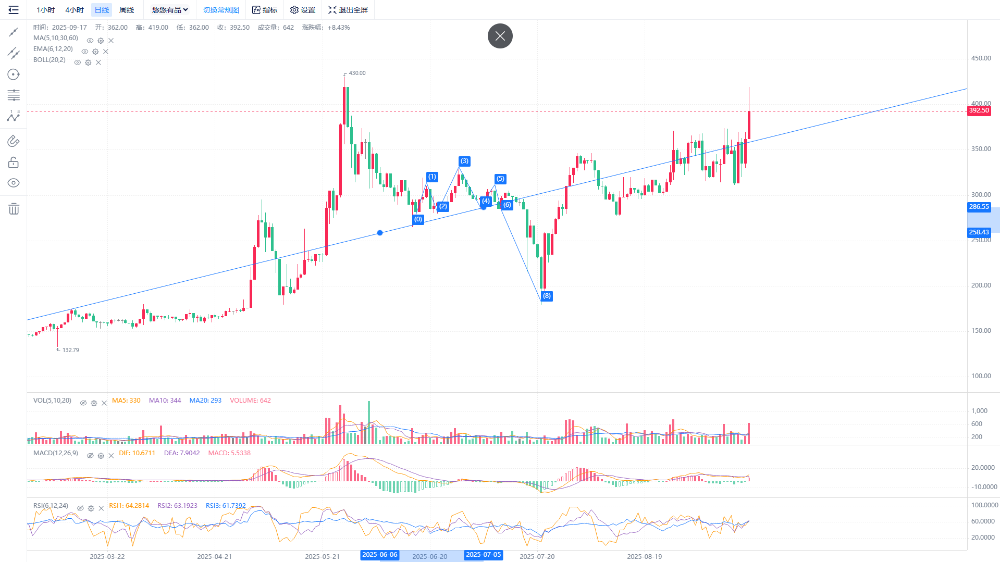

---

##### 2. 双重顶（Double Top） - "M顶"

*   **表现**：
    *   价格两次上攻**大致相同的高点**后回落，形成两个显著的峰值。
    *   第一个峰伴随大量成交，第二个峰成交量**显著萎缩**，表明买方力量衰竭。
*   **验证条件**：
    1.  **颈线突破**：**有效跌破两个峰值之间的谷底（即颈线）**。
    2.  **成交量确认**：跌破颈线时成交量放大，增加有效性。

*   **目标测算**：从峰值高点到颈线的垂直距离（H），从颈线突破点向下投射同等距离（H）。

**示例：**
- 大盘指数：五一的顶和现在的顶，能够看出到了五一的顶之后，出现了比较大的抛压（也可能是黑蛋暴雷导致的）。
  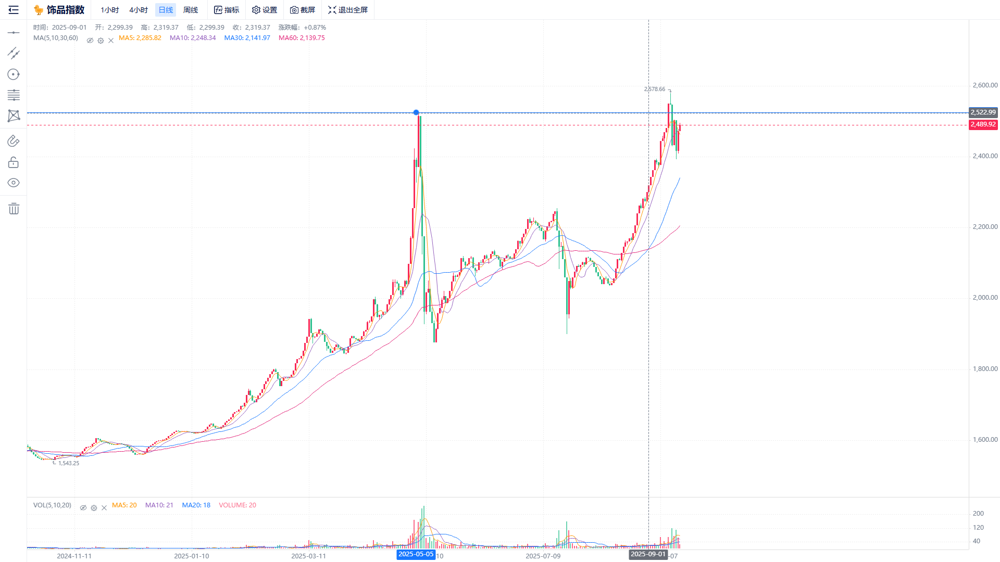

- 面具男聒噪：以前炒的飞起的探员，由此套牢了一堆人，所以后续探员行情都不能上桌。
  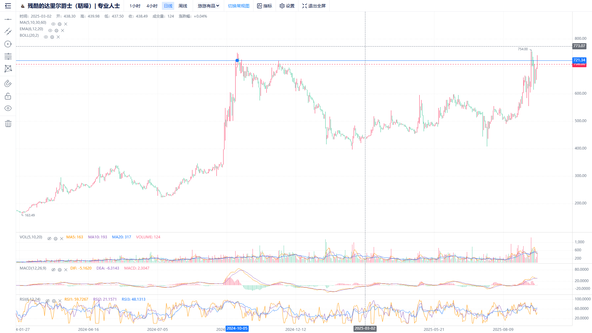
---

##### 3. 圆弧顶（Rounding Top）

*   **表现**：
    *   价格在一段长期上涨后，上升动能逐渐消失，走势由向上转为横向，再缓慢转为向下，形成一个圆弧状的顶部。
    *   **成交量**：也呈现圆弧状，顶部区域成交量萎缩，开始下跌时成交量放大。
*   **验证条件**：
    1.  **趋势线突破**：有效跌破连接圆弧起始点的长期上升趋势线。
    2.  **成交量确认**：下跌加速时伴随成交量增加。

**示例：**
- 面具男聒噪：游戏里按日线来，很少出现圆弧顶，所以这里还是用小丑举例，只是换成了时线，仅供形态参考。
  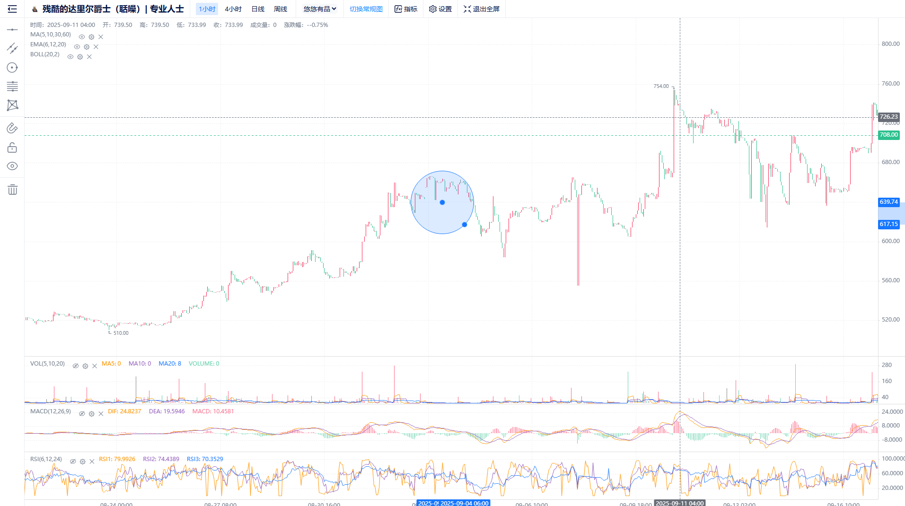

---

#### 二、底部反转形态（预示下降趋势结束，上升趋势开始）

##### 1. 头肩底（Head and Shoulders Bottom） - **头肩顶的镜像**

*   **表现**：与头肩顶相反。
    *   **左肩**：下跌后的一个低点，随后反弹。
    *   **头部**：再次下跌，创出**新低**，但成交量萎缩，随后反弹。
    *   **右肩**：第三次下跌，**未创新低**，成交量进一步萎缩。
    *   **颈线**：连接左肩和头部的反弹高点。
*   **验证条件**：
    1.  **颈线突破**：价格**有效放量突破颈线**是最终确认信号。**底部形态对成交量放大的要求比顶部形态更严格**。
    2.  **回踩**：突破后常有回踩颈线（现已成为支撑）的动作。

*   **目标测算**：与头肩顶相同。

**示例：**
- 飞贼波兹曼：阴跌+末日之后走出了头肩底形态，随后突破颈线，强势上涨。
  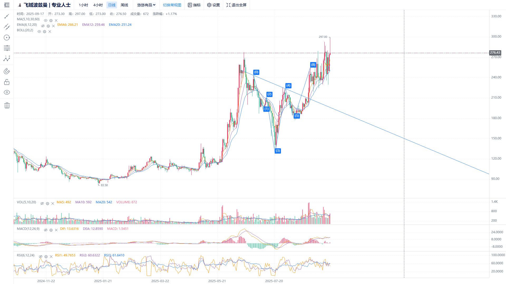

---

##### 2. 双重底（Double Bottom） - "W底"

*   **表现**：价格两次下探**大致相同的低点**后反弹，形成两个显著的谷底。
    *   第二个底形成时，成交量通常**极度萎缩**，表明抛压枯竭。
*   **验证条件**：
    1.  **颈线突破**：**有效放量突破两个谷底之间的峰值（即颈线）**。这是形态成立的唯一标准。
    2.  **成交量确认**：**突破时成交量必须急剧放大**，这是资金入场的铁证。

*   **目标测算**：与双重顶相同。

**示例：**
- 面具男聒噪：在强势上升后开始不断回调，最后底部几乎落在同一个地方，斐波那契回撤0.618左右。
  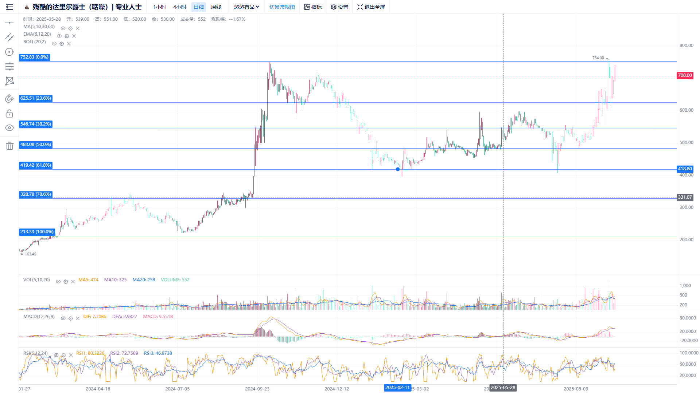
---

##### 3. 圆弧底（Rounding Bottom） - **“炒锅底”**

*   **表现**：
    *   价格长期下跌后，跌势逐渐减缓，走势由向下转为横向，再缓慢转为向上，形成一个圆弧状的底部。
    *   **成交量**：在底部时呈地量，随着价格右半部上升，成交量持续温和放大。
*   **验证条件**：
    1.  **颈线突破**：有效放量突破连接圆弧起始点的阻力位（颈线）。
    2.  **成交量确认**：右半部上涨过程伴随有序的放量。

---

#### 三、其他重要反转形态

相比之下，这些形态在游戏市场里基本很难看到，或者不会产生作用。

##### 1. 上升/下降楔形（Rising/Falling Wedge）

*   **表现**：
    *   **上升楔形（看跌）**：价格在两条**收敛且向上倾斜**的趋势线内震荡，但上涨动能减弱，成交量持续萎缩。它通常发生在趋势末尾。
    *   **下降楔形（看涨）**：价格在两条**收敛且向下倾斜**的趋势线内震荡，但下跌动能减弱，成交量萎缩。它是常见的底部形态。
*   **验证条件**：
    1.  **突破方向**：**上升楔形通常向下突破**，**下降楔形通常向上突破**。突破方向与形态之前的短期趋势相反。
    2.  **成交量确认**：突破时成交量放大。

##### 2. 岛形反转（Island Reversal）

*   **表现**：
    *   一个密集交易区间前后各出现一个**缺口**，使该区间K线在图表上像一个“孤岛”。
    *   **顶部岛形**：先是向上缺口（耗尽性缺口），后是向下缺口（突破性缺口）。
    *   **底部岛形**：先是向下缺口，后是向上缺口。
*   **验证条件**：
    1.  **第二个缺口**：第二个缺口的出现是确认信号。
    2.  **成交量**：岛形区间内成交量较大，第二个缺口突破时成交量也很大。

---

#### **高级验证的核心原则（超越单一形态）**

1.  **成交量是生命的呼吸**：**所有底部形态的突破必须有无可争议的成交量放大来确认**。顶部形态的突破也需放量，但要求可稍低。
2.  **市场背景（趋势）**：反转形态必须发生在**一个明确的现有趋势之后**。没有趋势，则无所谓反转。一个“头肩顶”如果出现在横盘整理中，就毫无意义。
3.  **形态的规模与持续时间**：**形态越大（宽度）、持续时间越长，一旦突破后的潜力就越大**。月线图上的头肩顶远比5分钟图上的头肩顶重要。
4.  **支撑/阻力转换**：颈线被突破后，其角色会发生转换（支撑变阻力，阻力变支撑）。后续的**反抽/回踩测试是增强信号有效性的重要环节**。
5.  **多时间框架共振**：在日线图上看到一个潜在的双重底，再去周线图上看是否出现了趋势衰竭的信号（如底背离），去小时图上看突破时是否量价齐升。多时间框架确认能极大提高胜率。
6.  **与技术指标的共振**：观察RSI、MACD等动量指标在形态形成过程中是否出现**背离**（如价格创新低而指标未创新低），这是隐藏在形态背后的强大动能确认信号。

**总结**：永远记住——**“未经突破确认的形态，都只是潜在的形态”**。耐心等待价格完成对关键位置（颈线、趋势线）的有效突破，并辅以成交量的验证，是运用反转形态进行交易而不被假信号欺骗的铁律。

### 中继形态
三角形形态是技术分析中极其重要且常见的一类形态，它们既可以作为**持续形态**，也可以作为**反转形态**，但更多情况下被视为**持续形态**。

它们代表了市场的**犹豫不决和 consolidation（盘整）**，是多空双方力量暂时达到平衡的时期，为下一次趋势运动积蓄能量。

以下是四种重要的三角形形态及其详细分析：

---

#### **1. 对称三角形（Symmetrical Triangle）**

*   **表现**：
    *   **结构**：由一条**逐渐下降的上趋势线**（阻力）和一条**逐渐上升的下趋势线**（支撑）构成。两条趋势线呈收敛对称状态，意味着高点不断降低，低点不断抬高。
    *   **市场心理**：表明多空双方力量势均力敌。买方在价格回落时愿意买入（推高低点），卖方在价格反弹时愿意卖出（压低高点）。这种平衡导致波动范围越来越小，最终等待消息或动力来选择方向。
    *   **成交量**：在形态形成过程中，**成交量应持续萎缩**。这反映了市场参与者的犹豫和观望情绪。

*   **验证与交易信号**：
    1.  **突破方向**：对称三角形本身是**中性形态**，没有固有的方向性倾向。**关键在于等待价格伴随成交量有效突破任何一条趋势线**。突破方向即为后续趋势方向。
    2.  **成交量确认**：**突破时必须伴有成交量的显著放大**，尤其是向上突破时。向下突破时，成交量放大最好，但不是绝对必须（因为下跌可以无需量能推动）。
    3.  **时间限制**：突破通常发生在三角形横向宽度的 **1/2 到 3/4** 处。如果价格波动至三角形顶端才突破，则信号较弱，可能是假信号。
    4.  **反抽**：突破后，价格常会反抽至被突破的趋势线（此时已转化为支撑/阻力位），这是二次入场的机会。

*   **目标测算**：
    *   测量三角形最**宽处的高度**（AB两点的垂直距离）。
    *   从突破点（C点）开始，向上或向下投射同样的垂直距离（CD）。

**示例：**

- 渐变M9：一个清晰的三角收敛，最后选择向上突破
  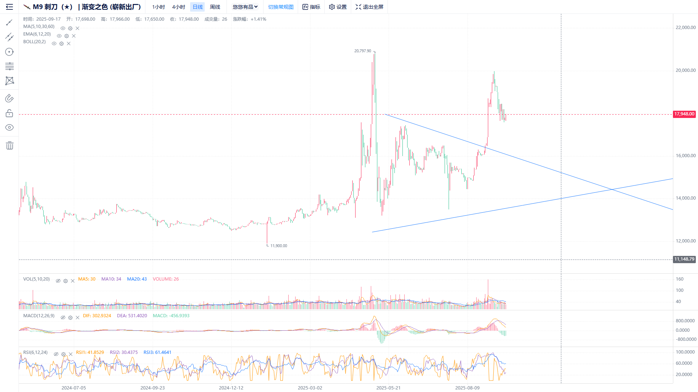

---

#### **2. 上升三角形（Ascending Triangle）**

*   **表现**：
    *   **结构**：由一条**水平的阻力线**和一条**上倾的支撑线**构成。价格的高点基本处于同一水平，而低点不断抬高。
    *   **市场心理**：这通常是一个**看涨**形态。水平阻力线代表固定的供给区域（卖压），但每次回落的低点都更高，表明买方越来越急于入场，需求强劲，正在逐步吸收卖压。最终，需求战胜供给，价格向上突破。
    *   **成交量**：形态内成交量萎缩。**在向上突破时，必须伴有巨量成交**，这是确认信号的关键。

*   **验证与交易信号**：
    1.  **预期方向**：**强烈偏向看涨突破**。大部分情况下出现在上升趋势中作为中继形态。
    2.  **突破确认**：**必须等待价格放量突破上方水平阻力线**。未突破前，可能会失败。
    3.  **假信号**：极少数情况下会向下突破上倾的支撑线，这通常意味着形态失败，是趋势转弱的强烈信号。

*   **目标测算**：与对称三角形相同。测量三角形最宽处的高度，从突破点向上投射。

**示例：**
- 探员索尔曼：上升三角形在游戏里也不是很容易看到，大量爆拉决定了这种形态难以发生。这里抓到了一个，看起来和横盘一样，确实属于中继形态。
  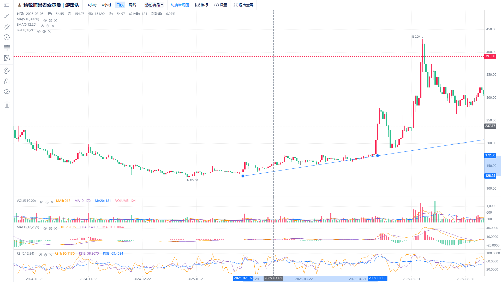

---

#### **3. 下降三角形（Descending Triangle）**

*   **表现**：
    *   **结构**：与上升三角形相反。由一条**水平的支撑线**和一条**下倾的阻力线**构成。价格的低点基本处于同一水平，而高点不断降低。
    *   **市场心理**：这通常是一个**看跌**形态。水平支撑线代表固定的需求区域（买盘），但每次反弹的高点都更低，表明卖方越来越积极，供给旺盛，正在逐步击穿买盘。最终，供给战胜需求，价格向下破位。
    *   **成交量**：形态内成交量萎缩。向下突破时，成交量放大可增强有效性，但并非绝对必要。

*   **验证与交易信号**：
    1.  **预期方向**：**强烈偏向看跌突破**。常见于下跌趋势中作为中继形态，也可出现在顶部作为反转形态。
    2.  **突破确认**：**必须等待价格跌破下方水平支撑线**。
    3.  **假信号**：若价格反而向上突破下倾的阻力线，则是看涨信号，表明买方最终赢得了战斗。

*   **目标测算**：测量三角形最宽处的高度，从突破点向下投射。

**示例：**
- 探员索尔曼：这大概就是所谓阴跌阶段的形态，游戏里同样难见。大多数就是一泻千里，和下降楔型很类似，但不代表游戏里能涨。
  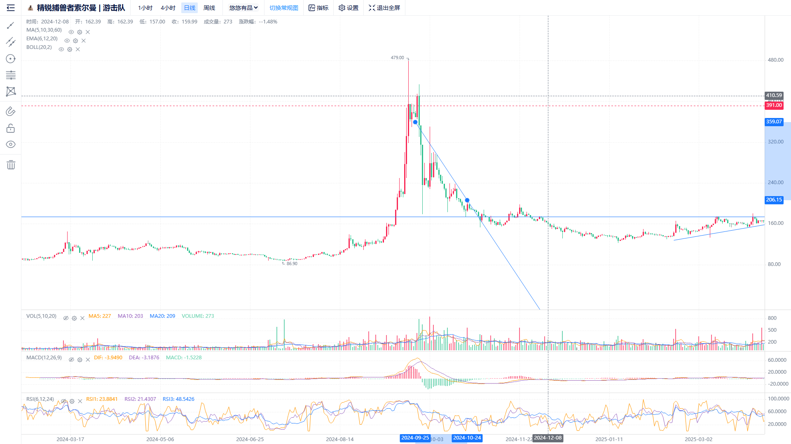

---

#### **4. 扩散三角形（Broadening Formation / Megaphone Top）**

*   **表现**：
    *   **结构**：与收敛三角形相反。由一条**上倾的阻力线**和一条**下倾的支撑线**构成，形成一个开口放大的“喇叭形”。价格的高点越来越高，低点越来越低。
    *   **市场心理**：反映市场情绪**失控、混乱和非理性**。买方和卖方都变得非常情绪化，一方疯狂地买，另一方疯狂地卖，导致波动性急剧增加。这通常出现在市场的主要顶部，是**反转形态**，预示着趋势的终结。
    *   **成交量**：成交量在形态内也呈**扩散状态**，即价格大幅摆动时放量，回调时缩量。

*   **验证与交易信号**：
    1.  **倾向性**：**通常看跌**，常见于牛市末期。但任何方向的突破都可能发生。
    2.  **突破确认**：由于形态的疯狂特性，**交易难度较大**。更安全的策略是等待价格最终跌破**第三个低点**（或更低点）形成的下倾支撑线，并伴随成交量增加。
    3.  **风险**：这是一个**高风险形态**，因为其波动性极大，止损很难设置。

*   **目标测算**：难以精确测算，但通常跌幅会很大。

#### **5. 矩形形态**

矩形形态，又称**箱体整理**，是一种典型的**持续形态**。它表示市场在一段时间内处于**多空双方力量均衡**的状态，价格在两条平行的水平直线之间上下波动，上方阻力位和下方支撑位都难以被有效突破，形成了一个像“箱子”或“走廊”一样的交易区间。

**市场心理解读：**
*   价格到达区间上轨时，卖方认为价格过高而抛售，形成阻力。
*   价格到达区间下轨时，买方认为价格划算而买入，形成支撑。
*   在这个过程中，市场正在进行 **“换手”** 。看好的新资金和获利了结的旧资金在此进行交换，为下一次趋势运动积蓄能量。最终，当一方力量耗尽，另一方将主导市场并实现突破。

---

##### **矩形形态的识别与交易要点**

| 特征项           | 具体描述                                                                                                                   | 图示说明（想象）                                                             |
| :--------------- | :------------------------------------------------------------------------------------------------------------------------- | :--------------------------------------------------------------------------- |
| **形态结构**     | 至少需要**两个基本一致的高点**和**两个基本一致的低点**，从而连接成两条平行的水平线。                                       | `--- 阻力线 ---`   `│    │    │`   `│    │    │`   `--- 支撑线 ---` |
| **成交量特征**   | 形态内的典型特征是**成交量逐渐萎缩**。价格在区间内来回波动时，成交量会减少。**关键信号在于突破时的成交量：必须显著放大！** | 突破时成交量柱突然增高                                                       |
| **形态性质**     | 主要作为**持续形态**（中继），即原有趋势暂停整理后，大概率沿原方向突破。少数情况下也可作为**反转形态**。                   |                                                                              |
| **突破方向预测** | **本身无方向倾向**。最终突破方向决定了后续走势。统计上，与**原有主要趋势方向一致**的突破概率稍高。                         |                                                                              |
| **目标测算**     | 经典理论：突破后的最小价格目标为 **矩形箱体的垂直高度（H）**。从突破点算起，向上突破则加H，向下突破则减H。                 | 目标位 = 突破点 ± H                                                          |

---

##### **何时需要密切关注矩形的形态改变？**

矩形形态并非一成不变，它可能演化或失败。在以下关键时刻，你必须高度警惕：

###### **1. 突破的关键时刻**

这是最需要关注的时刻，因为很多突破可能是“假”的。

*   **有效突破的确认**：
    *   **价格收盘价**：必须关注**收盘价**是否成功站在区间之外，而不仅仅是盘中刺破。一根坚定的K线（长阳线/长阴线）收盘在区间外是重要信号。
    *   **成交量**：**向上突破必须伴有成交量的急剧放大**，这是需求强劲入场的铁证。向下突破时，成交量放大最好，但不是绝对必要。
    *   **突破幅度**：通常要求突破幅度超过箱体高度的3%（或其他个人设定的阈值），或连续两根K线收在区间外，以避免假信号。

*   **警惕假突破**：
    *   价格短暂突破区间后，**迅速拉回区间内**继续震荡，这就是假突破。
    *   假突破往往是**主力资金设置的陷阱**，旨在清洗止损单或引诱反向交易者。一旦遇到假突破，应立即调整策略，这意味着震荡可能持续，甚至可能向相反方向真突破。

##### **2. 形态内部的演变**

*   **成交量异常**：如果在形态内部，某次反弹至阻力位时成交量异常巨大，但价格却无法突破，这可能意味着**派发**，暗示后续向下突破的概率增大。反之，如果在支撑位下跌时缩量，反弹时微微放量，可能意味着**吸筹**。
*   **区间结构变化**：如果价格不再能触及某一条边线（例如，连续几次反弹都无力碰到上轨），这可能表明力量平衡正在悄悄改变，一方力量正在减弱，是趋势可能提前改变的早期预警。

##### **3. 突破后的行为**

*   **回抽确认**：价格突破后，经常会**再次回踩**被突破的支撑线（ now 变为阻力线）或阻力线（ now 变为支撑线）。这个回抽动作是**二次入场或加仓的绝佳机会**。
*   **回抽后再度跌破/升破**：如果价格在回抽时，**不是止步于支撑/阻力位，而是又回到了矩形区间内部**，那么这个突破很可能失败，形态宣告无效。这是非常重要的**止损或反向操作信号**。

##### **交易策略与风险控制**

1.  **入场**：
    *   **激进型**：在矩形下轨附近买入，上轨附近卖出。这是一种逆势操作，风险较高，要求区间足够稳定。
    *   **稳健型**：**等待突破确认后入场**。这是推荐的主流做法。
2.  **止损**：
    *   如果做多，止损位设在矩形区间的下轨下方。
    *   如果做空，止损位设在矩形区间的上轨上方。
    *   如果是根据突破入场，可以将止损设在矩形区间的**中间位置**，甚至是另一侧边线，以过滤噪音。
3.  **止盈**：
    *   首要目标位就是矩形的高度H。
    *   如果趋势非常强劲，可以结合趋势线、前高/前低等其他技术工具来寻找更大的目标。

**总结来说，矩形形态是一个“暴风雨前的宁静”阶段。最重要的不是预测它向哪边突破，而是耐心等待市场自己做出选择，并在突破发生时，通过价格和成交量的配合来验证其真实性，然后果断跟随。永远对“假突破”保持警惕，并严格执行止损纪律。**

---

#### **高级应用与总结**

| 形态           | 倾向         | 成交量模式                     | 关键验证             | 市场心理       |
| :------------- | :----------- | :----------------------------- | :------------------- | :------------- |
| **对称三角形** | **中性**     | 内部萎缩，突破放量             | **等待方向性突破**   | 犹豫、平衡     |
| **上升三角形** | **看涨**     | 内部萎缩，**向上突破必须巨量** | **放量突破水平阻力** | 需求吸收供给   |
| **下降三角形** | **看跌**     | 内部萎缩，向下突破可放量       | **跌破水平支撑**     | 供给压倒需求   |
| **扩散三角形** | **反转看跌** | 混乱且放大                     | **跌破下倾支撑线**   | 情绪失控、混乱 |

**核心要点：**
1.  **永远等待突破**：在价格突破趋势线之前，所有形态都只是“潜在”的。提前预判方向入场风险极高。
2.  **成交量是终极验证**：尤其是对于看涨突破，成交量是区分真突破和假突破（Bull Trap）的生命线。
3.  **时间框架**：形态在越大的时间框架（如周线、月线）上形成，其突破后的意义和目标幅度就越大。
4.  **融入趋势背景**：在主要上升趋势中出现的“上升三角形”，其看涨中继的成功率远高于在下跌趋势中出现的“上升三角形”。

### 巩固形态
巩固形态是技术分析中极其重要的一类形态。它们代表了市场趋势中的“休息期”或“喘息期”，通常预示着原有趋势在经过调整后将继续运行。

前面提到的头肩底等反转形态也是巩固形态的一种,二者区别在于出现在趋势中,还是趋势末尾.如果是趋势中,则往往趋势继续.

*   **市场心理**：在一轮强劲的趋势后，部分交易者选择获利了结，导致价格暂停前进。同时，看好趋势的交易者则视回调为入场机会。多空双方在此阶段暂时达成平衡，进行**筹码换手**，为趋势的下一次发力积蓄能量。
*   **与反转形态的根本区别**：**巩固形态发生在现有趋势的方向上**，是趋势的暂停；而反转形态则发生在趋势的末端，预示着趋势方向的改变。

---

#### **巩固形态的四大共同特征**

无论具体形式如何，一个有效的巩固形态通常具备以下四个关键特征：

##### 1. **趋势先行**
   *   **表现**：形态之前必须存在一个清晰、可辨识的**趋势**（上升或下降）。没有趋势，则无所谓“持续”。
   *   **重要性**：这是判断形态性质的首要前提。

##### 2. **成交量收缩**
   *   **表现**：在形态**构建过程中**，成交量通常会呈现出**逐渐萎缩**的态势。
   *   **市场心理**：这表明市场参与者的犹豫和观望情绪，买卖双方力量暂时均衡。交易活动减少，市场进入“休眠”状态。
   *   **例外**：在三角形态中，成交量萎缩可能不明显，但通常会随着价格波动范围收窄而减少。

##### 3. **形态突破**
   *   **表现**：价格最终会**朝原趋势方向**（大概率）突破形态的边界（如趋势线、支撑阻力线）。
   *   **市场心理**：市场在经过充分换手和休整后，重新达成共识，继续推动原有趋势。
   *   **关键验证**：突破必须得到**成交量显著放大**的确认，尤其是向上突破时。这是新资金入场推动趋势延续的铁证。

##### 4. **价格目标预示**
   *   **表现**：大多数巩固形态都有**可测量的价格目标**。
   *   **测量方法**：通常以形态**突破点**为起点，投射出与形态**开始前的那段趋势波动**（称为“旗杆”）相当的幅度。
   *   **逻辑**：“横有多长，竖有多高”的量化体现，市场在整理期内积蓄的能量约等于之前驱动能量的规模。

下图直观展示了巩固形态（以旗形为例）的四大共同特征及其市场心理演变过程：
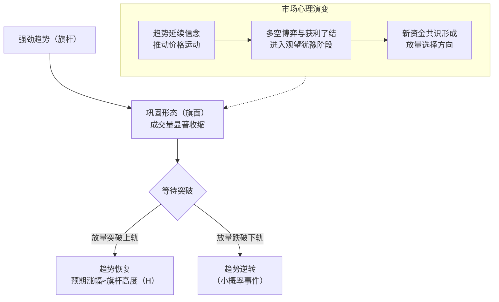
```mermaid
flowchart TD
A[强劲趋势（旗杆）] --> B[巩固形态（旗面）<br>成交量显著收缩]
B --> C{等待突破}
C -- 放量突破上轨 --> D[趋势恢复<br>预期涨幅≈旗杆高度（H）]
C -- 放量跌破下轨 --> E[趋势逆转<br>（小概率事件）]

subgraph S[市场心理演变]
    direction LR
    P[趋势延续信念<br>推动价格运动] --> Q[多空博弈与获利了结<br>进入观望犹豫阶段]
    Q --> R[新资金共识形成<br>放量选择方向]
end

S -.-> B
```

---

#### **主要的巩固形态类型及其独特特征**

除了上述共性，每种形态也有其独特之处：

| 形态类型     | 图形结构                                           | 成交量模式               | 持续时间                  | 备注                                                                      |
| :----------- | :------------------------------------------------- | :----------------------- | :------------------------ | :------------------------------------------------------------------------ |
| **三角形态** | 价格波动收敛于一个点。包括对称、上升、下降三角形。 | 逐渐萎缩。               | 通常持续数周至数月。      | **对称三角形**本身中性，突破方向决定后市。**上升/下降三角形**有明显偏向。 |
| **旗形**     | 与主导趋势反向倾斜的小型平行四边形。               | **急剧萎缩**。           | 通常持续1-3周，非常短暂。 | 可靠的短期形态，**“旗杆”** 陡峭。                                         |
| **三角旗形** | 小型对称三角形。                                   | **急剧萎缩**。           | 非常短暂。                | 本质上是短期的对称三角形，是**动能强劲**的标志。                          |
| **楔形**     | 与趋势反向倾斜的两条收敛趋势线。                   | 逐渐萎缩。               | 持续1-3个月。             | **下降楔形**通常看涨，**上升楔形**通常看跌。                              |
| **矩形**     | 两条水平的平行线，价格在其间波动。                 | 形态内萎缩，突破时放量。 | 可持续数周至数月。        | 反映了明确且坚定的支撑和阻力位。                                          |

---

### 缺口

#### **一、缺口是什么？**

在技术分析中，**缺口是指股价（或指数）在连续的交易时段中，后一个时段的最低价高于前一个时段的最高价（向上缺口），或者后一个时段的最高价低于前一个时段的最低价（向下缺口），从而在K线图上留下一段没有任何成交的“真空区域”**。

**简单来说，就是今天的K线和昨天的K线没有重叠部分，中间留下了空隙。**

---

#### **二、缺口的类型及其特征**

根据缺口出现的位置和市场背景，它可以分为四种主要类型，每种都传递着不同的市场信号。

| 类型            | 出现位置                                                  | 市场意义与特征                                                                                   | 成交量                   | 操作提示                                                     |
| :-------------- | :-------------------------------------------------------- | :----------------------------------------------------------------------------------------------- | :----------------------- | :----------------------------------------------------------- |
| **1. 普通缺口** | 通常在**整理形态**内（如三角形、矩形）。                  | 市场情绪平淡，无特殊意义。通常由交易清淡、消息面平静引起。                                       | 较低                     | **最可能被回补**。无重要操作指导意义，可忽略。               |
| **2. 突破缺口** | 发生在价格**脱离一个重要 consolidation（整理形态）** 时。 | **标志着一个新趋势的开始**，意义重大。表明多空一方取得了决定性胜利。                             | **显著放大**             | **强烈趋势信号**。应顺势操作（向上缺口买入，向下缺口卖出）。 |
| **3. 持续缺口** | 出现在**一轮趋势的中途**。                                | 确认趋势正在健康、强劲地运行。又名“测量缺口”，因为它到趋势起点的距离，约等于趋势终点到它的距离。 | 较大，但可能小于突破缺口 | **加仓或持有**的信号。可利用其“测量”功能预估趋势目标位。     |
| **4. 衰竭缺口** | 出现在**一轮长期趋势的末尾**。                            | 趋势动能耗尽的最后挣扎。往往是“最后一波”交易者或不明真相的散户涌入造成的。                       | **异常巨大**，但不可持续 | **趋势即将反转的警告**。应**平仓**而非开仓，准备反向操作。   |

**如何区分持续缺口和衰竭缺口？**
*   **看成交量**：衰竭缺口后的成交量往往急剧萎缩，表明跟进力量枯竭。
*   **看是否被快速回补**：衰竭缺口通常在**很短时间**（如几天）内就被回补，而持续缺口在趋势延续期间不会被回补。
*   **看位置**：如果缺口是趋势启动后的第N个缺口，且价格已大幅运动，则需警惕是衰竭缺口。

---

#### **三、出现缺口的原因**

1.  **重大消息/事件**：这是最常见的原因。公司在**收盘后**或**周末**发布财报、并购消息、产品突破等利好/利空，会导致次日开盘股价直接跳空高开/低开，远离昨日收盘价。
2.  **市场情绪突变**：突发性的宏观政策（如降息、加息）、地缘政治事件、或者整个行业的集体看好/看空，会引发资金集体涌入或出逃，形成缺口。
3.  **技术性买/卖盘集中爆发**：当价格运行至关键的技术点位（如突破长期阻力位、跌破重要支撑位）时，会触发大量的止损单或追涨单，导致价格跳空。
4.  **流动性枯竭**：在交易极度不活跃的市场或股票中，少量订单就可能导致价格大幅跳空。

---

#### **四、出现缺口后的操作策略**

1.  **识别缺口类型**：这是第一步，也是最重要的一步。根据上述特征判断它是哪种缺口。
2.  **突破缺口**：
    *   **顺势交易**：向上突破缺口是**买入**信号，向下跌破缺口是**卖出/做空**信号。
    *   **入场点**：可在缺口形成后的回调时入场。向上缺口的下沿（即缺口的起点）成为**新支撑位**，是理想的买入点。向下缺口的上沿成为**新阻力位**，是理想的卖空点。
    *   **止损点**：将止损设置在缺口被**完全回补**的下方（对于多头）或上方（对于空头）。
3.  **持续缺口**：
    *   **持有或加仓**：确认是持续缺口后，可视为趋势健康的信号，应继续持有头寸，或在趋势方向上加仓。
    *   **目标测算**：从趋势起点到持续缺口的距离，投射到缺口另一端，可作为潜在的目标位。
4.  **衰竭缺口**：
    *   **获利了结**：如果持有顺应原趋势的头寸，出现衰竭缺口是**强烈的平仓信号**。
    *   **准备反转**：激进者可开始布局反向头寸，但务必等待其他反转信号（如看跌吞没、顶背离等）的确认。
5.  **普通缺口**：
    *   **可忽略**，或进行短线“抓回补”的逆向操作（风险较高）。

---

#### **五、缺口一定会被补全吗？**

**这是一个非常流行的误解。答案是否定的，缺口不一定会被回补。**

*   **“缺口必补”理论的来源**：这个说法流传甚广，因为它描述了一种常见的现象。普通缺口几乎都会被回补，这给人们造成了“所有缺口都会回补”的印象。
*   **现实情况**：
    *   **突破缺口**：一个强有力的突破缺口，可能**很多年都不会被回补**，甚至永远不被回补。因为它标志着一种根本性的、结构性的趋势改变。例如，一只股票因为革命性产品突破历史新高形成的缺口，可能永远也回不到那个价格了。
    *   **持续缺口**：在趋势运行过程中不会被回补，直到趋势结束。
    *   **衰竭缺口**：**很快就会被回补**，这正是识别它的关键特征之一。

**结论**：不要迷信“缺口必补”而去逆势操作。**强劲趋势中的突破缺口是不应被回补的**。一旦一个重要的突破缺口被回补，往往意味着最初的“突破”是**假突破**，是一个失败的信号，需要高度警惕。

**核心原则**：将缺口分析与**趋势、成交量、价格形态**结合起来综合判断，才能提高交易的胜率。

---

### 支撑和阻力

#### **一、什么是支撑和阻力？**

*   **支撑**：是一个**价格水平或区域**，在该位置下方，**买盘兴趣足够强劲**，能够克服卖压，从而中止或逆转下跌趋势。价格跌至此位置时，仿佛落在了一张“弹簧床”上，通常会反弹向上。
*   **阻力**：是一个**价格水平或区域**，在该位置上方，**卖盘兴趣足够强劲**，能够克服买压，从而中止或逆转上涨趋势。价格涨至此位置时，仿佛撞到了“天花板”，通常会回调向下。

**简单比喻**：地板是支撑，天花板是阻力。价格在“房间”内（交易区间）上下波动。

---

#### **二、形成的原因（市场心理）**

支撑和阻力并非魔法，其背后是实实在在的市场参与者心理和行为。

1.  **前期高低点**：
    *   **阻力**：当价格此前在一个高点回落时，在该位置买入的交易者产生了“套牢盘”。当价格再次回到该位置时，这些套牢者急于**解套卖出**，形成了卖压。
    *   **支撑**：当价格此前在一个低点反弹时，在该位置买入的交易者获得了利润。当价格再次回到该位置时，他们视其为**再次买入的良机**，形成了买盘。

2.  **成交密集区**：
    *   这是**最重要、最强劲**的支撑/阻力来源。指价格在某个区域**反复、长时间**交易的区域。
    *   **原因**：该区域积累了大量的交易量和未平仓头寸。市场参与者在此区域的成本高度集中。价格回到该区域时，会引发大量决策：亏损者想要平仓，盈利者想要加仓，观望者想要入场。

3.  **趋势线**：
    *   连接一系列上升的低点形成**上升趋势线（支撑）**；连接一系列下降的高点形成**下降趋势线（阻力）**。它们代表了动态的支撑和阻力。

4.  **移动平均线**：
    *   广泛使用的动态支撑/阻力。例如，200日均线常被视为牛熊分界线，价格在其上运行时，它是重要支撑；反之则是阻力。

5.  **斐波那契回撤位**：
    *   如38.2%、50%、61.8%等回撤水平，是交易者普遍关注的心理位置，从而自我实现为支撑/阻力。

6.  **整数关口**：
    *   如股价的100元、200元，指数的10000点等。因为人类心理偏爱整数，这些位置常成为心理上的支撑阻力位。

7.  **价格缺口**：
    *   缺口的边缘也会成为明显的支撑或阻力。

---

#### **三、在形态中的体现**

几乎所有技术形态都是由支撑和阻力构成的。

*   **头肩顶**：颈线就是最重要的支撑线，一旦跌破，支撑变阻力。
*   **双重顶/底**：两个高点之间的谷底是支撑位；两个低点之间的峰顶是阻力位。
*   **三角形**：三角形的上边线是阻力，下边线是支撑。
*   **矩形**：矩形的上轨是阻力，下轨是支撑。形态的本质就是价格在支撑和阻力之间来回波动。

---

#### **四、在相关位置的操作建议**

**核心思想：在支撑位附近寻找做多机会，在阻力位附近寻找做空/卖出机会。**

| 情景               | 操作建议                                                                                                                           | 风险控制                                                                                     |
| :----------------- | :--------------------------------------------------------------------------------------------------------------------------------- | :------------------------------------------------------------------------------------------- |
| **价格接近支撑位** | **考虑买入**。但不要提前猜底，需等待**企稳信号**，如：出现看涨K线（锤子线、看涨吞没）、成交量萎缩后再次放大、RSI等指标出现底背离。 | 将止损设置在支撑位**下方一定空间**。支撑一旦被有效跌破，应立即止损，因为它很可能转换为阻力。 |
| **价格接近阻力位** | **考虑卖出或减仓**。同样等待**受阻信号**，如：出现看跌K线（乌云盖顶、看跌吞没）、成交量无法放大、RSI等指标出现顶背离。             | 将止损设置在阻力位**上方一定空间**。                                                         |
| **价格突破阻力位** | **考虑买入**。突破必须伴有**成交量显著放大**的确认。突破后，原阻力位变为新支撑位，可等待回踩该新支撑时再次买入。                   | 将止损设置在原阻力位（现支撑位）下方。                                                       |
| **价格跌破支撑位** | **考虑卖出**。跌破时也最好有成交量放大。跌破后，原支撑位变为新阻力位，可等待反弹至该新阻力时再次卖出。                             | 将止损设置在原支撑位（现阻力位）上方。                                                       |

**重要提示**：永远不要在所有仓位都在一个点上。支撑阻力是一个“区域”，而不是一个“精确的点”。

---

#### **五、支撑和阻力的互换（角色转换原理）**

这是技术分析中一个**极其重要且强大**的概念。

*   **原理**：一旦一个重要的**支撑位被有效跌破**，它就会转变为未来的**阻力位**。反之，一旦一个重要的**阻力位被有效突破**，它就会转变为未来的**支撑位**。

*   **市场心理解释**：
    1.  **支撑变阻力**：当支撑被跌破时，所有在该支撑位买入的交易者全部被套牢。当价格从低位反弹，再次回到这个“成本价”区域时，这些被套牢的交易者终于“解套”，会迫不及待地**卖出平仓**，从而形成了巨大的卖压（阻力）。
    2.  **阻力变支撑**：当阻力被突破时，所有在该阻力位卖出的交易者（或做空者）都处于亏损状态。当价格成功突破后回调至该位置时，这些空头会意识到自己错了，倾向于**回补空头头寸**（买入），而突破后买入的交易者视其为加仓机会，从而形成了买盘（支撑）。

**说明**：
假设股价在100元处是一个强阻力，多次上攻失败。
*   **情景A（阻力变支撑）**：股价某日放量突破100元，涨至110元。随后股价回调，当它跌回100元时，原先的**阻力位就变成了支撑位**，很可能在此止跌反弹。
*   **情景B（支撑变阻力）**：股价在80元处是一个强支撑，多次下跌在此止跌。股价某日放量跌破80元，跌至70元。随后股价反弹，当它涨回80元时，原先的**支撑位就变成了阻力位**，很可能在此受阻回落。

### 趋势线
#### **第一部分：如何结合支撑/阻力绘制趋势线**

趋势线本质上是**动态的支撑线或阻力线**。它不是一个水平区域，而是一条有斜率的直线，代表了趋势的速度和动能。

##### **1. 上升趋势线的绘制（动态支撑）**

*   **绘制方法**：
    1.  找到至少**两个依次上升的显著低点**（即回踩的支撑点）。
    2.  将这两个低点用一条直线连接起来。
    3.  延伸这条线至右侧，形成一条具有向上斜率的直线。
*   **与支撑的关系**：
    *   这条线本身就是一条**动态的支撑线**。在上升趋势中，价格会多次回踩这条线并反弹向上。
    *   **确认**：价格接触该线的次数越多（通常第三次接触是确认点），该趋势线作为支撑的有效性就越强。
    *   **交易操作**：价格回踩至上升趋势线并出现看涨K线形态（如锤子线、看涨吞没）时，是**理想的买入或加仓机会**。止损设在趋势线下方。

##### **2. 下降趋势线的绘制（动态阻力）**

*   **绘制方法**：
    1.  找到至少**两个依次下降的显著高点**（即反弹的阻力点）。
    2.  将这两个高点用一条直线连接起来。
    3.  延伸这条线至右侧，形成一条具有向下斜率的直线。
*   **与阻力的关系**：
    *   这条线本身就是一条**动态的阻力线**。在下降趋势中，价格会多次反弹至这条线并受阻回落。
    *   **确认**：同样，接触点越多，有效性越强。
    *   **交易操作**：价格反弹至下降趋势线并出现看跌K线形态（如乌云盖顶、看跌吞没）时，是**理想的做空或卖出机会**。止损设在趋势线上方。

**高级技巧**：
*   **趋势通道**：在画出主要趋势线后，可以画一条与之平行的线，连接对应的高点（在上升趋势中）或低点（在下降趋势中），形成一个通道。通道的上轨和下轨提供了额外的动态阻力和支撑。
*   **斜率的重要性**：趋势线的斜率反映了趋势的强度。**45度左右的斜率**通常被认为是健康可持续的。过于陡峭的趋势线（>60度）容易失效，过于平缓的趋势线（<30度）则动能不足。

---

#### **第二部分：如何确认趋势反转**

趋势反转不是一个瞬间事件，而是一个过程。它需要多个信号相互验证，**核心是“支撑和阻力结构的破坏”**。

##### **趋势反转的确认“三部曲”**

以下流程图展示了结合支撑/阻力和趋势线来确认趋势反转的完整决策过程：

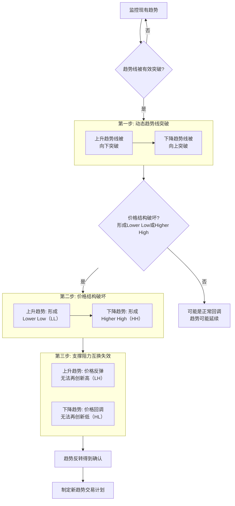
```mermaid
flowchart TD
    A[监控现有趋势] --> B{趋势线被有效突破?};

    B -- 否 --> A;
    B -- 是 --> C;

    subgraph C [第一步: 动态趋势线突破]
        direction LR
        C1[上升趋势线被<br>向下突破] --> C2[下降趋势线被<br>向上突破]
    end

    C --> D{价格结构破坏?<br>形成Lower Low或Higher High};

    D -- 否 --> F[可能是正常回调<br>趋势可能延续];
    D -- 是 --> E;

    subgraph E [第二步: 价格结构破坏]
        direction LR
        E1[上升趋势: 形成<br>Lower Low（LL）] --> E2[下降趋势: 形成<br>Higher High（HH）]
    end

    E --> G;

    subgraph G [第三步: 支撑阻力互换失效]
        G1[上升趋势: 价格反弹<br>无法再创新高（LH）]
        G2[下降趋势: 价格回调<br>无法再创新低（HL）]
    end

    G --> H[趋势反转得到确认];

    H --> I[制定新趋势交易计划];
```

上图的三步流程是确认反转的核心框架，但最终决策前，还应观察以下两大强力验证信号：

##### **强力验证信号**

1.  **成交量确认**：
    *   **向上反转**：在突破下降趋势线和前期关键阻力时，**成交量必须显著放大**，这是资金入场的铁证。
    *   **向下反转**：跌破上升趋势线和关键支撑时，成交量放大最佳，但非绝对必要（因为下跌可以无需量能推动）。

2.  **技术指标背离**：
    *   这是趋势动能衰竭的领先指标。
    *   **看跌顶背离**：价格创出新高，但RSI或MACD指标未能创出新高。
    *   **看涨底背离**：价格创出新低，但RSI或MACD指标未能创出新低。
    *   当**价格突破趋势线时，如果同时出现了指标背离**，那么反转的可信度会急剧升高。

##### **重要提醒**

*   **假突破/毛刺**：并非每次突破都有效。有时价格会短暂突破趋势线后又回到原趋势中（称为“假突破”或“毛刺”）。因此，建议使用**收盘价**确认而非盘中价格，或设置一个突破的过滤器（如百分比幅度或时间过滤器）。
*   **时间级别**：在越大的时间级别（如日线、周线）上发生的趋势线突破和反转信号，其重要性越高，可靠性越强。

---

### 交易中的误区
许多交易者精通技术分析，但最终却亏损，问题往往就出在以下这些错误上。

交易中的错误可以分为三大类：**心理层面、策略层面和执行层面**。

---

#### **一、心理与情绪错误（最致命）**

1.  **缺乏纪律性**
    *   **表现**：不遵循自己的交易计划，随心所欲地交易。这是“知行合一”中“行”的缺失，是绝大多数失败的根本原因。
    *   **后果**：计划形同虚设，交易变成赌博。

2.  **恐惧与贪婪**
    *   **恐惧**：表现为过早平掉盈利仓位（怕利润回吐），或不敢开立符合信号的仓位。
    *   **贪婪**：表现为过度持仓、亏损时加仓（摊平成本）、或不肯止盈，总想卖在最高点，最终让盈利单变亏损单。

3.  **报复性交易**
    *   **表现**：在一笔交易亏损后，急于马上下单想立刻把钱赚回来，导致情绪化操作，忽略所有规则。
    *   **后果**：往往会造成更大的、连续性的亏损。

4.  **希望与祈祷**
    *   **表现**：当仓位出现亏损时，不止损，而是“希望”市场会回头，“祈祷”会出现奇迹。
    *   **后果**：小亏拖成大亏，一次大亏抵消十次盈利。

5.  **自我中心（Ego）**
    *   **表现**：不愿承认错误，亏损后找市场、消息、庄家等外部原因，而不是反思自己。过分看重自己对市场的判断。
    *   **后果**：无法从错误中学习，持续重复同样的错误。

---

#### **二、策略与风险管理错误**

1.  **没有交易计划**
    *   **表现**：像无头苍蝇一样交易，凭感觉入场出场。
    *   **后果**：无法评估交易的有效性，成败全靠运气。

2.  **不设止损或止损不当**
    *   **不设止损**：这是交易界的“自杀行为”。
    * **止损不当**：止损设得过于随意，要么太近（容易被正常波动扫掉），要么太远（亏损幅度无法承受）。
    *   **后果**：单笔亏损失控，可能造成灾难性后果。

3.  **风险回报比不合理**
    *   **表现**：冒着亏损100元的风险，去博取50元的利润。
    *   **后果**：长期下来，即使胜率超过50%，依然是亏损的。**专业的交易者追求的是“小亏大赚”**，即使胜率只有40%，也能盈利。

4.  **过度交易**
    *   **表现**：交易频率过高，在毫无优势的情况下频繁进出，为了交易而交易。
    *   **后果**：产生大量手续费和滑点成本，侵蚀利润，并增加犯错几率。

5.  **仓位管理不当**
    *   **表现**：所有仓位都使用相同的资金量，或者根据“预感”重仓交易。
    *   **后果**：无法控制整体风险，一次重仓失败就可能重伤账户。**永远不要在一笔交易上风险超过总资金的1%-2%**。

6.  **盲目追求高胜率**
    *   **表现**：认为胜率越高就越成功。
    *   **后果**：忽略了风险回报比的重要性。**高胜率不代表高盈利**（可能赚点小钱就跑，一亏就亏大的），**低胜率也不代表亏损**（可以靠大赚小亏来实现盈利）。

---

#### **三、分析与执行错误**

1.  **确认偏误**
    *   **表现**：只寻找支持自己看法的信息和分析，而忽略相反的技术信号。
    *   **后果**：对市场产生片面认知，无法做出客观判断。

2.  **沉迷于技术指标**
    *   **表现**：在图表上加载十几个指标，导致图表混乱，信号相互矛盾。
    *   **后果**：“分析瘫痪”，无法做出决策。记住：**价格行为（K线、形态、支撑阻力）是第一位的，指标只是衍生工具**。

3.  **忽略市场大环境**
    *   **表现**：在熊市中坚持做多，在震荡市中使用趋势策略。
    *   **后果**：逆水行舟，事倍功半。必须判断市场处于趋势市还是震荡市，并选择相应的策略。

4.  **追逐市场**
    *   **表现**：在价格大幅上涨后因为“害怕错过”而追高，或在暴跌后因为恐慌而杀跌。
    *   **后果**：买在顶部，卖在底部，成为市场的“接盘侠”。

5.  **记录与复盘**
    *   **表现**：不做交易记录，赚了亏了都不知道原因。
    *   **后果**：无法进步，永远在重复交学费。**交易日记是你最好的老师**。

#### **如何避免这些错误？**

1.  **制定并写下你的交易计划**：包括入场条件、止损位、目标位、仓位大小。没有计划，就不要交易。
2.  **像机器一样执行你的计划**：交易中最难的不是分析，而是执行。信任你的系统。
3.  **优先管理风险，而非追求利润**：利润是风险控制下的自然结果。永远先问“这笔交易我最多能亏多少”。
4.  **定期复盘你的交易记录**：分析盈利和亏损的原因，不断优化你的系统和心态。
5.  **保持简单**：使用你最熟悉的1-2种形态和指标，复杂不等于有效。
6.  **工作和生活平衡**：疲惫、压力大、生活不顺时，不要交易。

---

### 止损
**止损不是可选项，而是生存和成功的必选项。**

#### **一、什么是止损？**

**止损（Stop-Loss）**，也叫停损，是指当市场价格达到你预设的特定价位时，自动平仓离场的一个订单指令。

*   **本质**：它是一个**预先制定的风险控制计划**，是你对市场说：“我承认我的判断错了，现在我要以最小的代价退出这场交易。”
*   **目的**：
    1.  **控制单笔最大亏损**：保护你的交易资本，避免出现灾难性的损失。
    2.  **释放资金和心态**：结束错误的交易，让你有资金和清晰的心态去捕捉下一个机会。
*   **核心哲学**：**截断亏损，让利润奔跑**。成功的交易不在于你赚多少，而在于你亏得少，并且能让盈利交易覆盖亏损交易后仍有盈余。

---

#### **二、常见的止损方法（附计算公式）**

设置止损不是随便猜一个数字，而是基于市场结构和数学计算。以下是几种主流方法：

##### **1. 百分比止损法**

*   **方法**：根据你的入场价，设置一个固定百分比的亏损幅度作为止损。
*   **计算公式**：
    *   **多单止损价** = 入场价格 × (1 - 止损百分比)
    *   **空单止损价** = 入场价格 × (1 + 止损百分比)
*   **举例**：股票入场价100元，你设定单笔最大亏损为2%。则止损价 = 100 × (1 - 0.02) = 98元。
*   **优点**：简单粗暴，易于计算和执行。
*   **缺点**：忽略了不同品种的波动性和具体的技术位，不够科学。

##### **2. 波动性止损法（ATR指标）**

*   **方法**：根据市场的平均波动幅度来设置止损，波动大的市场给予更大的止损空间，避免被“噪音”震出局。这是**最专业、最受推崇的方法之一**。
*   **计算公式**：
    *   **止损价** = 入场价格 ± (N × ATR值)
        *   **多单用“-”，空单用“+”**。
        *   **N** 是一个乘数，通常取1.5, 2, 或3。取决于你的交易风格和容忍度。
        *   **ATR值**（Average True Range），是衡量市场波动性的技术指标，可在交易软件中调用。通常取14周期ATR。
*   **举例**：股票入场价100元，当前14周期ATR为2，你设定N=2。则多单止损价 = 100 - (2 × 2) = 96元。
*   **优点**：动态适应市场环境，非常科学合理。
*   **缺点**：需要理解并会使用ATR指标。

##### **3. 技术分析止损法（最推荐与图表结合的方法）**

这种方法将止损设置在关键的技术结构之外，表明如果你的交易思路正确，价格就不应到达的位置。

*   **a. 支撑/阻力位止损**：
    *   **多单**：将止损设置在近期关键**支撑位**的**下方**。
    *   **空单**：将止损设置在近期关键**阻力位**的**上方**。
    *   **逻辑**：如果支撑/阻力被有效突破，则证明你基于该支撑/阻力做多/做空的理由失效。

*   **b. 趋势线止损**：
    *   **多单**：将止损设置在连接近期低点的**上升趋势线下方**。
    *   **空单**：将止损设置在连接近期高点的**下降趋势线上方**。

*   **c. 形态止损**：
    *   根据图表形态的结构设置止损。
    *   **举例**：在头肩底形态做多，止损应设置在**颈线突破后的回踩低点**，或者**右肩的低点**下方。

*   **优点**：与交易逻辑高度契合，有理有据。
*   **缺点**：需要较强的技术分析能力。

---

#### **三、如何通过止损制定交易计划（核心四步）**

止损不是孤立的，它是交易计划的心脏，决定了你的入场和仓位大小。遵循以下四步流程：

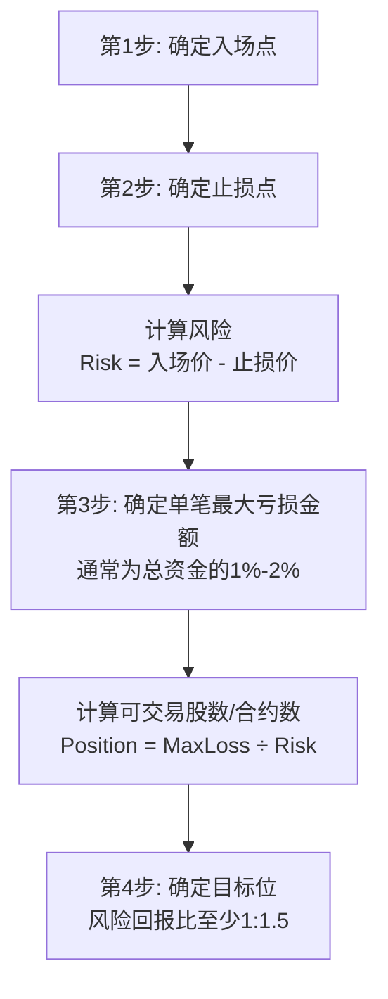
```mermaid
flowchart TD
    A[第1步: 确定入场点] --> B[第2步: 确定止损点];
    B --> C[计算风险<br>Risk = 入场价 - 止损价];
    C --> D[第3步: 确定单笔最大亏损金额<br>通常为总资金的1%-2%];
    D --> E[计算可交易股数/合约数<br>Position = MaxLoss ÷ Risk];
    E --> F[第4步: 确定目标位<br>风险回报比至少1:1.5];
```

**第1步：确定入场点和止损点**
*   首先分析图表，找到你的**入场位**（如：突破前高入场、回踩支撑入场）。
*   根据上述**技术分析方法**，立即确定你的**止损位**（如：放在支撑位下方、趋势线下方）。

**第2步：计算每股/每合约的风险**
*   **风险（Risk per Share）** = | 入场价格 - 止损价格 |

**第3步：确定你愿意承受的总风险**
*   这是最关键的一步。**永远遵循单笔风险原则**：
    *   单笔最大亏损 ≤ **总交易资金的1% - 2%**。
    *   假设你的总资金是10万元，你决定单笔最大亏损为1%，即 **1000元**。

**第4步：计算可购买的仓位大小**
*   **可购买股数/合约数** = (总资金 × 风险百分比) / (每股风险)
    *   **即：Position Size = (Total Capital × Risk%) / (Entry Price - Stop Loss Price)**
*   **举例**：
    *   总资金 = 100,000元
    *   单笔风险 = 1% = 1,000元
    *   入场价 = 100元
    *   止损价 = 95元
    *   每股风险 = 100 - 95 = 5元
    *   **可购买股数 = 1,000 / 5 = 200股**
    *   **本次交易总投入 = 200股 × 100元 = 20,000元（占20%仓位）**
    *   **验证：如果止损，亏损 = 200股 × 5元 = 1,000元，正好是总资金的1%。**

**第5步：根据风险回报比评估交易并设定目标**
*   计算出止损风险后，再看潜在的目标盈利位（如：前高阻力位、斐波那契扩展位）。
*   计算**风险回报比（Risk/Reward Ratio）**：
    *   **潜在盈利** = | 目标价格 - 入场价格 |
    *   **风险回报比 = 潜在盈利 / 潜在亏损**
*   **要求**：绝不参与风险回报比小于 **1:1.5** 的交易。例如，你风险是5元，那么潜在盈利至少要有7.5元才值得交易。

#### **重要原则**

*   **永不移动止损扩大风险**：如果市场向不利于你的方向移动，说明你错了。移动止损等于拒绝认错，往往导致小亏变大亏。
*   **可以移动止损保护利润**：当市场向你有利方向移动后，可以将止损移动到盈亏平衡点或新的技术位，以确保该笔交易至少不亏钱，并保护部分利润。
*   **预先设置**：在点击“买入”按钮的**同时甚至之前**，就必须知道你的止损位在哪里。绝不是入场后再犹豫。

**总结**：止损是交易系统的“安全带”。通过**技术位确定止损点**，通过**资金管理确定仓位大小**，两者结合，你就能建立起一个稳健、可持续的交易计划，从而在市场上长期生存下去。

#### 斐波那契回撤的止损设定

##### **核心原则：止损应设置在“交易逻辑失效”的位置**

如果你的入场是基于价格在某个斐波那契回撤位（如61.8%）获得支撑/阻力而反弹，那么你的**止损就必须设置在所有信号证明你错了的位置**。这个位置就是下一个更深层次的斐波那契回撤位下方（或上方）。

以下是基于不同斐波那契回撤位入场的具体止损策略，其决策流程可参考下图：

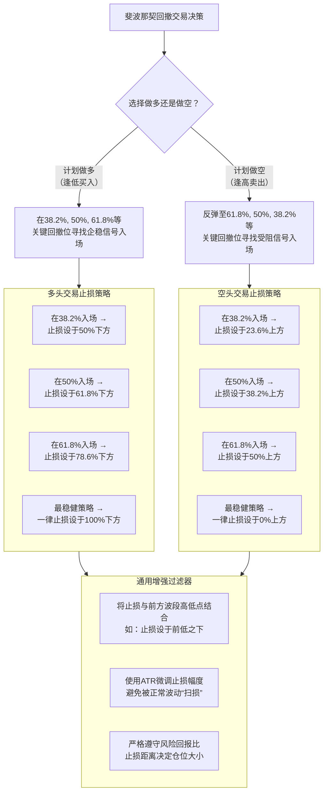
```mermaid
flowchart TD
    A[斐波那契回撤交易决策] --> B{选择做多还是做空？};

    B -- 计划做多<br>（逢低买入） --> C[在38.2%, 50%, 61.8%等<br>关键回撤位寻找企稳信号入场];
    B -- 计划做空<br>（逢高卖出） --> D[反弹至61.8%, 50%, 38.2%等<br>关键回撤位寻找受阻信号入场];

    C --> E;
    subgraph E[多头交易止损策略]
        direction LR
        E1["在38.2%入场 →<br>止损设于50%下方"]
        E2["在50%入场 →<br>止损设于61.8%下方"]
        E3["在61.8%入场 →<br>止损设于78.6%下方"]
        E4["最稳健策略 →<br>一律止损设于100%下方"]
    end

    D --> F;
    subgraph F[空头交易止损策略]
        direction LR
        F1["在38.2%入场 →<br>止损设于23.6%上方"]
        F2["在50%入场 →<br>止损设于38.2%上方"]
        F3["在61.8%入场 →<br>止损设于50%上方"]
        F4["最稳健策略 →<br>一律止损设于0%上方"]
    end

    E --> G;
    F --> G;
    subgraph G[通用增强过滤器]
        H["将止损与前方波段高低点结合<br>如：止损设于前低之下"]
        I["使用ATR微调止损幅度<br>避免被正常波动“扫损”"]
        J["严格遵守风险回报比<br>止损距离决定仓位大小"]
    end
```

##### **为什么这是最合理的设置？**

*   **逻辑清晰**：你在61.8%入场，是因为你认为这里是趋势的“最后防线”，市场会在此反弹。如果价格跌破了78.6%，甚至100%，则证明这个“防线”已被彻底击穿，你最初的“反弹”假设已经错误，趋势很可能已经反转。
*   **给予市场波动空间**：将止损放在下一个关键位之下，给了市场一定的波动余地，避免了因短期噪音（假突破）而被震荡出局。
*   **风险可控**：通过选择不同的回撤位入场，你可以主动控制风险的大小。在更深回撤位（如61.8%）入场，你的止损距离相对较大，但入场位置更优，成功率可能更高。你需要用**仓位大小**来平衡，确保单笔亏损总额不超过总资金的1%-2%。

##### **高级技巧与注意事项**

1.  **结合前高/前低**：将止损设置在斐波那契回撤位**之外的前期波段低点（做多）或高点（做空）的下方/上方**。这是一个双重保险，因为水平支撑阻力本身就很强。
2.  **使用ATR（平均真实波幅）过滤**：
    *   计算你的入场点到止损点的点数（风险R）。
    *   看这个R值是否远大于近期市场的平均波幅（ATR）。如果止损距离小于ATR，说明止损设得太近，很容易被正常波动打掉，应考虑放弃交易或调整止损位。
3.  **风险回报比**：在入场前，估算一下潜在盈利目标（如前期高点、下一个斐波那契扩展位）和你的止损距离（风险）。**风险回报比至少要达到1:1.5以上**，这笔交易才值得做。如果止损过大导致无法达到这个比例，则应放弃交易。
4.  **永远不要这样做**：**绝不**因为觉得止损太远而随意将止损改到更近的位置（如设置在入场K线的低点）。这违反了交易逻辑，一旦发生波动，你会被轻易震出场外，错失后续的盈利机会。

**总结：**
使用斐波那契回撤交易时，你的止损策略应该是**系统化**的：
**入场点 + 斐波那契逻辑止损位 + 仓位管理（基于止损距离计算） = 一个完整的交易计划。**

这样，你就不再是盲目地交易，而是在管理风险的前提下，有逻辑、有计划地参与市场。

---

## 走出幻觉，走向成熟：交易心理与市场认知
> 一本国产书，内容大多关于作者的成长经历，摸爬滚打后的经验和总结，字字珠玑。

### 一、交易世界的现实与幻觉

#### 1.1 所谓的“韭菜”心态
- 很多投资者（尤其是基金客户）只关注收益，忽视风险，期望百战百胜，却从不真正思考市场的不确定性。
- 与之谈论技术分析反而不讨好——他们真正需要的，是心理的迎合，而非理性的分析。

#### 1.2 推荐阅读
- 《通向金融王国的自由之路》
- 《克罗谈投资策略》
- 《股票作手回忆录》

---

### 二、市场的本质与三大陷阱

#### 2.1 期货交易的三大陷阱
1. **逆势**
2. **重仓**
3. **短线**

- 重仓的陷阱：自己在游戏市场里不断犯错亏损都是因为重仓导致的。这本书还没看到第三章，就把提到的坑全踩了（不相信技术分析，盲目追求利益，重仓，逆势）。现在虽然也没有稳定盈利，但是回头来看，每一个坑都是学费，但每一个坑都因为重仓，满仓，导致没有挽回机会。

> 不要试图抗衡市场，或证明市场是错的。

#### 2.2 有限信息 vs 无限市场
- 市场是无限的，信息是有限的。
- 我们常以已知信息自我蒙蔽，忽略未知因素对市场的巨大影响。
- 事后的合理性 ≠ 事前的确定性。

**基本公式**：  
已知原因 A + 未知原因 X = 结果 B

**结论**：不存在可预测未来的完美公式。

---

### 三、因果非线性与历史解释的陷阱

#### 3.1 过程与结果的非线性
- 历史是既定的，总能找到解释；但反过来不成立——同样的结果可能来自不同过程。
- 交易者常为了维护“确定性幻觉”，利用基本分析或技术分析对历史行情进行强行解释。

#### 3.2 市场观念的迅速转变
- 相互对立的概念常被市场交替接受，且**转变非常迅速**。
- 例如：绩优股陷入长熊，垃圾股反而暴涨。

---

### 四、规律的幻觉与巨变的必然

#### 4.1 短期经验的不可靠性
- 很多交易者依赖近期经验总结规律，却死于突如其来的市场巨变。
- **当一种现象成为定式，巨变往往随之而来**。
- 也是一个自己不断踩坑，甚至踩坑之前还把这个定律熟读于心。在游戏市场里自己总会忍不住眼红跟涨。当当产生这种想法时，任何技术分析，任何计划（虽然本就没有），都会被淡化甚至失效。短期看涨，不代表两个星期，三个星期内一直涨。同样，空仓也不代表没有上车机会。尝试根据以往经验完美复刻，也是不可取的（探员三推上涨，结果只给了两三次机会，自己一直忽略掉了下跌通道的信号，成功浮盈转浮亏）。

#### 4.2 市场的能量守恒与临界释放
- 市场类似地震机制：上涨积蓄下跌能量，下跌积蓄上涨能量。
- 当多数人深信不疑时，市场处于临界区，微小事件即可引发巨变。

---

### 五、规律的层次与交易策略的选择

#### 5.1 微观规律 vs 宏观规律
- **微观规律**：战绩辉煌，但有效期短。
- **宏观规律**：有效期长，但难创短期辉煌。

#### 5.2 市场如钟摆，板块会轮动
- 不存在永远有效的单次交易方法。
- 长期盈利的方法，往往源于大众的集体误区。

---

### 六、价格认知与趋势思维

#### 6.1 “高抛低吸”的心理陷阱
- 价格高低是相对的，取决于所选的参考历史价格。
- 散户常因等待“足够低”而错失趋势，庄家则利用此心理完成拉升与派发。
- 这句话适用于所有游戏市场里的抽象神车。几乎没有例外。所有短期内暴涨的东西，最后产生套牢盘都是因为有源源不断的人往里进，以为它能涨回去。

#### 6.2 趋势思维 > 整理思维
- 趋势中：追涨杀跌；
- 整理中：高抛低吸。
- 底仓震荡：用小钱，换大趋势的感知

**关键方法**：  
**让整理的尺度大于趋势的尺度一个数量级**  
即：
1. 大周期（周/月线）定趋势/整理背景；
2. 小周期（日/分时）执行具体策略。

> 看图应先远后近，避免陷入局部波动而忽略整体结构。

---

### 七、交易策略与绩效评估

#### 7.1 策略 > 结果
- 应基于策略一致性而非单次结果评价交易。
- 错误归因会导致重复犯错。
- 目前觉得斐波那契回撤比较适用于游戏市场。可惜这玩意自己学的不深，也没成体系，目前用来买卖是够的。价格行为学则有点不太适用，因为T+7+7，追涨很容易套死，所以目前没有验证，只能用于看K线辅助。

#### 7.2 正确率 ≠ 盈利
- 高正确率可能隐藏“小赚大亏”的陷阱。
- 应关注**盈亏比**、回撤、交易成本等综合指标。
- 同样踩过这个坑。很多时候自己把手上的标的的盈利空间看的太大了，涨20%-30%，不够，跌50%，觉得还能涨回来。为什么会这样？因为只利益熏心，只看到大家赚，没看到大家亏。自己也想一个品涨50%个点。因为这样，往往卖出目标不明确，浮盈不能正确转换为收益。加上自己一直深受重仓的荼毒，所以基本上交了学费没学到东西，踏空或者被套，变成恶性循环。

#### 7.3 心理陷阱：“兑现盈利，挂起亏损”
- 这与消费心理类似：分开支付感知更强，合并支付感知更弱。
- 交易中应**像对待利润一样对待亏损**。
- 这里对待利润，应该是指设置合理的止损位。但是在游戏市场里，压根没有止损一说。

---

### 八、收益目标的理性分析

#### 8.1 复利的幻想与现实的约束
- 每月6.9%收益，20年后10万可变1亿——但现实中不存在可持续的短期高收益策略。
- 正确率、赔率、交易周期三者互损，必须做出权衡。

#### 8.2 重仓与短线是陷阱
- 唯一可行之路是：**拉长交易周期，追求系统稳定性**。

---

### 九、价值观、价值与价格

#### 9.1 价值是相对的，价格是绝对的
- 价值取决于观察者，价格是市场真实的绝对存在。
- 庄家成功靠的是影响参与者价值观的能力，而非操控价值本身。

#### 9.2 价值投资的本质
- 不是买“好股票”，而是买“比大众预期更好的股票”。
- 比拼的是价值观，而非价值。

**典型案例**：
- 巴菲特买美国运通：并非因价值低估，而是因他的价值观超越市场共识。
- 业绩好却下跌的股票：背后常隐藏未知利空，盲目抄底危险。

---

### 十、风险控制与交易信念

#### 10.1 止损是唯一的短期风险
- 无论长期风险如何，短期风险就是止损幅度。
- 一个止损策略可让人敢于交易高波动、高潜力的品种。

#### 10.2 最有信心的交易最危险
- 知道越多“看好理由”，越难执行止损。
- **当基本面与走势背离，永远相信走势**。

#### 10.3 简单优于复杂
- 交易环节越多，失败概率越大。
- 真正的系统应力求简洁、一致、可执行。

---

## 高级趋势技术分析

### 第一篇 价格行为
#### 导读
##### **第一部分：一句话核心概括 (The Core Idea in One Sentence)**

要想在交易中持续盈利，就必须抛弃新闻、指标等一切外部干扰，学会像侦探一样直接解读价格图表，因为图表是市场主力（机构资金）行为留下的唯一、真实且通用的“作案”痕迹。

##### **第二部分：核心知识点清单 (Key Concepts Checklist)**

* **价格行为是唯一真相 (Price Action is the Only Truth):** 图表包含了交易所需的一切信息，任何外部信息都是噪音和干扰。
* **跟随机构资金 (Follow the Institutions):** 市场由“聪明的钱”（机构）驱动，散户的目标是识别并“搭便车”，而不是与之对抗。
* **概率思维而非寻求确定性 (Probabilistic Mindset, Not Certainty):** 市场大部分时间处于50/50的平衡状态，交易的本质是在概率暂时偏向你时（如60/40）下注，并接受亏损是游戏的一部分。
* **价格行为的普适性 (Universality of Price Action):** 相同的K线形态和逻辑根植于人性，因此在任何市场、任何时间周期里都同样有效，历久弥新。

##### **第三部分：重点知识深度解析 (Deep Dive into Key Concepts)**

###### **1. 价格行为是唯一真相 (Price Action is the Only Truth)**

* **【它是什么？】**
    这是一种交易哲学，认为价格在任何图表上的任何变化（即价格行为）本身就反映了所有市场参与者的行为总和，因此包含了做出交易决策所需的全部信息。其他工具，如新闻、财报或技术指标，要么是滞后的，要么是干扰信息。
* **【为什么重要？】**
    它能让你化繁为简，只专注于唯一能让你盈利或亏损的因素——价格本身。这可以避免你陷入“分析瘫痪”（analysis paralysis），即被各种矛盾的信号搞得无所适CSC。图表永远不会撒谎。
* **【生活中的比喻】**
    这就像你是一名经验丰富的医生，诊断病人时不依赖八卦传闻（新闻）或花哨但原理不明的“神药”（复杂指标），而是专注于最根本的生命体征：心跳、脉搏、呼吸和体温（开盘价、最高价、最低价、收盘价）。这些最直接的数据，才能告诉你病人的真实状况。
* **【具体的例子】**
    书中提到了Costco（好市多）发布了一份强劲的盈利报告，这是个大利好消息。当天股价也因此高开。然而，一个只看价格行为的交易者会发现，股价高开后很快在高位形成了一个双顶（Double Top）的看跌形态，随后一路暴跌，甚至跌破了前一天的最低点。如果一个交易者根据“好消息”去买入，他会亏损惨重；而一个只解读图表语言的交易者，会识别出上涨力量衰竭的信号并做空，从而获利。

###### **2. 跟随机构资金 (Follow the Institutions)**

* **【它是什么？】**
    这是一种市场观，认为市场上超过90%的交易量都由机构（如对冲基金、银行、养老金等）完成，所以市场的方向本质上是由这些“聪明的钱”或“市场主力”决定的。
* **【为什么重要？】**
    作为资金和信息都处于劣势的散户，你无法战胜主力，唯一可行的方法就是与他们同行。通过分析价格行为，你可以看出机构是在买入（形成上升趋势）还是卖出（形成下降趋势），然后顺势而为，搭上他们的“顺风车”。
* **【生活中的比喻】**
    想象你是一条小鱼，在巨大的鲸鱼（机构）旁边游泳。当鲸鱼决定要向北游时，你逆着它游是徒劳的，最聪明的做法就是紧跟在它身后，这样既省力又安全。图表上的趋势，就是鲸鱼游动的方向。
* **【具体的例子】**
    书中解释说，当市场处于上升趋势时，即便中间出现了几根看似吓人的阴线（回调），那也仅仅是机构在利用价格的短暂下跌继续买入，而意志不坚定的散户则在恐慌中卖出。比如，在一轮上涨中，一根K线的最低点跌破了前一根K线的最低点，这往往是机构吃掉散户“止损单”并继续建仓的地方。你的任务是和机构一起买，而不是和恐慌的散户一起卖。

###### **3. 概率思维而非寻求确定性 (Probabilistic Mindset, Not Certainty)**

* **【它是什么？】**
    这是一种交易心态，承认市场在绝大多数时间里处于一种方向概率为50/50的平衡状态（即不确定性）。交易者的目标不是去预测未来，而是在这片“灰色的迷雾”中，识别出那些概率暂时从50/50略微偏向某一方向（比如60/40）的短暂机会，并利用这些微小的“优势”（edge）。
* **【为什么重要？】**
    它让你不再追求“百战百胜”的“圣杯”，从而能够坦然接受亏损。你的关注点会从“这次交易会不会对”转移到“这笔交易是否符合我的系统，是否具备正向的数学期望（即交易者等式 Trader's Equation）”。这是从业余赌徒转向职业交易者的关键一步。
* **【生活中的比喻】**
    你是一位专业的德州扑克选手。你不会期望每一手牌都赢，你知道这不可能。你的工作是耐心等待，只在拿到好牌（比如AA, KK）或者局面非常有利时才下大注。虽然好牌有时也会输（小概率事件），但你知道只要坚持只在胜率高的时候下注，长期下来你一定会是赢家。交易中那些高胜率的K线形态，就是你的“好牌”。
* **【具体的例子】**
    作者指出，如果你不看图表，在一天中的任意时刻随机买入，然后设置一个等距离的止盈和止损（比如都设为10个点），你的获胜概率大约就是50%。而交易者的优势在于，当一个强劲的突破形态出现时，在接下来的几根K线内，价格继续朝突破方向运动10个点的概率可能会暂时提升到60%甚至更高。这就是一个值得你下注的、拥有概率优势的时刻。

###### **4. 价格行为的普适性 (Universality of Price Action)**

* **【它是什么？】**
    指那些核心的价格行为模式，如趋势、震荡、通道等，会在所有市场（股票、期货、外汇）和所有时间周期（从1分钟图到月线图）上反复出现。
* **【为什么重要？】**
    这意味着你学会的分析技能是“可移植的”。你不需要为每个市场都学一套全新的方法。其根本原因是，这些形态是人类群体心理（贪婪与恐惧）的直接体现，而人性是基本不变的。
* **【生活中的比喻】**
    这就像音乐的基本乐理（和弦、节奏、旋律）是通用的。无论你是在弹奏古典钢琴、爵士吉他还是电子合成器，这些基本原理都在起作用。价格行为就是市场的“乐理”。
* **【具体的例子】**
    为了证明这一点，书中展示了两张非常古老的道琼斯工业平均指数周线图，分别来自**大萧条时期和二战时期（1930-1940年代）**。作者指出，尽管当时没有电脑，交易环境也天差地别，但图表上清晰地显示了与今天5分钟E-mini期货图上完全相同的趋势线、通道和旗形整理形态。这雄辩地证明了价格行为的永恒性和普适性。

##### **第四部分：知识脉络图 (Concept Map)**

`市场由“聪明的钱”驱动 (机构行为)` -> `这些行为在图表上留下了可被解读的印记 (价格行为)` -> `因此，价格图表是唯一的真相，胜过新闻和指标` -> `由于这些行为源于不变的人性，所以价格行为模式具有普适性` -> `交易者的任务不是追求确定性，而是在市场暂时失衡时，寻找并利用概率优势`

#### 第一章 价格行为的谱系：从极端趋势到极端交易区间

##### **第一部分：一句话核心概括 (The Core Idea in One Sentence)**

市场的所有行为都可以在“强趋势”（方向明确地移动）和“强震荡”（来回拉锯）这两个极端之间找到自己的位置，并且市场具有强大的“惯性”，总是倾向于维持当前的状态。

##### **第二部分：核心知识点清单 (Key Concepts Checklist)**

* **价格行为的光谱 (The Spectrum of Price Action):** 市场要么处于趋势中，要么处于震荡区间中，这是一个连续的状态谱。
* **市场惯性 (Market Inertia):** 趋势倾向于延续，震荡区间也倾向于延续；大多数反转或突破的尝试都会失败。
* **分形结构 (Fractal Structure):** 趋势和震荡区间在所有时间周期上相互嵌套，大周期里的小回调可能是小周期里的大趋势。
* **两段式运动 (Two-Legged Moves):** 市场运动，尤其是回调，通常会以两个清晰的“波段”或“腿”（Legs）来展开，形成类似ABC的结构。

##### **第三部分：重点知识深度解析 (Deep Dive into Key Concepts)**

###### **1. 价格行为的光谱 (The Spectrum of Price Action)**

* **【它是什么？】**
    这是一个核心理念，认为任何时刻的市场都处于两种基本状态之一：**趋势（Trend）**，即价格朝一个主要方向（向上或向下）持续移动；或者**震荡区间（Trading Range）**，即价格在两个水平价位之间来回波动，没有明确方向。这两种状态是价格行为光谱的两端。
* **【为什么重要？**】
    这是交易者需要做出的最根本的判断。你的交易策略完全取决于你对当前市场状态的认知。在趋势中，你的策略是顺势而为（例如，在上涨趋势中逢低买入）。在震荡区间中，你的策略是逆势操作（例如，在区间的顶部卖出，在底部买入）。错误判断市场状态是导致亏损的首要原因。
* **【生活中的比喻】**
    把市场想象成一条河。有时候，河水湍急，朝一个方向奔腾而去，这就是**趋势**。这时候你想过河，最好的方式是顺着水流的方向斜着划过去。而有时候，河流汇入一个平静的湖泊，湖水只是在岸边来回拍打，没有明确的流向，这就是**震荡区间**。这时你可以在湖的两岸之间来回划船。在你下水划船之前，你必须先看清楚你面对的是湍急的河流还是平静的湖泊。
* **【具体的例子】**
    本章的图1.1完美地展示了这一点。当天开盘后，价格首先经历了一段猛烈的下跌，直到第1根K线（这是“湍急的河流”）。随后，市场进入了一个长达数小时、极其狭窄的横盘整理阶段（这是“平静的湖泊”）。最后，价格再次向下突破，形成了另一段同样猛烈的下跌趋势，直到第3根K线（“河流”再次奔腾）。成功的交易者必须在这三个阶段切换不同的交易模式。

###### **2. 市场惯性 (Market Inertia)**

* **【它是什么？】**
    这是一个基本原则：市场倾向于保持它当前正在做的事情。如果市场正在上涨，那么大多数试图让它下跌的努力（小回调）都会失败，上涨趋势会继续。如果市场正在横盘震荡，那么大多数试图向上或向下突破的努力都会失败，价格会重新回到震荡区间内。
* **【为什么重要？】**
    这个原则是高概率交易的基础。它告诉你，顺着当前的市场状态去交易，远比逆着它干要安全得多。它鼓励你“顺势而为”，直到有非常强烈的证据表明趋势或震荡已经结束。
* **【生活中的比喻】**
    市场就像一列高速行驶的重载火车。一旦它达到全速（趋势），想让它停下来是非常困难的，路上的小石子（小的反向信号）根本不起作用。反过来，当它停在车站时（震荡区间），也需要巨大的能量才能让它重新启动，一两个人去推是推不动的。
* **【具体的例子】**
    当一个强劲的上升趋势形成后，你会看到很多根阴线，看起来像是要反转下跌了。但由于市场惯性，这些“反转尝试”绝大多数都只会变成小小的“牛旗”或回调，随后趋势会恢复并创出新高。同理，在一个横盘震荡的区间里，你会看到价格 বারবার地向上触碰上轨或向下触碰下轨，看起来像是要突破了，但惯性会一次次地把价格拉回区间内部。

###### **3. 分形结构 (Fractal Structure)**

* **【它是什么？】**
    指图表形态在所有时间周期上都具有相似的结构。你在5分钟图上看到的一个完整趋势，可能只是60分钟图上一次回调中的一小段。而你在5分钟图上看到的一个震荡区间，在1分钟图上则是由许多微小的上涨和下跌趋势组成的。
* **【为什么重要？】**
    它为你的交易提供了宏观背景（Context）。知道你正在交易的小趋势只是更大周期图表上的一次顺势回调，会给你更强的持仓信心。它帮助你既能“见树木”（当前的K线），又能“见森林”（更大的市场结构）。
* **【生活中的比喻】**
    想象一下从太空看一条海岸线（月线图），它大致是一个弯曲的轮廓。当你拉近镜头（周线图），你会发现这个轮廓是由一个个海湾和半岛组成的。再拉近到一个海湾（日线图），你会看到更小的海滩和岬角。继续拉近（小时图），你会看到沙滩上的每一块岩石和浪花。这种“曲折”的模式在每一个层级上都在重复。
* **【具体的例子】**
    作者在书中提到，即使是像1987年和2009年那样巨大的股灾，从月线图的视角来看，也仅仅是对长期牛市趋势线的一次“回调”而已。这深刻地说明了一个在日线图上看起来是“世界末日”般的下跌趋势，在更高的时间框架下，可能只是一个更大结构中的正常调整。

###### **4. 两段式运动 (Two-Legged Moves)**

* **【它是什么？】**
    一种非常常见的市场运动模式，即一段行情（尤其是一段回调或者新趋势的开始）会以两个同向的“波段”（Legs）来完成，中间被一次小规模的反向运动隔开。这通常被称为“ABC”结构。
* **【为什么重要？】**
    识别这种模式有助于你预判行情的潜在终点。当你看到第一个波段（A浪）和随后的回调（B浪）之后，你就可以预期市场很可能会走出第二个波段（C浪），这为你提供了潜在的交易机会和目标位。
* **【生活中的比喻】**
    就像在水面上打水漂。你扔出一块石头，它第一次接触水面后会弹起，向前飞一段距离（第一段运动），然后落下，再次接触水面并第二次弹起（第二段运动）。很少有石头只弹一次就停下。
* **【具体的例子】**
    图1.1中，作者将第一次猛烈下跌至第1根K线标记为第一段（Leg 1或A浪）。随后的长时间横盘震荡是回调（B浪）。从第2根K线开始的第二次猛烈下跌至第3根K线，则是第二段（Leg 2或C浪）。一个交易者如果识别出了第一段下跌和随后的震荡回调，就可以预期并准备交易第二段下跌行情。

##### **第四部分：知识脉络图 (Concept Map)**

`市场状态存在于一个光谱上` -> `光谱的两端是“趋势”与“震荡”` -> `每种状态都有其“惯性”，倾向于自我维持` -> `这种“趋势vs震荡”的结构是“分形”的，在所有时间周期中都存在` -> `在这些结构内部，行情常常以“两段式运动”的模式展开`

**核心逻辑：** 首先判断市场处于光谱的哪个位置（趋势还是震荡）-> 尊重其惯性（顺势而为） -> 寻找常见的内部运动模式（如两段式回调）作为具体的入场依据。

#### 第二章：趋势K线、十字星K线和高潮

##### **一句话核心概括 (The Core Idea in One Sentence)**

每一根独立的K线都是一场多空力量的微型战役，其结果要么是一方明确获胜（趋势K线），要么是双方暂时战平（十字星K线），要么是一方在耗尽全力后迎来转折（高潮）。

##### **核心知识点清单 (Key Concepts Checklist)**

* **趋势K线 (Trend Bars):** 一方主导战局的标志。
* **十字星K线 (Doji Bars):** 双方力量均衡的标志。
* **高潮 (Climaxes):** 动能耗尽与情绪化的信号。
* **买卖压力 (Buying/Selling Pressure):** 力量对比变化的累积过程。
* **趋势性收盘价/高点/低点 (Trending Closes/Highs/Lows):** 十字星如何形成趋势。
* **连续趋势K线：尖峰 (Consecutive Trend Bars: The Spike):** 趋势K线如何构成趋势的“发动机”。
* **反向解读：作为陷阱的趋势K线 (Counterintuitive Reading: The Trend Bar as a Trap):** 何时一根强趋势K线反而是危险信号。
* **十字星组合：铁丝网形态 (Doji Combination: Barbwire):** 当犹豫不决加剧时，市场发出的最强警告。
* **真空效应的定义:** “聪明钱”的集体缺席。
* **真空效应的内在逻辑:** 等待最佳时机与“磁铁”效应。

##### **重点知识深度解析 (Deep Dive into Key Concepts)**

###### 1. 趋势K线 (Trend Bars)

* **【它是什么？】**
    趋势K线是指那些拥有明显“实体”（Body）的K线，即收盘价与开盘价之间有显著差距。阳线实体代表多方在这一时段内获胜，将价格从开盘推高至收盘；阴线实体则代表空方获胜。
* **【为什么重要？】**
    它是市场动量和信念最直接的体现。一根强有力的趋势K线表明市场参与者对当前方向有很强的共识。连续的趋势K线构成了肉眼可见的趋势，它告诉我们谁在掌控市场，并暗示了接下来最有可能的运动方向。
* **【生活中的比喻】**
    这就像一场拔河比赛中的一回合。如果红队（比如多方）把绳子中间的标记朝他们的方向拉动了一大段距离，那么这一回合的结果就清晰地显示了红队的压倒性优势。这根长长的阳线实体，就是这一回合的赛果记录。
* **【具体的例子】**
    在一轮上涨趋势中，突然出现了一根巨大的阴线（熊市趋势K线）。新手会立刻认为这是趋势反转的信号并急于做空。但作者提醒，在强趋势的背景下，这根大阴线也可能是“卖出高潮”（Sell Climax），是恐慌盘出尽的标志，反而是多头在回调中买入的绝佳机会。关键在于结合上下文（当前是牛市还是熊市），而不是孤立地看一根K线就下结论。

###### 1.1 过长的趋势K线

一根过长的趋势K线（An unusually large trend bar）是一个强烈的信号，但它的含义却是截然相反的双刃剑：它既可能是**趋势即将衰竭的最后疯狂（衰竭高潮）**，也可能是**新趋势开始的强大宣言（突破）**，而区分这两者的唯一钥匙就是它所出现的“语境”（Context）。

**含义一：趋势末端的“衰竭高潮” (Exhaustion Climax)**

*  **【它是什么？】**
    当一个趋势已经运行了相当长的时间（例如超过20根K线）或幅度之后，如果突然出现一根比近期所有K线都大得多的、同向的趋势K线，那么这根K线很可能不是趋势力量的增强，而是“衰竭性高潮”（Exhaustive Climax）的标志。

* **【为什么会发生？】**
    这背后是情绪化的交易行为和我们之前讨论过的“真空效应”。
    1.  **情绪化的“踏空者”和“绝望者”入场：** 在一个 protracted bull trend（长期牛市）的末尾，一直没敢买入的交易者（踏空者）看到价格再次加速，因害怕错过最后的机会而情绪化地追高买入。同时，一直持有空单的交易者（绝望者）因无法再承受亏损而被迫平仓（买入）。这两股买盘共同造就了这根巨大的阳线。
    2.  **主力资金的“缺席”与“反向操作”：** 与此同时，主力多头认为价格已高，开始获利了结；主力空头则在等待这个极端的价格出现后开始建仓做空。当弱势交易者在最高点买入时，他们面对的对手盘正是获利了结的主力多头和开始做空的主力空头。
    3. **真空效应的体现：** 主力资金在价格加速冲向某个阻力位（如测算目标位）前会暂时“缺席”，导致市场缺乏阻力而被“吸”上去，形成巨大的趋势K线，这就是真空效应的体现。

*  **【后续通常会发生什么？】**
    一次衰竭高潮之后，由于买方（或卖方）力量被瞬间耗尽，市场通常会迎来一次**至少持续10根K线、包含两个波段的深度回调**，甚至可能引发整个趋势的**反转**。如图6.3中的第3根K线，它是一根巨大的熊市趋势K线，出现在连续下跌之后，它标志着卖盘的衰竭，并引发了随后强劲的上涨。

**含义二：趋势初期的“力量宣言” (Declaration of Strength)**

* **【它是什么？】**
    如果一根过长的趋势K线出现在一个长期盘整的震荡区间（Trading Range）的**突破**位置，或者作为一个**主要反转**的第一推动力，那么它通常是极端力量的标志，是一份“力量宣言”。

* **【为什么会发生？】**
    它代表了市场平衡被彻底打破。在长时间的拉锯战后，一方力量取得了决定性的胜利，并迅速占领了市场。这根K线本身就构成了一个“突破缺口”（Breakout Gap），显示出新趋势的强烈意愿和动能。

* **【后续通常会发生什么？】**
    这种“突破型”的长趋势K线之后，通常会伴随着进一步的趋势行情。市场可能会短暂回调（测试突破点），然后开启一个**通道（Channel）**阶段，或者直接延续强劲的**尖峰（Spike）**走势。它常常是后续一段“测算目标”（Measured Move）行情的起点。

 **核心判断依据：语境决定一切**

如何区分一根长趋势K线是“衰竭”还是“力量”？关键在于它出现的位置和之前的市场背景：

* **出现在趋势的哪个阶段？**
    * **趋势初期或盘整突破后：** 极有可能是“力量宣言”，应顺势寻找入场机会。
    * **趋势已经运行了很长一段时间后：** 极有可能是“衰竭高潮”，应考虑获利了结，并警惕反转的可能。

* **它是否伴随着其他信号？**
    * **衰竭高潮**常常伴随着对通道线的“过冲”（Overshoot）或到达某个测算目标位。
    * **力量宣言**则通常是从一个狭窄的盘整区或重要的反转形态（如双底）中破茧而出。

**总而言之，** 一根过长的趋势K线就像一个巨大的感叹号，它告诉你市场发生了重要的事件。但这个事件究竟是“盛宴的开始”还是“最后的狂欢”，你必须结合之前的剧情（市场语境）才能做出正确的判断。

###### 2. 十字星K线 (Doji Bars)

* **【它是什么？】**
    十字星K线是指实体极小或没有实体的K线，其开盘价和收盘价几乎在同一位置。它代表多空双方的力量在这一周期内达到了完美的平衡，是一场平局。作者将其精辟地定义为“**单根K线的震荡区间**”（a one-bar trading range）。
* **【为什么重要？】**
    它标志着市场的“犹豫不决”。在一个强劲的趋势之后出现十字星，是趋势可能暂停或反转的早期警示信号，因为它表明之前的主导力量已经失去了优势。
* **【生活中的比喻】**
    拔河比赛的一回合结束了，绳子中间的标记几乎纹丝不动地留在了起点。双方都拼尽了全力，但谁也没能把对方拉过界。这就是一场势均力敌的平局，接下来是继续僵持还是某一方会突然发力，充满了不确定性。
* **【具体的例子】**
    作者特别强调，十字星的定义是**相对的**。在波动剧烈的谷歌（GOOG）月线图上，一根K线的开盘价和收盘价可能相差1美元（100个最小跳动点），但相对于其数日的巨大波动范围来说，这根K线的实体几乎可以忽略不计，市场对它的反应也和标准的十字星一样。因此，交易者要学会看“相对大小”和它所处的“语境”，而不是拘泥于教科书式的绝对定义。

###### 3. 高潮 (Climaxes)

* **【它是什么？】**
    指一段行情“走得太远、太快”（too far, too fast），通常以一根或连续几根异常巨大的趋势K线为标志，代表了动能的极端释放与最终耗尽。
* **【为什么重要？】**
    这是市场情绪达到极致的信号，往往是趋势转折或至少是深度回调的前兆。因为它意味着最后一批追涨（或杀跌）的情绪化交易者已经入场，后续力量难以为继，市场就像被“真空”一样吸到了一个极端位置，即将反转。
* **【核心组成部分】**
    高潮”的核心组成部分是**一根或连续多根强劲的趋势K线（Trend Bars）**。例如，连续三根实体饱满、几乎没有重叠的阳线就构成了一次“买入高潮”（Buy Climax）。

* **【高潮如何结束？】**
    “高潮”这个过程本身，在出现第一个“暂停信号”时就结束了。这个暂停信号可以是十字星（Doji）、内包K线（Inside Bar），或者一根反方向的趋势K线 。这个暂停信号的出现，标志着之前一边倒的市场开始进入多空双方都有力量的“双边市场”（two-sided market）。

* **【作者的重要经验之谈】**
    作者在书中明确指出，交易者常常错误地将“高潮”与“反转”划等号 。**高潮仅仅是行情的结束，并不等于趋势一定会反转。** 大多数高潮之后，市场会进入震荡区间（Trading Range），而不是立即形成反向趋势。
* **【生活中的比喻】**
    一位马拉松选手在终点线前100米，用尽毕生力气疯狂冲刺，第一个冲过终点，然后立刻因力竭而瘫倒在地。这次冲刺就是他的“高潮”，它既是他这场比赛最辉煌的瞬间，也是他力量耗尽、需要休息的开始。
* **【具体的例子】**
    市场经过长时间下跌后，在接近某个重要支撑位时，突然出现了一根比近期所有K线都大的巨型阴线。这通常不是熊市力量强大的表现，反而是“卖出高潮”。此时，恐慌的散户在最低点卖出，而聪明的空头会在这里获利了结，聪明的多头则会开始买入。因此，一根看似最“熊”的K线，反而可能是熊市的终点。

###### 3.1 “高潮反转”的特征：一场完整的“政变

* **【它是什么？】**
    “高潮反转”（Climactic Reversal）是一个更完整的、包含两个部分的事件。它不仅仅是一次高潮，而是**一次高潮 + 一次成功的反向突破**。这才是构成一次真正反转的完整“剧本”。

* **【发生高潮反转的两个核心特征】**
    根据作者的定义，一次有效的高潮反转必须具备以下两个组成部分：
    1. **特征一：一次高潮行情 (A Climax)。** 市场必须先经历一次如上所述的、由强劲趋势K线构成的快速拉升（买入高潮）或下跌（卖出高潮） 。这代表原主导力量的衰竭。
    2.  **特征二：一次反向突破 (An Opposite Breakout)。** 市场必须出现一根强劲的、反方向的趋势K线，作为反向的“突破”信号。这代表新的主导力量已经明确地掌控了局面。

* **【作者的重要经验之谈】**
    这两个核心组成部分——“高潮”和“反向突破”——**并不需要是连续的K线** 。它们之间常常会间隔几根K线，形成一个短暂的、围绕高点或低点的争夺区域（一个小的震荡区间）。例如，一次买入高潮后，可能会有几根十字星或小K线，然后才出现一根大阴线作为向下的突破信号。

###### 3.2. 真空效应的定义：“聪明钱”的集体缺席

“真空效应”是市场主力（聪明钱）在关键价位前“集体缺席”所导致的短暂价格加速现象，而一根经典的反转K线，其长长的影线就是“真空”本身，其强劲的实体则是主力资金在真空终点强势介入后留下的战果。

* **【它是什么？】**
    “真空效应”（Vacuum Effect）描述的是一种市场现象：当价格接近某个重要的支撑或阻力位（作者称之为“磁铁”Magnet）时，市场的主力交易者（即聪明的机构资金）会暂时停止在当前方向上交易，从而导致市场在该方向上失去阻力，价格被迅速地“吸”向那个关键价位。
    * **卖方真空 (Sell Vacuum):** 在下跌过程中，当价格接近一个重要支撑位时，**主力多头会停止买入**，因为他们相信价格会更低，并等待在支撑位买入。这种主力买盘的“缺席”状态，就形成了卖方真空，导致价格加速下跌至该支撑位。
    * **买方真空 (Buy Vacuum):** 在上涨过程中，当价格接近一个重要阻力位时，**主力空头会停止卖出**，等待在阻力位以更好的价格做空。这种主力卖盘的“缺席”，形成了买方真空，导致价格加速上涨至该阻力位。
* **【为什么重要？】**
    理解真空效应，可以让你明白为什么市场在关键转折点之前，往往会有一段最猛烈、最疯狂的加速行情。这并非趋势力量的增强，恰恰相反，它可能是趋势即将力竭的信号。它能帮助你避免在最危险的时候（高潮的末端）追涨杀跌。
* **【具体的例子】**
    市场正处于下跌趋势中，并且正在接近前一天日线图上的最低点（一个重要的支撑“磁铁”）。此时，你会发现下跌速度突然加快，出现了一两根比之前都大的阴线。这就是“卖方真空”效应。因为机构多头已经停止在半路上承接卖盘，他们在等待价格跌到前低这个“更甜美的价位”再大举买入，从而造成了买盘的暂时“真空”。

###### 3.3. 真空效应的内在逻辑：等待最佳时机与“磁铁”效应

* **【它是什么？】**
    真空效应的根本原因是主力资金的**耐心和纪律性**。他们不会随意交易，而是会识别出图表上那些成功概率最高、风险回报比最佳的关键价位（磁铁），然后耐心等待价格到达那里。在价格“到达”之前，他们宁愿“无为”，这种集体性的“无为”便创造了真空。
* **【为什么重要？】**
    这揭示了市场运动的本质：价格并非平滑移动，而是在不同“价值区间”之间跳跃。当价格处于两个价值区间之间时，由于缺乏主力资金的参与，价格会快速穿过。**这与第二章中的“高潮”（Climax）概念紧密相连**。一次高潮行情，其背后往往就是真空效应在驱动。
* **【具体的例子】**
    在一个上升通道（第三章知识点）中，当价格接近通道上轨（一个阻力“磁铁”）时。主力空头会停止在通道中部做空，等待价格触及上轨。同时，部分主力多头也会停止追高，准备在上轨附近获利了结。这样一来，市场中卖方的力量暂时减弱，形成了“买方真空”，价格会以一根或几根大阳线的形式被“吸”向上轨。

###### 3.4 **知识关联：真空效应与高潮反转**

要更深地理解高潮反转，可以关联我们之前讨论过的“真空效应”。

* **“高潮”的形成源于“真空效应”。** 当价格接近某个关键价位（磁铁）时，主力资金会暂时停止交易并等待，这种“集体缺席”造成了真空，使价格被迅速“吸”向该价位，从而形成了视觉上的“高潮K线”（通常是影线或巨大的实体）。
* **“反向突破”是主力资金在真空终点的集体行动。** 一旦价格到达了他们等待的“磁铁”位置，原先缺席的主力资金便会大规模、果断地反向入场。这股强大的力量瞬间压倒了市场，形成了强劲的反向趋势K线，也就是“反向突破”信号，从而完成了整个“高潮反转”的过程。

###### 3.5 连续趋势K的高潮

**一句话核心概括 (The Core Idea in One Sentence)**

连续十根以上的趋势K线是**极端强度**的终极展示，但它同时也是一个**即将衰竭的高潮信号**，这意味着虽然你绝对不能盲目逆势交易，但你也应该停止顺势追高，并开始为即将到来的、至少是两段式的深度回调做好准备。

**核心知识点清单 (Key Concepts Checklist)**

* 极端情绪与高潮 (Extreme Emotion and Climax)
* 不可持续性 (Unsustainability)
* 高概率的回调或震荡 (High Probability of a Pullback or Trading Range)
* 逆势交易的巨大风险 (The Great Risk of Counter-Trend Trading)

**1. 主要含义：趋势衰竭的“高潮”信号**

*  **【它是什么？】**
    连续十根以上的同向趋势K线（例如，连续十根阳线），是一种非常罕见且不可持续的市场行为。在作者的体系中，这被视为一次典型的**“高潮”（Climax）**，代表市场“走得太远、太快”。这通常是市场情绪达到极致的表现。

*  **【为什么会发生？】**
    这种形态的背后是情绪化的交易心理：
    1.  **踏空者的恐慌（FOMO）**：一直等待回调但未能入场的交易者，看到价格持续飙升，最终因害怕错过整个行情而情绪化地在最高点追入。
    2.  **逆势者的绝望**：在上涨过程中不断做空的交易者，在连续的亏损和巨大的心理压力下，最终被迫“投降”并回补空头头寸（即买入），他们的买盘进一步助推了价格的最后冲刺。
    当这两股力量耗尽时，市场上几乎没有新的买家（在牛市高潮中）或卖家（在熊市高潮中）来推动价格继续前行。

*  **【后续通常会发生什么？】**
    一次高潮行情之后，市场几乎必然会进入一个至少持续10根K线、包含两个波段（two legs）的修正阶段。这个修正可能是横盘震荡，也可能是向下的深度回调。
    **作者的经验之谈：** 作者在导读中提到，他曾在2011年看到日线图上出现“连续15根牛市趋势K线”，他立刻意识到这是一个“异常强劲的买入高潮”，并预期市场将迎来一次重要的修正。

**2. 次要含义：极端强度的“力量展示”**

*  **【它是什么？】**
    虽然是高潮信号，但连续十多根趋势K线也无可辩驳地证明了当前趋势具有**压倒性的力量**。主导方完全掌控了市场，任何反抗都被迅速碾压。

*  **【为什么重要？】**
    这层含义是对交易者的**严重警告**：**绝对不要轻易尝试逆势交易！** 面对如此强大的趋势惯性，任何第一次出现的反转信号（例如，第一根阴线）极大概率会失败，并演变成一个顺势的旗形（Flag），让逆势交易者被套牢。

*  **【后续通常会发生什么？】**
    在如此强劲的趋势中，第一次回调通常非常浅，并且会被急于入场的买家迅速买起，推动价格再次创出新高。聪明的交易者会利用这第一次回调作为**顺势加仓或入场**的机会，而不是逆势做空。

**3. 核心交易策略：不猜顶，等确认**

综合以上两点，面对连续十根以上的趋势K线，职业交易员的策略不是去“预测”顶/底部，而是根据市场后续的反应来“应对”。

* **第一步：停止顺势追高。** 当你看到连续8、9、10根趋势K线时，就要意识到这已经是趋势的晚期，属于高潮阶段。此时再追高入场，风险极高。
* **第二步：绝对不要立即逆势做空。** 不要因为你认为是高潮，就在第11根K线上方挂空单。强大的趋势惯性很可能会让你瞬间承受巨大亏损。记住，大多数反转尝试都会失败。
* **第三步：等待第一次像样的回调或震荡。** 等待高潮行情的结束（通常以一根暂停K线或反向K线为标志），让市场从“一边倒”转为“双边市场”。
* **第四步：寻找二次入场信号（Second Entry）。** 最可靠的逆势交易机会，通常出现在市场**第二次**尝试向上突破失败时。例如，在买入高潮后，市场回调，然后再次反弹但未能创出新高，此时形成的“更低的高点”（Lower High）或“双顶”（Double Top）所产生的卖出信号，其成功率远高于在高潮顶点的第一次尝试。

**总而言之，** 连续十根以上的趋势K线，是你交易思路的“转换阀”：它命令你**停止顺势思维**，但同时**禁止你立即启动逆势思维**，而是要求你进入一种高度警惕、耐心等待、寻求“二次确认”的交易状态。

###### 4. 买卖压力 (Buying/Selling Pressure)

* **【它是什么？】**
    指在图表上逐渐累积起来的、显示某一方力量正在暗中增强的迹象。例如，在下跌趋势中，K线虽然还在创新低，但开始频繁出现长长的下影线，或者阳线的实体越来越大，这就是“买入压力”（Buying Pressure）在累积。反之亦然。
* **【为什么重要？】**
    它是趋势反转的“量变”过程。在“质变”（真正的反转突破）发生之前，通常能观察到一方力量的衰退和另一方力量的悄然集结。识别压力的变化能让你更早地为潜在的市场转向做好心理和策略准备。
* **【生活中的比喻】**
    想象一场激烈的篮球比赛。虽然A队目前比分仍然领先（当前趋势），但在最近几分钟里，B队连续抢到前场篮板，并多次造成A队失误快攻得分（买入压力）。虽然比分还没反超，但作为观众的你能明显感觉到场上的“势头”正在向B队转移。
* **【具体的例子】**
    在一段下跌趋势的末期，K线虽然还在创出新低，但它们的收盘价开始无法收在最低点，并留下了越来越长的下影线。同时，上涨K线（阳线）的数量和实体大小也在悄然增加。这些迹象共同构成了“买入压力”。它告诉交易者：虽然空头表面上仍在主导，但多头主力（Strong Bulls）已经开始在低位积极吸筹，空头的力量正在被消耗，市场可能很快会进入震荡或反转。

###### 4.1 不同趋势下买卖压力的体现

 **1. 在熊市趋势中（买压的表征）**

*  **【表征是什么？】**
    当一个下跌趋势接近尾声时，“买入压力”（Buying Pressure）会通过以下形式逐渐显现：
    * **K线下影线变长：** 价格虽然创出新低，但收盘前被买盘推起，无法收在最低点附近。
    * **牛市趋势K线（阳线）增多、实体变大：** 阳线的数量和力量开始超过阴线。
    * **在波段低点出现牛市反转K线或双K线反转形态。**

*  **【交易者的心态是怎样的？】**
    * **主力多头 (Strong Bulls):** 他们认为价格已经进入有价值的区域，开始在每一次创新低时“逆势”买入，吸收恐慌盘。他们愿意在更低的位置继续买入。
    * **主力空头 (Strong Bears):** 他们觉得在当前低位继续做空的利润空间和胜率下降，于是停止在创新低时追空，转为等待价格反弹到更高位置再卖出。
    * **弱势交易者 (Weak Traders):** 他们被下跌趋势所吓倒，仍在恐慌性地杀跌，他们的卖单正好被主力多头接走。

*  **【如何通过趋势K判断？】**
    你需要**动态地观察**牛市趋势K线（阳线）的变化。在健康的熊市中，阳线应该是稀少、弱小且短暂的。但当你发现：
    1.  阳线的**数量开始增多**。
    2.  阳线的**实体开始变大**，甚至超过了旁边的阴线实体。
    3.  一根**巨大的牛市反转K线**突然出现，一举收复了前面多根阴线的失地。
    这些都是买入压力正在累积并可能达到“质变”的明确信号。

 **2. 在牛市趋势中（卖压的表征）**

*  **【表征是什么？】**
    当一个上涨趋势动能衰竭时，“卖出压力”（Selling Pressure）会显现：
    * **K线上影线变长：** 价格虽然创出新高，但收盘前被卖盘打压下来。
    * **熊市趋势K线（阴线）增多、实体变大。**
    * **在波段高点出现熊市反转K线等看跌形态。**

*  **【交易者的心态是怎样的？】**
    * **主力空头 (Strong Bears):** 认为价格过高，开始在每一次创新高时分批建仓做空。
    * **主力多头 (Strong Bulls):** 停止在创新高时追涨，转为在上涨过程中分批获利了结，并等待更深的回调再买入。
    * **弱势交易者 (Weak Traders):** 害怕错过行情（FOMO），仍在情绪化地追高，他们的买单正好被主力空头和获利了结的主力多头接走。

*  **【如何通过趋势K判断？】**
    密切关注熊市趋势K线（阴线）的表现。在健康的牛市中，阴线应该是回调的标志，幅度小且短暂。但当你发现：
    1.  阴线的**数量和出现频率**显著增加。
    2.  阴线的**实体越来越大**，显示出强大的抛售力量。
    3.  上涨波段中夹杂着**连续的、几乎没有重叠的阴线**。
    这些都是卖出压力正在主导市场的信号，预示着深度回调或反转即将到来。

 **3. 交易区间中的买卖压力：突破方向的“预兆”**

在交易区间（Trading Range）中，多空力量表面上处于平衡，但通过观察买卖压力的微妙变化，往往可以预判未来突破的方向。

*  **【表征是什么？】**
    * **买压增强（预示向上突破）：** 在震荡区间内，牛市趋势K线（阳线）明显比熊市趋势K线（阴线）更**大**、更**强劲**、更**频繁**。价格在区间下半部分停留的时间短，反弹迅速；在区间上半部分停留的时间长，回调犹豫。
    * **卖压增强（预示向下突破）：** 相反，区间内的阴线比阳线更有力，价格反弹无力，下跌迅速。

*  **【交易者的心态是怎样的？】**
    以买压增强为例，这表明：
    * **多头更具攻击性：** 他们不再耐心等待价格跌至区间的绝对底部，而是在区间的中部甚至上半部分就开始积极买入。
    * **空头信心不足：** 他们只敢在区间的绝对顶部附近尝试做空，并且一旦价格小幅回调就急于平仓。

*  **【如何通过趋势K判断？】**
    将交易区间内的所有**阳线实体**和**阴线实体**进行直观对比。哪一方的趋势K线“块头”更大、更有冲击力？哪一方在K线收盘时更能将价格守在对自己有利的一端？例如，在一个区间内，每次上涨都是由几根大阳线完成，而每次下跌都是由许多根小阴线“磨”下去的，这就是非常明显的买压增强信号。

 **4. 核心总结：从压力变化到市场状态的转变**

* 在**趋势**中，反向压力的累积，是市场从**单边（趋势）状态**转向**双边（震荡）状态**的过渡信号。
* 在**交易区间**中，某一方压力的持续增强，是市场即将从**双边（震荡）状态**转向**单边（趋势）状态**的预兆。

因此，学会解读买卖压力，就是学会了预判市场“状态转换”的核心技能。

###### 5. 趋势性收盘价/高点/低点 (Trending Closes/Highs/Lows)

* **【它是什么？】**
    这是一种微妙但非常重要的趋势形态，指的是连续多根K线（甚至可以是十字星或小实体K线）的收盘价、最高价或最低价持续向同一方向移动。例如，连续5根K线的收盘价都比前一根要高。
* **【为什么重要？】**
    它揭示了即便在市场看似犹豫不决、缺乏明确趋势K线的情况下，依然有一股潜在的、持续的力量在推动市场。这是一种“隐形”的趋势，能帮助你在趋势的极早期就发现端倪，或者确认一个看似停滞的趋势其实仍然健康。
* **【生活中的比喻】**
    想象一下你在逆风时放飞一个风筝。风筝可能在空中摇摇晃晃，时而被风吹得左右摆动（像十字星），看起来很不稳定。但只要你持续放线，风筝的**整体高度**在不断攀升，这就说明向上的力量依然是主导。这种整体高度的持续攀升，就是“趋势性高点”。
* **【具体的例子】**
    在图2.3中，5分钟图上从第1根K线开始，连续出现了四根十字星。孤立地看，每一根都代表“犹豫”。但把它们连起来看，每一根十字星的最高价、最低价和收盘价都比前一根要高。这就是一个“趋势性高点/低点/收盘价”的组合。这个组合清晰地表明，尽管多空双方在每一根K线内部都势均力敌，但多头总能在下一根K线开始时把“战场”推向一个更高的位置。这正是买入压力在悄然累积的信号。

###### 6. 连续趋势K线：尖峰 (Consecutive Trend Bars: The Spike)

* **【它是什么？】**
    “尖峰”是指由一根或连续多根强劲的趋势K线组成的、几乎没有重叠的、快速而猛烈的价格运动。它是趋势中最有力、最明确的阶段。
* **【为什么重要？】**
    尖峰是市场“达成共识”的标志，表明一方力量已经完全压倒另一方。它常常是一个新趋势的开端（突破性尖峰）或一个趋势的末端（高潮性尖峰）。识别出尖峰，可以让你理解当前趋势的强度，并为接下来的“通道”（Channel）阶段做好准备。
* **【生活中的比喻】**
    尖峰就像火箭发射的第一阶段。在这一阶段，火箭主发动机全力点火，以巨大的力量和极快的速度垂直升空，几乎没有任何停顿或摇摆。它的唯一目标就是用最强的动能脱离地心引力。
* **【具体的例子】**
    一个典型的“开盘趋势日”（Trend from the Open Day）通常以一个尖峰开始。例如，市场开盘后，连续出现3-5根实体饱满、几乎没有重叠的阳线，价格迅速拉升。这个过程就是一个“牛市尖峰”。它告诉所有交易者，买方在开盘时就占据了绝对主导地位，当天任何的回调都很可能是买入机会，而不应轻易做空。

###### 7. 反向解读：作为陷阱的趋势K线 (The Trend Bar as a Trap)

* **【它是什么？】**
    在特定的市场环境下，一根看起来非常强劲的趋势K线，其真实含义可能与它表面所展示的完全相反，它可能是一个诱多或诱空的“陷阱”。
* **【为什么重要？】**
    这是从业余向专业转变的关键认知之一。它要求你必须结合上下文来解读K线。在趋势的末端或重要的阻力/支撑位，一根异常巨大的趋势K线往往不是力量的延续，而是最后的疯狂，即“衰竭性高潮”。
* **【生活中的比喻】**
    一支军队在久攻不下的城池前，突然发起了最猛烈、最不计后果的一次冲锋，喊声震天（巨大的趋势K线）。但这并非力量强大的表现，而是因为他们已经弹尽粮绝，企图用最后的气势吓退敌人。一旦这次冲锋受阻，军队就会立刻崩溃。
* **【具体的例子】**
    在图2.4中，经过一连串十字星的盘整后，市场突然出现了一根强劲的牛市趋势K线向上突破。新手会认为这是上涨的开始并追高买入。然而，它的下一根K线立刻反转下跌，吞没了所有买家。作者指出，这是一个典型的“牛市陷阱”（Bull Trap）。因为在整体疲软的环境下，这种突兀的上涨往往是机构引诱散户买入，然后自己趁机在高位出货。

###### 8. 十字星组合：铁丝网形态 (Doji Combination: Barbwire)

* **【它是什么？】**
    “铁丝网”形态是指由三根或更多根大部分相互重叠、且至少包含一根十字星的K线组成的狭窄震荡区间。这些K线通常带有明显的上下影线，形态看起来就像一团缠绕的铁丝网。
* **【为什么重要？】**
    它代表了市场多空双方力量的极端平衡和极度不确定性。这是一种“绞肉机”行情，任何试图预测方向的交易都极易失败。作者明确指出，这种形态下最好的策略就是“离场观望”，因为它会频繁地向上和向下假突破，让交易者反复止损。
* **【生活中的比喻】**
    两个势均力敌的相扑高手在比赛一开始就紧紧地抱摔在一起，双方都用尽全力，但谁也无法将对方移动分毫。他们的身体纠缠在一起（K线重叠），肌肉紧绷（长影线），形成了一个危险的僵持局面。作为旁观者，此时去押注谁会赢是非常不明智的。
* **【具体的例子】**
    在一个趋势日的午盘时段，价格停止了运动，开始在非常狭窄的区间内横盘。图表上出现连续多根实体很小、上下影线很长且相互交错的K线。这就是“铁丝网”形态。它告诉交易者，早晨的趋势力量已经耗尽，市场正在休整，多空双方都在积蓄力量，但方向不明。此时贸然入场，就像赤手空拳闯入铁丝网阵，很容易被割得遍体鳞伤。

##### **知识脉络图 (Concept Map)**

`市场力量的博弈` -> `博弈结果体现在单根K线上`
* `├── 一方明确获胜 -> 趋势K线 (显示动量和当前压力)`
* `├── 双方势均力敌 -> 十字星K线 (显示犹豫和平衡)`
* `└── 一方情绪化地耗尽全力 -> 高潮K线 (显示极端情绪和潜在转折)`

`多根K线的组合，会进一步揭示力量的演变：`
`趋势K线的累积 -> 形成“买卖压力” -> 压力的极端释放导致“高潮” -> “高潮”往往是一个趋势的结束，和新一轮震荡或反向趋势的开始。`

`单根K线的基本形态 (第二章基础)`
* `├── 单根十字星 (Single Doji) -> 若连续排列且重心抬高/降低 -> 形成 趋势性收盘价/高点/低点`
* `├── 单根趋势K线 (Single Trend Bar) -> 若连续排列且重叠很少 -> 形成 尖峰 (Spike)`
* `├── 单根趋势K线 (Single Trend Bar) + 结合关键位置 (如趋势末端) -> 可能成为 陷阱或衰竭高潮`
* `└── 多根十字星 (Multiple Dojis) + K线高度重叠 + 长影线 -> 形成 铁丝网形态 (Barbwire)`

##### 自问自答
1.  从K线的形态上看，区分一根“趋势K线”（Trend Bar）和一根“十字星K线”（Doji Bar）最核心的视觉标志是什么？

2.  作者认为，将所有K线简单地分为“趋势K线”和“十字星K线”这两种，对于交易者来说为什么是至关重要的第一步？这两种形态分别揭示了多头（Bulls）和空头（Bears）之间怎样的力量关系？

3.  作者在书中以谷歌（GOOG）的月线图为例，说明一根实体宽度为1美元的K线也可能被视为“十字星”（Doji）。这告诉我们，在判断一根K线是否为十字星时，我们应该依据绝对数值还是相对大小？为什么？

4.  单根十字星（Doji）代表市场的“犹豫不决” 。那么，当出现连续多根十字星，并且它们的收盘价和高低点都持续抬高时，我们应该如何解读这种“犹豫的上涨”？

5.  什么是“高潮”（Climax）？根据作者的定义，它是由什么类型的K线组成的？

6.  “高潮”（Climax）和“高潮反转”（Climactic Reversal）是同一个概念吗？如果不是，一个完整的高潮反转必须具备哪两个核心组成部分？

7.  当一个熊市趋势可能接近尾声时，我们如何从图表上识别出“买入压力”（Buying Pressure）正在累积？请列出至少两种具体的K线或形态特征。

8.  根据作者的观点，当“买入压力”在一个熊市趋势中开始显著累积时，市场状态最有可能的**下一个演变阶段**是什么？是立即转为牛市趋势，还是进入其他状态？ 

9.  为什么一根看起来非常强劲、实体巨大的熊市趋势K线，有时反而是一个危险的卖出信号，甚至可能是买入机会的信号？这背后反映了怎样的市场心理？ 

10. 综合本章知识，当你看到一根巨大的牛市趋势K线（大阳线）时，作为一名交易者，你必须在头脑中同时考虑哪两种截然相反的可能性？决定哪种可能性更大的关键因素是什么？

#### 第三章：突破、震荡区间、测试与反转 (Breakouts, Trading Ranges, Tests, and Reversals)。

##### **一句话核心概括 (The Core Idea in One Sentence)**

市场行为的演变遵循着一个可预测的“剧本”：一次强力的“突破”往往会演变成一个“通道”，而这个“通道”本身就是未来反向运动的“旗形”信号，同时必须时刻警惕，大多数看似美好的“反转”最终都只会退化为震荡。

##### **核心知识点清单 (Key Concepts Checklist)**

* **“尖峰与通道”行为模式 (Spike and Channel Behavior):** 突破后的典型演变路径。
* **通道即反向旗形 (Channels as Opposite Flags):** 重新定义通道的真实意图。
* **测试的心理博弈 (The Psychological Battle of a Test):** 多空双方在关键位置的真实意图。
* **反转的高失败率 (The High Failure Rate of Reversals):** 交易者最重要的“保命”法则。

##### **重点知识深度解析 (Deep Dive into Key Concepts)**

##### 1. “尖峰与通道”行为模式 (Spike and Channel Behavior)

* **【它是什么？】**
    这是一种极其常见的趋势发展模式。趋势通常始于一个快速、强劲、几乎没有回调的**“尖峰”（Spike）**阶段。在尖峰之后，市场会经历一次回调，然后趋势会以一种速度较慢、斜率较缓、内部波动更多的**“通道”（Channel）**形式得以延续。
* **【为什么重要？】**
    这个模式揭示了市场情绪从“一致认同”到“产生分歧”的转变。在“尖峰”阶段，市场力量一边倒，方向明确。而在“通道”阶段，虽然趋势仍在，但反方力量开始出现，市场进入了“双边交易”（two-sided trading）状态。理解这一转变，可以让你避免在趋势后段（通道阶段）还使用趋势前段（尖峰阶段）的激进追涨杀跌策略。
* **【具体的例子】**
    在图3.1中，从第2根K线低点到第4根K线高点的猛烈上涨，就是“尖峰”阶段，特点是K线实体饱满、上涨迅速。在经历到第5根K线的回调后，从第5根到第6根的上涨则明显放缓，K线之间重叠增多，开始形成一个倾斜向上的“通道”。这就是一个完整的“尖峰与通道”的演变过程。

##### 2. 通道即反向旗形 (Channels as Opposite Flags)

* **【它是什么？】**
    这是阿尔·布鲁克斯提出的一个核心且反直觉的观点：**所有上升通道，无论看起来多么稳固，都应该被视为一个潜在的“熊旗”（Bear Flag）；所有下降通道，都应该被视为一个潜在的“牛旗”（Bull Flag）。**
* **【为什么重要？】**
    这种思维方式能让你时刻对趋势的延续保持警惕。通道虽然倾斜，但其本质仍是双方力量在角力的“震荡区间”，这种平衡状态 inherently 是不稳定的。它最终更有可能向着与通道倾斜方向**相反**的方向突破，从而引发深度回调或趋势反转。这能有效防止你在一个成熟趋势的末端盲目追高或杀跌。
* **【具体的例子】**
    图3.1中从第5根到第6根的上升通道，虽然整体向上，但根据这个原则，它本质上是一个“熊旗”。一个秉持这种观点的交易者，除了在通道下轨寻找买入机会外，会更警惕在通道上轨附近出现的卖出信号，因为他知道这个通道最终向下破位的可能性很大。果不其然，在第6根K线之后，市场就跌破了该通道的下轨。

##### 3. 测试的心理博弈 (The Psychological Battle of a Test)

* **【它是什么？】**
    一次“测试”并不仅仅是价格回到某个点位，它是多空双方围绕这个关键“记忆点”展开的一场心理战。一方试图证明自己的力量足以延续之前的走势，另一方则试图证明情况已经发生了变化。
* **【为什么重要？】**
    理解测试背后的心理活动，能让你更深刻地解读测试期间的K线形态。例如，当价格上涨去测试前高时：
    * **多头的意图**：他们希望看到强劲的阳线，一举拿下前高，显示自己的决心和力量，吸引更多买家入场。
    * **空头的意图**：他们希望看到上涨过程步履蹒跚、K线重叠、出现上影线，显示多头力不从心。一旦出现看跌信号，他们就会果断做空。
    * **测试的目标**：市场往往会对一个通道的起点展开测试。
* **【具体的例子】**
    当价格上涨测试前一个高点时，如果上涨过程是由许多小的、相互重叠的K线组成，并且伴随着许多熊线或带上影线的K线，这表明多头缺乏动能。空头会认为这是一个绝佳的做空机会，因为多头“攻城”的军队看起来已经筋疲力尽了。反之，如果是一根巨大的阳线直接突破前高，则表明空头防线不堪一击。

##### 4. 反转的高失败率 (The High Failure Rate of Reversals)

* **【它是什么？】**
    这是一个统计上的现实和交易中的核心法则：绝大多数（书中认为约80%）试图扭转一个已确立趋势的“反转”行为都会失败。它们不会开启一个新的反向趋势，而仅仅是演变成一个“震荡区间”，而这个震荡区间通常又会变成原趋势的“中继形态”（即旗形）。
* **【为什么重要？】**
    这是交易中最重要的“保命”法则之一。它能从根本上阻止你去犯新手最常犯的错误——试图“猜顶”或“抄底”。市场具有强大的惯性，逆势操作如同螳臂当车。这个法则要求你在没有得到充分且强力的确认信号之前，永远不要轻易与一个已确立的趋势作对。
* **【具体的例子】**
    在一个强劲的牛市趋势中，你会看到许多看似完美的卖出信号（例如一根大的乌云盖顶K线）。如果你根据这个信号做空，你就是在交易一次“反转尝试”。然而，在绝大多数情况下，你会发现价格下跌一小段后就停止了，开始横盘整理（进入震荡区间），最终这个整理区演变成了一个“牛旗”，随后价格恢复上涨，你的空单被止损。只有极少数的反转尝试，会真正成功演变成熊市。

##### **知识脉络图 (Concept Map)**

`强力 突破 (Spike)` -> `演变为 -> 动能减弱的 通道 (Channel)` -> `通道的本质是 -> 未来的 反向旗形 (Opposite Flag)` -> `通道内的波动是在对前期高低点进行 -> 测试 (Test)` -> `最终，通道的结束（无论是延续还是反转）都面临高失败率，大多数 反转 (Reversal) 尝试会失败并形成新的 -> 震荡区间 (Trading Range)` -> `循环往复`

##### 自问自答
1.  **关于“突破”(Breakout)的定义：** 根据本章内容，当价格移动超过一个“先前有意义的价位”时即为突破。请问，除了波段高点和低点，作者还提及了哪些也属于“有意义的价位”的例子？

2.  **关于“震荡区间”(Trading Range)的本质：** 作者在本章提到，所有为人熟知的图表形态，如旗形、三角旗形和三角形，其本质都是什么？为什么他认为记住这些具体名称是无关紧要的？

3.  **关于“测试”(Test)的目的：** 当市场价格回到一个先前的高点进行“测试”时，多头（Bulls）和空头（Bears）双方各自期望看到什么样的价格行为来验证自己的观点？

4.  **关于“反转”(Reversal)的广义定义：** 大多数交易者认为“反转”是指趋势方向的改变（如牛市转熊市）。但作者在本章扩展了这一定义，请问他还将哪一种市场行为的转变也定义为“反转”？

5.  **关于“尖峰与通道”(Spike and Channel)行为：** 本章提到，一次强力的突破（尖峰）之后，趋势通常会如何演变？后续的“通道”阶段与最初的“尖峰”阶段在价格行为上有什么不同？

6.  **关于通道的反向思维：** 作者提出了一个核心观点：“将所有牛市通道都视为熊旗，所有熊市通道都视为牛旗是有帮助的”。这个观点暗示，一个倾斜向上的通道，其最终最有可能的结局是什么？

7.  **关于反转的成功率：** 根据本章的论述，当市场在一个已确立的趋势中（例如，一个强劲的牛市）出现一次“反转尝试”时，其最可能的结果是什么？是成功开启一个新的熊市，还是演变成其他形态？

8.  **关于反转失败后的形态：** 既然大多数反转尝试都会失败，那么失败之后，市场通常会进入什么状态？是立刻恢复原有的强劲趋势，还是形成一个临时的过渡形态？

9.  **关于形态的演变：** 在图3.1中，从第5根K线到第6根K线的上涨形成了一个牛市通道。根据本章的原则，交易者应该如何看待这个通道，并为接下来最可能发生什么情况做准备？

10. **关于概念的循环：** 市场从一个“震荡区间”开始，通过“突破”进入“趋势”。请问，根据本章的逻辑，这个“趋势”是如何通过“测试”和“反转”，最终又变回一个新的“震荡区间”的？请描述这个过程。

#### 第四章：K线基础：信号K线、入场K线、交易设置与蜡烛图模式 (Bar Basics: Signal Bars, Entry Bars, Setups, and Candle Patterns)

##### 1. 交易执行的序列 (The Sequence of Trade Execution)

* **【它是什么？】**
    这是作者提出的一个结构化交易流程，将一笔交易分解为四个连续的环节：
    1.  **交易设置 (Setup):** 发现一个具备潜在优势的图表形态。
    2.  **信号K线 (Signal Bar):** 等待该形态的最后一根确认K线走完。
    3.  **入场K线 (Entry Bar):** 在信号K线之外的预设点位（如突破其高/低点）被触发入场。
    4.  **跟随K线 (Follow-through Bar):** 入场后，市场继续朝有利方向移动，确认了交易的有效性。
* **【为什么重要？】**
    这个序列将交易从一种情绪化的冲动，转变为一种有纪律、有确认、有逻辑的执行过程。它强迫交易者“等待”，避免了在信号尚不明确时“抢跑”（front-running），从而大大提高了交易的成功率和稳定性。
* **【具体的例子】**
    在一个上升趋势中，价格回调至20周期均线附近（**交易设置**）。随后出现了一根强劲的牛市反转K线（**信号K线**）。你在这根K线的最高点上方挂一个买入单。当下一根K线的价格上涨并触发了你的买单时，这根K线就是你的**入场K线**。如果入场后，接下来的一两根K线继续上涨并创出新高，它们就是**跟随K线**，表明你的这笔交易得到了市场的有力支持。

###### 1. 交易设置 (Setup)

* **【它是什么？】**
     “交易设置”是由一根或多根K线组成的、让你认为市场可能存在交易机会的图表形态。它是你制定交易计划的起点。作者强调，实际上图表上的每一根K线都是一个潜在的交易设置，因为价格随时可能从任何一根K线开始朝任一方向大幅运动。
* **【为什么重要？】**
    它将你的交易从随机赌博提升到有计划的决策。通过识别特定的“交易设置”（例如，在上升趋势中的一次回调），你才能评估这笔交易的潜在风险、回报和成功概率。没有“设置”，就没有交易的理由。
* **【具体的例子】**
    在图4.1中，市场处于下跌趋势中。价格在跌破前低后，在第2根K线附近形成了三根K线的盘整（iii形态），这是一个潜在的看涨反转“交易设置”。随后出现的第3根K线是一根强劲的牛市反转K线，它确认并完成了这个“交易设置”，准备触发一次买入交易。

###### 2. 信号K线 (Signal Bar)

* **【它是什么？】**
     “信号K线”是在你的入场订单被触发**之后**，对入场前最后一根K线的**追溯性定义**。它是“交易设置”的最后组成部分。在你下单之前，它只是设置的一部分；一旦你入场，它就成为了你交易决策所依据的“信号”。
* **【为什么重要？】**
    这个概念强调了“等待确认”的纪律性。你不是在K线形成过程中随意下单，而是等待这根关键的K线走完、形态固定下来之后，才依据它来设定你的入场点（通常是突破其高点或低点）。这大大降低了被K线最后几秒的突然变化所欺骗的风险。
* **【具体的例子】**
    在图4.1中，当交易者看到第3根K线（强牛市反转K线）收盘后，他决定在突破其最高点一个价位（one tick）的地方挂一个买入止损单。当下一根K线（第4根K线）上涨并触发了这个订单时，第3根K线就正式成为了这笔交易的“信号K线”。

##### 2.1. 信号K：内包K线 (Inside Bar)

* **【它是什么？】**
    一根K线的最高价低于或等于前一根K线的最高价，并且其最低价高于或等于前一根K线的最低价。它的整个价格范围被前一根K线完全“包裹”在内。连续两根或三根内包K线被称为`ii`或`iii`形态。
* **【为什么重要？】**
    内包K线代表市场暂时取得了平衡，波动性在收缩，多空双方都在“喘息”，为下一步的方向选择积蓄力量。因此，它是一个典型的**“突破模式”设置（breakout mode setup）**。价格向上突破内包K线的高点或向下跌破其低点，往往预示着短期动能的再次释放。
* **【具体的例子】**
    * **作为延续信号：** 在一轮强劲的上涨后，出现一根小型的内包K线。这通常只是一个短暂的停顿（相当于一次微型回调）。当价格再次向上突破这根内包K线的高点时，通常意味着上涨趋势将延续，是一个加仓或入场的信号。
    * **作为反转信号：** 在一段漫长下跌的末端，出现一个`ii`（连续两根内包K线）形态。这表明卖方的力量已经衰竭，市场陷入极度平衡。此时，如果价格向上突破`ii`形态的最高点，往往会引发一轮强劲的空头回补和抄底买盘，形成有力的反转。

##### 2.2. 信号K：外包K线 (Outside Bar)

* **【它是什么？】**
    一根K线的最高价高于前一根K线的最高价，并且其最低价低于前一根K线的最低价。它的范围完全“吞噬”了前一根K线。根据收盘价的位置，分为外包阳线（Outside Up Bar）和外包阴线（Outside Down Bar）。
* **【为什么重要？】**
    外包K线代表市场波动性在急剧放大，多空双方在同一根K线内都曾占据主导并发起猛攻，但最终结果未定。作者警告，它本身是一个**充满不确定性的“单根K线震荡区间”**，因此直接交易其突破（即在其最高点之上买入或最低点之下卖出）是一种**高风险的糟糕策略**，因为这相当于在震荡区的顶端买、底端卖。
* **【具体的例子】**
    * **作为陷阱（糟糕的信号K线）：** 市场横盘，突然出现一根巨大的外包K线。许多传统技术分析会建议交易其突破。但作者认为，这根K线内部充满了混乱的战斗，方向不明，此时跟随突破很容易被市场的“回马枪”止损。
    * **作为强劲的入场K线（好的Entry Bar）：** 假设你看到一个看涨的信号K线，并已在其高点之上挂了买单。但下一根K线先是下跌，跌破了信号K线的低点（似乎要诱空），然后又猛烈拉升，最终触发了你的买单并收高。此时，你的**入场K线**就是一根外包阳线。这种情况非常好，因为它不仅确认了上涨动能，还顺便“套牢”了一批在下跌时追空的交易者，这些被套的空头将成为未来上涨的燃料。

###### 3. 入场K线 (Entry Bar) 与 跟随K线 (Follow-through Bar)

* **【它是什么？】**
    “入场K线”是你的订单被实际成交的那一根K线。而“跟随K线”则是入场之后，继续朝着你交易方向运动的K线，它代表市场对你判断的初步认可 。
* **【为什么重要？】**
    强劲的“入场K线”（例如，本身也是一根趋势K线）和“跟随K线”是你交易信号有效性的重要确认。如果入场后，市场立刻停滞不前（形成十字星）或反向运动，说明你的判断可能存在问题，需要警惕。一笔好的交易，通常会很快得到市场的积极响应。
* **【具体的例子】**
    在图4.1中，第4根K线触发了买单，所以它是“入场K线”。它本身是一根小阳线，显示买盘仍在持续。更重要的是，两根K线之后出现了一根强劲的牛市趋势K线，这就是一个非常有力的“跟随K线”，它极大地增加了这笔多头交易最终成功的可能性。

##### 4. 核心交易原则 (Core Trading Principles)

* **【它是什么？】**
    这是作者在介绍完具体形态后，提出的两条统领全局的指导思想，是将知识转化为稳定盈利能力的关键。
    1.  **语境为王 (Context is King):** 任何单一的K线或形态都没有固定的含义，其意义完全取决于它所处的市场环境（是强趋势、弱趋势还是震荡区间？是回调的开始还是结束？是第一次尝试还是第二次尝试？）。
    2.  **初学者的保护伞 (Beginner's Protection):** 新手应该只在主趋势方向上交易，并且最好只在信号K线本身也支持该方向时才入场（例如，在上升趋势中，只在信号K线是阳线时才考虑买入）。
* **【为什么重要？】**
    “语境为王”是价格行为分析的灵魂，它让你从一个死记硬背形态的“信号工”，转变为一个能读懂市场故事的“分析师”。而“初学者保护伞”则是一套高胜率的过滤系统，它能帮你过滤掉大量复杂的、低胜率的交易机会，让你在学习初期能先生存下来。
* **【具体的例子】**
    一个“内包K线”形态，如果出现在强劲牛市趋势的中途，它大概率是一个延续上涨的“牛旗”。但如果它出现在一个已经上涨很久、动能衰竭的趋势顶部，它就可能是一个反转下跌的信号。决定其含义的，是它之前的几十根K线共同构成的“语境”，而非它本身。对于新手，即使在牛市中看到一个看跌的信号（如乌云盖顶），也应该遵循原则，放弃做空，耐心等待下一个顺应主趋势的买入信号。

##### **知识脉络图 (Concept Map)**

`交易执行序列 (流程)`
`↓`
`在流程中识别具体K线形态`
`├── 内包K线 (动能收缩，预示突破)`
`└── 外包K线 (波动扩张，警惕陷阱)`
`↓`
`将所有形态和流程置于“核心交易原则”下进行过滤和决策`
`├── 当前市场语境是什么？`
`└── 是否符合顺势、顺信号K线的原则？`
`↓`
`执行或放弃交易`

##### 自问自答

1.  请您按照时间顺序，详细描述一笔纪律严明的交易从“想法”到“确认”所经历的四个关键K线环节，并解释“交易设置”（Setup）和“信号K线”（Signal Bar）之间的本质区别是什么？

2.  作者认为，实际上图表上的每一根K线都是一个潜在的买入和卖出信号。那么，一个价格行为交易者是如何在这种“双向可能”中做出决策，判断何时应该买入，何时应该卖出？

3.  当你的入场订单被触发后，你所在的这根“入场K线”（Entry Bar）本身的强弱（例如，它是一根强趋势K线还是一根十字星）对你的这笔交易意味着什么？

4.  为什么“跟随K线”（Follow-through Bar）的存在如此重要？如果入场后迟迟没有出现跟随K线，这对你的头寸管理有何警示？

5.  作者对传统的、带有各种花哨名称的“日本蜡烛图模式”（例如“锤子线”、“黄昏之星”）持什么样的批判态度？他建议交易者应该用一种更简单、更本质的分类方法来替代，这个方法是什么？

6.  在强劲的趋势中，顺势交易（With-trend）的“信号K线”通常会呈现出什么样的特征？它们是教科书般完美的形态，还是常常“看起来很糟糕”？为什么会这样？

7.  与上一个问题相反，当您打算进行一次逆势交易（Counter-trend）时，您对“信号K线”的要求应该如何变化？为什么逆势交易对信号强度的要求如此之高？

8.  请解释什么是`ii`（或`iii`）形态，它代表了市场怎样的状态？这种状态为什么常常成为一个可靠的交易设置？

9.  作者在本章明确为初学者（Beginners）提供了两条必须遵守的核心交易原则，以提高胜率和生存能力。请问这两条原则是什么？

10. 什么是“失败的反转尝试”（Failed reversal attempt）？请举例说明，为什么一个看似失败的信号，反而能成为一个更强烈的、方向相反的交易信号？

#### 第五章：信号K线：反转K线 (Signal Bars: Reversal Bars)
##### **一句话核心概括 (The Core Idea in One Sentence)**

“反转K线”是一根独立的K线，它本身就讲述了一个“先抑后扬”或“先扬后抑”的完整战斗故事，是市场在关键位置可能改变短期方向的最直接、最可靠的视觉证据，但其有效性完全取决于它的形态质量和它所出现的市场语境。

##### **核心知识点清单 (Key Concepts Checklist)**

* **反转K线的定义与最低要求 (Definition and Minimum Requirements):** 成为一根有效反转K线的基本门槛。
* **优质反转K线的特征 (Characteristics of the Best Reversal Bars):** 区分“勉强及格”与“高分信号”的关键要素。
* **语境决定一切：反转K线的失效场景 (Context is King: When Reversal Bars Fail):** 为什么完美的形态也可能是陷阱。
* **反转K线与交易纪律 (Reversal Bars and Trading Discipline):** 如何正确使用反转K线来入场。
* **逆势交易中的反转K线：** 高标准的“入场许可”。
* **突破趋势中的反转K线：** 扭转战局的“冲锋号”。
* **顺势交易中的反转K线：** 低门槛的“搭车机会”。
* **反转K线重叠度过高:** 从“反转信号”退化为“震荡区间”。
* **影线长实体短（大十字星）:** 一次有心无力的“失败反攻”。
* **反转K线与真空效应的关系:** 反转K如何在真空效应中产生作用。
* **反转K在极端价格测试中的作用**：反转K如何在通道起点测试中发挥作用。
* **反转K后的动能衰竭**：反转K后出现十字星，对新方向可能要二次测试。
* **核心交易原则:** 信号的本质是力量的“失衡”，而非“平衡”。

##### **重点知识深度解析 (Deep Dive into Key Concepts)**

###### 1. 反转K线的定义与最低要求 (Definition and Minimum Requirements)

* **【它是什么？】**
    “反转K线”是一根趋势K线，其方向与之前的短期趋势相反。**牛市反转K线**（看涨）出现在下跌之后，**熊市反转K线**（看跌）出现在上涨之后。
    作者给出了非常明确的**最低要求**：
    * **牛市反转K线：** 收盘价必须高于其开盘价（即拥有一个阳线实体），或者至少要收在整根K线范围的一半以上。
    * **熊市反转K线：** 收盘价必须低于其开盘价（即拥有一个阴线实体），或者至少要收在整根K线范围的一半以下。
* **【为什么重要？】**
    这个最低要求为你提供了一个客观的、可量化的标准，用于过滤掉那些看似反转但力量不足的无效信号。例如，一根带长下影线的K线，如果最终收盘价仍然很低（低于中点），说明多头的反击力度不足，它就不是一根合格的牛市反转K线。这可以防止你过早地在弱信号上建仓。
* **【具体的例子】**
    市场连续下跌，最新一根K线先是创出新低，然后强力拉升。如果它最终收盘价高于开盘价，形成阳线，那么它满足了牛市反转K线的最低要求。但如果它虽然从最低点反弹了很多，但收盘价依然低于开盘价，并且收盘位置在整根K线（从最高到最低）的下半部分，那么根据阿尔·布鲁克斯的定义，这根K线不能被视为一个可靠的买入信号。

###### 1.1 信号K线（反转K线）可作为入场参考的三大必要条件
1. 条件一：形态本身必须合格——“士兵”自身的战斗力，在考虑是否根据一根反转K线入场前，你必须先评估这根K线本身的“质量”。它分为“及格线”和“优秀线”。

* **【及格线：最低要求】**
    这是作者设定的硬性门槛，不满足则直接淘汰：
    * **牛市反转K线（看涨）：** 收盘价必须高于其开盘价（是阳线），或至少收在整根K线范围的一半以上。
    * **熊市反转K线（看跌）：** 收盘价必须低于其开盘价（是阴线），或至少收在整根K线范围的一半以下。
    **作者的经验：** 这个简单的中点规则，是在量化“反攻”是否取得了实质性成果。如果价格反弹了很长一段距离（长影线），但收盘时连一半的失地都没收复，说明反攻力量后继乏力，这根本不是一个值得信赖的信号。

*  **【优秀线：高质量特征】**
    一根“A+”级的反转K线，信号强度远高于刚刚及格的K线，它具备以下特征：
    * **实体饱满，收盘坚决：** K线实体部分很大，并且收盘价非常接近K线的极端位置。这代表新方向的力量从头到尾都掌控着局面，毫不退让。
    * **对前期K线的“否定”能力强：** 它的收盘价一举越过了前面**多根**K线的收盘价或高低点。这表明它不是一次小打小闹，而是一次足以扭转近期战局的决定性反击。

2. 条件二：必须出现在正确的“语境”中——“战役”发生的地点，这是比形态本身更重要的条件。一根完美的K线出现在错误的位置，就是陷阱。

* **【必须“反转某个东西”】**
    作者反复强调，反转K线必须有明确的“反转对象”。这个对象可以是一个短期趋势、一次回调、或者对一个重要价位的测试。
    **作者的经验：** 如果市场本身就处于横盘震荡的“泥潭”中（例如，多根K线大量重叠），那么根本就没有趋势可供“反转”。此时出现的任何“反转K线”都失去了其本意，它只是震荡区间内部的一次无意义的波动，不应作为交易信号。如图5.1中的第1根K线，虽然形态合格，但因为它深陷于一个震荡区间中，所以是无效信号。

*  **【出现在关键“测试”位置时信号最强】**
    反转K线最强大的作用，是作为一次**“测试”（第三章知识点）**结果的最终确认。当价格回到一个重要的支撑/阻力位（如前期高低点、趋势线、通道线）进行测试时，如果在此处形成一根高质量的反转K线，则表明该位置的防守/进攻力量非常强大，反转的成功率极高。

3. 条件三：信号强度必须与交易方向的风险相匹配——“武器”与“任务”的匹配度，这是交易策略层面的核心原则，体现了交易者对概率和风险的深刻理解。

*  **【逆势交易：需要最强的信号】**
    当你要逆着一个已确立的主趋势交易时，你的失败概率天然就很高。为了抵消这种劣势，你必须等待一个**近乎完美的、A+级的反转K线**出现。只有最强的信号，才有可能对抗强大的市场惯性。
    **作者的经验：** 在一个强劲的牛市中，任何看起来像是顶部的熊市反转信号，都极大概率会失败并演变成一个小牛旗。因此，逆势做空的要求必须极其苛刻。

*  **【顺势交易：可以接受较弱的信号】**
    当你在一个主趋势的回调中，准备顺势重新入场时，主趋势的惯性是你强大的盟友。因此，你不需要一个完美的信号。一个“及格”的反转K线，甚至一个十字星或小阴线（只要它出现在关键支撑位且止住了下跌），都可能是一个有效的顺势买入信号。
    **作者的经验：** 在最强的趋势中，回调结束时的信号K线常常“看起来很糟糕”，因为强大的主力资金不会等待一个完美的形态形成，他们会提前入场，从而阻止了价格形成一个漂亮的阳线。如果你坚持只在完美的信号上顺势入场，你可能会错过整个趋势。

**核心判断流程**

综上所述，当你看到一根反转K线时，可以遵循以下流程来判断其是否可以作为入场参考：

1.  **评估语境：** 当前是强趋势、弱趋势还是震荡区间？
2.  **评估位置：** 这根K线是出现在趋势的末端、关键的测试位，还是在混乱的震荡区中部？
3.  **评估形态：** 这根K线是否满足“收盘过中点”的最低要求？它的实体、影线和对前期K线的否定能力如何？能打几分？
4.  **匹配决策：**
    * **逆势？** -> 只有A+级的信号才能考虑，且最好只做短线。
    * **顺势？** -> C级以上的信号就可以考虑，可以考虑持有更长时间。
    * **震荡区中部？** -> 任何信号都不可靠，最好放弃。

###### 2. 优质反转K线的特征 (Characteristics of the Best Reversal Bars)

* **【它是什么？】**
    在满足最低要求的基础上，一根高质量的反转K线还应具备以下一个或多个特征，特征越多，信号越强：
    1.  **强劲的实体：** K线实体部分（开盘价与收盘价之差）较大，收盘价接近K线的极端位置（牛市反转K线收在最高点附近，熊市反转K线收在最低点附近）。
    2.  **标志性的影线：** 牛市反转K线有一个明显的下影线（通常占K线长度的1/3到1/2），上影线很短或没有。熊市反转K线则相反。
    3.  **对前期K线的“否定”：** 它的收盘价不仅反转了自身，还收复了（或跌破了）前面一根甚至多根K线的收盘价或高低点。
    4.  **较少的重叠：** 它与前一根K线的重叠部分越少，表明转折的力度和决心越大。
    5.  **强劲的跟随：** 紧随其后的“入场K线”本身也是一根强劲的趋势K线，而不是犹豫的十字星。
* **【为什么重要？】**
    这些特征量化了“反转”的强度。一根K线收复的失地越多、自身收盘越坚决，就代表新方向的力量越强大，你跟随它交易的成功概率也就越高。这套标准帮助你从众多信号中筛选出那些真正值得你拿资金去冒险的“A+”级交易机会。
    如果一根K线与前面的K线重复过多，则这根K线并不意味着反转，而是市场进入了一个新的交易区间。
* **【具体的例子】**
    市场上涨后，出现一根熊市反转K线。如果这根K线的最高点创了新高，但收盘价不仅跌破了开盘价，还一举跌破了前面三根阳线的收盘价，并且最终收在自身最低点附近，这就是一个质量极高的卖出信号。因为它表明空头不仅抵挡住了多头的进攻，还发起了毁灭性的反击，一举扭转了多日的战局。

###### 3. 语境决定一切：反转K线的失效场景 (Context is King: When Reversal Bars Fail)

* **【它是什么？】**
    作者反复强调，反转K线必须“反转某个东西”。如果市场本身就处于横盘震荡（即没有明确趋势可供“反转”），那么即使出现形态完美的“反转K线”，它也毫无意义，甚至会成为陷阱。
* **【为什么重要？】**
    这是本章最核心的经验之谈。它将价格行为分析从简单的“形态识别”提升到了“逻辑推理”的层面。它强迫你思考：这根信号K线出现的位置是否合理？它是在“测试”一个重要的支撑/阻力位吗？它是在一个趋势的末端，还是在一个混乱的震荡区间中部？
* **【具体的例子】**
    在图5.1中，第1根K线是一根形态不错的牛市反转K线。但作者指出，它是一个糟糕的买入信号。为什么？因为它**与前面的四根K线大量重叠**，整个区域本身就是一个小型的“震荡区间”。在这种没有趋势的“泥潭”里，任何方向的信号都不可靠。相反，第2根K线虽然也是反转K线（熊市），但它出现在对熊市趋势线的“测试”位置，并且它的出现导致了之前试图买入的交易者（如在第1根K线上方买入的人）被套牢，因此它是一个在正确“语境”下出现的有效信号。

###### 4. 反转K线与交易纪律 (Reversal Bars and Trading Discipline)

* **【它是什么？】**
    作者给出了使用反转K线进行交易时必须遵守的纪律，尤其是针对逆势交易。
    1.  **等待K线收盘：** 绝对不要在反转K线还在形成的过程中提前入场。因为在最后几秒钟，价格可能剧烈变动，让一个看似完美的信号变成一个陷阱。
    2.  **逆势交易需要更强的信号：** 如果你要逆着一个强劲的主趋势去交易（比如在牛市中做空），你的反转K线信号必须近乎完美，否则失败的概率极高。
    3.  **顺势交易可以容忍弱信号：** 相反，如果你是在一个主趋势的回调结束时顺势交易（比如在牛市回调的低点买入），即使信号K线不那么完美（比如是一根十字星或小阴线），交易的成功率依然较高。
* **【为什么重要？】**
    这些纪律是风险控制的核心。它们基于“市场惯性”的原则（第三章知识点）：顺势而为的阻力小，逆势而为的阻力大。因此，逆势交易必须等待最强的“火力”（信号）支持才能行动。这套纪律能帮你避免在低概率的逆势交易中耗尽弹药。
* **【具体的例子】**
    在一个猛烈的熊市下跌中，你看到一根K线形成了漂亮的牛市反转形态，你想抄底。此时纪律要求你：第一，必须等到这5分钟（或你所用的周期）结束，K线形态完全固定。第二，你要评估这个信号的质量是否足够高，是否足以对抗强大的下跌惯性。如果它只是一个勉强合格的信号，你应该放弃这次交易。相反，如果是在一个牛市中，价格回调到均线附近，即使信号只是一根小十字星，你也可以考虑入场，因为你有主趋势作为“后盾”。

###### 5. 在逆势交易中：反转K线是“高标准的入场许可”

* **【它是什么？】**
    当你想逆着一个已确立的主趋势进行交易时（例如，在一个强劲的牛市中试图做空“猜顶”），反转K线是你唯一的、必须满足极高标准的入场信号。
* **【为什么重要？】**
    因为逆势交易的本质是低概率事件（作者认为大多数反转尝试都会失败）。为了弥补概率上的劣势，你必须要求你的信号具备压倒性的强度，否则就是以卵击石。一根高质量的熊市反转K线（实体饱满、收于最低点、否定了多根前期K线）表明，在这一根K线的时间周期内，空头的力量是如此强大，以至于有可能暂时压制住整个牛市的惯性。没有这个级别的力量确认，逆势交易就无异于赌博。
* **【具体的例子】**
    市场处于一个持续数小时的强劲牛市中。此时，出现了一根带上影线的阴线，但实体很小，收盘价仍在整根K线的上半部分。根据第五章的“最低要求”，这甚至不是一根合格的熊市反转K线。**此时你绝对不能做空。** 你必须耐心等待，直到可能出现一根巨大的、收盘在最低点附近的、并且其收盘价一举跌破了前面好几根阳线收盘价的“A+级”熊市反转K线，才**可以考虑**进行一次逆势的短线（Scalp）交易。

###### 6. 在突破趋势中：反转K线是“扭转战局”的号角

* **【它是什么？】**
    这里的“突破趋势”特指对短期趋势线或微通道的突破，从而引发更大级别的转向。在这种情况下，一根强劲的反转K线本身就是“突破”行为的体现。
* **【为什么重要？】**
    它形象地展示了力量的瞬间转移。例如，在一段下跌中，多头不仅成功在K线内部守住了阵地，还发起了猛烈反击，将收盘价推升至远高于开盘价的位置，甚至高于前几根阴线的收盘价。这根牛市反转K线本身就完成了对下跌微趋势的“向上突破”。它的出现就像战场上吹响了反攻的号角，宣告了局部战役的胜利。
* **【具体的例子】**
    市场在下跌通道中运行，在测试通道下轨时，出现了一根巨大的牛市反转K线（大阳线）。这根K线的收盘价不仅远高于其开盘价，甚至高于前方的三根阴线。此时，这根阳线不仅仅是一个“看涨信号”，它本身就是一次对下跌动能的“暴力突破”。它用一根K线的力量就收复了数根K线的失地，表明多头力量在此处强势介入，战局已经发生扭转。

###### 7. 在顺势交易中：反转K线是“低门槛”的搭车机会

* **【它是什么？】**
    当你在一个已确立的主趋势中，等待回调结束并准备重新入场时（例如，在牛市中等待回调低点买入），反转K线是你重新上车的信号，但此时对它的“质量要求”可以大大降低。
* **【为什么重要？】**
    因为在顺势交易中，你最大的优势来自于主趋势的强大“惯性”（市场惯性原理）。主趋势是你坚实的后盾。因此，你不需要一个完美的信号来确认方向，你只需要一个“回调结束、趋势可能延续”的**暗示**即可。作者指出，在最强的趋势中，回调结束时的信号K线甚至常常是“看起来很糟糕的”（例如，在牛市回调的低点，信号K线可能是一根小阴线或十字星），因为强大的买方力量不会等待一个完美的阳线形成，而是会提前入场。
* **【具体的例子】**
    市场处于一个强劲的牛市中，价格回调至20周期均线附近。此时出现了一根小十字星，或者一根实体很小的熊市K线。根据第四章给初学者的建议，这并不是一个好的买入信号。但对于理解趋势的交易者来说，在强大的牛市背景下，回调至关键支撑位（均线）时出现的任何“止跌”迹象（即使信号本身不强），都可能是一个值得尝试的顺势买入机会。因为趋势本身已经为你提供了足够高的成功概率。

###### 8. 反转K线重叠度过高：从“反转”退化为“震荡”

当一根反转K线与前期K线过度重叠，或自身“有影无实”（影线长实体短）时，它所传递的信号就不再是“反转”，而是“犹豫”和“平衡”，这代表着市场正从清晰的趋势转变为混乱的震荡，此时贸然入场是极不明智的。

* **【它是什么？】**
    这种情况指的是，一根反转K线虽然形态尚可，但其大部分价格范围都处在前面一根或多根K线的范围之内，形成了高度的重叠。作者甚至给出了一个经验法则：**当一根牛市反转K线的中点高于前一根K线的最低点时，就应警惕重叠度过高的问题。**
* **【为什么重要？】**
    因为“反转”的本质是对前期趋势的**否定**。如果一根新的K线大部分时间都在前一根K线的“领地”内活动，那就说明它并没有有效地“否定”或“击退”前一股力量，双方只是在同一片阵地上继续“肉搏”。这种“肉搏”就是**震荡区间（Trading Range）**的特征，而不是“反转”的特征。此时入场，你相当于在震荡区间的中部交易，方向不明，胜算很低。
* **【具体的例子】**
    在图5.1中，第1根K线是一根带有下影线的阳线，形态上像一根牛市反转K线。但作者明确指出这是一个糟糕的买入信号。其根本原因就在于，**这根K线与其前面的四根K线价格范围大量重叠**。这五根K线共同构成了一个小型的横盘震荡区间。因此，第1根K线并非下跌趋势的“反转”，而仅仅是这个小震荡区间内部的一次向上波动。此时买入，无异于在震荡区的顶部附近追高，极易失败。

###### 9. 影线长实体短（大十字星）：一次有心无力的“失败反攻”

* **【它是什么？】**
    这种情况指的是，一根K线的整体波幅（最高价到最低价）很大，也带有长长的反向影线，但其实体（开盘价到收盘价）却非常小，甚至没有，形态上类似一个巨大的十字星（Large Doji）。
* **【为什么重要？】**
    这种形态讲述了一个“反攻失败”的故事。长长的影线表明，反方向的力量确实发起了猛烈的攻击（例如，长下影线代表多头曾努力将价格从低点推高），但极小的实体表明，到收盘时，这股攻击力量没能守住阵地，被原来的主导力量又打了回来，最终双方达成暂时的平手。这代表着**“犹豫”和“不确定性”**，而不是反转成功的“确定性”。作者的建议是，遇到这种信号，最好**等待第二个更明确的信号（wait for a second signal）**。
* **【具体的例子】**
    市场处于下跌趋势中，突然出现一根K线，它先是大幅下挫创出新低，然后又被买盘强力拉升，几乎要收成一根大阳线。但在收盘前的最后时刻，卖盘再次涌出，将价格压回至开盘价附近，最终收成一根带长下影线的大十字星。这根K线说明了什么？
    * **多头尝试了反攻**（长下影线）。
    * **但空头成功守住了阵地，阻止了多头的胜利**（收盘回到开盘价附近，没有形成阳线实体）。
    这是一个多空力量“势均力敌”的信号，而不是多头“获胜”的信号。此时买入，你等于是在双方胜负未分时就站队，风险很高。更稳健的做法是，等待下一根K线能否以一根强劲的阳线来确认多头的力量。

###### 10. 反转K线与真空效应的关系：一个完整故事的两个部分

* **【它是什么？】**
    反转K线**不是**导致真空效应的原因，而是**真空效应及其后续结果的“可视化记录”**。一根经典的反转K线，其形态本身就完美地讲述了“真空发生”到“主力介入”的全过程。
    * **K线的影线 (Tail) = 真空效应本身。** 反转K线那长长的影线，正是价格在真空状态下被“吸”向“磁铁”所走过的路径。
    * **K线的实体 (Body) = 主力资金的强势介入。** 当价格到达“磁铁”（影线的尽头）后，原先“缺席”的主力资金开始大规模、果断地反向入场，强大的力量将价格推向相反方向，形成了坚实的K线实体。
* **【为什么重要？】**
    理解了这一层关系，你看到的就不再是一根孤立的K线，而是一个完整的、充满逻辑的市场行为故事。这能极大地增强你对反转K线信号的信心，并让你明白为什么带有长影线和坚实体 K 线的反转信号如此强大。
* **【具体的例子】**
    我们来分解一根出现在下跌趋势末端的**牛市反转K线（带长下影线的大阳线）**的形成过程：
    1.  **卖方真空形成：** 价格下跌，接近一个关键支撑位（如前期低点）。主力多头停止接盘，等待更好的价格。市场出现“卖方真空”。
    2.  **价格加速下跌（形成下影线）：** 由于缺乏主力买盘，价格在恐慌盘的推动下迅速下坠，击穿了支撑位。这个快速下坠的过程，就形成了后来我们看到的**长长的下影线**。
    3.  **主力强势介入（形成实体）：** 当价格到达主力的理想买入区后（影线的最低点），原先等待的多头开始大举买入，同时之前获利的空头也在此处平仓（买入）。这股强大的买盘力量瞬间压倒了卖方。
    4.  **价格强力反弹（收盘形成阳线）：** 强大的买盘将价格从最低点一路推高，不仅收复了失地，还超过了开盘价，最终收盘在K线的上端，形成了一个坚实的**阳线实体**。
    
    最终，这根完整的“牛市反转K线”就诞生了。它的下影线记录了“卖方真空”的惨烈，而它的阳线实体则宣告了多头主力在关键位置的“王者归来”。

###### 11. 反转K与极端价格测试

**核心概括**

对极端价格的测试之所以至关重要，是因为它扮演着市场“**最终审判官**”的角色。它迫使多空双方在最关键的“战役前线”（前高/前低）摊牌，通过一场决定性的力量博弈，来最终确认一个潜在的趋势反转是拥有真实力量的“新政权”，还是仅仅是一次注定要失败的“武装叛乱”。

 **“测试”至关重要的四大深层原因**

1. 它是克服“市场惯性”的必要过程

*  **【核心逻辑】**
    根据第三章的“市场惯性”原理，一个已确立的趋势就像一列重载火车，它会抵抗任何改变方向的企图。仅仅一次反向运动（例如，牛市中的一次下跌）是远远不足以让这列火车停下并掉头的。市场需要回去**“测试”**最初的动能来源（即那个极端价格点），看一看原方向的“发动机”是否已经熄火。

*  **【为什么重要？】**
    这个过程过滤掉了绝大多数的随机波动和无力的反转尝试。一个真正的趋势反转，必须证明它不仅能发起一次攻击（第一次跌破趋势线），还能顶住对手的反扑（在测试前高时再次击退买方）。因此，**测试是区分一次普通回调和一次真正反转的“试金石”**。

*  **【具体的例子】**
    在一个熊市趋势中，价格突然强劲反弹，突破了下跌趋势线。此时，这仅仅是一次“反转尝试”。接下来，价格很可能会回落去**“测试”**之前的熊市低点。
    * 如果在测试中，价格未能创出新低，并形成了一个“更高的低点”（Higher Low），这就证明了空头的力量已经衰竭，多头在关键位置防守成功。
    * 如果价格直接创出新低，则证明之前的反弹只是熊市中的一次普通回调。
    这个“测试”过程，是确认熊市是否真正结束的关键一步。

2. 它是揭示双方真实意图的“心理战场”

*  **【核心逻辑】**
    一个极端价格点（如前高）是市场参与者的一个集体“记忆点”。当价格回到这里进行“测试”时，就引发了一场心理博弈。
    * **原趋势的主力（多头）：** 他们会在此处防守，试图推动价格创出新高，以证明趋势依然健康。
    * **试图反转的力量（空头）：** 他们会在此处发起最猛烈的攻击，试图阻止价格创出新高，以证明多头已经力竭。
    双方的真实决心和力量储备，只有在这个“战场”上才会暴露无遗。

*  **【为什么重要？】**
    通过观察“测试”期间的K线形态，我们可以清晰地看到这场心理战的结果。这为我们提供了比单一K线更可靠的决策依据。

*  **【具体的例子】**
    在图3.1中，第4根K线的高点几乎与第1根K线的高点在同一水平，形成了一次对前期高点的“测试”。如果此时出现了一根巨大的熊市反转K线，则说明空头在此处防守成功。但实际情况是，价格仅仅回调了一根K线就再次向上突破，这雄辩地证明了多头在此处的决心和压倒性力量。

3. 它是形成“被套牢交易者”并为新趋势提供燃料的关键

*  **【核心逻辑】**
    一个成功的反转，需要“燃料”来推动。这个燃料的主要来源之一，就是那些在错误方向上被“套牢”的交易者（Trapped Traders）。而“测试”正是制造这些被套牢者的关键环节。

*  **【为什么重要？**】
    当一次“测试”失败时（例如，测试前高失败并下跌），所有在突破前高附近追涨买入的多头都被套牢了。为了避免更大的损失，他们被迫止损卖出。他们的卖单，加上新入场空头的卖单，共同形成了推动价格下跌的强大合力。

*  **【具体的例子】**
    在一个牛市趋势的末端，价格回调后再次上涨去“测试”前高。许多交易者预期趋势会延续，于是在前高附近挂了买单。然而，价格触及前高后立刻掉头向下，形成了一根强劲的熊市反转K线。此时，所有刚刚入场的多头都被套在了最高点。他们惊慌失措的止损盘，将成为接下来下跌行情的第一推动力。

4. 它是“反转K线”信号有效性的最终确认

*  **【核心逻辑】**
    这是结合第五章最重要的知识点。第五章告诉我们，一根“反转K线”的有效性极度依赖于它出现的“语境”。而**“对极端价格的测试”**，就是反转K线能够发挥最大效力的**最佳语境**。

*  **【为什么重要？】**
    孤立的反转K线可能是随机噪音，但出现在关键测试位置的反转K线，则是市场给出的明确“判决书”。它宣告了这场围绕极端价格的战役的最终结果。作者在书中明确指出，一次可靠的趋势反转，**必须先突破趋势线，然后在对前期趋势极点的“测试”中，形成一根强有力的反转K线。**

*  **【具体的例子】**
    在一个持续下跌的熊市中，价格反弹突破了下跌趋势线，然后再次回落。当价格回到前期熊市的最低点附近进行“测试”时，如果在此处出现了一根实体饱满、带长下影线的牛市反转K线，那么这个信号的可靠性就极高。因为它同时满足了：
    1.  **位置正确：** 出现在对极端低点的测试中。
    2.  **形态有力：** 是一根高质量的反转K线。
    3.  **时机正确：** 出现在突破下跌趋势线之后。
    这三个条件的叠加，构成了一个高概率的反转交易设置。

###### 12. 反转K后的动能衰竭
根据书中第五章及相关章节的内容，当一根反转K线形成后的几根K线内出现了十字星（Doji），市场有大约50%的概率会跌破该十字星的低点。这背后的核心原因在于，**十字星的出现标志着反转的初始动能已经消失，市场从短暂的“一边倒”状态迅速回归到了“多空平衡”的不确定状态。**

**1. 十字星代表“动能丧失”和“缺乏紧迫感”**

* **反转K线**是一次力量的爆发，代表新一方力量（例如，在下跌后的多头）取得了短暂的压倒性胜利。
* 然而，紧随其后的**十字星**则表明，这次爆发没能延续。作者明确指出，信号K线之后出现十字星“表明多头缺乏紧迫感”（shows a lack of urgency by the bulls） 。这意味着，在反转K线之后，买家没有能力或意愿继续强势推高价格，导致多空力量再次达到平衡。

**2. 市场回归“50/50”的平衡概率**

* 根据作者的核心理念，市场在大部分时间都处于一种方向概率为50/50的平衡状态。只有在趋势的“尖峰”阶段，概率才会暂时偏向一方。
* 反转K线本身可以被视为一次微型的“尖峰”。但十字星的出现，立即将市场从这个短暂的、具有方向倾向的尖峰状态，拉回到了标准的**50/50不确定状态**。
* 作者直接指出，当一个十字星出现在反转附近时，“市场有大约50%的机会会交易到它的下方”（the market has about a 50 percent chance of trading below it）。

**3. “测试”的需要**

* 当市场进入这种50/50的平衡状态后，它需要对刚刚发生的反转的“诚意”和“强度”进行一次**“测试”**。
* 这个测试过程，通常就表现为价格的回调。市场会向下方试探，看看在反转K线低点附近的买家是否依然存在，是否愿意在此处防守。向下跌破十字星的低点，是这个测试过程的自然组成部分。
* 因为此时市场处于50/50的平衡状态，所以向下测试的概率与直接向上突破的概率是大致相等的。

**4. 作者的直接操作建议作为佐证**

*作者给出了一个非常具体的警告，这也反向证明了上述原因：“通常来说，将止损位提高到十字星入场K线的正下方不是一个好选择，因为它有50-50的概率会被触发”（In general, raising the stop to just below a doji entry bar is not a good choice because the odds are 50–50 it will get hit）。
* 这个操作建议的背后逻辑正是：因为十字星代表着平衡和不确定，所以市场接下来向任一方向小幅波动的概率都是均等的，将止损设得太近无异于抛硬币。

**总结来说，** 跌破十字星的50%概率，源于十字星本身所代表的**动能中断**和**市场回归平衡**。它将反转后的市场从一个短暂的方向明朗状态，变成了一个需要通过“测试”来重新确认方向的不确定状态。在这个不确定状态下，向下跌破以完成测试，就和直接上涨一样，成为了一个概率均等的可能性。

###### **核心原则总结：信号强弱与语境强弱的“反比关系”**

通过以上分析，我们可以总结出一条阿尔·布鲁克斯贯穿全书的核心经验：

**你对信号K线形态的“要求标准”，与你所处交易“语境”的有利程度成反比。**

* **语境极差（逆势交易）：** 成功概率低，因此你必须要求**极强的信号K线**来弥补概率上的不足。
* **语境极好（顺势交易）：** 成功概率高，因此你可以接受**较弱的信号K线**，因为趋势本身就是你最大的保障。
* **重叠度过高的K线**，展示的是**“平衡”**（在同一区域的拉锯战）。
* **影线长实体短的K线**，展示的也是**“平衡”**（一次势均力敵的攻防战）。

理解了这一层关系，你才能真正从“形态识别”的阶段，晋升到“概率与风险评估”的专业交易思维。

##### **知识脉络图 (Concept Map)**

`第三章：市场在关键位置会进行“测试”或尝试“反转”`
`↓`
`第五章：如何识别“测试”成功或“反转”启动的具体信号？`
    * `1. 寻找“反转K线”作为信号。`
    * `2. 评估其质量：是否满足“最低要求”？是否具备“优质特征”？`
    * `3. 评估其语境：它是否出现在混乱的“震荡区间”中（信号无效）？还是出现在趋势末端或关键支撑/阻力位的“测试”中（信号有效）？`
    * `4. 结合交易方向决定信号强度要求：逆势交易需要极强信号，顺势交易可容忍较弱信号。`
`↓`
`遵守“等待收盘”的纪律，最终做出交易决策。`

##### 自问自答
1.  根据作者的定义，一根K线要成为合格的“牛市反转K线”或“熊市反转K线”，其收盘价必须满足的**最低要求**是什么？

2.  除了满足最低要求，一根高质量、信号更强的反转K线通常具备哪些特征？请至少列举三项。

3.  作者强调，一根反转K线必须“反转某个东西”才有意义。请问，在什么样的市场“语境”下，即使出现一根形态完美的牛市反转K线，也应该被视为一个糟糕的、不可靠的买入信号？

4.  对于反转K线与前一根K线的“重叠度”，作者提出了一个经验法则。当重叠度过高时，这通常意味着市场正在进入什么状态，而不是反转？

5.  如果一根K线波幅巨大，带有长长的影线，但实体部分却非常小（形成一个大的十字星），这根K线是否是一个好的反转信号？它揭示了多空双方怎样的力量对比？

6.  在强劲的趋势中，一根潜在的反转K线在收盘前的最后几秒价格突然崩溃，形态完全改变。请问这种常见陷阱是如何形成的？“等待K线收盘”这一纪律如何保护交易者？

7.  在交易决策中，我们对反转K线信号的“质量要求”是固定不变的吗？请解释在进行**逆势交易**和**顺势交易**（在回调结束时）时，我们对信号强度的要求应该有何不同，以及为什么。

8.  如果在一根看涨的反转信号K线之后，紧接着的“入场K线”是一根犹豫不决的“十字星内包K线”（Doji Inside Bar），这说明了什么？对这笔交易的成功概率有何影响？

9.  作者提到，评估一根反转K线强度的一个方法是看它的收盘价“反转”了前面多少根K线的收盘价和高低点。为什么一根能“一举收复多根K线失地”的反转K线，其信号意义会更强？

10. 作者认为，任何一个反转，在某个时间周期的图表上都会呈现为一根完美的“反转K线”。这个观点的实际交易意义是什么？它是否意味着我们应该不断切换图表周期去寻找那个“完美”的信号？

#### 第六章：信号K线：其他类型 (Signal Bars: Other Types)

##### **一句话核心概括 (The Core Idea in One Sentence)**

除了经典的单根反转K线，市场还会通过多根K线的组合（如双K线反转）、动能的暂停（如内包K线）或动能的极端释放（如衰竭K线）来提供同样有效、甚至更可靠的交易信号，关键在于识别这些形态背后的多空力量转换逻辑。

##### **核心知识点清单 (Key Concepts Checklist)**

* **双K线与三K线反转 (Two-Bar and Three-Bar Reversals):** 力量的快速易手。
* **小K线信号 (Small Bar Signals):** 动能收缩后的突破机会，特别是`ii`和`iii`形态。
* **失败形态作为信号 (Failure Patterns as Signals):** 利用“被套牢的交易者”创造优势。
* **趋势K线的反向解读 (Counterintuitive Reading of Trend Bars):** 在特定语境下，趋势K线是陷阱而非信号。
* **窄幅交易区间的本质：多空双方的“僵持战”。**
* **信号的本质：力量天平的“倾斜”。**
* **窄幅区间的“磁铁效应”与“突破失败”定律。**
* **交易信号在窄幅区间内的“角色降级”。**

##### **重点知识深度解析 (Deep Dive into Key Concepts)**

###### 1. 双K线与三K线反转 (Two-Bar and Three-Bar Reversals)

*  **【它是什么？】**
    * **双K线反转 (Two-Bar Reversal):** 由两根方向相反、实体大小相当的连续趋势K线组成。例如，在一轮上涨后，一根强劲的阳线紧跟着一根同样强劲的阴线，构成一个看跌反转信号。
    * **三K线反转 (Three-Bar Reversal):** 是双K线反转的变体，在两根方向相反的趋势K线之间夹着一根小K线或十字星。

*  **【为什么重要？】**
    它们是市场上最常见、最重要的反转信号之一。这种形态直观地展示了市场控制权的**快速、暴力转移**。第一根K线代表原趋势力量的最后冲锋，第二根K线则代表新趋势力量的决定性反击。作者指出，理解双K线反转，能让你意识到**所有反转的本质都是一次“一个方向的强劲运动 + 一个反方向的强劲运动”** 。

*  **【具体的例子】**
    在图6.11中，熊市下跌至第1根K线的低点后，紧接着出现了一根强劲的牛市趋势K线。这两根K线共同构成了一个强有力的“双K线反转”买入信号 。它比单根K线更能显示多头不仅止住了下跌，还发起了有效的反攻。

###### 2. 小K线信号 (Small Bar Signals)

*  **【它是什么？】**
    指那些K线范围（range）远小于近期平均水平的K线，尤其是**内包K线 (Inside Bar)**。当连续出现两根或三根内包K线时，就形成了`ii`或`iii`形态。

*  **【为什么重要？】**
    小K线（特别是`ii`或`iii`）代表市场波动性收缩至极点，多空双方暂时“休战”，市场进入了高度不确定的**“突破模式”（breakout mode）**。这种极度平衡的状态无法持久，随后的突破往往非常有力，因为它释放了被压缩的能量。

*  **【作者的经验之谈】**
    * **作为反转信号：** 在一个趋势的末端，`ii`或`iii`形态的出现，往往是**“最终旗形”（Final Flag）**的标志。这意味着顺着原趋势方向的突破很可能会失败，而反向的突破则可能引发一次大的反转。
    * **入场技巧：** 交易`ii`形态时，止损应该放在**两根K线范围之外**，而不是只放在那根较小的内包K线之外，这样可以避免被轻微的假突破扫出场。
    * **在图6.7中，** 第5和第6根K线构成了一个`ii`买入设置，它出现在对日内低点的二次测试中，是一个可靠的顺势做多信号 。

###### 3. 微型与特殊形态

* **【形态名称：微型双顶/双底 (Micro Double Top/Bottom)】**
    * **它是什么？** 由连续或几乎连续的两根K线形成几乎相同的高点或低点。
    * **为什么重要？** 它的含义完全取决于语境。在强劲的尖峰趋势中，它通常是一个**“单根K线的旗形”**，是趋势延续的信号。在其他情况下，它更可能是一个反转信号。
    * **具体的例子：** 在图6.10中，第1根K线就是一个熊市尖峰中的“微型双底”，它是一个顺势做空的熊旗信号。

* **【形态名称：光头光脚K线 (Shaved Bar)】**
    * **它是什么？** 指在一端或两端没有影线的趋势K线。
    * **为什么重要？** **只有在强劲的趋势中**，它才是极端力量的象征，可以作为顺势入场的信号。作者警告，如果在成交量低迷的震荡区间中频繁出现，它就失去了意义，甚至可能是一个陷阱。

###### 4. 失败形态作为信号 (Failure Patterns as Signals)

*  **【它是什么？】**
    当一个看似可靠的信号未能按预期发展，反而向相反方向运动时，这个“失败”本身就构成了一个强烈的交易信号。最典型的例子是**“反转K线失败” (Reversal Bar Failure)**。

*  **【为什么重要？】**
    这种信号的威力来自于**“被套牢的交易者”（Trapped Traders）**。当交易者A根据一个看跌信号做空后，价格却反向拉升，交易者A就被套牢了。为了止损，他被迫买入平仓，他的买单就为上涨提供了新的燃料。聪明的交易者B会利用这一点，在失败信号被确认时（价格突破反转K线的反向端点），与被套牢的交易者A的反向止损盘一起入场。

*  **【具体的例子】**
    在图6.2中，第6根K线是一根熊市反转K线，似乎是一个卖出信号。然而，下一根K线没有向下跌破，反而强劲地向上突破了第6根K线的高点。这就是一次“熊市反转K线失败”。所有在第6根K线形成时提前做空的人都被套牢了。因此，向上突破第6根K线的高点，就成了一个高概率的买入信号，因为它不仅是顺势行为，还有空头止损盘作为助推力。

###### 5. 趋势K线的反向解读 (Counterintuitive Reading of Trend Bars)

*  **【它是什么？】**
    在特定的语境下，一根趋势K线可以被用作其**反方向**的交易信号。
    1.  **衰竭K线 (Exhaustion Bar):** 在一个已经运行了很长时间的趋势末端，一根**异常巨大**的同向趋势K线，通常代表最后的疯狂，是衰竭的信号，而不是力量的延续。
    2.  **回调中的反向K线：** 在一个强劲的主趋势中，一次回调（例如，牛市中的下跌回调）的末端出现了一根**反向**的趋势K线（例如，一根熊市K线），这根K线可以被用作**顺势**入场的信号K线。

*  **【为什么重要？】**
    这体现了价格行为分析的精髓——**语境决定一切**。它要求交易者不能机械地认为“阳线就是买，阴线就是卖”。
    * **对于衰竭K线：** 它提醒你在趋势末端要警惕“最后的晚餐”，这是主力出货、散户接盘的典型特征。
    * **对于回调中的反向K线：** 它是一个高阶的顺势入场技巧。因为在强大的主趋势背景下，一次小小的回调力量（体现在那根反向K线上）很可能只是一个陷阱，是主力在回调末端吸筹的表现。

*  **【具体的例子】**
    在图6.15中，第8根K线是一根强劲的牛市反转K线，但它出现在一个猛烈的熊市下跌趋势中。根据原则，这种逆势信号很可能会失败。果然，市场向下跌破了第8根K线的低点，这次“牛市反转的失败”构成了一个极好的**顺势做空**信号。

###### 6. 窄幅交易区间的本质：多空双方的“僵持战”

* **核心概括**
    一个有效的交易信号，其本质是市场**力量失衡**的明确宣告；而一个窄幅交易区间，其本质却是市场**力量极度平衡**的体现。在一个“平衡”的环境中去寻找“失衡”的信号，本身就是一种逻辑矛盾，这就是为什么这类信号的失败率极高，最好被忽略。

###### 6.1. 窄幅交易区间的本质：多空双方的“僵持战”

*  **【它是什么？】**
    窄幅交易区间（Tight Trading Range），或作者常说的**“铁丝网”（Barbwire）**，是由多根K线高度重叠、通常伴有十字星和长影线组成的形态。它代表着多头和空头双方都非常活跃且力量均等，在一个狭窄的价格区域内反复争夺，谁也无法取得决定性优势。这是一种极端的“双边市场”（two-sided market）。

*  **【为什么重要？】**
    理解其“僵持战”的本质至关重要。这意味着在这个区域内，任何一个方向的微小推进都会立即遭到另一方的猛烈反击。市场没有明确的意图和方向，充满了噪音和不确定性。这与趋势中（力量一边倒）或宽幅震荡中（有清晰的买卖边界）的语境完全不同。

*  **【具体的例子】**
    想象一下图表上连续出现了5根K线，它们的实体都很小，但上下影线都很长，并且这5根K线的最高价和最低价几乎都在同一个小方框内。这就是一个典型的窄幅交易区间。它告诉你，买家在低点买入，卖家在高点卖出，双方力量旗鼓相当，价格被困住了。

###### 6.2 信号的本质：力量天平的“倾斜”

*  **【它是什么？】**
    根据第五章和第六章的内容，一个有效的信号（无论是反转K线、双K线反转还是`ii`形态），它之所以有效，是因为它清晰地展示了在那个时间周期内，**力量的天平发生了倾斜**。例如，一根强劲的牛市反转K线表明，在该K线的时间内，买方的力量最终压倒了卖方。

*  **【为什么重要？】**
    交易的本质就是跟随力量更强的一方。信号K线就是你用来识别哪一方暂时更强的工具。如果一个信号无法清晰地表明力量已经失衡，那么它就是一个无效的、充满风险的信号。

*  **【具体的例子】**
    一个“双K线反转”形态（例如，一根大阳线后紧跟一根大阴线）之所以是强烈的卖出信号，是因为它在两根K线的时间内，完整地展示了从“多头完全控盘”到“空头完全控盘”的戏剧性转变，力量天平发生了180度的倾斜。

###### 6.3 窄幅区间的“磁铁效应”与“突破失败”定律

*  **【它是什么？】**
    窄幅交易区间具有强大的“磁铁效应”，倾向于将价格拉回到它的中点。因此，根据第三章的“市场惯性”原理，**绝大多数（约80%）试图向上或向下突破窄幅交易区间的尝试都会失败**。

*  **【为什么重要？】**
    这一点直接解释了为什么区间内的信号会失效。因为一个信号的触发（例如，买入突破一根信号K线的高点）本身就是一次**“微型突破”**。在一个宏观上极易导致突破失败的环境（窄幅交易区间）中，去交易一次微型突破，其失败的概率自然极高。

*  **【具体的例子】**
    在一个窄幅交易区间内，出现了一根形态完美的牛市反转K线。你按照规则，在其高点上方挂了买单。当价格向上突破其高点一个价位时，你的订单成交了。但由于整个市场处于“突破失败”模式，价格很可能只向上多走一两个价位就立即遭到潜伏空头的打压，迅速跌回，你的多单瞬间被套或止损。你实际上是在一个大概率会下跌的地方买入。

###### 6.4. 交易信号在窄幅区间内的“角色降级”

*  **【它是什么？】**
    当第五章和第六章中学习到的那些信号形态出现在窄幅交易区间内时，它们的角色和意义发生了“降级”。
    * **反转K线**不再是“反转”信号，因为它没有趋势可供反转，它仅仅是区间内部的一次波动。
    * **突破性K线**不再是“突破”信号，因为它很可能是一次即将失败的“假突破”。
    * **`ii`或`iii`形态**虽然本身是突破模式，但当它出现在一个更大的“突破失败模式”（窄幅交易区间）中时，其突破的可靠性也大打折扣。

*  **【为什么重要？】**
    这要求交易者必须具备“语境切换”的能力。你不能机械地看到一个形态就做出反应，而必须先判断这个形态所处的“舞台”是什么。在窄幅交易区间这个“舞台”上，所有信号的可靠性都被大大削弱了。

*  **【作者的经验之谈】**
    作者明确指出，在“铁丝网”形态中交易，就像一台“绞肉机”，会不断地触发你的买单和卖单，然后又反向运动将你止损。最好的策略是**完全忽略**这些信号，耐心等待市场用一根决定性的、强有力的趋势K线**真正地、决定性地**突破这个窄幅区间之后，再寻找回调的机会入场。在僵持战中，最好的策略就是不参战。

###### **知识脉络图 (Concept Map)**

`第五章：学习了最经典的信号——单根反转K线`
`↓`
`第六章：扩展信号工具箱`
    * `├── 多根K线组合信号 -> 双K线/三K线反转 (揭示力量的快速转移)`
    * `├── 动能暂停信号 -> 小K线/ii/iii形态 (揭示动能压缩与突破机会)`
    * `├── 心理博弈信号 -> 失败形态 (利用被套牢的交易者)`
    * `└── 高阶语境信号 -> 反向解读趋势K线 (识别衰竭与陷阱)`
`↓`
`所有这些信号都必须放在第三章的宏观结构（趋势/震荡/测试）中进行评估，才能最终用于交易决策。`

##### 自问自答
**1. 信号 K 线的核心价值与突破失效的判定**

在《高级趋势技术分析》中，信号 K 线最终是指向**入场的建仓形态 K 线**。请问，判断一根 K 线是否为“有价值的交易”信号，其**核心标准**是什么？如果价格在突破信号 K 线之后没有后续行情来带来剥头皮利润，这如何从根本上否定所有信号 K 线的意义？

**2. 强势 K 线的交易策略与心理学考量**

**强势 K 线**（Strong Trend K-Lines）在急速行情阶段（例如市场刚突破重要支撑区域）被认为是重要的信号 K 线。请详细阐述交易者在看到强势 K 线收盘后，可以采取的**两种主要的入场操作策略**（即时买入/挂单买入）。并解释这种操作策略如何体现了交易者对于价格将继续上升的**预期**和**信心**。

**3. 双 K 线反转形态的结构特征与市场地位**

双 K 线反转（Two-Bar Reversals）被描述为**最常见的反转建仓形态之一**。请描述其标准的形态特征，包括两根 K 线的方向、实体长度以及相互重叠的关系。此外，请说明最强的走势通常是以哪两种 K 线信号作为起点？

**4. 三 K 线反转的变体与可靠性提升条件**

三 K 线反转（Three-Bar Reversals）是双 K 线反转的变体。请解释构成这种形态的三根 K 线之间的关系（尤其是第 1 根和第 3 根 K 线的作用）。并说明在实际交易中，通过结合**更高时间级别**图上的反转 K 线，如何能够提高三 K 线反转信号的**可靠性**？

**5. 内包 K 线作为信号线的优势及应用**

小 K 线（Small K-Lines），尤其是内包 K 线（Inside Bar），可以作为反转信号 K 线。请解释当内包 K 线的**实体很短**且方向与**趋势相反**时，为何其作为信号 K 线的可靠性会更强。在趋势当中，内包 K 线或微小内包 K 线如何用于**顺势建仓**？

**6. 十字星 K 线的局限性与例外情况下的可靠性**

十字星 K 线（Doji）本质上属于**交易区间 K 线**。请说明为什么十字星 K 线**通常不是一个好的信号 K 线**，以及为什么交易者不应在市场极高点或极低点处依赖十字星做多或做空。在何种**特殊情况**下，十字星 K 线可以成为一个**可靠的反转信号**？

**7. 微型双底/双顶的形成过程与精确入场点**

请定义微型双底（Micro Double Bottoms）形态的结构。并描述这种形态通常是如何形成的（涉及空头趋势 K 线与多头趋势 K 线的配合）。如果两根 K 线的低点完全相同，交易者可以采取的**精确入场操作**是什么？

**8. 失败的反转 K 线的市场含义及判断标准**

请定义“失败的反转 K 线”（Failed Reversal K-Lines）。若在一轮上升趋势中出现一根空头反转 K 线，但其**后一根 K 线**突破了**高点而非低点**，这说明了市场出现了什么行为，并可能导致什么样的交易形态？

**9. 光 K 线的建仓条件与强趋势信号的意义**

**光 K 线**（Bald K-Lines，即一端或两端没有影线）只有在**强趋势之中**形成时，才是一个**建仓形态**。请解释光 K 线在强趋势中代表的**强势信号**是什么？光头光脚 K 线（两端都没有影线）在强趋势中又意味着什么？

**10. 耗竭 K 线的特征与趋势 K 线的分类**

耗竭 K 线（Exhaustion K-Lines）指的是在趋势方向出现的**极长的趋势 K 线**。请解释耗竭 K 线通常代表了何种**市场情绪性状态**。此外，请说明**所有趋势 K 线**在其本质上都包含了哪些运动或状态的成分？

#### 第七章：外包 K 线 (Outside Bars)

##### **一句话核心概括 (The Core Idea in One Sentence)**

外包K线是市场波动性急剧放大和多空双方激烈交战的标志，它本质上是一个“单根K线的震荡区间”，因此直接交易其本身的突破通常是错误且高风险的，正确的用法是将其视为对前期信号的确认（作为入场K线）或等待其后续形态（如ioi）给出更明确的方向指引。

##### **核心知识点清单 (Key Concepts Checklist)**

* **外包K线的定义与分类:** 识别形态及其基本类型（向上/向下）。
* **核心本质：单根K线的震荡区间:** 理解其内在的不确定性。
* **主要陷阱：避免交易外包K线的突破:** 最重要的风险警示。
* **正确用法一：作为强劲的入场K线:** 在特定条件下确认前期信号。
* **正确用法二：ioi 形态:** 等待后续内包K线形成突破设置。
* **语境决定意义:** 外包K线在不同市场位置（趋势中 vs 震荡中）的解读。
* **顺势回调反转：**外包K线在顺势回调中的信号作用。

##### **重点知识深度解析 (Deep Dive into Key Concepts)**

###### 1. 外包K线的定义与分类

*  **【它是什么？】**
    一根K线的最高价高于前一根K线的最高价，**并且**其最低价低于前一根K线的最低价。它的价格范围完全“吞噬”或“外包”了前一根K线。根据其收盘价相对于开盘价的位置，分为：
    * **外包阳线 (Outside Up Bar):** 收盘价高于开盘价。
    * **外包阴线 (Outside Down Bar):** 收盘价低于开盘价。
    如果收盘价接近开盘价（实体很小），则可以视为一根**外包十字星**。

*  **【为什么重要？】**
    识别外包K线是第一步。它立刻告诉你，市场在这一根K线的时间内经历了**波动性的急剧放大**，并且多头和空头双方都曾展现出强大的力量（既能向上突破前高，又能向下跌破前低）。这种力量的冲突直接导致了其核心特征——**不确定性**。

*  **【具体的例子：】**
    在图7.1中，第1根K线就是一根典型的外包阳线（Outside Up Bar），它的最高价比前一根K线高，最低价比前一根K线低，且收盘价高于开盘价。第5根K线则是一根外包阴线（Outside Down Bar）。

###### 2. 核心本质：单根K线的震荡区间

*  **【它是什么？】**
    这是作者对外包K线本质的深刻洞察。由于外包K线内部既经历了向上的突破尝试，又经历了向下的突破尝试，它本身就包含了一次完整的“震荡”过程。因此，可以将一根外包K线视为一个**浓缩的、仅持续一个时间周期的“震荡区间”**。

*  **【为什么重要？】**
    这个认知直接导出了交易外包K线的核心原则。既然它是震荡区间，那么根据第三章关于震荡区间的交易原则（买低卖高，避免追突破），直接在其最高点之上买入或最低点之下卖出（即交易其本身的突破）就是**极其错误**的策略。这相当于在震荡区的顶端追多，在底端追空，失败率极高。

*  **【作者的经验之谈：】**
    作者非常明确地警告，尤其是当外包K线本身很大时，跟随其突破入场的风险极高，因为潜在的止损空间（通常放在K线的另一端）会非常巨大。

###### 3. 主要陷阱：避免交易外包K线的突破

*  **【它是什么？】**
    这是本章最重要的操作建议。除非有极其特殊且强烈的理由（例如，你非常有信心地认为这是一个主要趋势的转折点），否则**永远不要**基于“突破外包K线的高点/低点”来入场交易。

*  **【为什么是陷阱？】**
    1.  **违反震荡区间原则：** 如上所述，这是在区间的极端位置追逐动能，而非利用区间的边界进行反向操作。
    2.  **波动性陷阱：** 外包K线的高波动性往往是暂时的，市场很可能在其后恢复平静或反向运动，导致突破失败。
    3.  **风险过大：** 大范围的外包K线意味着巨大的潜在止损距离。

*  **【具体的例子：】**
    在图7.3中，第5根K线是一根巨大的外包K线，并且构成了“oo”（外包-外包）形态。作者指出，这通常只是形成了一个更大的震荡区间，而不是一个突破信号。如果交易者贸然在其下方做空，很可能会在随后的反弹中被止损。

###### 4. 正确用法一：作为强劲的入场K线 (Entry Bar)

*  **【它是什么？】**
    虽然交易外包K线*本身*的突破是危险的，但外包K线可以成为一根非常强劲的**“入场K线”**——前提是它触发的是一个**先前已经形成**的、有效的交易设置（Setup）和信号K线（Signal Bar）。

*  **【为什么有效？】**
    在这种情况下，外包K线的出现是对前期信号的**强力确认**，并且常常伴随着对反向交易者的**“套牢”**。例如，你根据一根牛市信号K线在其上方挂了买单。下一根K线先是下跌，跌破了信号K线的低点（诱空并可能触发了部分止损），然后又猛烈拉升，最终触发了你的买单并强劲收高。你的入场K线就是一根外包阳线。这非常好，因为它不仅确认了上涨动能，还把那些追空的熊市交易者套在了低位。

*  **【具体的例子：】**
    假设市场下跌后形成一个看涨的反转K线（第五章知识点）。你在其高点之上挂买单。下一根K线先是跌破了反转K线的低点，然后迅速反弹向上，触发了你的买单，并最终收盘成一根巨大的外包阳线。这时，这根外包K线就是你的入场K线，它的强劲形态和对空头的“清洗”大大增加了你这笔多头交易的成功概率。

###### 5. 正确用法二：ioi 形态 (Inside-Outside-Inside)

*  **【它是什么？】**
    这是一个由三根K线组成的特殊序列：内包K线 -> 外包K线 -> 内包K线。

*  **【为什么重要？】**
    这个形态代表市场经历了一次“收缩 -> 扩张 -> 再次收缩”的过程，最终形成了一个更明确的**“突破模式”设置**。作者认为，交易**最后一根内包K线**的突破，比直接交易外包K线的突破要可靠得多。

*  **【具体的例子：**】
    在图7.2中，第1根K线就是ioi形态中的那根外包K线。它之后紧跟了一根内包K线。作者指出，应该交易这根**内包K线**的突破。然而，他也提醒，如果这根内包K线本身很大，或者出现在一个不利的语境中（如图7.2是在下跌趋势中），其突破也可能失败。

###### 6. 语境决定意义

*  **【核心原则：**】
    与所有K线形态一样，外包K线的意义完全取决于它所出现的市场位置。
    * **在震荡区间中部：** 通常毫无意义，只是噪音，应该忽略。
    * **在趋势反转的关键位置：** 如果它作为入场K线确认了一个强烈的反转设置（例如二次测试失败后的突破），则可能非常重要。
    * **在强劲趋势中：** 一根顺势的外包趋势K线（例如，牛市中的外包阳线）可能是趋势加速的信号，但追高风险依然存在。

###### 7. 顺势回调反转
**核心概括**

在顺势反转（即回调结束）的关头，外包K线的核心作用**不是**作为一个独立的、发起新信号的“信号K线”，而是更多地扮演着**确认**和**加速**的角色：要么作为一根强劲的“入场K线”，暴力确认前期信号并套牢反向交易者；要么在新趋势的首次回调中，展示压倒性的力量宣言。

**外包K线在顺势反转中的两大作用**

**1. 作用一：作为强劲的“入场K线”，暴力确认并套牢空头**

这是外包K线在顺势交易中最强大、最可靠的作用。

*  **【它是什么？】**
    在一个主牛市趋势的回调中，你已经识别出了一个看涨的**信号K线**（例如，第五章的经典牛市反转K线，或第六章的`ii`形态），并已在其高点之上设置了买入止损单。
    此时，下一根K线（即你的**入场K线**）先是向下跌破了信号K线的低点（似乎要延续下跌），但随后被强大的买盘猛烈拉起，不仅收复失地，还向上触发了你的买单，并最终收成一根强劲的**外包阳线（Outside Up Bar）**。

*  **【为什么这个作用如此强大？】**
    这根作为“入场K线”的外包阳线，讲述了一个“陷阱与反杀”的完美故事：
    1.  **清洗与诱空：** 它先向下跌破，清洗掉了意志不坚定的多头（让他们提前止损），并引诱了部分交易者追空（让他们在最低点附近建立了空头仓位）。
    2.  **暴力反转与套牢：** 随后价格的猛烈拉升，不仅证明了在回调低位的买盘极其强劲，还将所有刚刚追空的交易者**“套牢”（Trapped）**在了错误的一方。
    3.  **提供上涨燃料：** 这些被套牢的空头为了减少亏损，将被迫回补他们的头寸（即买入）。他们的止损买单，会成为推动价格继续上涨的强大“燃料”。

*  **【具体的例子】：**
    在一个牛市中，价格回调至20周期均线。在均线处，形成了一根小阳线作为买入的**信号K线**。你在其高点上方设置买单。下一根K线开盘后先是下跌，跌破了这根小阳线的低点，但随后被迅速拉起，最终强劲上涨，触发了你的买单并收成一根外包阳线。这根外包阳线就是一根极佳的“入场K线”，因为它用实际行动证明了回调已经结束，并且还为你准备了一批“空头燃料”。

**2. 作用二：作为复杂的“信号K线”，显示多空激战**

这种情况下的外包K线，信号意义就远不如第一种情况清晰。

*  **【它是什么？】**
    在一个主牛市趋势的回调末端，直接形成了一根**外包K线作为信号K线**。例如，回调的最后一根K线本身就是一根外包阳线或外包十字星。

*  **【为什么这个作用更复杂/更弱？】**
    因为根据外包K线的本质（单根K线的震荡区间），它代表了**“不确定性”**和**“多空激战”**，而不是一方力量的明确胜利。
    * 一根外包阳线虽然收涨，但它内部也经历过一次猛烈的下跌（形成了长长的下影线），说明空头力量依然活跃。
    * 一根外包阴线虽然收跌，但它内部也经历过猛烈的上涨，说明多头也在反抗。
    在这种双方都展示过力量的情况下，直接跟随它去交易，方向并不明确。

*  **【作者的经验之谈】：**
    作者的观点是，直接将外包K线作为独立的信号K线来交易，风险较高。相比之下，一个经典的、实体饱满的单根反转K线（第五章）或一个清晰的双K线反转（第六章）是更可靠的信号。如果你看到的是一根外包K线作为信号，更好的做法可能是：
    1.  **等待二次确认：** 等待下一根K线能否以一根强劲的阳线来确认多头的胜利。
    2.  **寻找`ioi`形态：** 如果外包K线之后出现了一根内包K线，则构成了`ioi`形态，可以等待交易这根内包K线的突破。

**总结来说，** 在顺势反转（回调结束）的场景中，你最希望看到的，不是一根外包K线作为你的**信号灯**，而是在你已经看到一个清晰的信号灯（如经典反转K线）之后，一根外包K线作为你踩下油门的**“入场确认”和“涡轮增压器”**。

##### **知识脉络图 (Concept Map)**

`外包K线 (定义与特征：高波动，多空激战)`
`↓`
`核心本质 -> 单根K线的震荡区间`
`↓`
`主要陷阱 -> 避免直接交易其本身的突破`
`↓`
`正确的用法`
`├── 作为强劲的“入场K线” -> 确认【前期】的交易设置，并套牢反向交易者`
`└── 等待后续形态 -> ioi 形态 -> 交易【最后那根内包K线】的突破`
`↓`
`所有用法都必须置于 -> 市场语境 (趋势 vs 震荡) 中进行评估`

##### 自问自答
**1. 外包 K 线的双重控制与收盘价分类标准**

外包 K 线的高点高于前一 K 线高点，低点低于前一 K 线低点。请问，这种形态在结构上体现了多头和空头在 K 线内部发生了怎样的**“控制权”**争夺？根据源材料，外包 K 线的**收盘价**如何决定了它是主要属于**“交易区间 K 线”**还是可能具备**反转或趋势 K 线**的特征？

**2. 突破入场的风险控制与传统策略**

传统的分析方法认为可以在外包 K 线的**上方和下方同时挂单**，一旦一个方向成交，未成交的挂单就成为**止损单**。请详细解释这种**“反手挂单”**（Reversal Stop Order）机制的工作原理。此外，如果外包 K 线**很长**，为什么贸然在突破时入场是**不明智的**？交易者可以采取哪种特定的止损方法（如 Emini 交易的案例）来减轻风险？

**3. 顺势外包 K 线的强劲信号与发生场景**

顺势外包 K 线（Outside Bar that aligns with the trend direction）被认为是非常强劲的信号，尤其当它在功能上**等同于一根强趋势 K 线**时。请问这种形态通常发生在**顺势反转行情的哪个波段**？并结合下跌趋势中的例子，说明在市场出现强多头反转 K 线（外包 K 线）后，交易者如何利用价格回撤来寻找**低风险的买入机会**？

**4. 外包 K 线在交易区间中的应用限制**

如果一根外包 K 线被判断为**交易区间 K 线**（即收盘价接近中位），那么在交易中，应该避免采取**突破入场**的策略。请问在这种情况下，交易者应采取哪些**相反的操作手法**来最大化盈利机会？为什么在**横盘市场**中，外包 K 线信号的交易成功率会**大幅下降**？

**5. “内外内（ioi）形态”的结构、突破条件与盈利空间**

**“内外内（ioi）形态”**（即外包 K 线、内包 K 线、外包 K 线或反之）的交易成功率取决于其出现的**市场环境**。请描述这种形态的结构，并解释当其出现在**交易区间外**，且形成“突破回调做空形态”时，如何演变成**突破失败做空形态**，并带来**剥头皮交易**利润？

**6. 双外包（oo）形态的突破失效概率与市场含义**

请描述**双外包（oo）形态**的构成（一根更长的外包 K 线完全包容了前一根外包 K 线）。这种形态往往会构成一个**更大的交易区间**。请解释为什么当交易区间内有多根振幅较大的 K 线，并且在突破区间时**同时出现实体比较长**的突破 K 线时，**突破失败的概率会很高**？

**7. 外包 K 线作为反转信号的可靠性前置条件**

在外包 K 线作为信号 K 线时，它的可靠性不是由形态本身决定的。请问源材料强调了哪个**前置条件**必须满足，才能使外包 K 线成为**可靠的入场 K 线**？并解释在下跌趋势中，如果市场出现强多头外包 K 线，但随后其低点被跌破，多头应在何处挂单以形成**强多头信号 K 线**？

**8. 外包 K 线与低风险买入：空头陷阱的诱因**

当市场出现强劲外包 K 线（例如强空头外包 K 线）时，往往会诱发交易者在其下方做空。请问这种行为为何可能形成**空头陷阱**？聪明的多头交易者在这种情况下，应该预期市场价格回撤至哪个关键区域附近，以寻求**低风险的买入机会**？

**9. 交易中的不确定性管理**

在处理外包 K 线这类复杂且具有双向潜力的形态时，交易者必须记住应对**不确定性**的基本原则。如果交易者不确定如何根据外包 K 线进行操作，源材料建议采用的**最佳策略**是什么？

**10. 内包 K 线后紧随外包 K 线的组合意义**

如果一根**内包 K 线**紧跟一根**外包 K 线**，并且这根外包 K 线只重叠了 K 线中间或其高点/低点附近。请问源材料对这种组合形态的交易意义（作为信号 K 线）是如何判定的？

本章（第八章：K 线收盘价的重要性）主要深入探讨了在价格行为交易系统中，K 线收盘价的独特作用、交易者围绕收盘价进行的博弈以及在不同时间级别图表上解读收盘价的重要性。

以下是第八章知识点的详细总结：

#### 第八章 K 线收盘价的重要性

##### **I. K 线收盘价的核心地位**

1.  **交易的核心关注点：** 交易者应密切关注**每一根 K 线的收盘价**，尤其是**入场 K 线**以及其后的 1 到 2 根 K 线。
2.  **市场博弈的体现：** 许多交易者（尤其是在 5 分钟图上）往往在 K 线**收盘前的最后几秒钟**才给出或取消订单。在 K 线收盘前最后 1 到 2 个最小报价单位的先行结果，常常表现为 K 线在收盘前数秒钟（或以上）出现或超出**预期**的最终价格。
3.  **收盘价对信号的影响：** 这种发生在收盘前几秒钟的价格波动，常常是**使得 K 线成为信号 K 线**的原因。

##### **II. 围绕收盘价的交易行为与风险**

1.  **剥头皮利润的产生：** 如果 K 线在收盘前数秒钟（或以上）表现出与预期相反或类似的情况，价格变动 1 到 2 个最小报价单位或更多。如果 K 线在收盘前数秒钟（或以上）表现出与预期相反或类似的情况，**偶尔**可以带来**多达 1 个最小报价单位**的利润。
2.  **不确定性陷阱：** 尽管 K 线收盘前可能出现小额利润的机会，但如果交易者将精力集中在**预测 K 线收盘前几秒钟的价格**，试图利用此变化，这很可能会导致**亏损**。因为交易成功并非易事。
3.  **情绪波动与耐心：** 交易者如果在收盘前 1-2 最小报价单位进行交易，却发现价格突然发生 2-3 个单位的反转，会因**焦虑**而开始怀疑自己的判断。
4.  **最佳策略：** 如果趋势强劲且入场信号可靠，最好的做法是**等待 K 线收盘**。不应对每一根 K 线都去判断其收盘前的价格走向，也不应过度担忧错失的交易机会。

##### **III. K 线长度与收盘价的考量**

1.  **波动幅度的衡量：** 了解**K 线长度**有助于评估风险和潜在回报。
2.  **收盘价的决定作用：** **收盘价**之所以重要，是因为许多交易者根据收盘价来绘制图表。他们做交易决策时，往往基于 K 线收盘价来判断趋势的延续或反转，甚至有人根本不看影线，**只看收盘价**。

##### **IV. 时间级别转换与止损**

1.  **低时间级别的风险：** 使用**较低时间级别图表**（例如 3 分钟图或 1 分钟图）进行交易时，**风险会大大增加**。
2.  **频繁的止损：** 在 3 分钟图上，止损被触发的频率要比 5 分钟图**频繁得多**。聪明的交易者会抓住机会，避免在低时间级别因**微小波动**被震出市场。
3.  **时间级别形态差异：** 在 Emini 5 分钟图上，有时 K 线形态（如反转 K 线）在 3 分钟图上看起来**可能大不相同**。例如，K 线 11 在 5 分钟图上是一个**强多头反转 K 线**，构成了**双 K 线反转**，是一个高概率买入点。
4.  **保护性止损：** 无论是使用 3 分钟图还是 5 分钟图，设置保护性止损在**前一根 K 线下方**是最好的，且入场 K 线收盘前应**保持止损不变**。

总之，第八章强调了 K 线收盘价作为**最终确定多空双方力量平衡点**的重要性，并提醒交易者不应试图利用收盘前几秒的微小波动进行投机，而应关注信号 K 线在收盘时形成的**形态强度**，并选择更合适的时间框架来降低风险。

#### 第九章 ETF 与反向 ETF

##### **I. ETF 的本质与作用**

1.  **ETF 定义与目的：** ETF（交易所交易基金，exchange-traded funds）是一种基金，其发行机构推出 ETF 的目的是为了**赚钱（从中收取佣金）**。
2.  **图表清晰度优势：** ETF 图表可以帮助交易者理清价格走势。例如，标准普尔 500 ETF（SPY）可以帮助交易。关注 SPY 的走势有助于价格行为的解读，因为其**最小报价单位**更小，这使得图表图形**更为清晰**。

##### **II. ETF 与 Emini/其他指数的关系**

1.  **走势的一致性：** 标普 500 ETF（SPY）的走势与 Emini（标准普尔 500 期货）的走势**完全吻合**。
2.  **交易日结束后的吻合：** 虽然在某些特殊情况下（如三重魔力日），SPY 的价格调整可能导致**开盘缺口**远离 Emini，但在**整个交易日之后**，SPY 与 Emini 的价格走势调整后仍是**完全吻合**的，因此交易者不必担心开盘缺口。

##### **III. 反向 ETF（Inverse ETF）的应用**

1.  **反向视角：** 交易者可以从**反向的视角**观察图形，这将提供额外的帮助。
2.  **反向跟踪机制：** 反向 ETF，例如 ProShares UltraShort S&P 500 ETF（SDS），是旨在**双倍反向跟踪标普 500 指数**的 ETF。其他指数也有对应的反向 ETF，例如跟踪纳斯达克 100 指数的 QQQ，其反向双倍跟踪 ETF 是 QID。
3.  **形态的对应关系：**
    *   通过观察 SDS 的图表，交易者可以发现 Emini 和 SPY 图上看到的**牛旗**（Bull Flag）形态，在 SDS 上可能恰好对应着一个**反向的熊旗**。
    *   当在 Emini 上看到牛旗（即看多）时，**聪明的做法**是不要在 Emini 上做多，而是应该**等待价格行为进一步展开**（例如等待突破或在突破失败的情况下做空）。

#### 第十章 二次入场点

##### 一、 二次入场点的定义与市场意义

分析师们普遍认为，日线图上部或顶部的形态（例如上涨趋势的顶点）**往往需要从低点进行二次反转**。只有这样，才能让足够多的交易者相信市场正在酝酿一轮新的趋势。

1.  **获利潜能**
    二次入场点**几乎总是更有可能实现交易获利**。
2.  **风险最小化**
    交易者之所以选择在二次入场点进场，主要是为了**让风险最小化**。
3.  **价格陷阱警惕**
    如果二次入场点让你获得**比首次入场点更好的价格**，交易者应该警惕它可能是一个**陷阱**。
4.  **“费用”与信号**
    市场往往会让他们为这额外的信心付出一个“费用”。然而，如果市场“收费”反而更低，那么它很可能是一个**假信号**，是来骗取交易者钱财的。
5.  **价格位置**
    **大部分的二次入场点都处于同一价位或更低的价格**。寻找二次入场点往往需要通过观察较小时间级别的图形。

##### 二、 强劲趋势下的二次入场策略

当市场处于强劲的趋势中，交易者在尝试逆势交易时，风险相对较大。因此，在强劲趋势中进行逆势交易时，等待二次入场点是更稳妥的策略：

1.  **避免急于入场**
    在强多头趋势第一次尝试反转时，如果面前出现大约 4 根信号 K 线或 2-3 根多头趋势 K 线，且**上升动能非常强劲**，**逆势开空风险较大**，此时不宜急于入场。
2.  **等待和确认**
    最好的做法是等待**二次入场点**出现，例如等待趋势恢复 1-2 根 K 线，然后在市场**第二次尝试反转时入场**。
3.  **强劲趋势下的做空时机**
    在强劲趋势中，交易者通常需要等到**第二次卖出高潮（Second Sell Climax）**之后再回调，极少数情况下才会等到第三次。这意味着，当市场动能强劲时，聪明的交易者会耐心等待，观察多头的第二次攻击是否会失败（这发生在二次入场点）。

##### 三、 二次入场点的形态示例与应用

二次入场点的识别通常需要结合 K 线形态和特定的价格行为：

1.  **价格结构与 K 线计数**
    图 10.2 显示，在强劲下跌趋势中，K 线 6 是一个高 2 买点，但由于前面有 4 根空头趋势 K 线，显示下跌动能强劲，因此**不应该立即买入**。
2.  **二次反转 K 线**
    在图 10.2 的探析中，K 线 11 出现了一个**十字星反转 K 线**（在大阴线之后），这是一个反转信号。
3.  **微型双顶/双底**
    大部分的趋势顶部是由**某种类型的微型双顶构成**，底部则由某种类型的微型双底构成。这些形态的二次尝试通常构成二次入场点。
4.  **形态的持续与恢复**
    当价格动能强劲时，应等出现二次反转形态再考虑逆势开仓。例如，如果市场动能强劲，应等出现**二次反转形态**再考虑逆势开仓。在上涨趋势中，K 线 8 与其前面两根 K 线构成了一个微型双底买入形态。

总之，第十章强调的是，在价格行为分析中，**第二次入场点通常比第一次入场点更安全且更可靠**，因为它提供了额外的确认信息，有助于交易者在强劲趋势的第一次反转尝试失败后，以更小的风险入场或逆势交易。

#### 第十一章 迟到的与错过的入场点

##### 一、 迟到入场的交易原则与心理应对

当交易者错过最早的最佳入场点时，仍希望能够参与到随后的价格摆动中（分参与了摆动的头寸），此时应遵循特定的交易和风险原则。

1.  **入场方式**
    如果交易者选择在错过最佳时机后入场，他们应该**以市价入场**。
2.  **获利概率与价格位置**
    此时入场的获利概率通常**并不高**。同时，交易者应该认识到，市场在处于明确的“始终入场”（“Always In” direction）方向时进行行情，获利的概率虽然不高，但仍有获利可能。
3.  **仓位和风险管理**
    如果迟到的入场点让你获得的**价格不太理想**（即与最早的入场点相比差太多），交易者应该**适当降低仓位**。
    *   **止损位置不变：** 无论入场点是否理想，止损点应该与最早入场点所使用的**同样的止损**相对应。
    *   **风险保持一致：** 成熟的交易者明白，如果将止损保持在同一水平，那么现在承担的风险与在最早入场点买入的风险是完全一样的。

4.  **交易心理陷阱**
    交易者必须克服心理障碍。那些不成熟的交易者往往无法相信自己能像早期入场者一样获利，或者需要先解决自己的心理问题才能入场。迟到的交易操作，从逻辑上来看，仍然是在承担相同的风险，这**并非没有风险**。

##### 二、 强劲趋势中的延迟入场策略

在市场已经走出强劲趋势，特别是连续出现多根趋势 K 线之后，交易者需要审慎判断是否应立即入场，还是等待更好的确认信号。

1.  **判断等待时机**
    一般而言，如果市场开始**连续出现 4 根或以上的多头趋势 K 线**（以强多头趋势为例），并且 K 线实体**不是太长**，那么交易者应考虑等待出现**建仓形态**，而不是急于入场等待回调。

2.  **强劲上涨势头示例 (图 11.1 探析)**
    *   **强劲上涨：** 图 11.1 展示了强劲的连续趋势 K 线，K 线 3 处的入场点因强劲的上涨动能，导致许多多头在此加仓。
    *   **入场和止损设定：** 如果交易者在 K 线 3 附近入场，他们应该在 K 线 3 上方 1 个最小报价单位处挂单买入。他们的保护性止损应设置在 K 线 1 下方 1 个最小报价单位处，这相当于将仓位整体的止损转移到 K 线 1 下方。

3.  **价格走势的持续性与回调形态**
    *   **动能强劲的表现：** 持续到 K 线 10 的上涨行情，表明**多头力量异常强劲**，这可能预示着随后会有一个**急拉**，或者在较长时间级别图上可能是一个**急速拉升**。
    *   **均线缺口 K 线回调：** K 线 11 构成了一个**20 根均线缺口 K 线回调**。虽然它并非一般的缺口 K 线形态，但它更接近于 20 根均线缺口 K 线形态。
    *   **预期后续走势：** 当市场测试 20 根均线缺口 K 线回调之后，**通常会出现一个新高**，随后可能会再次测试高点。

总之，第十一章的核心思想是，迟到的入场点虽然不是最优选择，但通过**降低仓位**和**坚持使用与最初入场点相同的止损结构**，交易者可以安全地参与市场持续的势头，尤其是在市场表现出强劲动能时。这需要交易者克服因价格上涨而错过的机会（即所谓的**怕踏空**）的心理压力。

#### 第十二章 形态的演变

##### 一、 形态演变的本质与核心原则

1.  **形态的持续变化性**
    交易者必须时刻牢记，无论看到哪根 K 线，它都可能演变成**朝向任何一个方向的一轮行情**的起点。形态在市场上是**总在不停地演化**的，它们可以演变成**更复杂的形态**，或发展成**规模更大的形态**。
2.  **简化与扩展**
    更大规模的形态可以被看作是**较小形态的扩展版本**。形态的名称或“法则”并不重要，交易者只需要**正确地解读眼前的走势图**，并从中了解那些 K 线之前已经形成的形态。
3.  **价格行为的连续性**
    价格总是处于开盘、收盘或演变成另一种形态的连续过程中。

##### 二、 形态演变的主要表现和示例

形态的演变主要通过**形态的失败**来体现，即一个形态未能产生预期的剥头皮利润，反而导致向相反方向的突破。

1.  **失败形态带来的交易机会**
    如果一个形态失败（即未能产生剥头皮利润）并立即发生反转，它会**促使交易者在错误的市场方向上被阻止出场**。随着这些交易者被迫止损，市场将获得反方向的运行动能。
    *   这种失败形态通常会立即产生一个**剥头皮利润的机会**。
    *   在极少数情况下，形态的演变可能导致**形态的失败并产生运动**，而不是陷入盘整。

2.  **形态的转化与扩大**
    形态的失败往往会导致其演变成**更大、更复杂的形态**。常见的演变形式包括：
    *   **失败的微型趋势突破或微型回调**：随后经常会演变成**交易区间**。
    *   **未能成功的末端旗形（Failed Terminal Flag）**：如果一个末端旗形未能成功产生剥头皮利润并反转，它往往会演变成一个**更大的旗形**或**楔形形态**。
    *   **双顶旗形（Double Top Flag）**：通常会演变成**双底牛旗（Double Bottom Bull Flag）**。
    *   **失败的突破/回调**：通常会扩大成一个**“急速与通道”（“Spike and Channel”）**。

3.  **微型双底/双顶与更复杂的形态**
    在某些情况下，建仓形态失败后，可能会演化成一个**更复杂、规模更大的形态**。
    *   例如，在图 12.1 中，K 线 2 下方的微低做空形态失败。K 线 19 的熊旗形演化成了一个更复杂的微低做空形态，最终在 K 线 21 的**双 K 线反转**下方形成了一个可接受的入场点。

##### 三、 风险与利润的权衡

形态的演变提醒交易者，交易中的形态并不总是可靠的，需要灵活应对：

1.  **形态的可靠性**
    可靠的形态大约有**40%的概率失败**。
2.  **双重机会**
    通常情况下，一个成功的交易会抓住**两个入场机会**：一部分剥头皮利润（Scalp）和一部分摆动利润（Swing），因为这两个形态往往会接连发生，从而提供更大的涨幅。
3.  **忽略失败的形态**
    交易者应该**忽略**已经被套牢的交易者被迫止损出局而产生的价格运动。这与市场对失败形态产生的推动作用有关。

总而言之，第十二章的核心在于强调价格行为的动态性。交易者必须关注当前 K 线的演变趋势，理解**形态失败往往是新交易机会的信号**，这些机会可能包括在相反方向的剥头皮交易或更复杂形态的形成。

### 第二篇 趋势线与通道
“趋势线与通道”是《高级趋势技术分析》一书中的第二篇，旨在阐述如何利用趋势线和通道线来分析和利用市场趋势，它们是构建交易系统的基础工具。本篇内容涵盖了趋势线、趋势通道线、通道、微型通道和水平线等关键概念。

#### 导读

##### 一、 趋势线 (Trendlines)

**1. 趋势线的定义与画法：**

*   **定义：** 趋势线是沿着价格行为（通常是 K 线）的摆动低点（在上升趋势中）或摆动高点（在下降趋势中）绘制的直线。
*   **上升趋势线：** 连接上升趋势中的摆动低点。
*   **下降趋势线：** 连接下降趋势中的摆动高点。
*   **作用：** 趋势线的主要作用有两点：
    *   **寻找入场点：** 在回调（回撤）中寻找顺势入场机会。
    *   **突破后寻找入场点：** 在趋势线被突破之后，寻找逆势入场机会。
*   **画线原则：** 虽然趋势线的画法有很多种，但连接**两个最近的摆动点**画出的趋势线通常被认为是**最可接受**的趋势线。最佳状态的趋势线实体和影线（在楔形中较为普遍）都可能触及趋势线。

**2. 趋势的演变与趋势线的重要性：**

*   **趋势确立：** 一旦趋势确立（独立），它会形成一系列的高点和低点，大部分有利可图的交易机会都出现在沿着趋势线的方向。
*   **趋势线被测试：** 每次市场回撤（回调）到趋势线附近区域时，交易者都会预期市场将从趋势线反转，或者它被突破后可能提供顺势入场机会。
*   **趋势线与动能：** 通常，每一根新画的趋势线都会比前一根的斜率更缓，意味着趋势动能减弱。与此同时，相反方向的趋势线变得更加重要，表明市场控制权正在从多头转向空头，或反之。

##### 二、 趋势通道线 (Trend Channel Lines)

**1. 趋势通道线的特征：**

*   **平行线：** 趋势通道线是与趋势线平行，并且与之斜率大致相同的线条。
*   **位置关系：** 在上升趋势中，趋势线位于低点下方，趋势通道线位于高点上方。
*   **交易工具：** 趋势通道线在涨跌幅过大、上涨过快的趋势中是有用的交易工具。

**2. 通道线的形态与作用：**

*   **通道类型：** 通道可以保持平行，也可以呈**收敛（楔形）**或**发散（扩散）**状态。楔形通道通常预示着趋势反转交易机会。
*   **突破与入场：** 当价格对趋势通道线进行第二次刺穿或突破之后，通常会带来**逆势入场机会**。
*   **绘制技巧：** 趋势通道线可以通过画趋势线的平行线来创建，连接趋势线上的两个点后，将平行线移动到对侧的摆动高点或低点，并确保所有 K 线都包含在内。

##### 三、 通道 (Channels)

**1. 通道的构成与属性：**

*   **定义：** 通道由两条斜线构成，一条是趋势线，另一条是趋势通道线。
*   **支撑与阻力：** 通道的上轨和下轨通常充当支撑和阻力，但有时这些角色也会互换。
*   **价格行为与交易：** 通道中的价格行为提供了交易区间（震荡）的属性，使得交易者可以在通道内高抛低吸（买入支撑、卖出阻力）。
*   **楔形（Wedges）的意义：** 楔形形态（由两条收敛趋势线构成）是三角形的变体。在上升趋势中的楔形通常预示着下降通道，反之亦然。

**2. 通道内交易的成功率：**

*   **通道的震荡性：** 通道通常意味着价格行为的摆动幅度很小，如果通道很窄，在更高时间级别上可能对应一个**急速行情**。
*   **入场机会：** 交易者应寻求在通道的顶部附近卖空，或在突破至下降通道底部附近时做多。
*   **通道的结束：** 上升通道通常在**第三波推动**之后结束，下降通道也是如此。

##### 四、 水平线：摆动点与其他关键价位 (Horizontal Lines)

本篇的最后一部分虽然在目录中作为独立章节（第17章）存在，但在趋势分析中，水平线是**关键的支撑和阻力位**。

*   **关键价位的重要性：** 趋势线、趋势通道线、突破位、K线实体（收盘点）、高点、低点以及前数根 K 线的收盘价位都是重要的支撑和阻力位。
*   **摆动点 (Swing Points)：** 市场在回调（回撤）和突破测试反转的交易中，都会用到摆动高点和摆动低点作为参考。
*   **价格测试：** 突破失败后的行情往往会回调测试之前的摆动高点或低点。
*   **交易区间的支撑与阻力：** 在交易区间（横向运行）中，价格会在某个水平阻力/支撑位附近徘徊。这些区域是多空力量交替、机构进行买卖的地方。

总而言之，第二篇《趋势线与通道》的核心理念在于提供利用直线工具（趋势线、通道线和水平支撑/阻力线）来识别和追踪市场趋势的界限和动能，并利用这些界限来寻找顺势或逆势的入场和离场机会。它强调了价格行为在这些几何形态内的运作方式，是理解后续趋势形态和交易策略的基础。

#### 第十三章 趋势线 (Trendlines) 

第十三章专门讨论了趋势线，它是价格行为技术分析中最基础且最重要的几何工具之一，用于识别和跟踪市场趋势的方向和强度。

##### 一、 趋势线的定义与基本画法

**1. 定义和方向性：**
趋势线是沿着价格运动方向绘制的斜线。

*   **上升趋势线（支撑线）：** 沿着上升趋势中的**摆动低点**画出。
*   **下降趋势线（阻力线）：** 沿着下降趋势中的**摆动高点**画出。

**2. 画线原则：**
趋势线的画法虽然有很多种，可以使用连接摆动点、线性回归或最佳适配等方法。

*   通常认为，连接**两个最近的摆动点**画出的趋势线是**最可接受**的趋势线。
*   在理想情况下，趋势线绘制时，K 线的**实体和影线**都可能触及趋势线（在楔形中尤其如此）。
*   此外，趋势线还可以通过画趋势通道线的**平行线**来绘制。

**3. 趋势线的交易作用：**
趋势线在交易中主要具有两种作用：

*   **顺势入场点：** 在价格回调（回撤）到趋势线附近时，寻找**顺势入场**的机会。
*   **逆势入场点：** 在趋势线**被突破之后**，寻找**逆势入场**的机会。

##### 二、 趋势的演变与趋势线的重要性

**1. 趋势的确认与方向性：**
一旦趋势确立，它会形成一系列新的高点和低点，大多数有利可图的交易机会都出现在**沿着趋势线的方向**。

**2. 斜率与动能：**
随着趋势的持续，市场通常会绘制出新的趋势线，这些新趋势线往往表现出以下特征：

*   **斜率减缓：** 通常，每一根新画的趋势线都会比前一根的**斜率更低**，这表明趋势的**动能正在减弱**。
*   **反向重要性增加：** 与此同时，相反方向的趋势线变得更为重要，暗示着市场的**控制权正从多头转向空头，或反之**。

**3. 趋势线的测试与突破：**

*   **测试即入场/反转机会：** 每次市场回撤（回调）到趋势线附近区域时，交易者都会预期市场将从趋势线反转，或者它被突破后可能提供顺势入场机会。
*   **突破不等于反转：** 趋势线被突破并不必然意味着趋势反转。突破仅仅是告诉交易者市场**不再完全由某一方向（买家或卖家）所控制**，而是进入**双向交易模式**的可能性大大增加。
*   **突破后的走势：** 趋势线被突破后，市场可能回调（回撤），然后可以再次测试**趋势线极值点**（前期高点或低点），这可能导致趋势延续、反转或进入交易区间。
*   **长期趋势线的意义：** 趋势线在所有时间级别都非常重要，但特别是长期趋势线（如周线或月线图）的测试（如道琼斯工业平均指数在 1987 年和 2009 年崩盘后的测试）通常代表着市场结构的重大调整。

##### 三、 交易策略与逆势运动

**1. 顺势与逆势：**

*   虽然随着趋势的延续，**逆势运动**（即回调）会变得越来越容易，但逆势尝试往往会失败，因此寻找**顺势入场**的机会通常更有利可图。
*   逆势交易需要更强的信号 K 线（或形态）。

**2. 突破失败与二次入场：**
如果价格在突破趋势线后，立即向相反方向运动的尝试失败，市场通常会提供**第二次入场信号**。

*   **第二次突破：** 第一次突破失败后出现的第二次入场点，通常会对应**斜率更大、更低**（或更高）的**新趋势线**。
*   **回撤测试：** 突破失败或测试成功后的回撤往往会测试**前期的摆动高点或低点**。

#### 第十四章 第十四章：趋势通道线 (Trend Channel Lines)
##### 核心内容与定义

**趋势通道线是趋势线（Trend Line）的平行对应线，与趋势线的斜率近似相等，但位置处于相反的方向**。趋势线和趋势通道线共同界定了一个价格通道（或趋势通道）。

*   **上升趋势中：** 趋势线连接低点，趋势通道线位于高点上方，构成通道的上轨。趋势通道线此时充当压力位，为观察空头活动（交易者卖出）提供参考。
*   **下降趋势中：** 趋势线连接高点，趋势通道线位于低点下方，构成通道的下轨。趋势通道线此时充当支撑位，为观察多头活动（交易者买入）提供参考。

##### 重点知识和交易应用

###### 1. 趋势通道线的作用和交易机会

趋势通道线是**有用的交易工具**。它们主要用于发现交易区间和潜在的反转点。

*   **极端趋势的识别：** 当价格走势表现为“夸张过大、迅速过快”的趋势时，趋势通道线尤其有用。
*   **反转信号：** 价格若突破了趋势通道线，并在第二次测试通道线后出现反转，则可能提供**逆势入场机会**。
*   **顺势交易的补充：** 趋势通道线可以作为辅助工具，帮助交易者在顺势交易中找到更好的入场点或出场点。

###### 2. 趋势通道的形态与类型

趋势通道不总是平行的，它们可以采取以下几种形态：

*   **平行通道 (Parallel Channel):** 趋势线和趋势通道线保持平行。
*   **收敛通道 (Converging Channel) 或 楔形 (Wedge):** 趋势线和趋势通道线向着某个方向收窄。收敛通道通常属于楔形形态，一般是反转交易的信号。
*   **发散通道 (Diverging Channel):** 趋势线和趋势通道线向外扩大。

书中指出，楔形形态（包括收敛三角和发散三角）虽然由两条趋势线构成，但它们的交易方法与通道是一致的。

###### 3. 趋势通道线的绘制原则

绘制趋势通道线的方法有多种，但基本思想是利用趋势线的平行线或最佳拟合来确定通道的另一边：

1.  **平行线绘制法：** 可以通过将趋势线平行移动，使其划过振动点（或采用最佳拟合/回归方法）来确定通道线。
2.  **包含 K 线实体：** 绘制通道线时，应努力使价格走势尽可能包含在趋势线和趋势通道线之间。
3.  **确定斜率：** 趋势通道线的斜率通常能反映趋势线的斜率。如果新的趋势线比趋势通道线的斜率更陡，这通常意味着**趋势正在加速**。

###### 4. 突破和测试的重要性

当价格突破趋势通道线时，这并不一定意味着反转。突破可能只是测试趋势极端的尝试。

*   **通道突破与反转尝试：** 当价格突破趋势通道线（尤其是经过过度延伸或急涨急跌后），市场往往会尝试进行反转。
*   **假突破：** 如果趋势通道线被逆势突破，通常市场会回撤到趋势线附近，或在突破后的几天内迅速回归到通道内。对于长期趋势线而言，大部分的突破尝试都会失败，并最终演变为交易区间。
*   **趋势加速：** 如果市场价格加速冲向趋势通道线，这表明多头或空头正在试图加强或延伸当前趋势。在这种情况下，通常不应立即尝试做反向交易，而应等待价格行为的进一步确认。
   
##### 楔形反转
根据《高级趋势技术分析》第十四章以及相关的价格行为原则，楔形（作为一种收敛通道）的假突破往往意味着行情反转，其原因主要在于这种形态本身就预示着趋势的衰竭和力量的平衡，而假突破则有效地**“套住了”（traps）试图追随突破的交易者，并利用他们的止损单为反转提供燃料**。

###### 1. 楔形形态的本质：趋势衰竭的信号

楔形（通常是收敛通道）是趋势通道线的一种类型，它本身就具有重要的反转交易信号。

*   **趋势减速：** 楔形形态的出现，通常标志着价格波动范围的收窄，表明**当前趋势的动能正在减弱**，多头和空头之间的力量正在趋于平衡。
*   **反转倾向：** 楔形或收敛三角通常出现在强劲趋势的末端，**是市场即将发生反转的信号**。交易者在处理这种形态时，通常应将其视为反转信号，而非延续信号。

###### 2. 假突破的机制：诱捕和平衡的打破

当价格试图突破楔形（或任何趋势通道线）时，如果突破未能持续，即形成“假突破”（或称**失败的突破**），便会迅速引发反转行情。这是因为市场通过假突破，成功地将交易者“困住”或“套住”，并利用他们的止损单来驱动价格向相反方向运行。

**A. 诱捕交易者 (The Trap)**

*   **诱导入场：** 当价格看似突破楔形或通道线时，许多追随趋势的交易者（无论是人类还是程序化交易）会被诱导在突破方向入场，期望趋势延续。
*   **套牢形成：** 如果价格在突破后未能如预期般延续，而是迅速回调并回到楔形或通道线之内，那么那些追涨或杀跌的交易者就被“套住”了。例如，在上升楔形向上突破失败后，追涨的多头被套。

**B. 利用止损单作为燃料 (Fueling the Reversal)**

*   **集中止损：** 被套牢的交易者会将其保护性止损设置在紧邻突破失败点的水平位或前一根 K 线的极值附近。
*   **驱动反向行情：** 当市场开始向突破失败的相反方向移动时，它会触发这些被套交易者的止损单。例如，如果多头被套，他们的止损是卖单；当市场跌破他们的止损位时，这些卖单集中涌出，**进一步加速和强化了下跌（反转）的趋势**。这种集中止损提供的高潮式的交易量，正是反转行情所需要的动能。

简而言之，楔形假突破之所以常常意味着行情反转，是因为这种形态本身就是趋势动能不足的体现，而**失败的突破则成功地将市场控制权从试图推高或压低价格的一方手中转移到了另一方**。市场一旦通过假突破完成了对交易者（头皮交易者）的捕杀，并扫清了他们积聚的止损，新的、强劲的反向趋势就能得以建立和延续。

因此，楔形假突破不是一个随机事件，而是一个信号，表明市场已经完成了对其**趋势极端的测试**，并且多数尝试延续趋势的努力已经失败，从而为新一轮的强劲反向行情奠定了基础。

##### 楔形和三角形的区别
###### **核心概括**

楔形和三角形本质上都是**价格收敛**的形态（Converging Channels），代表多空双方力量暂时达到平衡，即将分出胜负。**楔形**更强调形态内部**“三推”（Three Pushes）**的衰竭结构，通常带有明确的倾斜方向；而**三角形**则更侧重于**边界线的形态**（对称、上升、下降）。两者在作为**趋势中的回调（旗形）**时功能高度相似，但在作为潜在**趋势反转**信号时，楔形的三推衰竭特征往往更具指示意义。

###### **核心知识点清单 (Key Concepts Checklist)**

* **共同点：** 收敛通道与突破模式。
* **主要区别：** 内部结构（三推 vs. 边界线）与倾斜方向。
* **在趋势中的作用：** 大概率作为“旗形”（Continuation Patterns/Flags）。
* **作为反转信号：** 楔形的“衰竭”特征更明显，但仍需警惕失败。

###### 1. 共同点：收敛通道与突破模式

*  **【它们是什么？】**
    无论是楔形还是三角形，它们都属于价格在一个逐渐收窄的通道内运行的形态。这意味着市场的波动性正在降低，多空双方的拉锯战越来越激烈，但力量差距越来越小。这种状态无法持久，最终必然会以价格**突破**通道的某一边界而告终。因此，它们本质上都是**“突破模式”设置（Breakout Mode Setup）**。

*  **【为什么重要？】**
    识别出价格正在收敛，可以让你提前做好准备，迎接即将到来的突破行情。同时，在突破发生之前，收敛的边界线可以提供短线的交易机会（在边界附近进行反向交易）。

###### 2. 主要区别：内部结构（三推 vs. 边界线）与倾斜方向

*  **【楔形 (Wedge)】**
    * **核心特征（作者强调）：** 作者更倾向于将楔形定义为一个包含**“三推”（Three Pushes）**的结构。即价格朝一个方向（与楔形倾斜方向一致）运动三次，并且每一次推进的力度（幅度或K线强度）可能有所减弱。这三次推动构成了楔形的内部动力结构。这通常对应着我们之前学过的**“高3”（High 3）或“低3”（Low 3）**的K线计数信号。
    * **形态特征：** 两条边界线通常**同时向上倾斜（上升楔形）**或**同时向下倾斜（下降楔形）**，并且相互收敛。
    * **内在含义：** 楔形，尤其是上升楔形出现在上涨趋势末端，或下降楔形出现在下跌趋势末端时，其“三推力竭”的内部结构使其天然带有一种**反转**的意味。

*  **【三角形 (Triangle)】**
    * **核心特征：** 更侧重于由**边界线的形态**来定义。
        * **对称三角形 (Symmetrical):** 上边界向下倾斜，下边界向上倾斜，形态对称。代表多空力量完全均衡。
        * **上升三角形 (Ascending):** 上边界水平（阻力位），下边界向上倾斜（支撑抬高）。代表买方力量逐渐增强。
        * **下降三角形 (Descending):** 下边界水平（支撑位），上边界向下倾斜（阻力降低）。代表卖方力量逐渐增强。
    * **内部结构：** 虽然也可能包含多次价格波动，但“三推”结构不是其核心定义要素。
    * **内在含义：** 三角形更多地被视为一个**整理形态**，其突破方向通常（但非绝对）会延续之前的趋势。上升三角形倾向于向上突破，下降三角形倾向于向下突破，对称三角形则方向不定。

*  **【作者的视角：**】
    阿尔·布鲁克斯倾向于淡化这些名称上的严格区分。他可能会将一个看起来像对称三角形的形态，如果内部有清晰的三次向上推动，也称之为（或按楔形来交易）上升楔形。对他而言，**价格行为的内在逻辑（如推动次数、K线力度）比形态的几何外观更重要**。

###### 3. 在趋势中的作用：大概率作为“旗形”（Continuation Patterns/Flags）

*  **【核心逻辑：**】
    这是楔形和三角形最常见的角色。当一个楔形或三角形形态出现在一个已确立的主趋势中，并且其倾斜方向与主趋势**相反**时（例如，牛市中出现一个下降楔形或下降三角形），它极大概率是一个**回调**或**整理**形态，即**“旗形”（Flag）**。

*  **【为什么会这样？】**
    依据“市场惯性”原理，趋势倾向于延续。这种反向倾斜的收敛形态，通常只是主趋势力量在短暂休整、积蓄能量，以便发起下一波攻击。反方向力量的挣扎（形成了这个旗形）最终会被主趋势力量所压倒。

*  **【具体的例子：**】
    * **牛旗 (Bull Flag):** 在一个强劲的上升趋势中，价格回调形成一个**下降楔形**（Wedge Bull Flag，通常是High 3买入信号）或**下降/对称三角形**。当价格向上突破这个形态的上边界时，通常预示着上升趋势的恢复。
    * **熊旗 (Bear Flag):** 在一个下跌趋势中，价格反弹形成一个**上升楔形**（Wedge Bear Flag，通常是Low 3卖出信号）或**上升/对称三角形**。当价格向下跌破这个形态的下边界时，通常预示着下跌趋势的继续。
    * **作者的经验：** 作者特别强调**楔形旗形（Wedge Flag）**，即回调中的“高3”或“低3”形态，是极其可靠的顺势交易入场信号。

###### 4. 作为反转信号：楔形的“衰竭”特征更明显，但仍需警惕失败

*  **【核心逻辑：**】
    当一个楔形或三角形形态出现在一个**已经运行了很长时间、可能接近衰竭**的主趋势的**末端**，并且其倾斜方向与主趋势**相同**时（例如，牛市末端出现一个上升楔形），它就有可能是一个**反转信号**。

*  **【为什么楔形更突出？】**
    因为楔形的“三推力竭”内部结构，本身就蕴含着动能衰减的信号（最后一推往往比前两推弱）。这种内在的衰竭特征，使得同向楔形作为反转信号的“嫌疑”比三角形更大。

*  **【作者的警告：**】
    即使形态看起来像一个完美的反转楔形（例如，上升楔形出现在牛市顶部），交易者也必须极度谨慎。因为根据“大多数反转尝试都会失败”的原则，这个看似反转的形态，最终很可能演变成一个更复杂的横盘整理区间，甚至失败并恢复原来的趋势。
    **作者的操作建议：** 对于逆势的反转交易，最好等待**第二个信号（Second Entry）**。例如，等待价格先跌破上升楔形的下轨，然后在其后的反弹（形成一个更低的高点 - Lower High）中寻找卖出机会，而不是直接在跌破时就做空。

###### **知识脉络图 (Concept Map)**

`市场处于 趋势 (Trend) 或 震荡 (Range)`
`↓`
`价格开始 收敛 (Convergence) -> 进入 突破模式 (Breakout Mode)`
`↓`
`收敛形态的识别`
`├── 内部有清晰“三推”结构 + 同向倾斜 -> 楔形 (Wedge)`
`└── 由边界线形态定义（对称/上升/下降） -> 三角形 (Triangle)`
`↓`
`结合前期趋势判断其作用`
`├── 形态与主趋势方向相反 -> 大概率是 旗形 (Flag) -> 顺势交易突破`
`└── 形态与主趋势方向相同（且出现在趋势末端） -> 可能是 反转信号 (Reversal) -> 警惕失败，最好等二次信号`

#### “高1”、“高2”与“低1”、“低2”的本质

在布鲁克斯的价格行为分析中，他强调的是“数K线”（counting the bars）。“高1”、“高2”、“低1”、“低2”不是指某个特定的价格高点或低点，而是一种对**市场力量博弈**的量化和标记。它们代表了多头或空头在**趋势回调或反转过程中，第一次和第二次尝试继续推动价格**的行为。

1.  **高1（High 1）**：
    * **代表什么**：当市场处于一个下跌趋势中，出现了一根向上的K线（或多根向上K线的组合），它形成了这个下跌波段中的第一个高点。这根K线或K线组合，就是**多头第一次尝试向上反攻**。
    * **交易含义**：它是一个潜在的做多信号，但通常被认为是一个低概率的信号，因为它发生在下跌趋势中，多头力量可能还不够强大。

2.  **高2（High 2）**：
    * **代表什么**：在“高1”之后，价格再次回落，但未能跌破之前的低点，然后又出现了一根或一组向上的K线，形成了第二个高点。这标志着**多头第二次尝试向上反攻**。
    * **交易含义**：布鲁克斯认为，“高2”是一个更可靠的做多信号。因为它表明多头不仅有力量发起第一次反攻，而且在随后的回调中成功守住了阵地，并再次发起了攻势。这通常是趋势可能反转，或者至少形成一个回调反弹的较高概率信号。

3.  **低1（Low 1）**：
    * **代表什么**：与“高1”相反。当市场处于一个上涨趋势中，出现了一根向下的K线（或K线组合），形成了这个上涨波段中的第一个低点。这是**空头第一次尝试向下反攻**。
    * **交易含义**：这是一个潜在的做空信号，但同样，在强势上涨趋势中，它的成功率较低。

4.  **低2（Low 2）**：
    * **代表什么**：在“低1”之后，价格再次反弹，但未能突破之前的高点，然后再次出现了一根或一组向下的K线，形成了第二个低点。这标志着**空头第二次尝试向下反攻**。
    * **交易含义**：这是一个更可靠的做空信号，因为它表明空头在第一次尝试失败后，仍有足够的勇气和力量再次发起攻势，并且成功地形成了新的低点。

#### 交易建议

布鲁克斯的这套体系，核心在于**等待市场确认**。

* **不要急于在“1”号信号入场**：布鲁克斯常常告诫我们，市场在强势趋势中，第一次反转尝试（如“高1”或“低1”）通常会失败。它可能只是一次短暂的回调，随后趋势会继续。
* **等待“2”号信号，提高胜率**：在我的经验中，耐心地等待“高2”或“低2”信号出现，能够显著提高交易的胜率。因为它意味着市场已经经过了一次失败的尝试，并且第二次尝试成功，这代表着市场力量的真正转变。

**示例：**
- 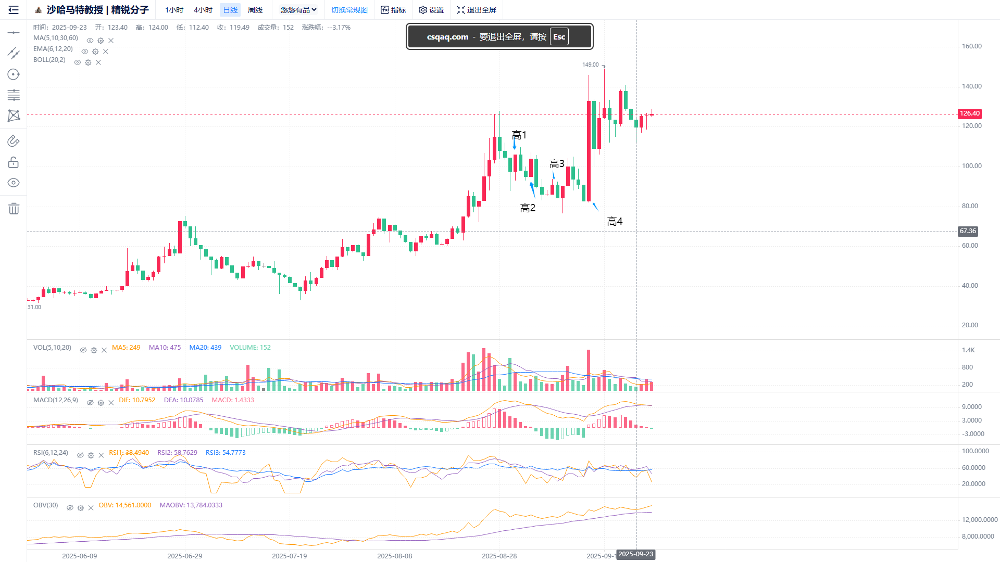
- 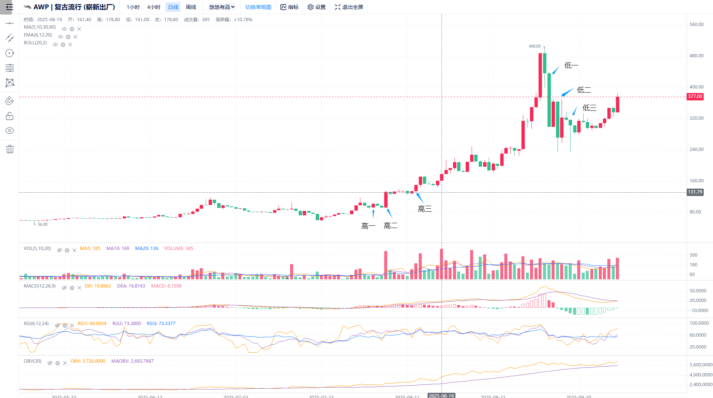

## 交易随笔
### 形态操作
#### 双底形态

出现双底怎么操作：

止损带到右脚，止盈放到扩展区域2.

突破颈线认为形态完成。完成后不一定标准上涨，可能走出整理行情，因此谨慎上移止损，避免被扫出去。

### 技术指标
#### 斐波那契

斐波那契怎么用，趋势如何判断起终点：

用来评估扩展时从右往左拉。

在潜在支撑区域没有得到验证时，入场胜率会更低。可以看小周期内有没有反转结构支撑，获得信号后再入场。

如何确认趋势是否延续：主要根据拐点有没有被破来判断。如果一段下降趋势没破拐点，那么不管后续怎么走，都认为第一段空头没走完。如果破拐点了，认为空头趋势走完了，将终点移动到下跌趋势的终点（找趋势终点）。

如何确认一段趋势是否属于同一个趋势结构：看回调例如，如果回调到0.382-0.618之间，则新的一段趋势可以单独存在，否则认为是同一段趋势（在不同时间周期内表现不同，可以用大周期目标抓小周期趋势）。

示例：
- 多头延续/趋势结束，以及回调新趋势延续的示例
  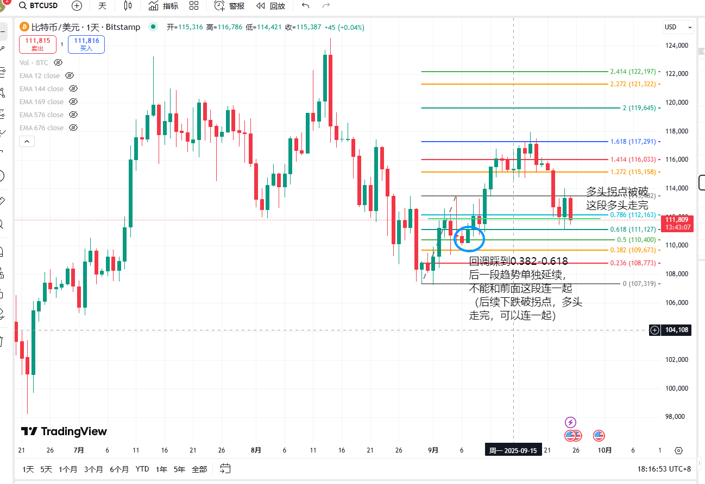

#### 趋势线
趋势线怎么用，如何通过它判断入场和出场时机：

趋势线适用于流通性高的品，例如黄金，游戏里的贴纸。

主要需要关注前高点和起涨点。前高点很可能在一波上涨中成为上涨阻力位。起涨点则很可能作为一波趋势的起点。

需要观察价格在碰到趋势线，阻力位之后的反应。能够验证的点越多，趋势线越有效，越能说明在对应位置，存在大量买/卖行为。

大周期找趋势，小周期确认入场点。

**示例：**

- 25液体：可以发现在小时周期内，价格多次触碰阻力/趋势线后趋势延续。
  游戏其实并非完美适用趋势玩法，因为它的交易周期太长了。小时基本的趋势并不能作为卖出点参考，作为买入点来说，也很容易半路下不了车。最合适的玩法是少开单，只做爆点单。这点斐波那契回撤会比较合适。
  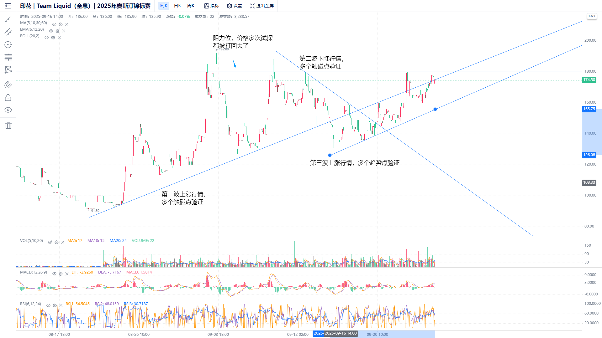

- 黄金差价合约：先从大周期找到最大趋势，再根据价格表现决定做多做空。
  这里按一天为周期，可以看到黄金一直在走大多头，且有多个触碰点确认；切换到4小时，发现短期变成空头，价格接近一天趋势。再从一小时趋势可以看到有多个底部支撑，开空止盈位确认。结合可以得出结论，现在黄金走出一个三角形中继形态，可操作的就是小趋势里高抛低吸，新方向确认后，再根据右侧机会入场。
  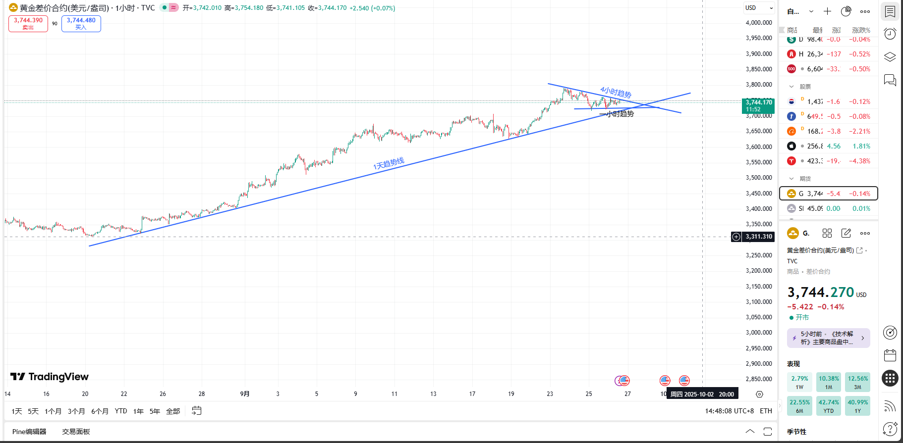

## 常用技术指标

### EMA200

### Vegas

### 斐波那契
#### 确认趋势

使用斐波那契作为交易指标最大的好处是能帮助我们找到入场点和出场点，还可以通过它来判断趋势延续的可能，多空双方的力量强度。

使用斐波那契回撤进行交易时，最好先确认当前市场处于那种趋势,顺应趋势而行。一种最简单的判断趋势的办法就是通过 **EMA200** 。当蜡烛线运行在 **EMA200**之上时,认为当前市场处于多头主导,反过来则认为当前市场处于空头主导.如果价格运行在均线附近,则不使用斐波那契进行操作,避免噪声和震荡导致的错误信号.

#### 关键位置

**最关键的位置（按重要性排序）：**

1.  **61.8% （0.618） - 「黄金比例」回撤位**
    *   **市场心理**：这是**最强有力的支撑/阻力位**。如果一波趋势是健康的，其回调不应超过61.8%这个“最终防线”。回调至此意味着趋势受到了真正考验，若能在此止跌/止涨，则原趋势延续的概率非常高。
    *   **作用**：最重要的**趋势健康与否的试金石**。

2.  **50% （0.50） - 「中庸」回撤位**
    *   **市场心理**：虽然不是一个严格的斐波那契比率，但由于其简单直观（回调一半），被交易员广泛使用和信任，具有很强的心理暗示作用。
    *   **作用**：重要的**心理支撑/阻力位**。价格回调至50%是非常常见的现象。

3.  **38.2% （0.382） - 「浅度」回撤位**
    *   **市场心理**：表明趋势非常强劲，回调幅度很浅。市场仅进行了轻微的获利了结就重新吸引了买家/卖家入场。
    *   **作用**：**强势趋势中的回调支撑/阻力**。如果价格仅回调至此就恢复原趋势，说明趋势动能极强。

4.  **78.6% （0.786） - 「深度」回撤位**
    *   **市场心理**：这是0.786的平方根，也是一个重要位。回调至此，趋势已经岌岌可危，几乎完全回吐了之前的涨幅/跌幅。
    *   **作用**：**趋势的最后一道防线**。如果该位置被有效突破，那么这很可能不是回调，而是**趋势反转**的开始，之前的趋势大概率已经结束。 

**示例:**
- 探员鬼狙:之前的抽象神车,现在已经风光不在,短期内看底部支撑就在0.618附近.不过这种抽象神车都是一波流,基本上和之前的肌肉男会是一样的结局
  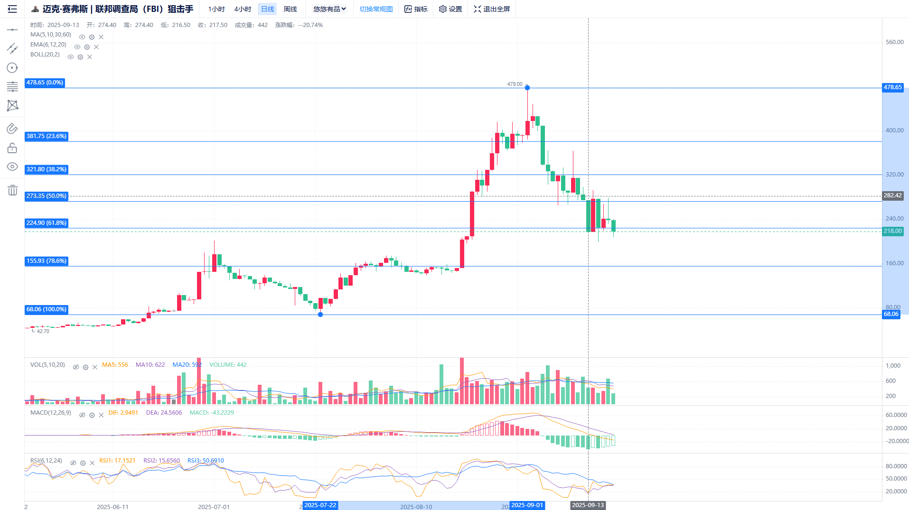
---

#### 斐波那契扩展

斐波那契扩展用于预测一波趋势 beyond 前高/前低后，可能最终会到达的目标位。它回答了“这波趋势能走多远？”的问题。

**最关键的位置（按重要性排序）：**

1.  **161.8% （1.618） - 「黄金比例」扩展位**
    *   **这是最核心、最常用的扩展目标位**。市场认为一波强劲的趋势运动，其幅度往往是前一推动浪的1.618倍。这是交易者寻找获利了结的首个重要目标。

2.  **100% （1.00） - 「等幅」扩展位**
    *   意味着新的趋势波段与之前作为测量基础的波段幅度相同。这是一个基本的目标位，通常在中继形态（如旗形、三角形）突破后使用。

3.  **127.2% （1.272） - 「常见」扩展位**
    *   这是1.618的平方根，也是一个非常重要的次级目标位。在强势但非极端的趋势中，价格经常在此位附近会遇到一些阻力或暂停。

4.  **261.8% （2.618） 与 423.8% （4.236） - 「极端」扩展位**
    *   这些位置通常出现在非常强劲的长期趋势或泡沫/恐慌性杀跌中。一旦价格到达161.8%后继续强势运动，这些位置就成为下一个参考目标。
   
斐波那契扩展可以用来找出场点,也可以用来找重叠区.当存在斐波那契聚集时,信号的可信度放大.

**示例:**
- 略磨皇帝:两段扩展都是多头走完就开始下跌,非常符合斐波那契扩展中的阻力位和重要位置.
  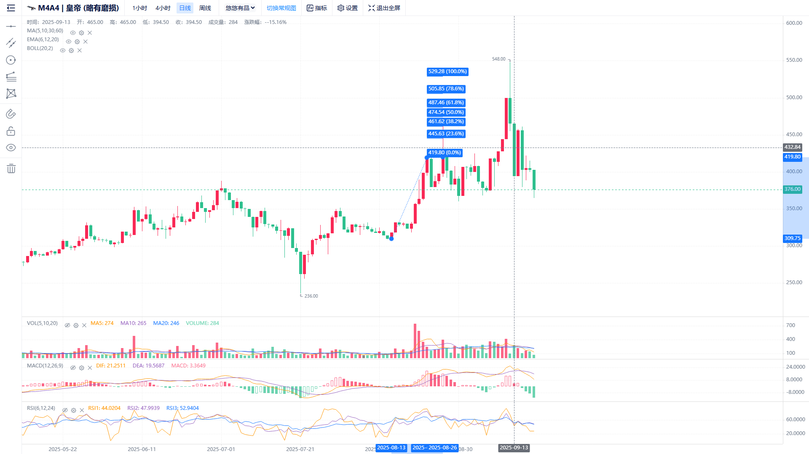
- AWP复古流行:有潜在的买点重合区,可以等到后接一点,这里如果跌破0.618,可能就会下去,因此也可以关注0.618附近的双底右侧信号.
  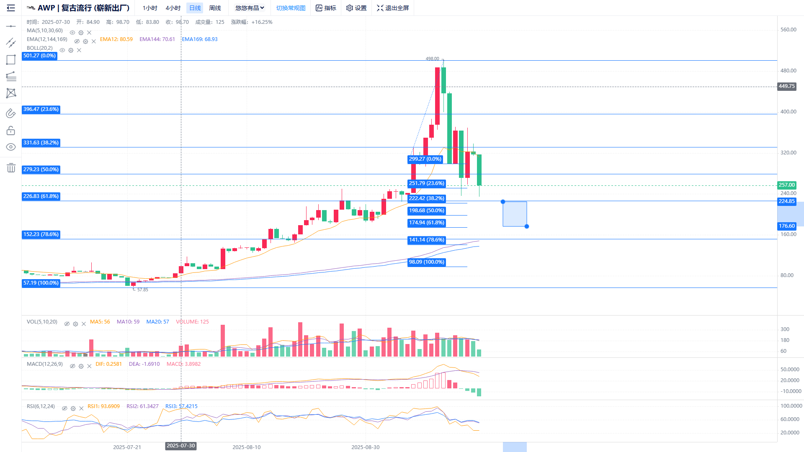
- AWP大姐姐:同上.
  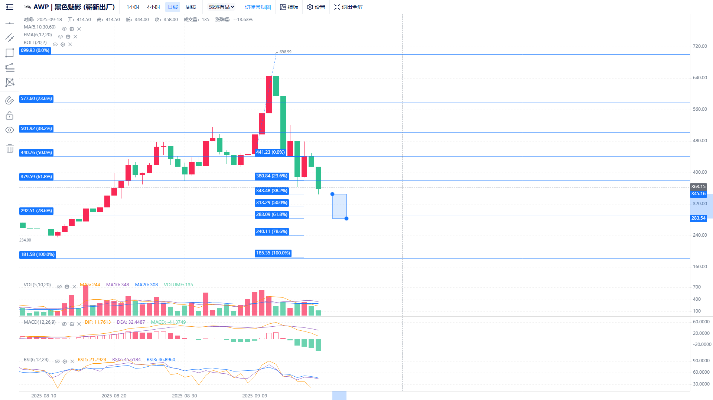
- M4反冲精英:在2.382-2.618附近存在重叠区:
  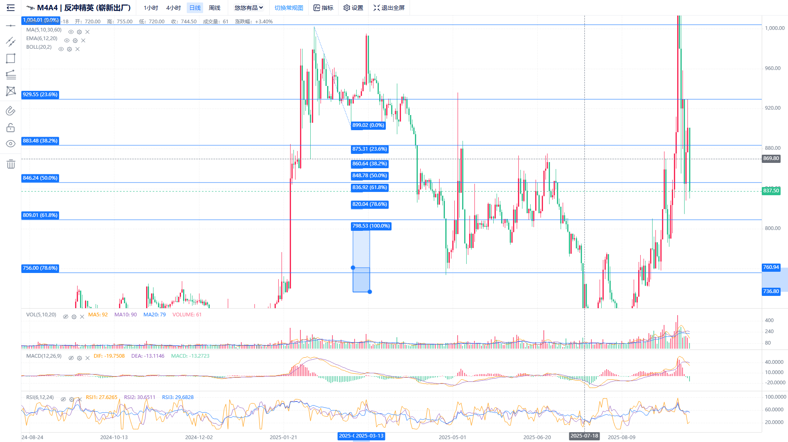

#### 使用技巧

5.  **结合其他信号进行确认**：
    *   **绝对不要孤立的依赖斐波那契扩展位**。当价格接近这些目标位时，需要观察是否有其他阻力迹象，如：
        *   **前期的高点/低点**形成的水平阻力。
        *   **重要的趋势线**。
        *   **看跌的K线反转形态**（如乌云盖顶、看跌吞没、黄昏之星）。
        *   **动量指标的背离**（如价格创新高，但RSI未创新高）。

*   **共振效应**：当多个不同时间框架（如日线和周线）的斐波那契目标位聚集在同一区域时，或者当斐波那契扩展位与前期关键价格水平重合时，该区域的重要性会**大大增强**。
*   **概率游戏**：斐波那契工具提供的是**高概率的潜在区域**，而非精确的点。将目标位视为一个“区域”而不是一个“点”。
*   **失效信号**：如果价格强势突破61.8%回撤位并冲向78.6%甚至100%，通常意味着原趋势动能衰竭，可能即将发生反转。
*   **先回撤，后扩展**：**首先使用回撤工具**来寻找高胜率的入场点（例如在61.8%回撤位企稳时入场），**然后再使用扩展工具**来规划盈利目标。

通过结合关键回撤位寻找入场点，并使用扩展位设定目标，斐波那契工具可以为你提供一个完整的从入场到出场的交易框架。

**示例:**
- AWP复古流行:考虑右侧做法,关注价格在这个双底附近的行为,如果跌破,则可能继续下探到0.786最后支撑位;如果上弹但没有破掉上次反弹高点,则可能继续回落;如果反弹成功突破,那么行情可能继续延续.
  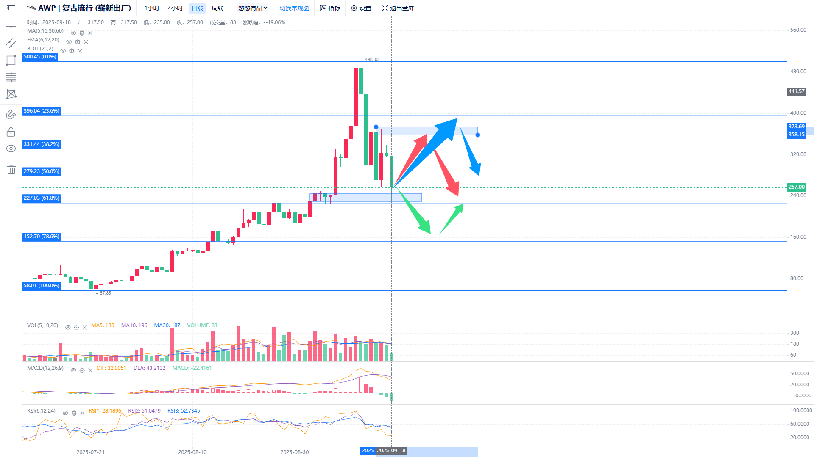

### BOLL+RSI

### MA60+MA120+RSI
均线多头排列，且MA60上传MA120，RSI处于超卖

## 交易系统

学会单一技术指标，却没有理念支撑，不能串联知识，只会导致照搬公式，将交易不顺归结于技术不行，心态不好。

交易理念>交易原则>交易技术。

交易理念：思维和行为的抽象化概述，是决定交易策略和方向的基石；
交易原则：基于交易理念形成的交易认知，方法论；
交易技术：认知的精细化，操作的有效性。

道氏理论核心：从大到小（大盘到板块个股），从长到短（先研判长期趋势再看短期趋势）。

趋势的定义：上升趋势，底底高，顶顶高；下降趋势，顶顶低，底底低。

新趋势定义（趋势跟踪）：上升趋势，回调的幅度比前一个回调小，认为趋势延续，反之回调触碰到前一个回调线，认为趋势可能反转；下降趋势，反弹的幅度比前一个小，认为趋势延续，反之反弹触碰到前一个反弹线，认为趋势可能反转。

趋势改变后的可能走向：交易区间，趋势逆转，趋势延续，或者碰到阻力位/支撑位，且趋势开始衰竭，直接反转（衰竭，回调浪数越来越多，高低点越来越接近）。

新的趋势定义主要借用斐波那契回撤衡量。以上升通道为例，通道起点作为回撤起点，依次在每一浪回调高点衡量这一次回调的力度是否触碰到上次回调的比例，碰到了，认为可能存在趋势变化。(个人认为这是趋势线变平缓的另一种表现形式，因为趋势力量越强，趋势线越陡峭，延续的可能也就越大；反之趋势线越平缓，市场进入调整的可能性也更大)

震荡之后趋势延续的关键位置：1.382，破则延续，不破则高概率反转。

趋势级别：大周期制约小周期，小周期影响大周期；递归概念：趋势严演变呈现从小周期到大周期逐级演变，直至大周期转向。

趋势的雏形：突破1.382认为趋势雏形形成，对于一个两段式行情，ABCD，以CB的趋势突破1.382为参考，突破后认为趋势雏形形成，后续回调C变成关键支撑点位。

三个基本点：

1.382：雏形认定参考位；强弱认定参考位；与1.618组成关键目标区间（震荡上行或者下行趋势初中期）

有效点：基本条件：同级别，强力度，回撤明显。较强力分型（黄昏星等蜡烛图形态），突破或跌破临近波段1.382位；不明显分型（时间短、力度小），可降级处理；(上面例子的C就是有效点)

节奏线：一点一线（来源），一线一位（阻力），一位一向（方向），相应级别最后节奏线。

趋势结构有三种，趋势延续，趋势重构，趋势诱多待定，核心依据是回调是否踩到节奏线。

没有踩到节奏线或者踩到节奏线后上涨，趋势延续；踩到节奏线甚至跌破接着上涨，趋势重构（每次这样上升的动力就会更强，并且这种情况可以算成是一个趋势，也就是大趋势套小趋势）；踩到节奏线甚至跌破节奏线接着上涨，但是没破1.382，可能是诱多。

一般来说，一个趋势里只需要关注最新的两三个节奏线即可，因为趋势可能存在重构，雏形也可能存在重构，根据前两个节奏线作为阻力位，第三个节奏线作为趋势终结的标准。

每一次回调产生的节奏线，接下来的移动举例和回调深度有关。以上升回调为例，如果回调幅度比较小，那么节奏线跟随价格就越近；如果回调幅度比较大，那么节奏线跟随价格就比较远；如果回调和前一个差不多，那么两个节奏线会几乎紧挨在一起。两根节奏线之间会形成共振区，而紧挨的节奏线会形成强支撑位。

趋势的最初状态：

完美推进型：趋势上破1.382，回踩破拐点，但依然在节奏线之上。左边图中E和G连成一条线，和节奏线形成了共振区。右边的图也是同理，只是用E作为共振区起点。

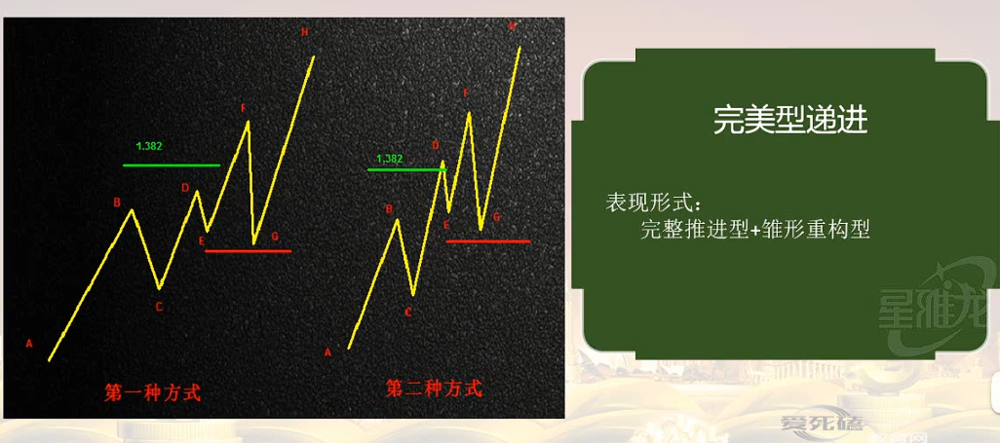

重叠推进型：大体与完美推进型类似，区别在于趋势回调中回踩了节奏线，此时变成诱多待定型（回踩的过程可能是震荡，也可能是接着上破，关键在于回踩后趋势能否延续）。后续上涨破1.382，证明趋势延续。这种情况下可以认为趋势非常强劲。重叠推进型的节奏线也会形成共振区。

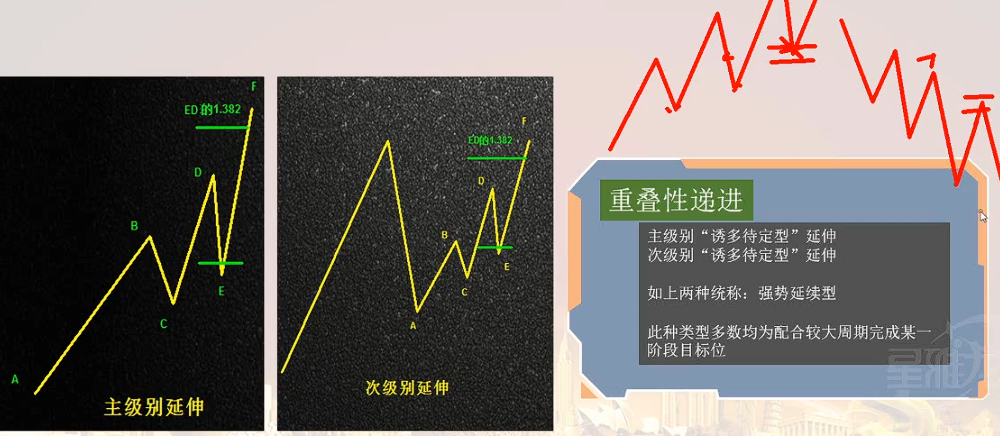

趋势延续力度的判断：

根据反弹打到节奏线的程度，可以判断出趋势延续的力度。

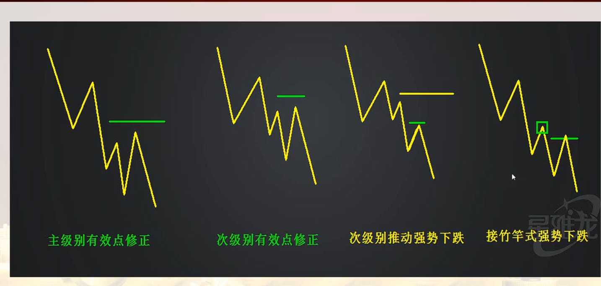

有效点生效的必要条件：有顶底分型，破了1.382（前提顶底分型，后续趋势破1.382，延续）。

盘整区间的结构判别：时间顺序上先左后右，空间顺序上先大后小（反弹力度）。

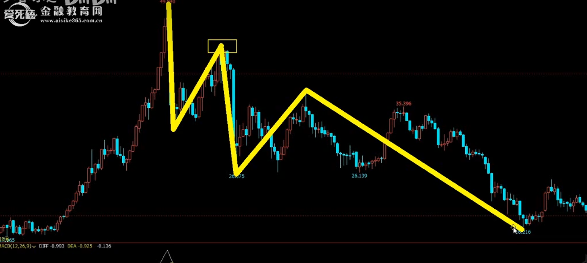

实践中常见形态的处理：

重要的是形态4，如果两个回弹比例非常接近，那么一般把两个节奏线对应的区域当成重要的阻力区。其它形态都可以按照先左后右，先大后小的规则来。

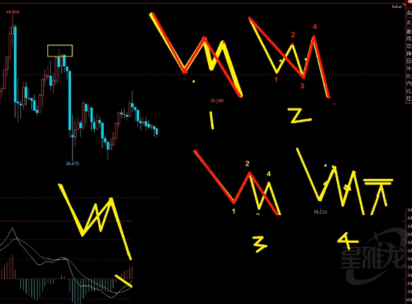

如果趋势延续后没有破1.382的点，证明这个区间不是一个有效的结构区间，这时直接连接区间低点。如果出现这种情况，要小心价格的反转发生。

下面的例子中，倒数第二波反弹之后的趋势，并没有跌破1.382，因此这个反弹不能作为有效点。

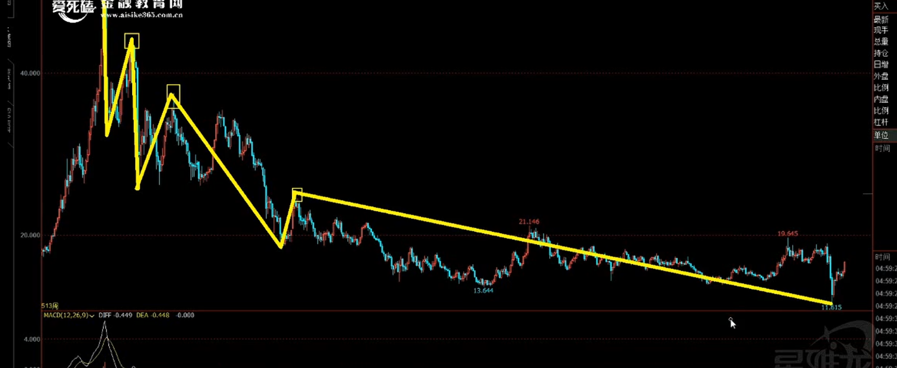

## 方方土

### C1
好的，我为你总结了这段视频字幕中的核心知识点，并特别突出了你提到的“对某一块知识点熟练后，再转向练习另外的知识点”的学习方法。

---

### 视频核心知识点总结

这段视频主要分享了三方面内容：Al Brooks (AB) 的个人背景、作者本人（视频博主）的学习经历与方法、以及一个辅助学习 AB 课程的翻译插件。

#### 1. 核心人物：Al Brooks (AB) 的背景

* **从医生到交易员：** AB 本是一位极其成功的眼科手术医生（80年代税后年入超100万美金），但他对交易充满向往。
* **10年亏损：** 在他交易生涯的前10年，他尝试了市面上几乎所有方法（写指标、请人教学等），但始终是亏损的。
* **转折点：** 1987年左右，为了能在家陪伴三个女儿的成长，他下定决心认真对待交易，并最终取得了成功，得以从医生岗位上退休。
* **价格行为 (Price Action)：** AB 将“价格行为”这一交易方法发扬光大。作者强调，AB 的体系（逐个 tick 分析）与市面上很多所谓的“裸K”或“价格行为”有本质的巨大差距。
* **著书与教学：** AB 出于热爱和分享，撰写了多本著作（三件套原版达54万字）并录制了视频课程，他本人是“世界上看K线图最多的人”。

#### 2. 作者的学习方法与经验（包含你关注的重点）

作者强调，学习 AB 的课程（约100小时）**没有任何捷径**，他的成功源于极度刻苦的重复性训练。

* **深度学习法：**
    * 每个视频至少看 2-3 遍，多的看 4-5 遍以上。
    * **逐帧做笔记：** 把课程的**每一张**课件都截图，在上面添加自己的注释和理解，做成自己的PPT。
    * **举一反三：** 在一个案例旁，自己去补充相似或几乎一样的图表，以加深理解。
    * **时间投入：** 一个30分钟的视频，他需要花 1.5 到 2 个小时才能完整学完。

* **克服困难：**
    * 作者承认自己并非“天才”，也曾经历过多次“大赚大亏”和情绪崩溃（例如在超市看到苹果就联想到股票亏损而崩溃）。
    * 他强调，交易中最重要的品质是：① 对市场的正确认知；② 对风险和情绪的控制能力。

* **💡 你关注的学习策略：专注精通，逐个击破**
    作者明确指出，AB 的课程内容庞大，初学时可能会混乱。他强烈推荐的学习路径是：
    1.  **选定一个形态：** 比如先学“三推楔形”（第24章）。
    2.  **深度专攻：** 详细看完这5个视频，做好笔记，然后在复盘和模拟中专门寻找和练习这一个形态。
    3.  **直到熟练：** 一直做到你对这个形态非常熟练，能稳定赚到小钱为止。
    4.  **再学下一个：** 然后再转向下一个知识点，比如“缺口”（第11章），重复上述过程。
    5.  **最终效果：** 作者认为“一招鲜，吃遍天”，只要能真正精通一个模式，就足以在市场中赚钱。

#### 3. 课程重点章节推荐

作者建议，学习不一定非要按顺序，可以优先学习最重要的部分：

* **风险控制 (最重要)：** 第 51、52 章。核心规则是“避免大亏”。
* **止损设置：** 第 33 章（共 7 个视频）。
* **基础概念：** 第 1 章（Getting Started）。
* **特定形态：**
    * 波段/剥头皮 (Scalping)：第 49、50 章及附加视频。
    * 大反转 (MTR)：第 38、39 章。
    * 通道与震荡区间：第 43-47 章。

#### 4. 辅助工具：在线翻译插件

* **需求：** AB 课程目前没有官方中文字幕，学习门槛高。
* **工具：** 观众发现了一款浏览器插件，可以实时翻译字幕。
* **建议：**
    * 作者推荐使用 **Firefox (火狐) 浏览器** 安装此插件，因为其他浏览器（如Chrome）有防盗版机制，截图时会黑屏，而火狐可以直接截图做笔记。
    * **效果：** 免费版够用，付费版（使用OpenAI）翻译效果更好，但仍有瑕疵（如无法准确翻译“Bar”、“Bull/Bear”、“Filled”等交易术语），但已足够帮助理解。

### C2
好的，这场直播的核心是复习和讲解 Al Brooks (AB) 视频课中的**市场周期 (Market Cycle)** 理论。

以下是为你提炼的核心知识点：

#### 1. 市场周期的四个阶段

Al Brooks 将市场划分为四个不断循环的阶段，主播强调，理解自己处于哪个阶段，是决定交易策略的第一步：

1.  **突破 (Breakout)：**
    * **特征：** 连续的、实体很大的趋势K线（如大阳线），几乎没有回调。
    * **策略：** 只能顺势交易（Always In）。胜率极高，但缺点是止损空间必须设得很大。

2.  **窄通道 (Narrow Channel)：**
    * **特征：** 有轻微回调（通常不超过1-2根K线），但趋势极强。
    * **关键点：** 窄通道在**更大**的时间周期上，其本质就是“突破”。（例如：5分钟的窄通道，在1小时图上可能就是一根大阳线）。
    * **策略：** 等同于突破，只能顺势交易，任何回调都是入场机会。

3.  **宽通道 (Wide Channel)：**
    * **特征：** 回调变得很深、很复杂，可能持续5-10根甚至20根K线。
    * **策略：** 顺势交易（如上涨宽通道中逢低买入）依然是最好的选择。但因为回调足够深，逆势交易者（如空头）也会开始“逢高”入场做剥头皮（Scalp）。

4.  **震荡区间 (Trading Range)：**
    * **特征：** 价格在水平的支撑和阻力位之间来回波动，多空力量均衡。
    * **策略：** 高抛低吸（在区间上沿做空，在下沿做多），并且**必须快速止盈 (赚快钱)**，因为市场大概率（80%）会继续震荡，不会轻易突破。
  
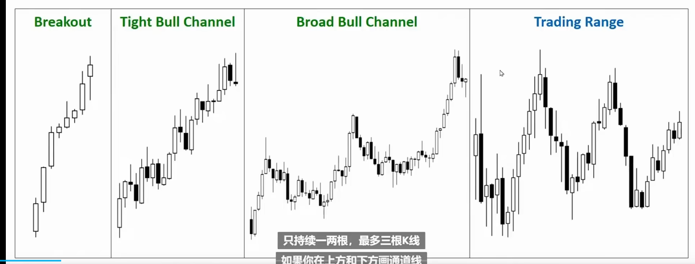

---

#### 2. 【核心】市场周期的“转化信号”

这场直播**最重要的知识点**，是讲解这四个阶段是如何互相转化的，尤其是“趋势如何转变为震荡”。

**关键预兆：观察“逆势方”能否赚到钱。**

主播（引用AB）详细解释了这个信号：

* **从“突破”变为“通道”：** 标志很简单，即突破行情开始出现了“明显的回调”。
* **从“通道”变为“震荡”：** 这是最关键的转变，**以一个“下降通道”转变为“震荡”为例：**
    1.  **趋势减弱信号：** 当“限价单多头”（Limit Order Bulls，即在前期低点挂限价买单的人）开始能赚到钱。
        * *表现：* 价格跌到前期低点，他们买入后，市场立刻反弹，让他们能快速剥头皮止盈。
    2.  **趋势终结信号：** 当“突破单多头”（Stop Order Bulls，即看到反弹信号K线，在其高点挂突破买单追涨的人）**也**开始能赚到钱。

**结论：** 当一个“下降趋势”开始反复让“多头”（逆势方）赚钱时，这个下降趋势就已经名存实亡了。这意味着市场已从趋势转变为“震荡区间”，此时交易策略必须从“逢高做空”转变为“高抛低吸”。

---

#### 3. 其他关键交易细节

1.  **50% 回调的意义：**
    * 在一个强趋势中，即使出现50%的深度回调，原有趋势继续的概率依然偏高（约60%）。
    * 但如果回调超过 2/3（约66%），市场就进入了 50/50 的震荡。

2.  **突破必须有“跟随” (Follow-through)：**
    * 一根突破K线（如大阳线）本身不代表趋势，它必须有“跟随”的K线（如另一根阳线）。
    * 如果突破后没有跟随（如创新高后立刻收阴线），这通常是陷阱或突破失败的信号。

3.  **失败的楔形 (Failed Wedge)：**
    * 当市场形成一个本应延续趋势的形态（如下降趋势中的“熊旗”或“下降楔形”），但最终却向**相反**方向突破时，这通常是一个极强的反转信号。
    * 这种“失败”会触发一个反向的“测量目标”（Measured Move），即形态的高度翻倍。

4.  **价格行为的通用性：**
    * 主播通过复盘美股指数(ES)、外汇、比特币(BTC)、A股甚至个股（如苹果、戴尔）的案例证明，这套市场周期理论在**所有品种**和**所有时间周期**上都是通用的。

早盘决定当天交易性质：这里开盘两次大波动，体现出是一个震荡区间。在这个大的震荡区间内，又有小的震荡区间，震荡区间内的合理操作就是高抛低吸。

这里衡量50%可以用斐波那契回撤。为什么说50%呢，因为底部入手的人，在反弹回到50%的时候，会选择减持或者清仓。

另外一个小知识点，K线40是一个盘中反转信号，突破失败且没有跟随，所以趋势反转。第7根K线出现的暴涨暴跌，和美东开盘时间有关系。

跟随是一个很重要的评估趋势能否延续的指标。例如K线7后面的K线8，虽然是同一趋势方向的跟随K线，下影线却非常长。这意味着能涨的幅度不会特别大了。

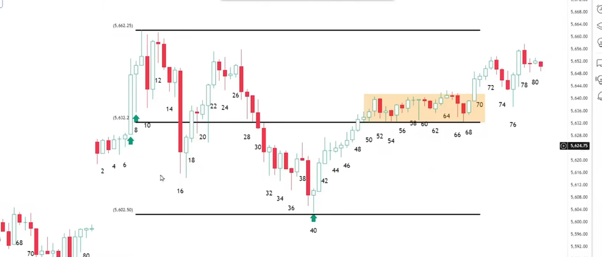

下降趋势中，关注多头能不能逆势赚钱：
1. 限价单多头（类似挂低点求购）
2. 突破单多头（类似追涨右侧）

如果处于下降趋势中多头也能赚钱，那么意味着当前处于通道或者震荡的可能性很大，此时也应该按照高抛低吸的原则操作，而不是看到大阴线就追空。

为什么处于下降趋势多头也能赚钱呢？因为他们会在每个低点持续买入，在价格回弹的过程中卖出。即使是突破单买入，也可以在价格回弹的时候平仓，那么每次这样操作，都能保证小赚或者不亏。

当越来越多的多头执行这样的操作，就支撑起了价格反弹。

限价单和突破单的例子（处于底部的是限价单，信号中的是突破单）：
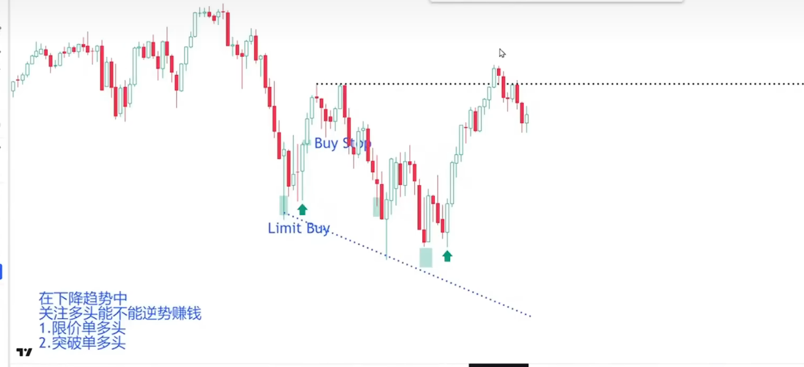

三推绝大部分时间都是优秀的止盈位置。

突破需要跟随。

斐波那契50/50，意味着能拿到一倍的盈亏比。

在市场中观察你想交易方向的交易者能否赚钱。如果能，那么下次到这个地方，他们可能依然选择在这个点位入场。这就是为什么一些低点，或者拐点，是重要的入场参考点位。

如何判断突破变成通道：看反弹出现次数，以及力度。如果出现大力度的反弹，或者连续两次及以上的反弹，意味着当前突破可能要结束转为通道或者震荡区间了。

图中首先是一个下跌突破，而后出现反弹，这其实就意味着下跌突破的趋势变弱了，市场进入通道区间。当下跌到某个低点时，多头开始赚钱，当再次下跌到这个低点时，多头逢低买入依然可以赚钱。因此就变为交易区间，大家都在各自方向能赚钱的地方买入或者做空。
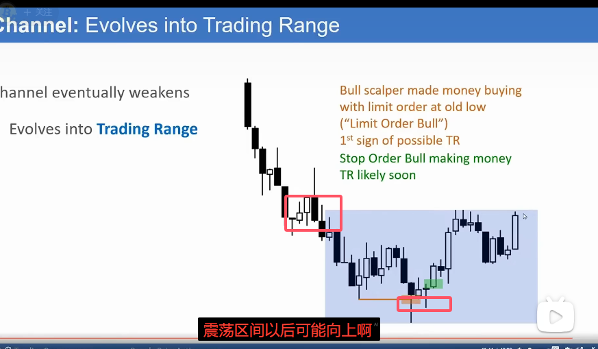

下跌趋势中的上涨通道都是熊旗，如果没有强力突破，那么大概率下跌趋势延续。同理，上涨趋势中的下跌通道也都是牛旗。

宽通道也能成为牛旗/熊旗。

熊旗的例子：
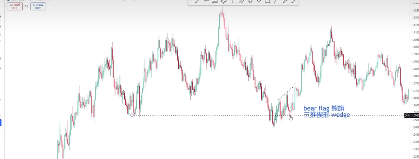

利用斐波那契回撤判断止盈目标+根据突破后跟随的力度判断趋势延续的可能：这里出现一个强势趋势K（surprise bar），反转了下跌趋势，这个熊旗变成一个失败的楔形（MTR，大反转）。随后出现了一个新的熊旗，为什么可以这样判断，因为上去之后的K线跟随不是很强势，立马又出现一个小阴线，后续变成三推状态，多头止盈，激进多头入场推动下跌。
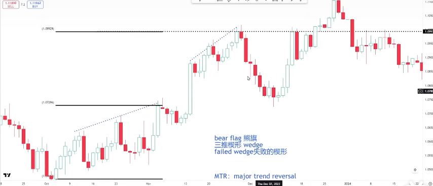

判断反转成功的依据是上去之后第三四根K线并没有跌回surprise bar的起点。

### C3

这一章的内容主要讨论了K线的形成，以及它可能的形成原因。

#### K线的上下影线形成时间

对于一根K线，它的上下影线形成是时机是什么时候呢？对于处于趋势中的K线，如何根据前面的K线来判断它可能的上下影线，以确认入场位置呢？这些都是非常重要的内容。通过经验总结，我们可以得出下列的结论：

1. 如果早盘存在非常强的趋势，例如上涨趋势，那么盘中高点，可能就是上影线，反之，下降趋势中早盘低点可能就是下影线；
2. 如果早盘存在非常强的趋势，例如上涨趋势，那么即使趋势被完全反转，最后的收盘价也不会比开盘价低特别多。

对于早盘的定义，不一定是日内，将时间周期拉长，或者缩短，也可也适用，例如一个月的前10天，或者一小时的前20分钟。

如何理解上面的结论呢？首先，我们知道带有长上下影线的K线，其实就说明这根K线包含一个交易区间。对于盘中的人而言，当最高点形成（上影线）后，
大家都会不约而同的在同一个地方卖出，这时就形成了上涨阻力；当多头卖出离场后，空头又开始大行其道，他们会尝试将价格打到开盘价之下，然而由于
大多数多头在开盘价买入都赚到钱了，所以到开盘价附近，又会形成做空阻力。

日内反转的例子：
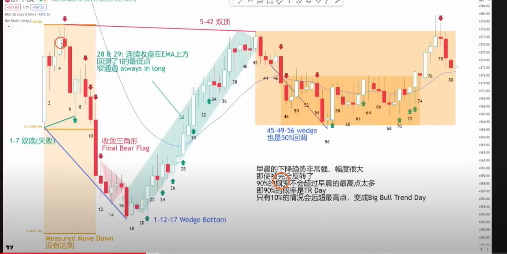

早盘存在强趋势，出现反转可能的收盘K线：
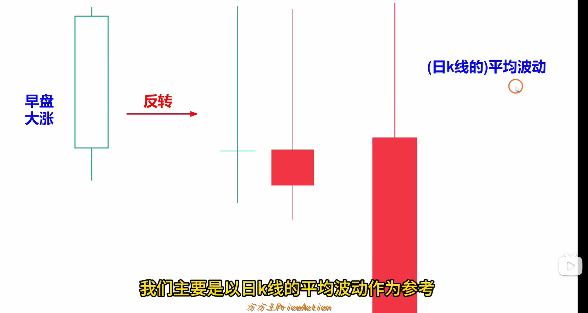

上面这个情况有一个前提，就是早盘存在明确的趋势。如果趋势被反转，出现后面那种巨大实体的影线的概率是比较低的。判别的标准可以根据
市场日内波动幅度来。例如标普500日内波动可能只有1-2%，那么它出现上涨5%，然后回撤到2%，就是比较合理的。而直接回撤7%，就比较少见，一般
只由于消息面导致。

如果处于趋势中，那么下引线形成可能是比较好的买入机会：
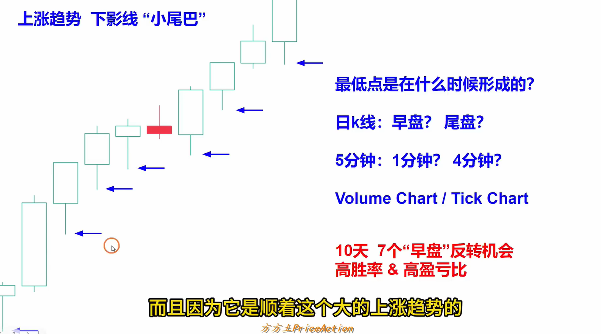

#### 趋势线的可能形成过程

对于有大实体的趋势K线，它的形成过程可能是这样的：
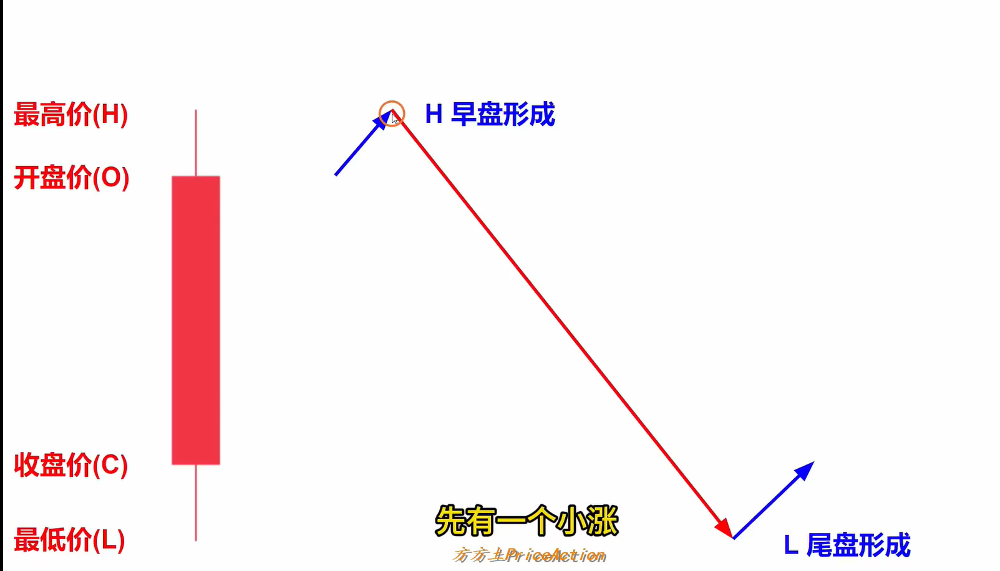

也可能是这样的：
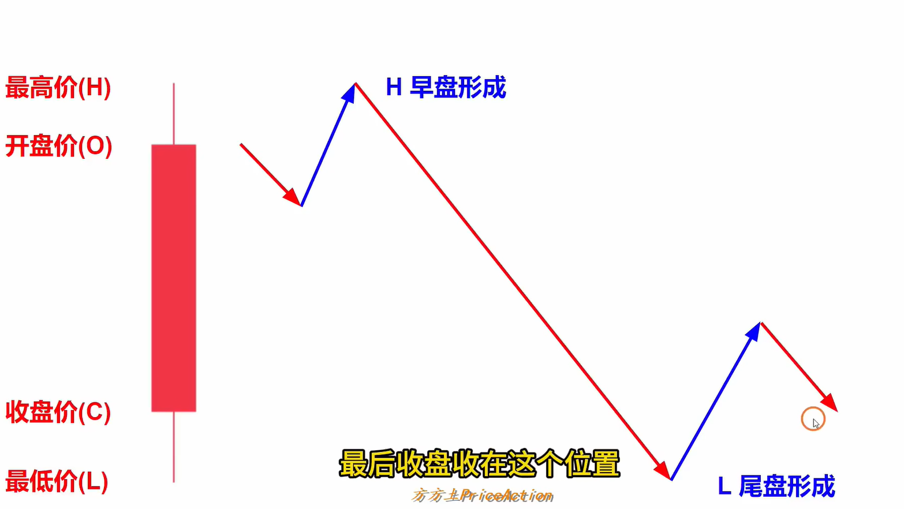

了解这些，可以大概通过趋势K推断出K线内的趋势结构。

#### 十字星

十字星本身就代表一个交易区间，了解十字星的目的主要是明白开盘价是一个磁铁这个道理，正因为开盘价是一个很强的磁铁，所以即使
十字星中间有震荡过程，最终也可能收回到开盘价变成一个小实体十字星。

十字星的上下影线至少有一个是早盘时就形成了，非常少的情况下上下影线会在收盘同时形成（事件驱动）。
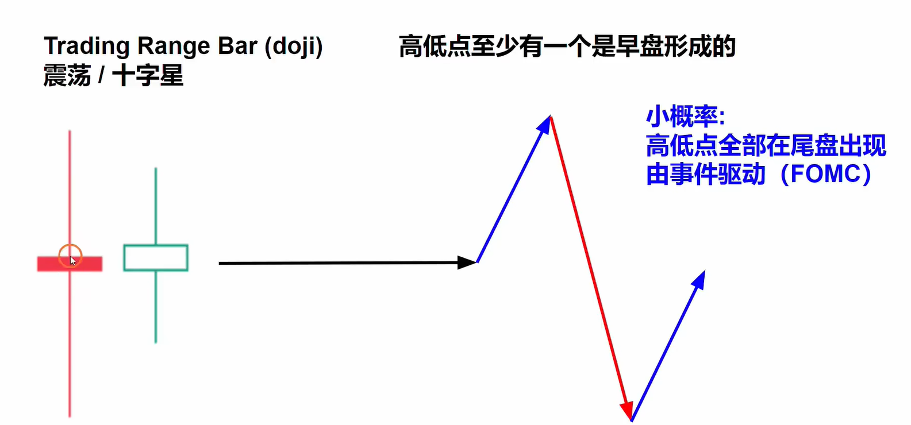

收盘价格被吸回开盘价的例子：
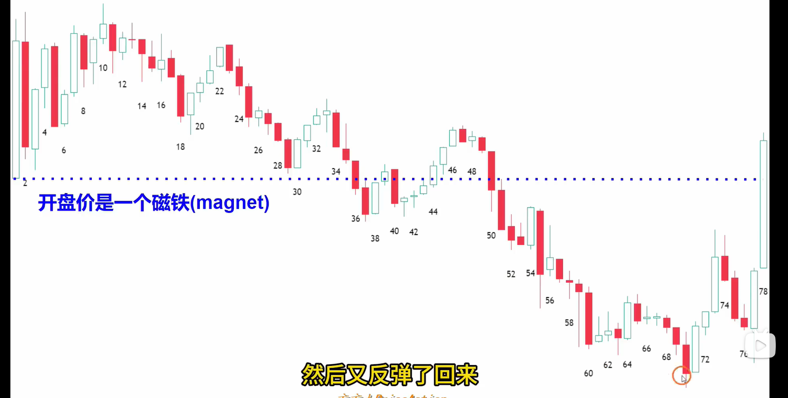

### C4 
这一章的内容介绍了市场的四种周期，各个周期可以执行的合理操作，以及顺带提了下止盈止损。

#### 突破（强趋势）

这里的突破并非突破交易区间，而是一种强趋势的体现。在突破趋势中，几乎没有回调，或者只有一根K线回调。

上升趋势突破的典型形态：
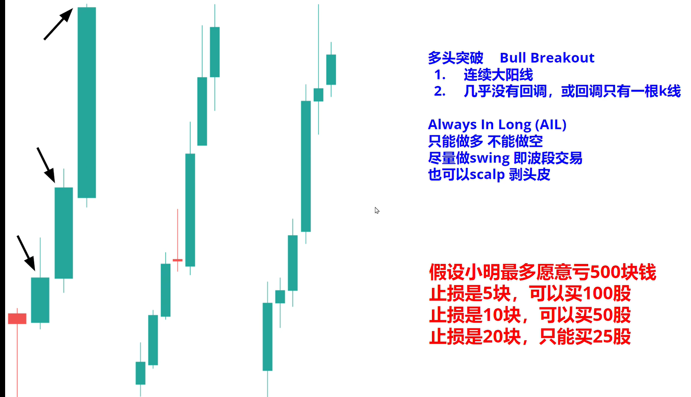

下跌趋势突破的典型形态：
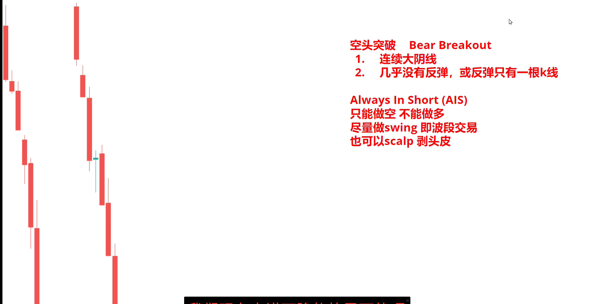

在突破行情中入场，止损需要设置到突破的起点。根据不同入场的点位，以及可接受的亏损范围，需要相应的调整仓位大小。
例如图中，越早入场，能放入的仓位越大，止损点离入场点越近；越晚入场，胜率越大，能放入的仓位越小，止损点也离入仓点越近。

在突破行情中，按照波段交易，可以一直持有仓位，直到趋势变弱或者终结。在突破行情中，唯一能够接受的操作就是顺势操作，按照突破的方向
进行交易。

#### 窄通道（强趋势）

窄通道与突破较为类似，区别在于它的回调K线更多，回调次数也更多，一般上涨一段回调1-3根K线，接着上涨，认为是窄通道。

由于趋势具有惯性，因此在窄通道中尝试反转，有80%的几率失败，所以按照波段的方式交易，能够最大程度的吃满收益。

上升趋势窄通道：
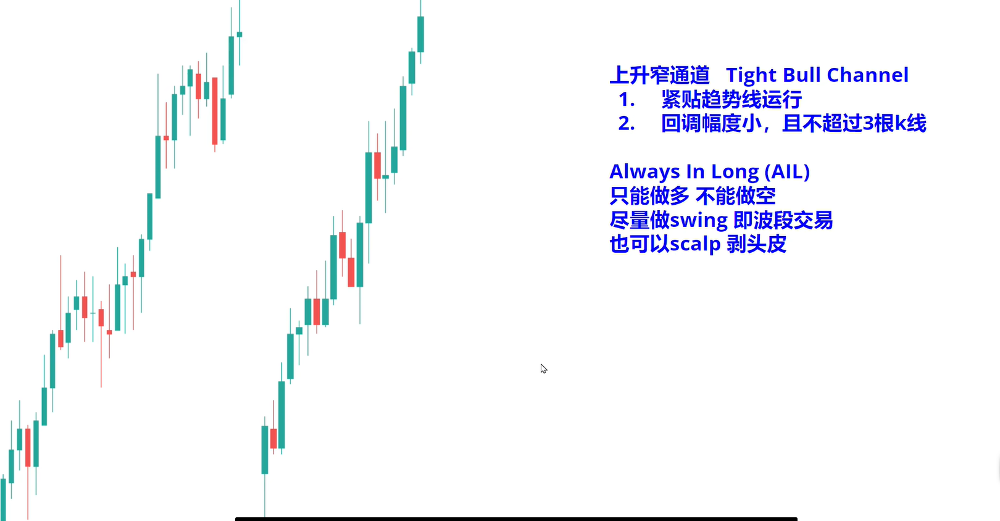

下跌趋势窄通道：
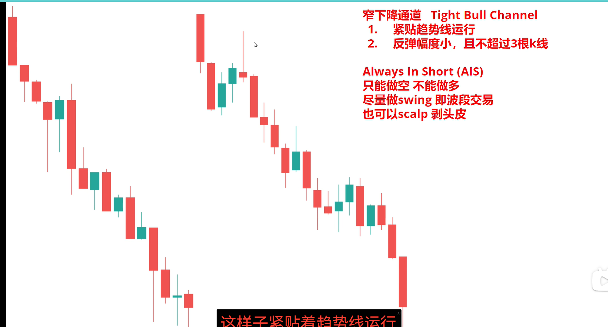

窄通道趋势中交易方法与突破类似，都是顺着通道方向交易，止损设置到最低点。

#### 宽通道（弱趋势）

宽通道开始出现多次回调，有深度的回调，但是整体上低点还是在不断抬高。宽通道之所以弱势是因为在宽通道中多头和空头都能赚钱，
空头可以逢高做空，多头也可逢低买入，因此在趋势改变之前总会有对手盘。

在宽通道中同样可以做波段交易，但是宽通道的止损需要动态移动。

上升趋势宽通道：
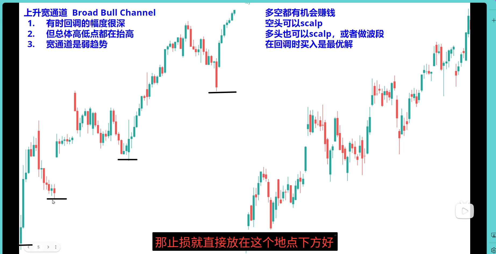

下跌趋势宽通道：
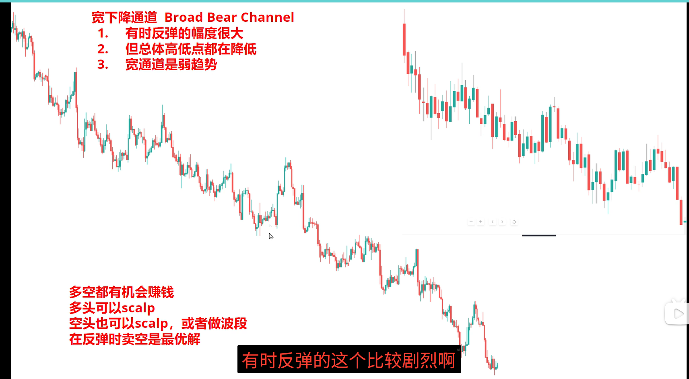
'
上图的趋势宽通道从一个突破开始，一个关键的定律是，任何趋势都是由突破开始，而后转变。

在宽通道中，无论那个节点入场，都需要将止损点设立在前期的低点之中，而后在前期重要高点突破后，将止损抬高到这段突破的低点。

#### 震荡区间

震荡区间看起来是一个有着明确上下边界的箱体，在震荡区间内能做的操作就是高抛低吸。震荡区间里，低吸的止损放在区间底部之下，高抛做空的
止损则放在区间顶部之上。

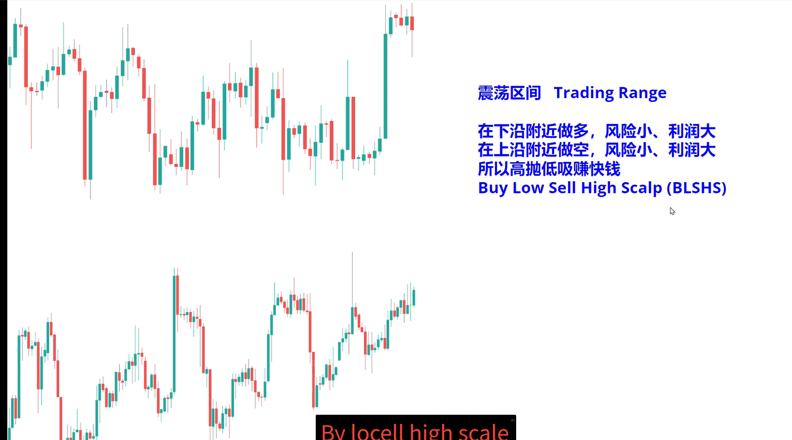

#### 不同时间周期下的趋势体现

 在不同时间周期下，我们能看到的趋势类型也不同。例如下面AMD的周线是一个突破，日线是窄通道，一小时和五分钟又是宽通道：
 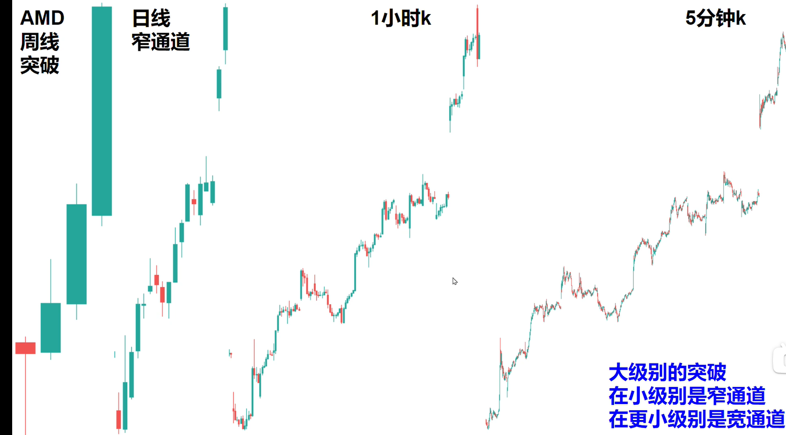

这其实暗示我们不同时间周期看到的趋势强弱不同。大时间周期能让我们快速了解这只股票的强弱，而小时间周期则提供交易机会。实践中
我们不必将大时间周期带入到小时间里，如果是小时间周期交易，只需要参考小时间周期的就可以了。

另外如果能养成看到大时间周期就能联想到小时间周期结构的能力，对我们理解趋势结构是有帮助的。

这里从C5章节给出一个新例子，如果觉得小周期复杂，可以放到大周期来看，大周期的结构会更加清晰，并且屏蔽掉一些交易区间内多空争夺对我们的影响。

小时间周期的下降通道，利用数K线+信号K的方式入场，不一定能拿到收益：
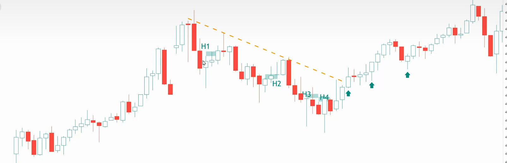

放到大时间周期，结构就清楚很多：
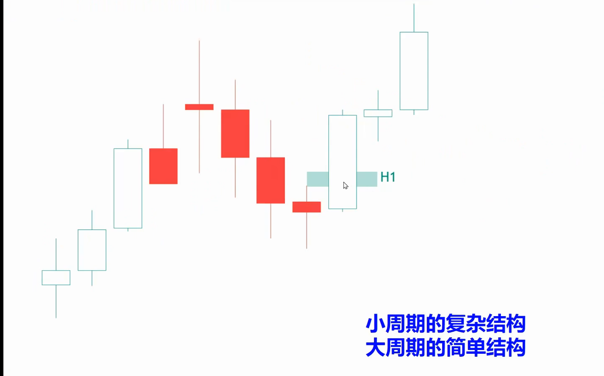

#### 市场结构的变化
市场的结构变化无非就是在上面的四种形态中来回切换，例如下图：

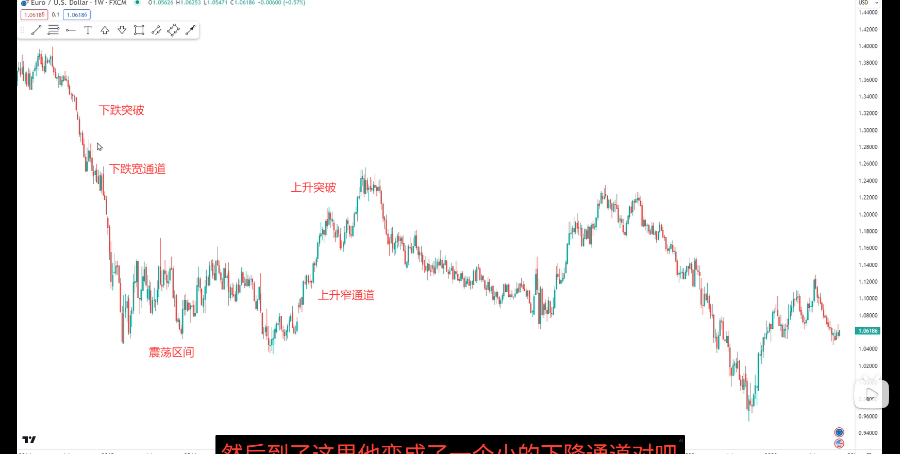

对于震荡区间1：1移动的现象，实际上可以解释为measure move，上图中就体现出来了。

#### 趋势的过渡

市场中趋势开始改变，一定会有过渡，很少会有立马反向反转的现象。

对于强势上涨突破或者窄通道，当出现连续下跌时，可能就意味着接下来要进入交易区间，或者通道了：
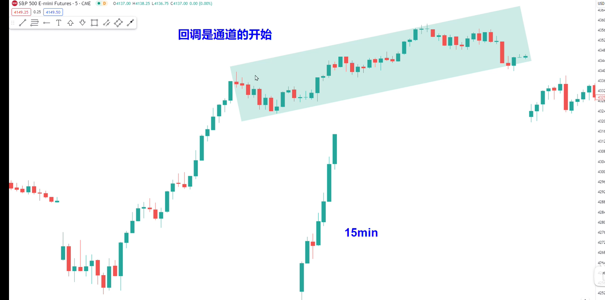

同理，对于强势下跌突破或者窄通道，反弹是过渡的征兆：
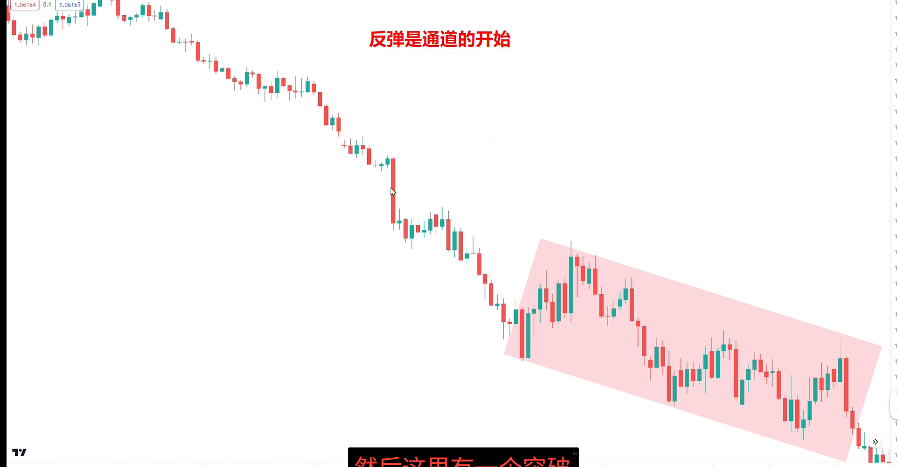

从价格行为学的角度来看，头肩形态的本质就是突破转为通道或者区间的过程，因此突破颈线是重要信号：
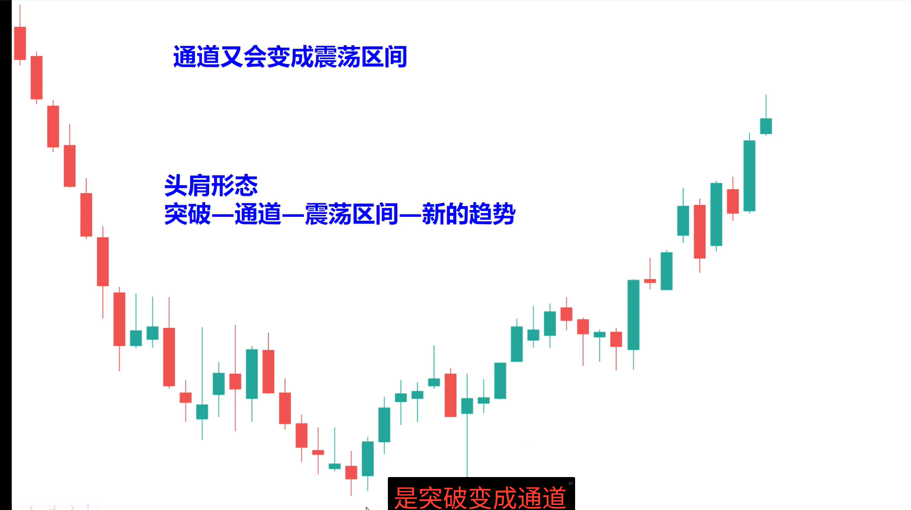

#### 惯性原则

市场存在惯性，当一个趋势形成后，对它的反转有80%的几率会失败（为什么？因为获利者会不断重复获利操作，从而使得反转形成对手盘）。

上涨趋势的惯性：
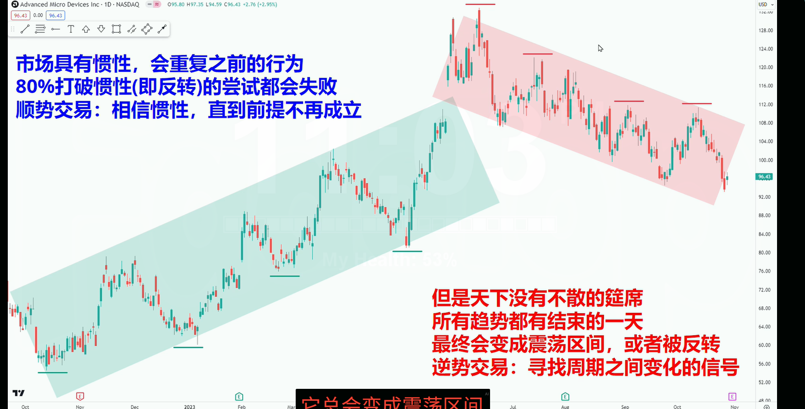

同理，震荡的交易区间也有惯性：
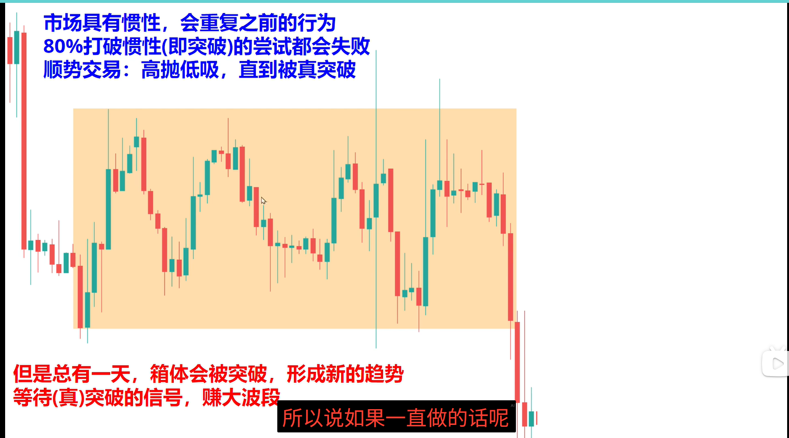

这里有一个做反转的知识：如果一个形态走的太远了，例如箱体震荡，持续超过20根K线以上（不绝对，震荡时间长达几年，短则两三根K线，都是有可能的），那么它被突破的概率就会越来越高。因此在震荡区间做反向交易的目的，实际上就是去赌突破，去用多次小亏换一次大赚。

#### 二元决策：根据周期交易

结合上面说到的四种周期，在交易前，可以问下自己当前市场处于那个周期，是趋势，还是震荡区间，持续了多久，趋势的强度如何。

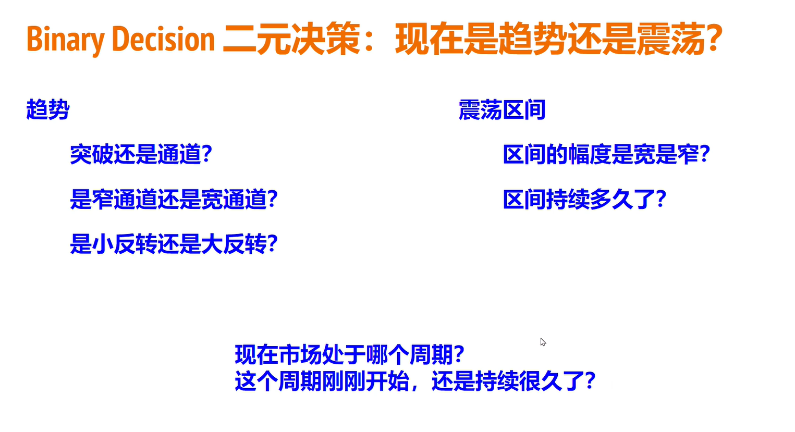

提示：对于窄的交易区间而言，由于没有多少利润空间，所以可以等到突破后做波段，而不是入场赌突破。

### C5
这一章讲了什么是回调和反弹，如何数K线，以及通过数K线+信号K的方式入场。

####  趋势和回调/反弹

什么是趋势？趋势就是指K线形成了低点抬高，高点抬高（上升趋势），或者低点下降，高点下降（下降趋势）。

什么是回调？回调可以理解为在上升趋势中，第一次出现低点比前一个K线低点还要低的K线。即使只有一根这样的K线，我们也认为这是一次回调。

什么是反弹？反弹可以理解为在下降趋势中，第一次出现高点比前一个K线高点还要高的K线。即使只有一根这样的K线，我们也认为这是一次反弹。

上涨趋势中的回调：
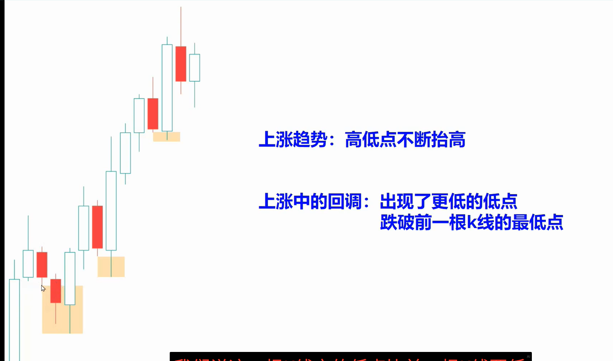

下跌趋势中的反弹：
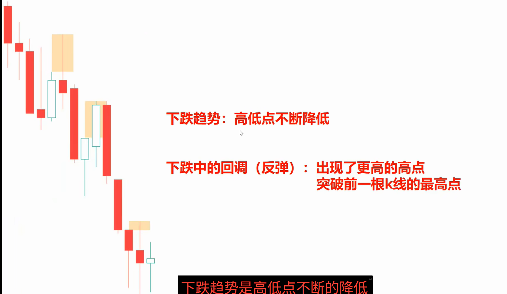

##### 大时间周期内的隐形回调

在大时间周期中，尤其是处于突破或窄通道趋势中，我们可以不能直观的看出哪一个部分产生了回调，因为K线图上不一定会有低点更低的K线出现。但是切换到小时间周期，可以发现十字星，或者长上/下影线K，实际上蕴含着回调。

上升趋势的回调：
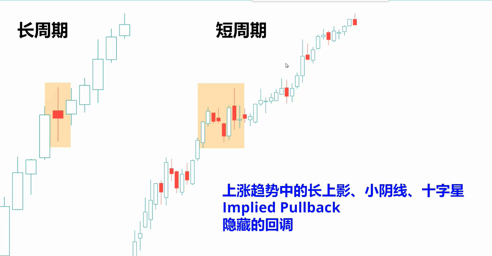

下降趋势的反弹：
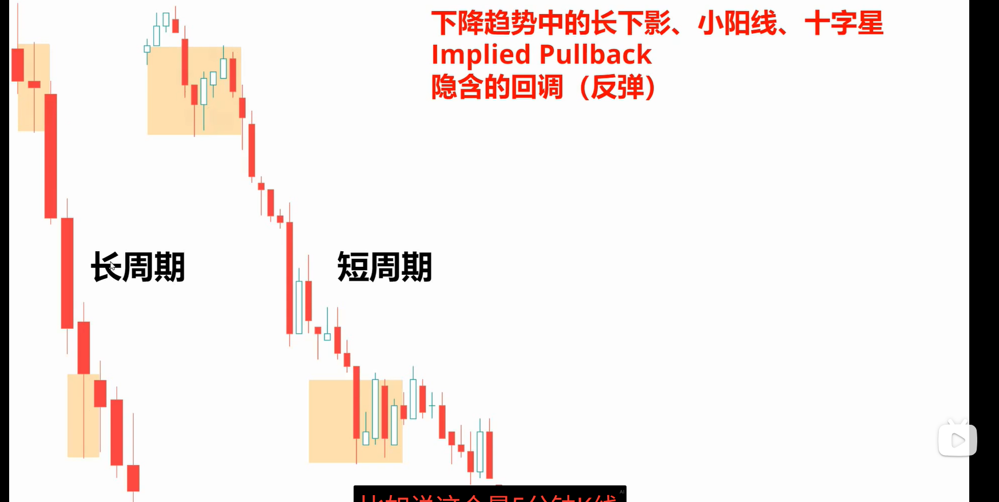

对于这种隐形回调出现的下影线，会有很多多头/空头在这里地方买入，期待趋势延续。这也是一种做回调的方式。

##### 顺大逆小的原则

顺大逆小指的是顺应大趋势，逆着小回调/反弹。因为回调和反弹能带来不错的盈亏比，且胜率较高，所以在回调时可以根据信号入场，以免错过行情。

##### 深度回调/反弹

我们知道任何任何对趋势的尝试反转，都有80%的几率失败，转而继续顺应趋势或者进入交易区间。深度回调/反弹就是对这一原则的最好体现。为什么会这样？因为主导趋势的永远是机构，而机构的资金量允许它们在逆趋势时不断注入资金，期待趋势延续。

下跌趋势中的深度反弹：
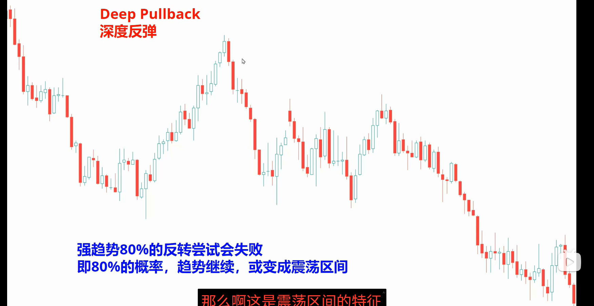

上升趋势中的深度回调：
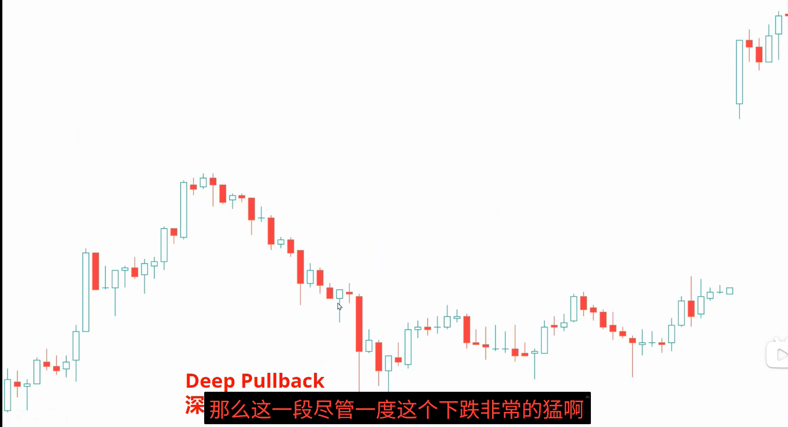

上面的回调和反弹幅度，都非常之大，一度接近起跌点和起涨点。即使它们的上涨或者下跌幅度接近80%，也不能说明趋势被反转了。因为还没破位，所以依然之只能看作回调，只是对手盘在测试通道起点。

这里要注意，对于个人交易者而言，能承受的风险以及资金量，肯定是不如机构的。所以我们不能像机构一样，逆着趋势一直加仓，最好还是看到信号后止盈，等待趋势明确后，再次入场。

这里不由得想到，游戏市场里，是没有所谓“机构”的。这意味着这个市场绝大多数都是散户，只有少量大资金，能够主导走势。这里大资金，必然也是团队，商会级别的，也就是大导购。如果这种人都放弃了自己的项目，那是不是意味着利润空间没有了，或者没人接盘了呢？

当然，根据前面几次黑天鹅事件来看，形成影响力的品，是不会那么轻易被放弃的。例如抽象派，地狱烈焰之类的。但是也并非所有饰品都是如此，刀皮，探员，贴纸，武库等等等等，很难说明这些东西为什么没有后续了，但是从表面上来看，资金就是不青睐这些东西。它们往往都是一波流。想明白这些，其实就能反问自己，到底在埋伏什么？是埋伏起爆点，还是埋伏下降通道。当然市场是不可预测的，既然如此，为什么不把重点放在这些商会主导的东西上呢。

##### 产生回调的原因

产生回调的原因就是，机构在分批或者全部止盈。对于机构而言，他们的止损一定是非常大的，放在起涨点的位置。因此，他们推动趋势运行越远，止损也就越大，需要承担的风险也就越大。对于这种情况，他们会采用减仓止盈的方式来减小风险。当市场上最大多头/空头开始观望，推动趋势进行的力量也就变弱了很多。这时会出现回调是非常正常的。机构买家会在回调处观察空头对手盘的力量，如果力量不大，那么他们会选择继续买入，然后在更高的位置再次止盈。如果空头力量强劲，他们可能就不会选择继续入场，而是加入空头或者观望。

由此就可以解释为什么回调出现后，可能会进入交易区间，或者趋势延续，以及为什么趋势反转的难度非常大，为什么回调会测试起涨点。

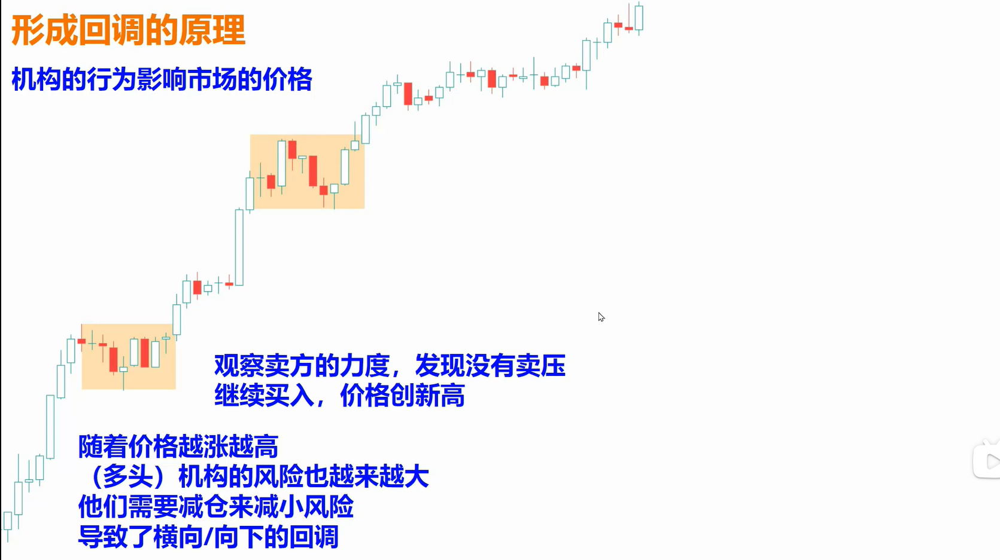

##### 50/50回调的重要性

前面我们提到50%回撤扩展附近可以看成一个关键的止盈位。为什么呢？因为这个地方能达到1：1的盈亏比。在回调中，有时也会踩着50%回撤进行趋势延续。这是因为在这里，空头的盈亏比也是1：1.为了防止风险扩大，空头会卖出止盈。因此这里变成了一个支撑位。

上升趋势中的50%回调，此时空头继续向下做空需要承担1：1的风险，而趋势具有惯性，因此多头胜率更高，能有60%。
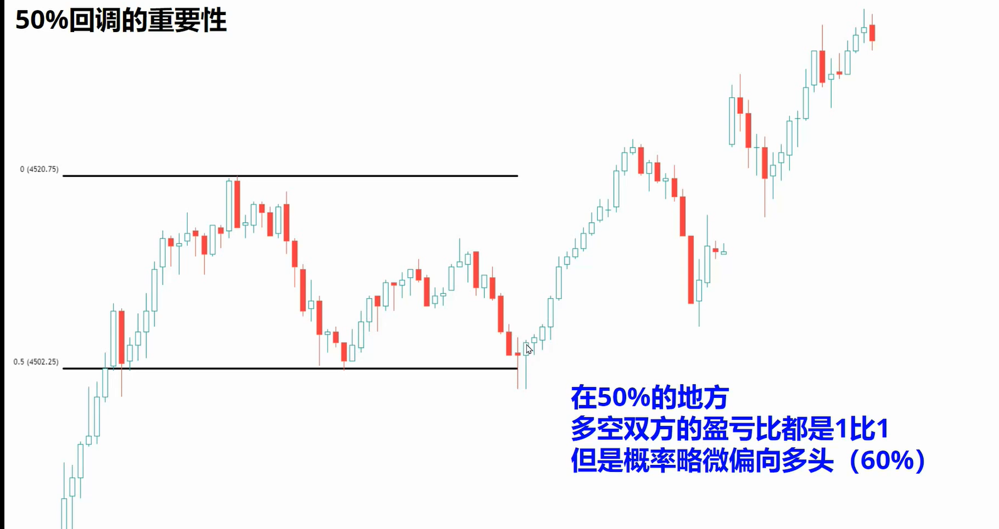

下降趋势同理，50%的反弹，意味着多头在1：1的位置进行了止盈。

#### 数K线
##### H1、H2、H3的定义

H1，H2，H3...其实都是对入场点的定义，它适用于上涨趋势中出现回调的时候。当上涨趋势出现回调后，出现的第一根比前一根K线高点要高的K线，称为高1。依次类推，第二根就称为高2。如果高1之后出现了第二根高点比高1高的K线，它并不是高2，因此高2的出现是回调之后产生。

为什么高1，高2等等K线能作为入场参考呢？因为出现高1，高2意味着趋势可能要继续延续了。买入高1，高2，其实就是在期待趋势延续下去。从形态上来看，其实高1，高2...就是上升趋势中的牛旗。

H1，H2，H3的定义：
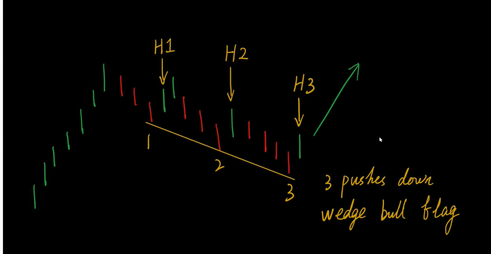

##### 如何应用H1、H2、H3

如果我们看到一个强劲的上涨趋势开始出现了回调，那么按照数K线的买入逻辑，就是在每一根回调K线的上方挂突破单。当K价格涨到前一根K线之上时，买单成交，如果继续回调，就改为在下一根K线上方买入。这样，只有当出现H1的时候，买单才会成交。

买单的例子：
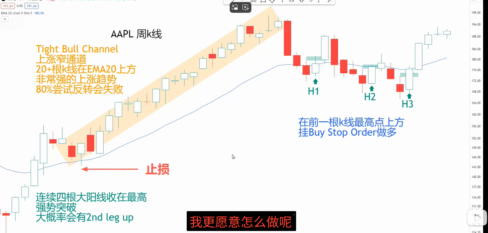

上面例子可以看出市场在一个强势突破后进入了上升趋势窄通道，那么这个强势上涨趋势被反转的概率只有20%，根据数K线的逻辑，可以在回调K线的上方挂突破单。

但是这个操作的问题在于，这样做的止损太大了，需要放到起涨点，也就是通道起点。如果后面没有如愿，那么我们的亏损可能会非常大。

如果追求更高胜率的的做法，我们应该等待好的信号K出现再入场。对于上涨趋势，好的信号K就是大实体，短上影线，或者小实体，长下影线。买入逻辑同样是挂突破单。

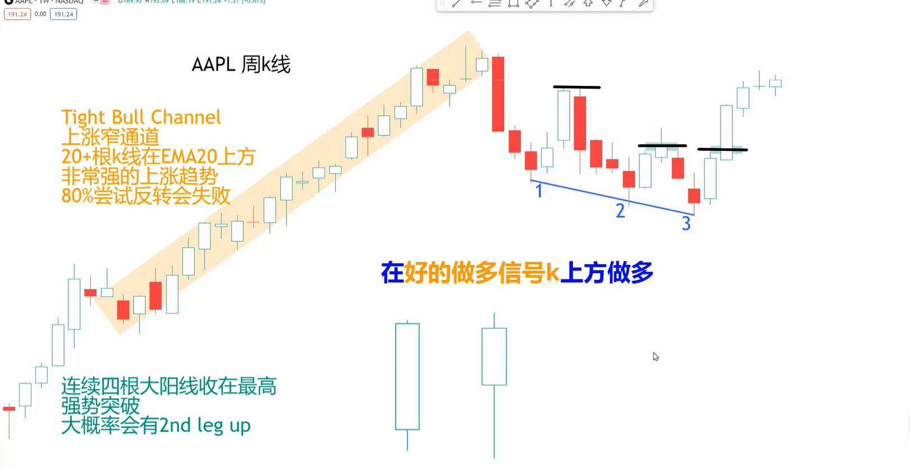

##### 如何使用高1入场

在强势的上涨行情，例如上涨窄通道，此时大多数人都是迫不及待入场点，因此在这种趋势中，采用高1入场是合理的。但实际上，在窄幅上涨通道，不一定非要采用高1入场，它只是作为入场的理由之一。
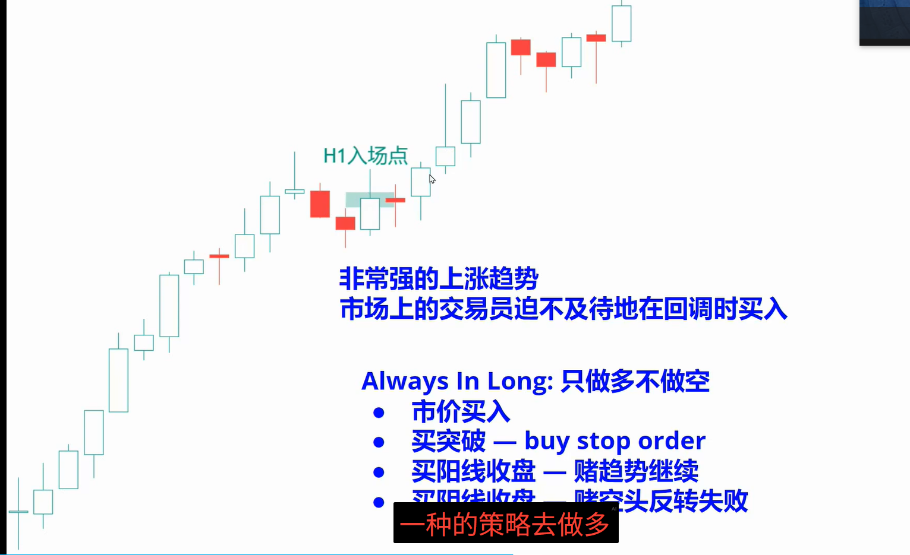

另一个使用高1入场的例子，这个例子的核心知识点是1：1止损，加上高1是一个不错的信号K（大实体，收在1：3的位置以上）。：
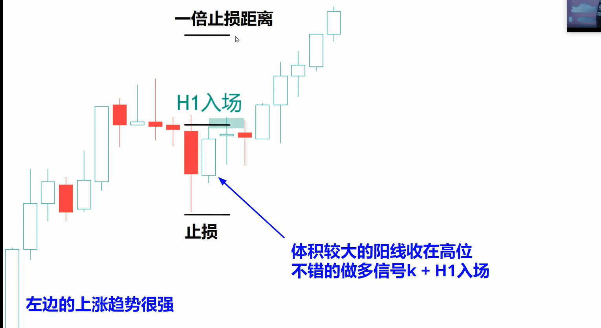

##### 如何使用高2入场

下面的例子是一个使用高2入场的例子，这里的高2同样是一个不错的信号K。
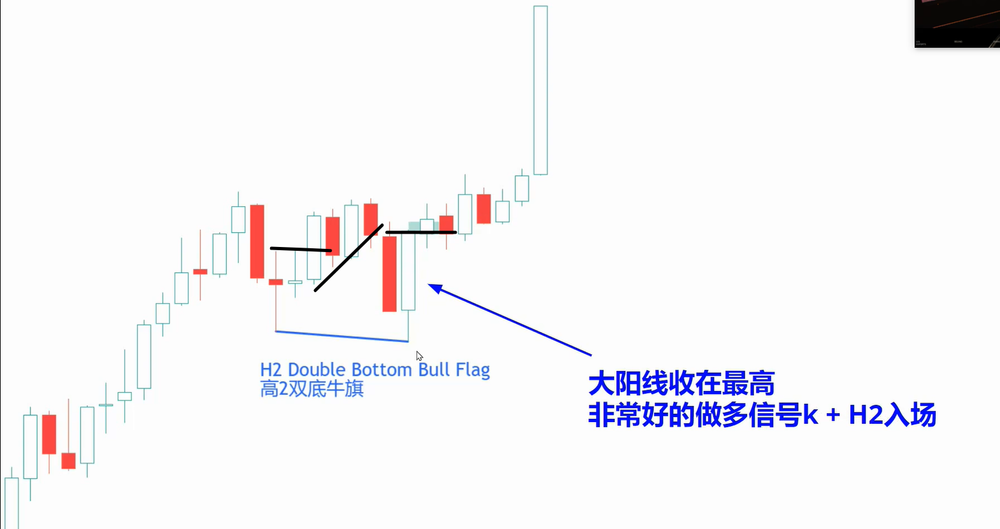

这个例子也体现了高2的定义，在高1后的阴线，没有跌破前一个K线的低点，因此不算回调。对于这种类似交易区间的情况，采用Measured Move进行止盈，是比较合理的。

##### L1、L2、L3的定义

低1，低2，低3的定义就是和高1反过来。

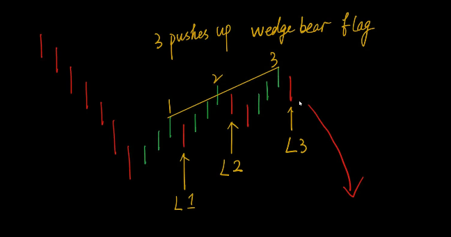

##### 如何应用L1、L2、L3

它的使用方式和H1，H2，H3相反：

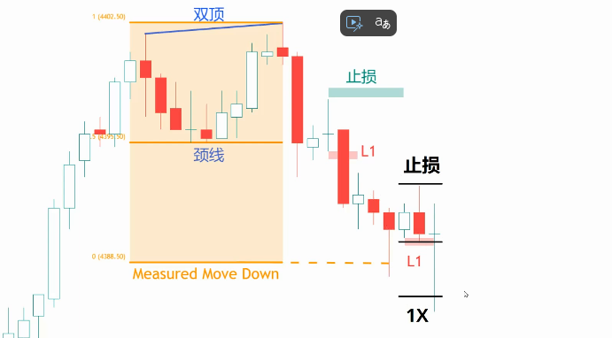

上面例子中用绿色圈出来的K线并不是一个有效的反弹，因为它没能比前一个K线高点高，这意味着下跌趋势创出新低，那么下一个比前一根K线低点还要低的K线，就不是L2，而是L1。

这个例子还体现出了信号K的作用。这里如果要追空，一定要小心多头重新占领上风。因为前面的一根长上影线，且实体收于开盘价附近，说明空头开始止盈，多头在大量买入。如果继续持有波段，可能会被埋。这种情况比较合适的操作是做scalp，快进快出。

在强势下降趋势中，L1，L2可以作为入场参考点，期待趋势可以延续。入场越早，不确定信号越多，亏损的风险也越大，因此使用H1，H2入场需要控制仓位，避免触发止损得不偿失：

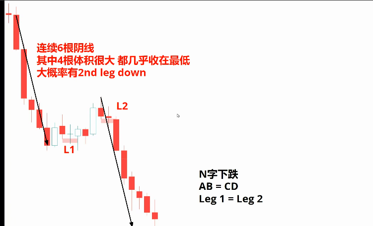

另一个下降趋势中的例子，对于K线的观察，需要一根一根来，不然可能就会错过L2那根反弹K：

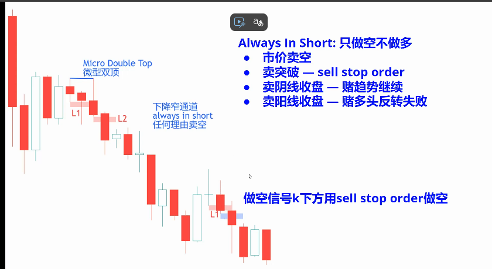

对于下跌趋势中出现的L1，但是是阳线的情况，避免入场，因为此时信号不确定。下面的例子四根连续阳线没有上影线，也说明一个问题：空头不打算在这个位置离场，这个微弱的熊旗也不足以引起空头的恐慌。所以这里只是一个反弹，而不是反转。

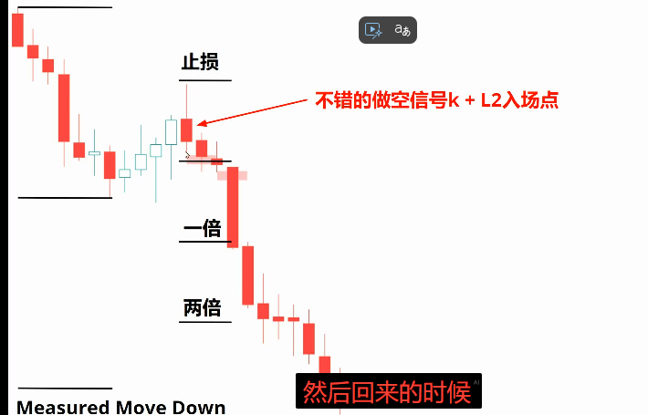

如果出现只有L1，没有L2的情况，说明多头力量非常疲软，每一次反攻都没能有效威胁空头的地位。这种情况看起来像一个窄交易区间，尽量避免在这种情况下入场。

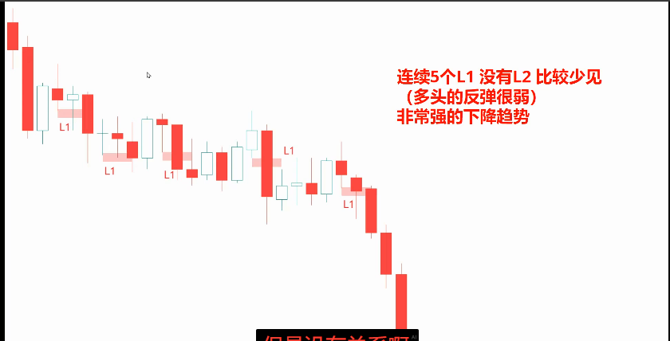

在熊旗通道里，可能出现很多个Ln，也就是有多段反弹。这种趋势采用数K线的方式入场，可能不能拿到可观的收益，这时大部分入场的人可能在做scalp，稳健做法是等到趋势通道被跌破再入场。

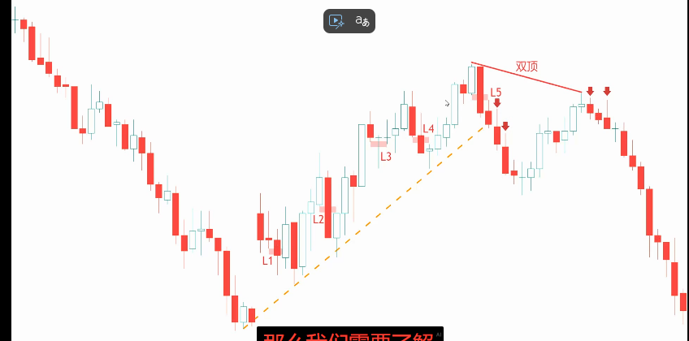

#### 双顶/低（熊旗、牛旗）

所有双底，以及双底牛旗，其实都由H1，H2组成；反过来，双顶和双顶熊旗，也都由L1，L2组成。

在H1，H2入场，其实就是在赌对自己交易方向有利的趋势形成。

#### 楔形顶/低（熊旗、牛旗）

同理，H1，H2，H3也能组成楔形低，或者楔形牛旗；反过来L1，L2，L3也能组成楔形顶，或者楔形熊旗。

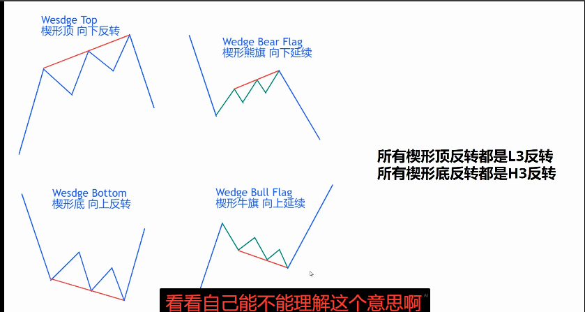

#### 其它情况
##### 多头陷阱

当使用数K线+信号K入场的时候，本以为是趋势延续的优秀入场点，可接下来立马出现一根大阴线，这时就要注意，这可能是多头陷阱了。之前获利的多头利用交易员的这种心理，制造出趋势可能延续的假象，实则是诱多将入场多头全部套牢。被套牢的多头的止损会变成空头趋势延续的燃料。

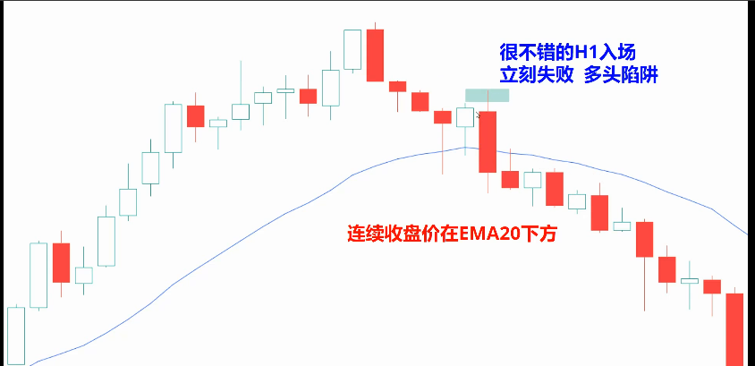

##### 无尽回调/反弹

如果多头趋势出现回调，却没有给出H1的机会，这说明多头力量相当脆弱，使用市价或者限价单买入，可能会被套。如果严格按照突破单买入，由于没有H1的存在，也就自然能逃过这个陷阱。

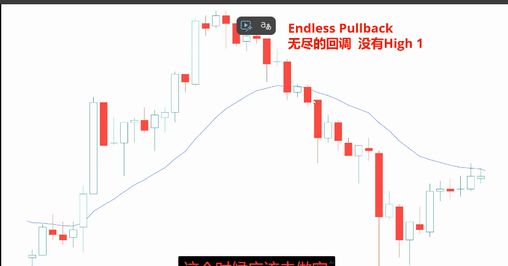

同样，如果一波反弹也没有给出L1的入场机会，说明空头力量脆弱。

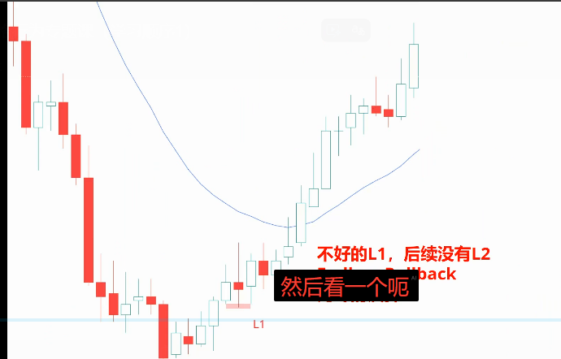

##### 失败的楔形变成反转

与多头陷阱类似，只是这里给出的例子是一个多次L1，L2，L3被反转的例子。下面的例子里出现的三个反弹低点，全都立马失败。

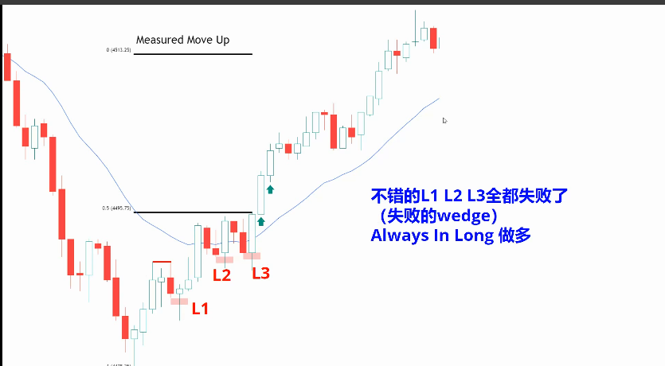

### C6 & C7 & C8
这两节的内容主要都是介绍信号K的，以及如何使用信号K进行右侧交易。

#### 趋势K/交易区间K

这部分内容其实在书中就有提及。趋势K是指有着大实体的K线。这种K线一般有着明确的方向，代表着某一方力量的释放。交易区间K，或者叫震荡K，就是指类似十字星这种，小实体，长影线的K线，这种K线没有明确的趋势性，一般只代表一个交易区间。

趋势K的例子，这一根K线是一根日K，右边的图对应它的五分钟图表，可以看到它本质代表一个有着明确方向的下跌趋势。这里短影线意味着空头在绝大部分事时间都占领了上风：

震荡K的例子，同样是日K对应的五分钟图标，可以看到这是一个明显的交易区间，在这个区间内，能执行的策略基本只有高抛低吸，不具备明显的趋势性：
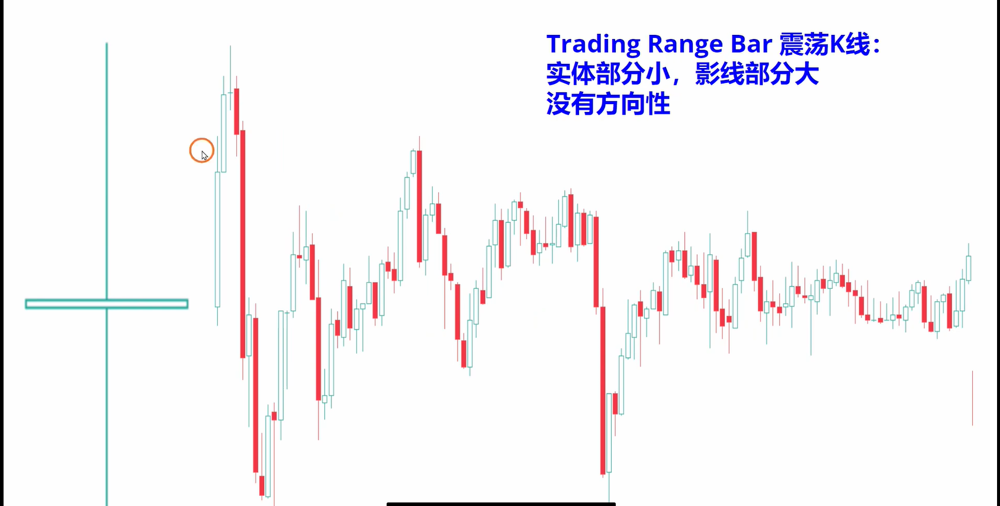

下图列举出了很多趋势K和震荡K，对于不好辨别的K线，例如实体接近上下影线，收盘收在中间的K线，需要结合它的背景来看。也就是它是否处于一个明确的趋势中，如果处于，那么可以认为它也是一个趋势K。
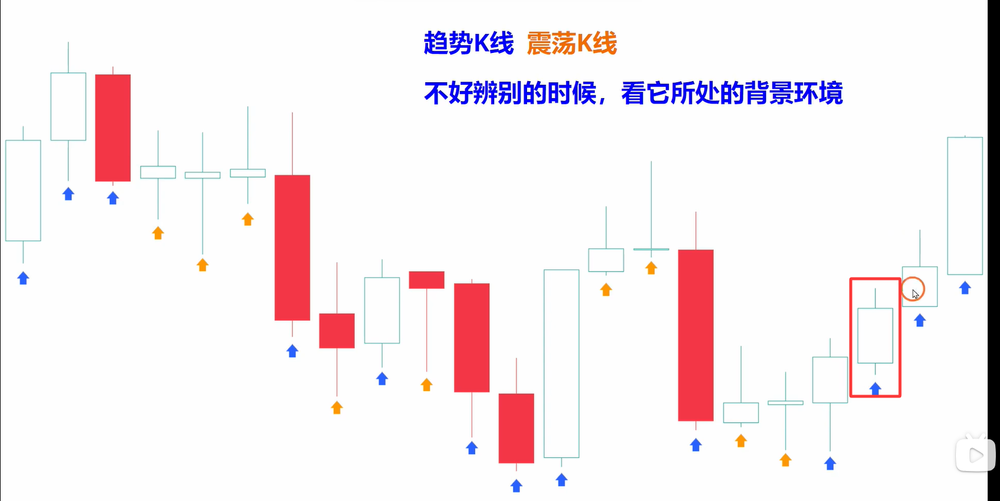

#### Buy Stop Order
Buy Stop Order是指在特定K线上或者下一个tick挂单买入。这样做的目的是验证市场是否最小程度同意你的想法。下面会给出一些例子，Buy Stop Order一定程度上能防止我们猜想错误，提前入场导致亏损。
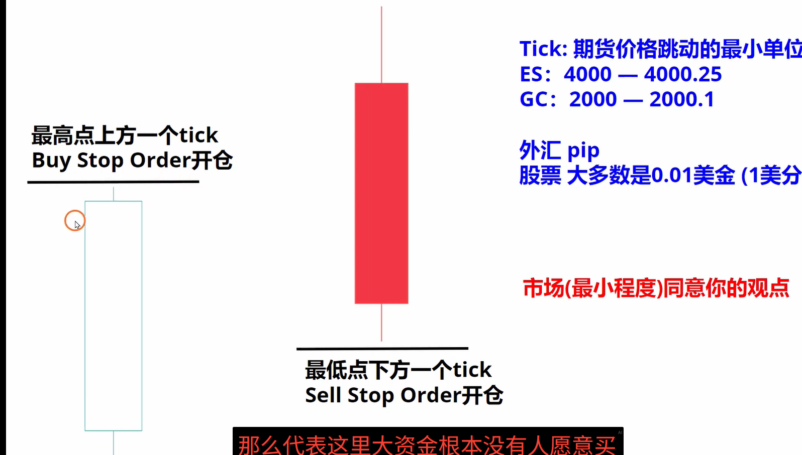

下面称为“突破单”。

#### 信号K

信号K是趋势K的一种，在多头趋势中，优秀的信号K满足大实体，阳线，收在中高位等特征；在空头趋势中，则是反过来，大实体，阴线，收在底部。

下面的例子是一个采用信号K入场的例子。这个例子中，这段回调处于50%的支撑位，一般而言，会有支撑力量体现。但是如果我们直接买入回调K的收盘价，相当于一个纯左侧交易，这样能带来更大的盈亏比，对资金管理和执行力的要求也更高。对于绝大多数交易者而言，右侧入场是是更好的选择，它能带来明确的止损和止盈指标。

这个例子中，再次回调到50%位置时，出现了一根小实体，收盘在最高处附近的反转信号K。这意味着50%的支撑位生效，空头止盈，多头开始抢占地盘。因此在这根K线上方挂入突破单入场是一个不错的选择。为什么要挂突破单而不是限价单？因为信号K只有等到后面有确认信号才能成立。这对应书中提到的入场设定，和触发入场设定的K线。此外，挂限价单还能隐形的帮我们避免一部分亏损。因为如果这K信号K后没有反转，那么突破单就不会触发，就能避免入场。
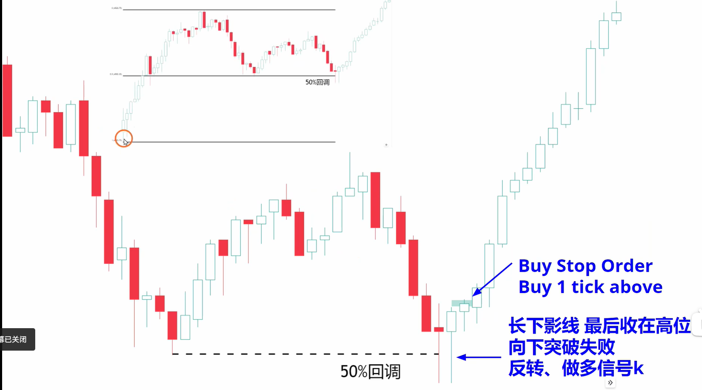

下面的例子，也是一个使用信号K入场的例子。这个例子中，几根接连的大阴线，随后却出现一根大阳线。这说明前面的多头尝试突破失败，没有空头跟随，接下来很可能进入交易区间或者趋势恢复，我们可以在这个信号K上方买入，然后在前高，或者一杯盈亏比的地方止盈。
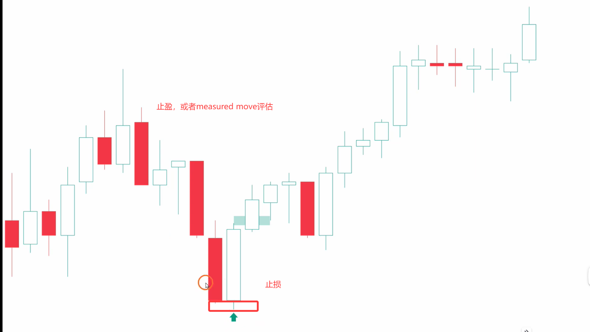

#### 优秀的信号K

优秀的信号K的特征前面已经提过了，大实体，短阴线，收在高位/地位。

下面的例子是上涨趋势中优秀信号K的特征：
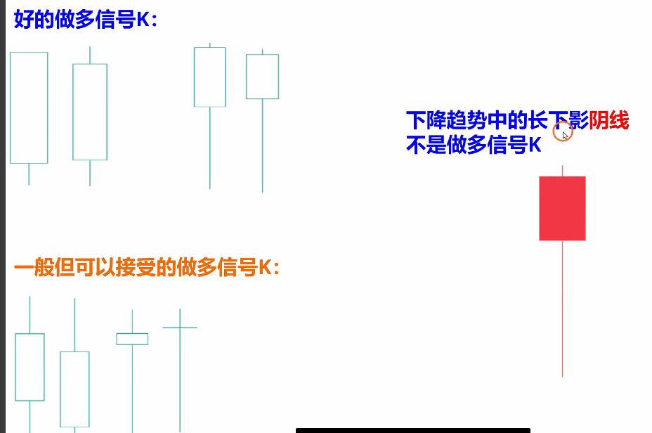

下面的例子是下降趋势中优秀信号K的特征，基本和上涨信号K相反：
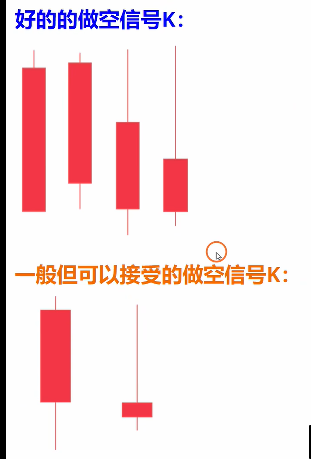

#### 信号K的背景重要性

有些情况下，我们可能能看到一些逆势的信号K。这时需要结合背景判断它们能否作为入场依据。如果处于强趋势中出现了逆势的信号K，那么它有可能只是一个回调或者反弹。

下面这个例子中两个信号K都处于强势下跌信号中。我们知道强趋势的第一次反转有80%的几率失败，因此这种信号K是需要过滤掉的。如果我们认为它是一个反转K，那么至少需要连续的阳线，或者超大实体阳线，并且收盘处于EMA20以上。
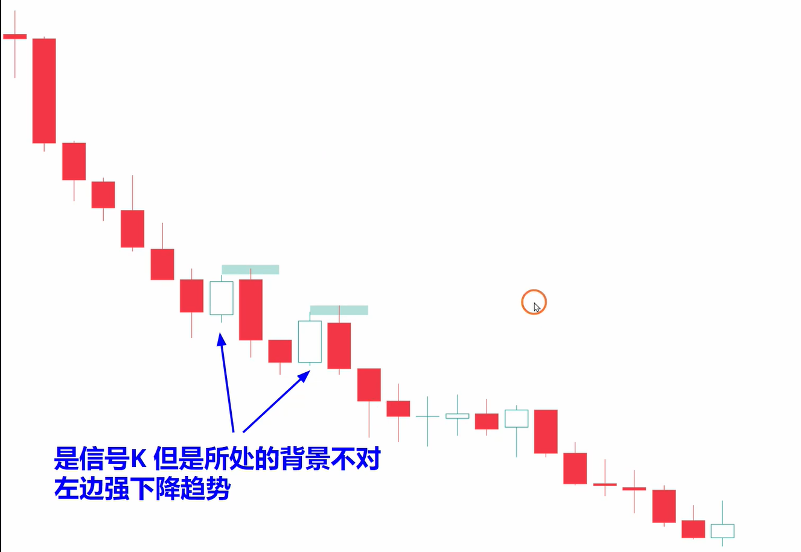

但并非所有情况下逆势的信号K就必须忽略，下面这个例子中出现了优秀的信号K，这根K直接吞没了前两根阴线，使这两根阴线买入的空头变为浮亏状态，且后续有连续阳线确认趋势反转。对于这种强势反转，最大的可能是形成交易区间，小概率趋势延续。可以用小仓位入场，在后续买入追求更高收益。
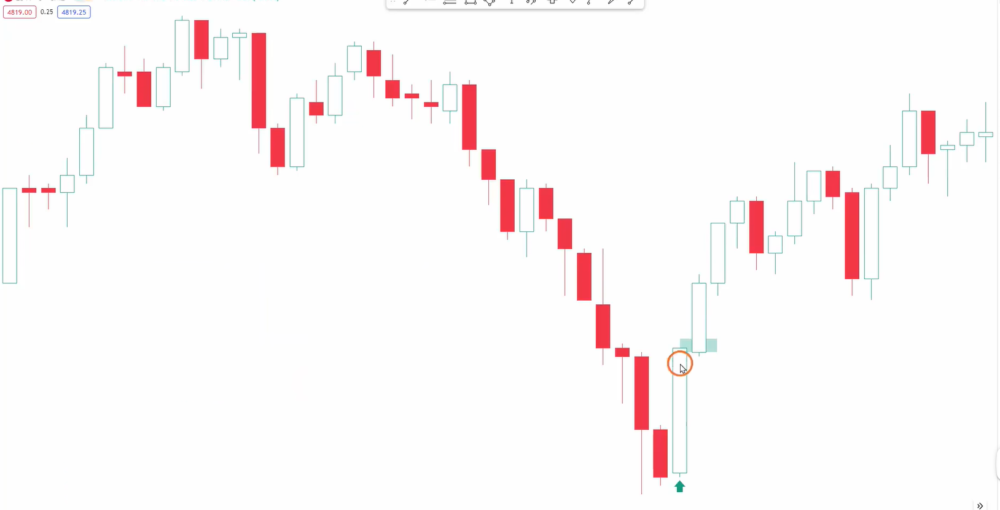

值得注意的是，下降趋势中形成的类似信号K的阴线，并不是信号K。因为放到小时间周期看，我们会发现它只是一个回弹，并不代表趋势被逆转。这一点，在数K线那一节也有提及。
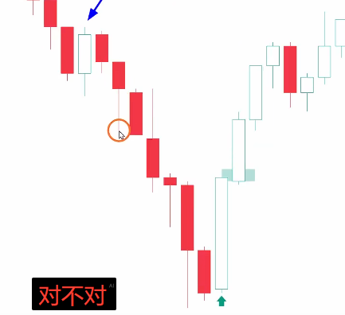

相反，在上涨趋势中形成的长下影阴线，并不代表可以做空，而是代表空头力量薄弱，没办法将价格打的更低。这体现出不同趋势中不同信号K的意义不同。
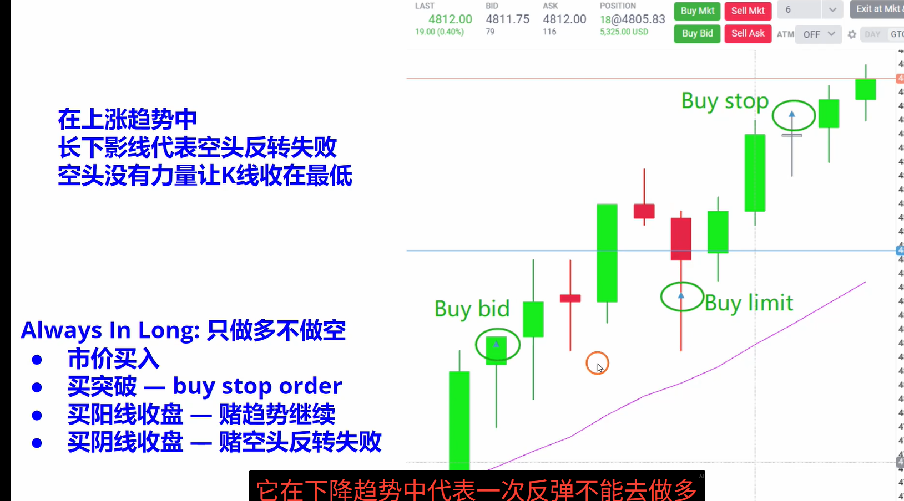

在交易区间中，突破失败往往是一次交易机会，可以通过突破K的表现来决定买多还是卖空。
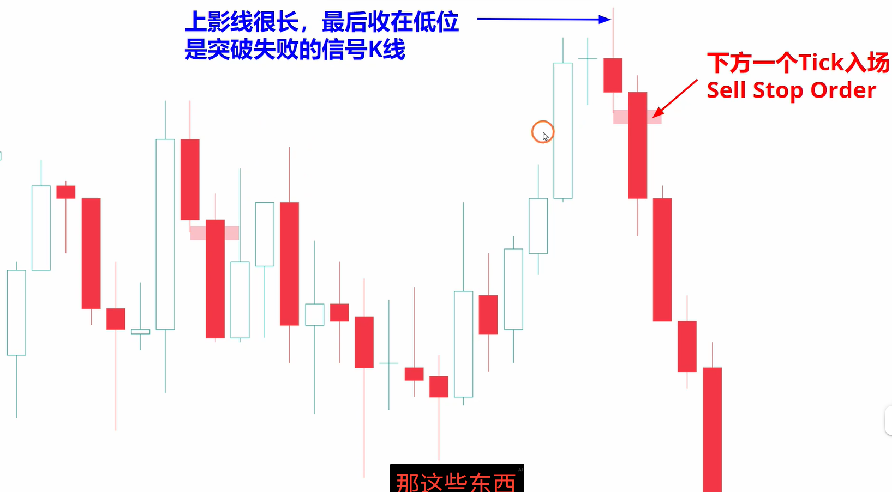

在强趋势中，产生的回调看起来可能是一个信号K，但是具体需要根据它后面的跟随情况来决定：
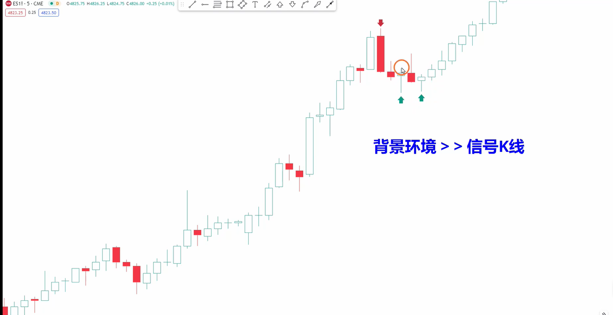

#### 双K线反转
当下降趋势中的大阴线紧随其后的是一个体积差不多的阳线，而后价格行为开始表现为上涨趋势，这两根K线就可以认为是双K线反转。在小时间周期，双K线反转由两根K线组成，而在大事件周期，它可能就是一个带有长下影线，收在高位的信号K（例如两根30分钟K合并成一根1小时K）。

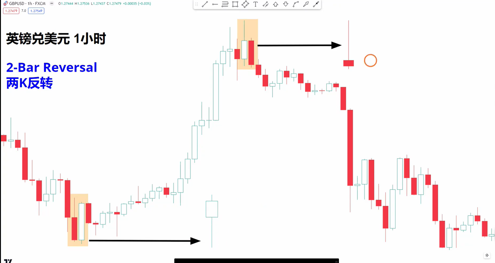

这个图就是上面的小时间周期合并的产生的信号K（一小时合并成两小时）：

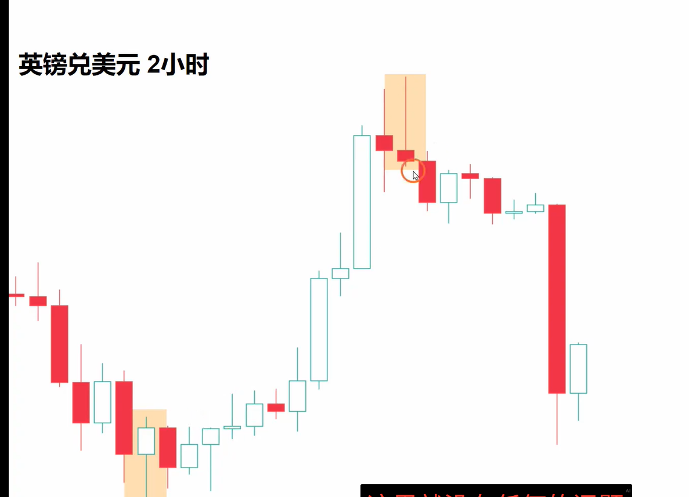

##### 时间周期

上面的例子中，双K线反转是在更大时间周期出现的。但实际上，对于时间周期，没必要强求，例如两小时图（几乎没人会在这个时间周期交易），只要自己喜欢的交易时间周期有信号，就可以认为信号有可能生效，甚至能够更早入场。

这里还有一个比特币的例子，其中包括双K线反转，以及一个双顶反转（回忆下，这里在那个信号K入场比较好）。

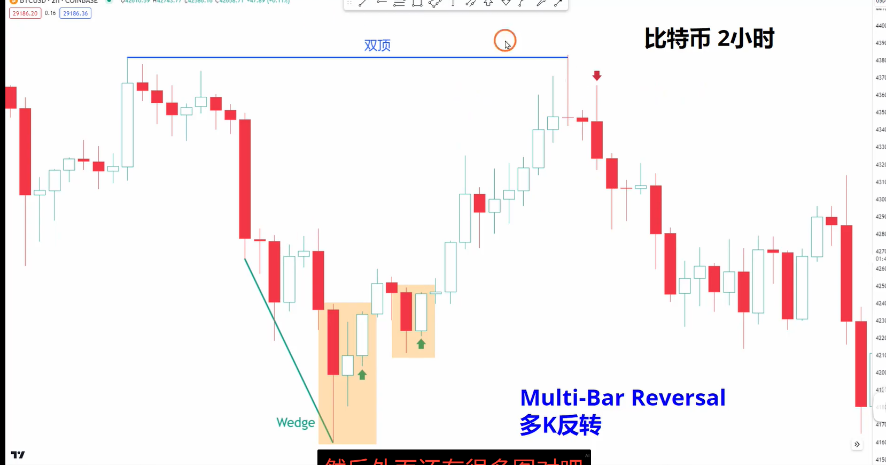

下面的例子是五分钟周期的图表，如果换到五分钟的倍数时间，其实双K线反转也能体现出来。这里一根大阴线就是因为更高时间周期的人也发现了这个信号，入场做空。

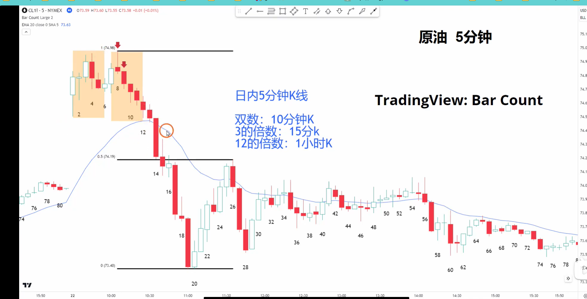

##### 孕线和吞噬线

孕线和吞噬线也是双K线反转的一种，但是对市场背景的要求更高。

孕线，顾名思义就是前一根K线的高低点完全包裹住了后一根K线，看起来就像是一个怀孕的妈妈。吞噬线则是反过来，前一根K线的高低点完全被后一根K线包裹。

下面图中给出了孕线和吞噬线的例子：

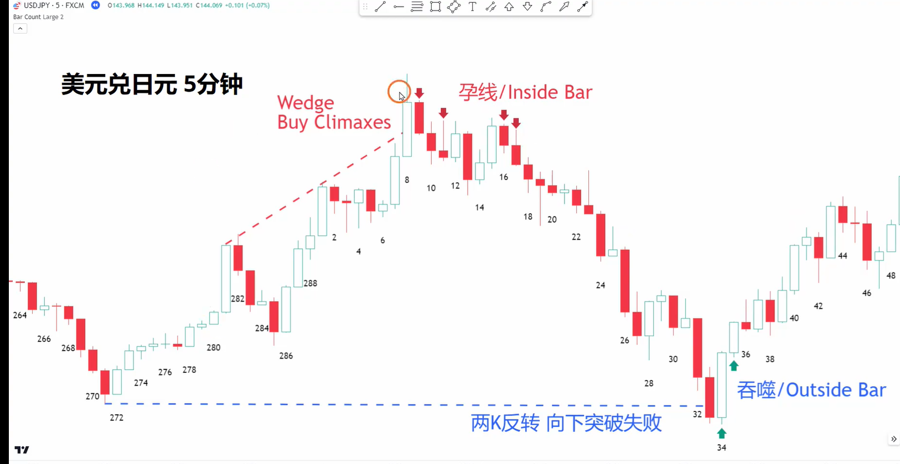

孕线和吞噬线更加需要结合市场背景来观察。下面的例子中，存在一个交易区间，而交易区间内的孕线或者吞噬线，代表不了任何信号；同样，在强势上涨趋势中的吞噬线，也不一定代表反转，反而恰恰只是多头的一次止盈。

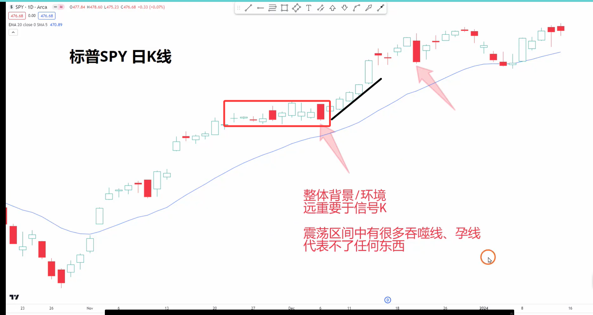

关于这节的内容目前就这么多。

#### 坏的交易背景和信号K

这一节的内容是对前面结合背景识别信号K的再次补充。如果想逆趋势做反转，不仅需要优秀的信号K，还需要看到良好的跟随。即使上述条件存在，也最好等到第二，第三个入场点，否则很可能大亏小赚。

下面的例子，左边是一个窄的上升通道，随后出现连续的回调和反弹，大涨大跌，开始呈现宽交易通道的特征。由于左边的上升趋势很强，所以可以期待趋势延续，至少测试前高。当涨到前高附近后，立马出现了一个巨大的阴线，且随后有跟随。在下跌的过程中出现了红框中的两个优秀的信号K。但综合考量，它很可能只是一波下跌过程中的反弹，针对如此强势的下跌突破而言，趋势被反转的可能只有20%。

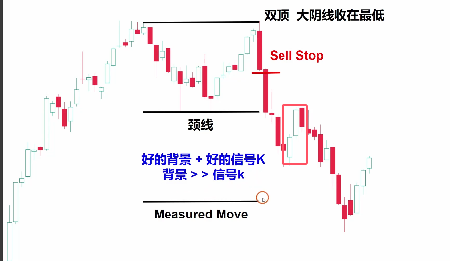

##### 利用坏的信号K反向交易

有时出现在强趋势中的坏的信号K，可能本身代表一次回调或者反弹。因此可以反向操作，期待趋势可以延续。这是一种偏左侧的玩法，对意识和操作要求更高。

下面这个例子是一个利用坏的信号K反向交易的例子。由于这根阴线信号K出现的背景是一个突破趋势的回调，所以可以考虑在它的低点买入，赌趋势继续延续，多头继续买入。这个例子中比较细节的地方是它其实是一个scalp。这里的一倍预期是根据数学期望算出来的，不是measured move，为什么呢？因为前面的上涨其实已经持续4周了（特斯拉周线，可以看出来也符合价格行为）。这里出现一根回调K线，说明多头开始止盈，继续上涨的动力可能会有减弱。

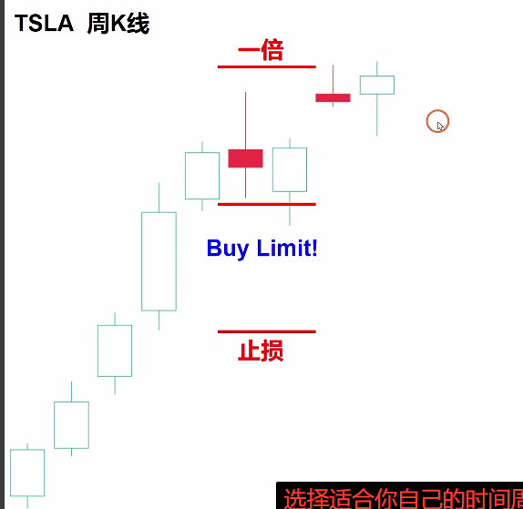

接下来依然是一个差的做空信号K，同样是scalp操作。止损放到前期低点，当这个低点被跌破，说明多头意愿不强，上涨趋势可能会不成立。

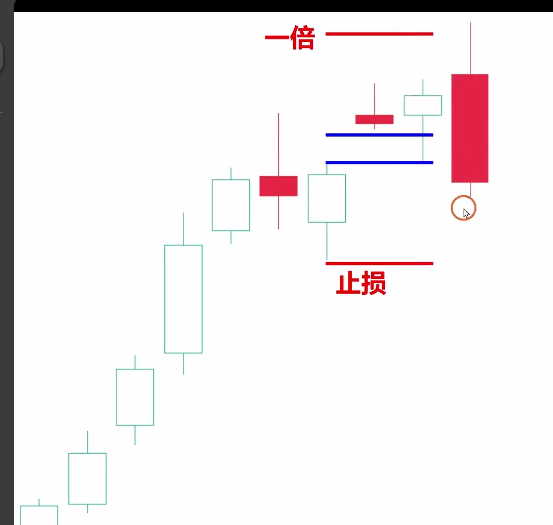

#### 主观交易和系统交易

在使用价格行为进行交易时，我们需要对每一根K线进行解读，这就导致可能同一个位置，能解读出许多不同的想法。这些想法可能互相冲突，也可能互相验证。我们会觉得价格行为是一种非常主观的交易方式，它可能不存在可复制性。实际上这就是主观交易和系统交易的区别。主观交易是一种“你觉得可以，那就入场”的交易方式；系统交易，则是按照自己已经验证过的，可靠性高的路径进行交易。

##### 什么是系统交易、主观交易

系统交易，举例子，我们只做熟悉的图形结构，例如三推后的反转、牛旗后的突破、交易区间的高抛低吸。这些相同的图表结构，每天都在不同市场上演。如果我们能熟练掌握其中一个，就能够在保证胜率的同时，有着不错的盈亏比。

下面的例子就是一个三推楔形后的反转：

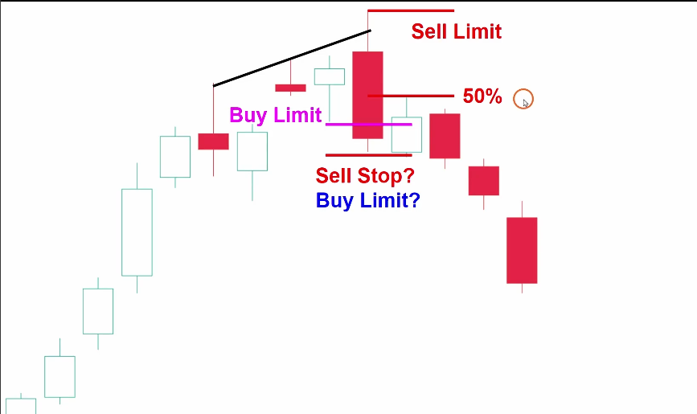

主观交易则是突破、窄通道等价格行为发生后，“always in long/short”等概念的体现。具体来说就是，找机会入场，只向对应趋势方向交易。支撑主观交易的方式有很多种，比如H1，H2，H3；MA20；50%回调等等。

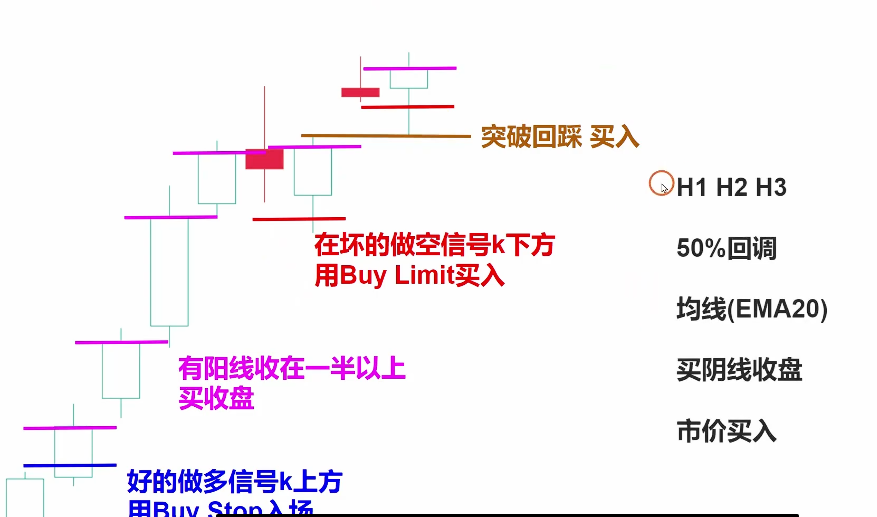

为什么主观交易和系统交易的差别很重要呢？因为它决定了我们的入场理由，也就相当于带来了胜率，盈亏比等一系列重要的交易支撑。

##### 左右互搏的交易系统

首先看下面的例子。这个图中的大阴线，是一个完美的信号K。如果不结合前面的突破背景，它很可能是一个做空的机会。但是考虑前面的突破，它又可能是一个回调，我们可以考虑在前一根K线底部的位置买入，期待趋势延续。同时，我们发现在这根K线前有一个三推楔形，这似乎又进一步增加了做空的可信度。仅仅对于这一根K线而言，就有这么多做法，那么到底该如何抉择呢？这种情况实际上就是脑海里出现了系统交易和主观交易两种方法，然而我们拿捏不定。

其实碰到这种情况，最简单的做法就是，不做这一笔交易。当你对这笔交易的止损，止盈，还有方向不确定时，这就在暗示这笔交易的胜率是不好评估的，或者说，这笔交易不是你所擅长的交易类型。

##### 主观交易还是系统交易

实际上无论是主观交易，还是系统交易，都是能够赚钱的。我们需要关心的是，自己擅长使用哪一种交易方式。同样，对于价格行为学中的各种零零散散的知识，也不一定要全面掌握，找到适合自己的，能够稳定赚钱的方式就好了。

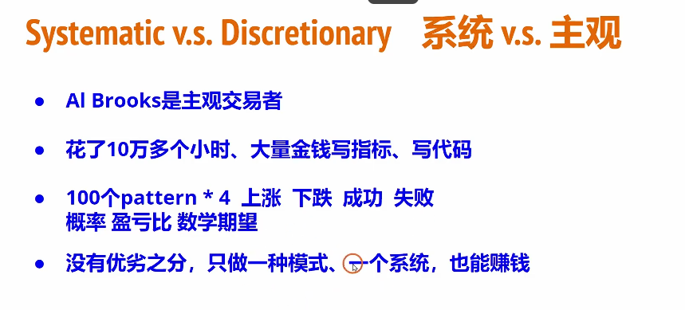

对于新手而言，使用最稳健的方式：看K线背景，等待信号使用stop order入场，拿到一倍或者两倍盈亏比，就足够了。

##### 一种推荐的交易方式

下面这个例子，有多种做单的理由。首先，这里一个强势大阴线下跌，且后续有跟随。但我们发现跟随K的下影线较长，因为它已经触及到1:1盈亏比的底部，所以部分空头止盈。这里如果直接追空，可能会有反转的风险。而后发现出现了一个一般的做多信号K，且它处于一个强下跌趋势中，我们认为这可能只是一次反弹，可以在跟随K的上方挂一个卖出限价单，期待卖空的力量继续延续。

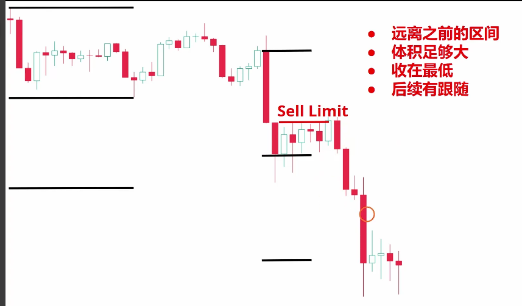

当然，上面的解释需要考虑的东西还是比较多，对于熟练度和经验有着一定要求，下面是另一个采用系统交易角度做单的理由：这里形成了一个三推楔形熊旗，最后出现一个优秀的做空信号K，我们可以在做空信号K下方挂限价单，止损放到熊旗上方。可以发现，这个理由是很清晰，且适合复用的，这也是作者推荐的交易方式。

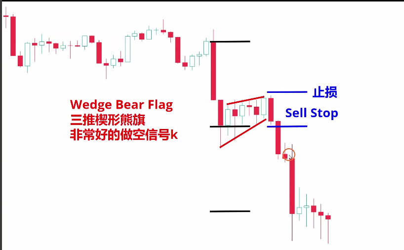

最后，我们思考，稳定的盈利方式，其实就是可以复用的交易思维，也就是一套自己的交易体系（精通一个简单的交易系统，就可以了）。对于过于复杂的操作，例如补仓，在信号不明确时入场等，不一定能带来收益，反而可能难以执行导致交易失败产生亏损。

### C9 & C10 & C11
这一章讲的是各种wedge（三推楔形）。这种形态时一种胜率高，易于识别的形态，属于非常重要的知识。

#### 什么是楔形（wedge）
楔形是三角形态的一种，其图表形式类似下面的例子：

上升楔形，低点抬高的同时，高点却动能不足，一般会形成强烈反转：
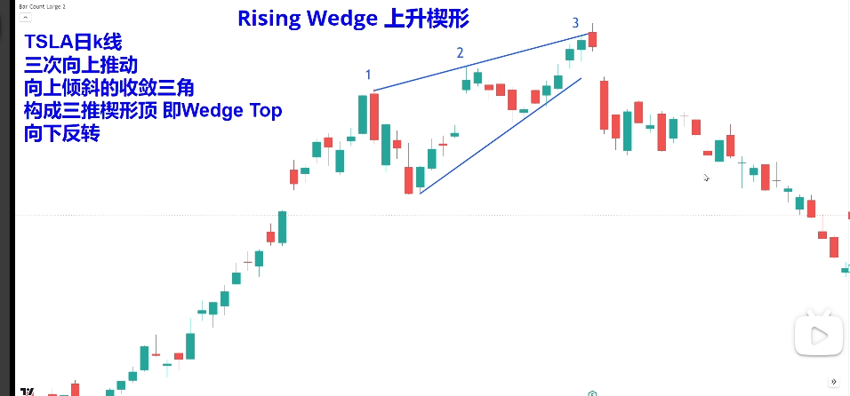

下降楔形，低点降低的同时，高点也在降低，看起来像通道，同样会形成强烈反转：
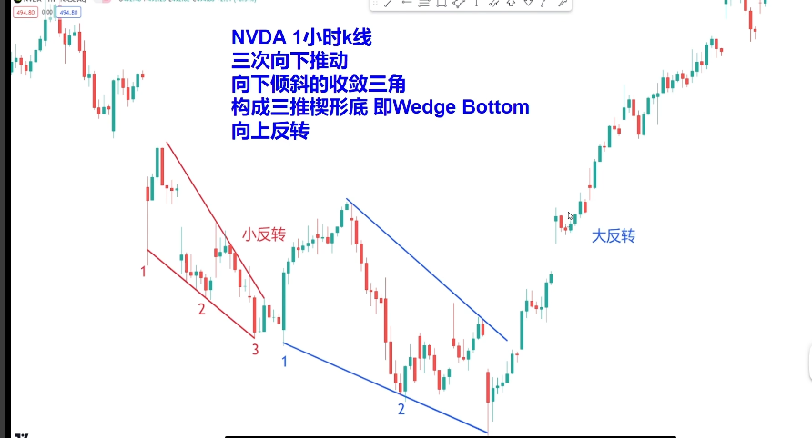

上面例子中的两个楔形，构成了楔形顶和楔形底，这种楔形一般构成反转形态。楔形也能作为中继形态存在，在后面会介绍。

这里我们主要关注三推楔形，这是一种常见，胜率高的，盈亏比高的楔形结构。

狭义的楔形需要形成高低点收缩，例如上面的例子。很多时候，楔形不一定会呈现出收缩的形态，也可能是类似一个宽通道一样的通道区间。我们主要关注这个过程中出现的三推结构，例如下面的例子：

有类似宽通道的楔形，就自然有类似交易区间的楔形。它的特征是看起来像一个收敛的三角形结构，其中出现了三推形态。由于三角形形态本身向上向下都是50%的突破概率，所以这种形态高胜率的关键，其实取决于K线背景。如果前面是强上升趋势，那么它突破上方的概率就大一些；反之就是向下突破。
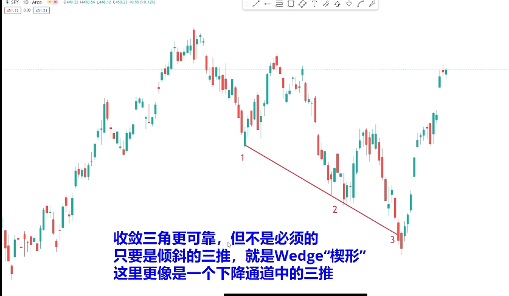

少数情况下，会出现四推甚至五推的楔形（宽通道），我们主要关注三推的楔形。
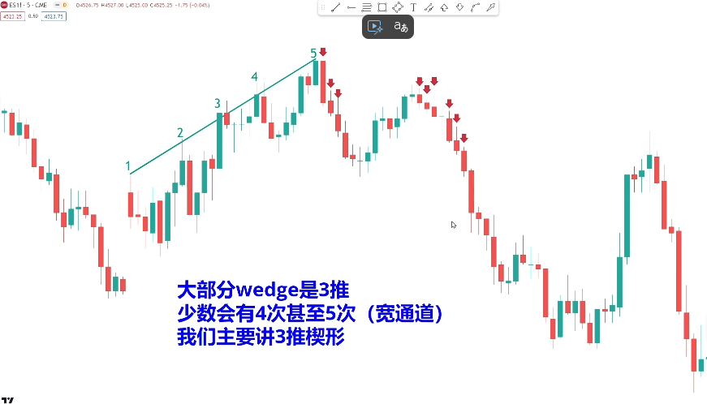

#### 楔形反转的原理
我们知道“事不过三”，意味着同一个错误连着犯两三次，在正常人眼中看来是不可接受的。同样的道理在市场中也适用。三推，实际上就是对这句话的体现。三次突破都失败了，那突破成功的可能性就大大降低了，多头/空头继续推波助澜的动力，也就会少很多。

从另一个角度想，每一个买在楔形顶部K线的人，可能都是趋势交易者，他们相信趋势会继续存在。在他们被彻底套牢前，都会至少有一次机会离场。当他们在下一个顶部离场时，就会造成一次回调/反弹。而如果他们坚定持有到突破失败，那么当逆向趋势发生时，首先会形成踩踏，，其次随着下跌趋势越来越不可逆，被套牢的人也会选择离场，加速趋势的发展。

那么何时反转结束呢？答案是等到市场价格被大家接收为止。当下跌结束时，一定是价格到了一个买家愿意入场的位置；同样，当上涨开始回调，也一定是到了卖家愿意卖出的位置。
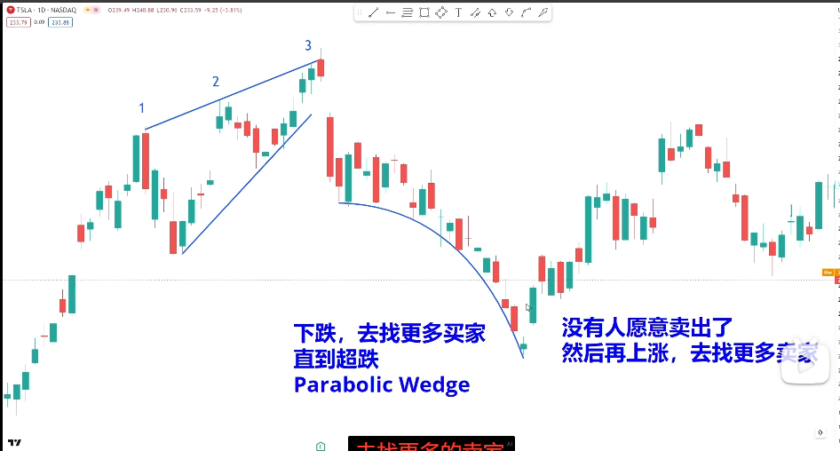

#### 通过趋势线找到楔形
如何找到三推楔形？最简单的方法是通过趋势线。我们可以在上升趋势的顶部，下降趋势的底部画上一根趋势线，来观察价格回落到趋势线后的反应。有时，我们画出的趋势线不一定能完美让每一根K线的高点/低点落在上面。例如图中的红线，这种情况下，我们可以选择像蓝线一样，允许一根K线穿过趋势线，这样能帮助我们更早识别到楔形的存在。

图中的粉线是一个完美的三推楔形，对于这种工整的三推楔形，无论是电脑程序还是交易员，都更加容易识别到，因此利用这个理由入场的资金就会更多，也就更能推动趋势的发展。
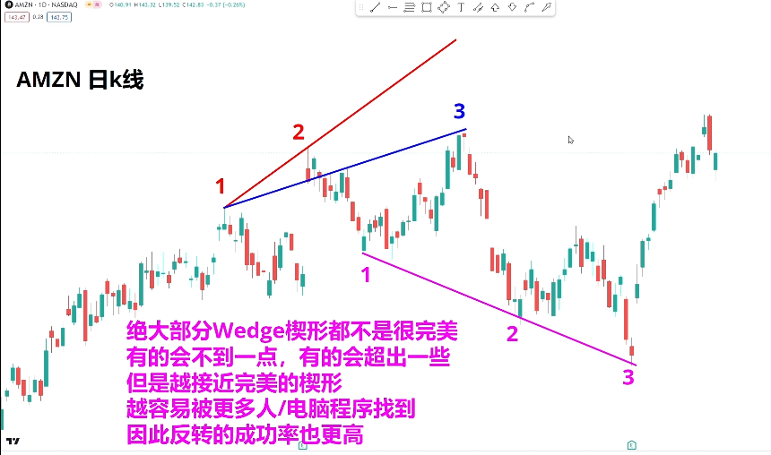

下面这个例子也是，选择超出的点画趋势线，更容易发现市场在做什么：
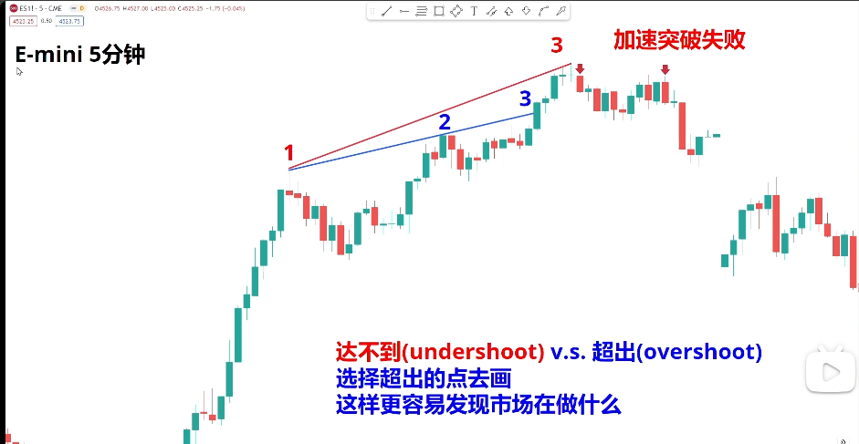

#### 楔形无处不在
市场中存在非常多的楔形，但并非所有楔形都会引发大的反转，例如交易区间的楔形，熊旗牛旗楔形等。下面的例子给出了一段市场中各种各样的楔形结构：
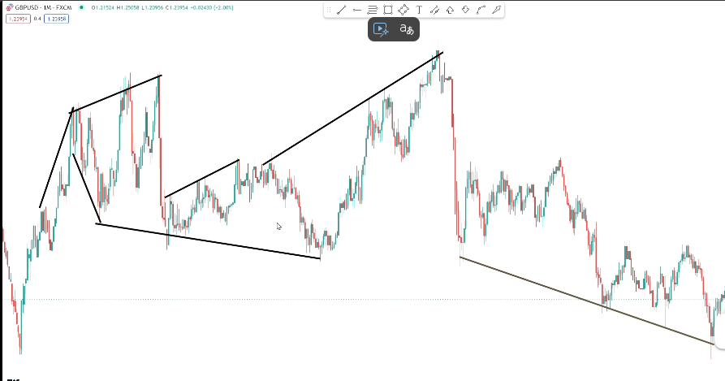

另一个楔形例子：
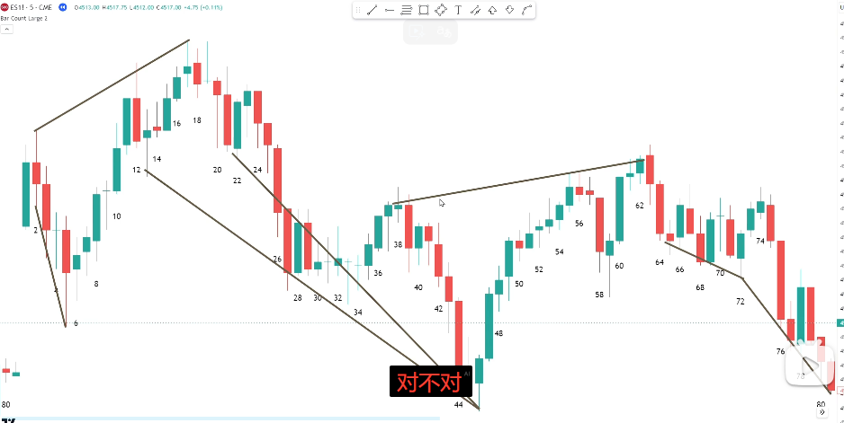

#### 反转概率高的楔形特征
我们认为反转概率高的楔形，是好的楔形。它是指反转概率更大的楔形。这类楔形的一个特征就是在反转前有比较多的K线高点/低点重叠在一起（上升趋势中，高点重叠，形成突破阻力，空头在这里做空；下降趋势中，低点重叠，形成突破阻力，多头在这里做多）。

为什么包括K线重叠的楔形反转概率更大？这实际上是我们前面提到过的，如果一个趋势中，逆趋势交易者也在赚钱，那么它变成交易区间，或者反转的概率就会变大。

我们可以看下面这个例子。这个例子中，产生反转前就有空头通过做空赚到了钱。即使后面创下新高，他们也能通过不断加仓的方式平仓甚至小赚。那么可想而知，当趋势变为对他们有利的情况下，这类交易者就会变成推动趋势发展的主要推手。
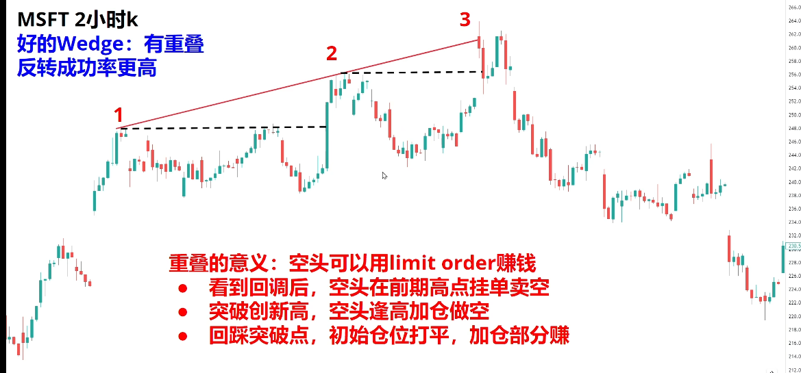

上面这种左侧加仓的玩法，一般是由机构交易者主导。需要非常强的执行能力以及仓位管理能力。这个例子并不是说逢高做空就能赚，相反，绝大多数交易者都不应该用这种方式交易。这种交易方式能够赚钱是因为机构的资金量庞大，能够接收对应的风险。

结合上面的例子，我们认为反转在趋势结束前就已经开始了：
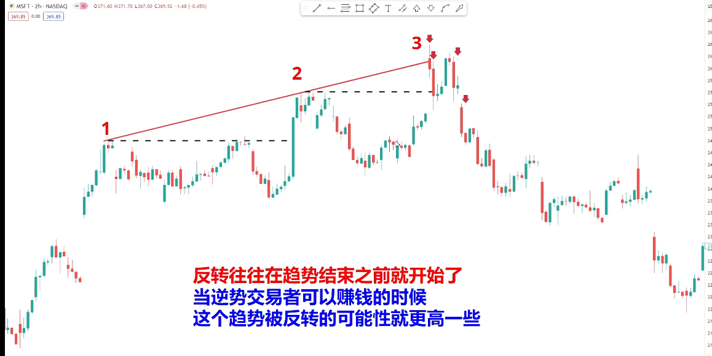

下面的例子，是多头主导反转，同样，多头也能在这个下降趋势中平仓甚至小赚。所以当我们在反弹或者回调趋势中看到越来越多的重叠区域时，就要考虑这个趋势是不是有可能要反转了。

#### 反转概率低的楔形特征
我们认为反转概率低的楔形，是坏的楔形。这种楔形某种程度上不能算作楔形，它实际是窄通道的趋势线。我们知道窄通道是只能“always in long/short”的。如果在强趋势中去找楔形，就相当于反着来，而强趋势立马反转的概率只有20%，所以要学会鉴别这种楔形，避免反向操作导致亏损。
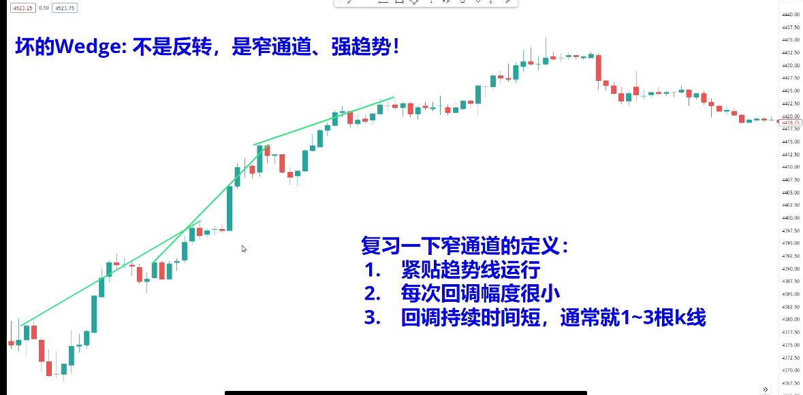

我们可以采用好的楔形中，重叠部分多的方式来分析这种楔形。可以发现，这种行情下逆势操作，打平的机会都非常少，更别提推动趋势反向发展了。因为逆势的交易者的止损反而会推动趋势延续。
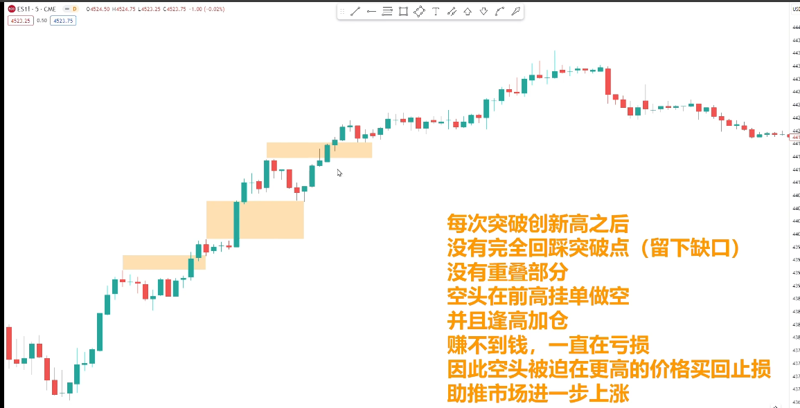

下面的例子是在下跌窄通道中，尝试适用楔形寻找反向机会：
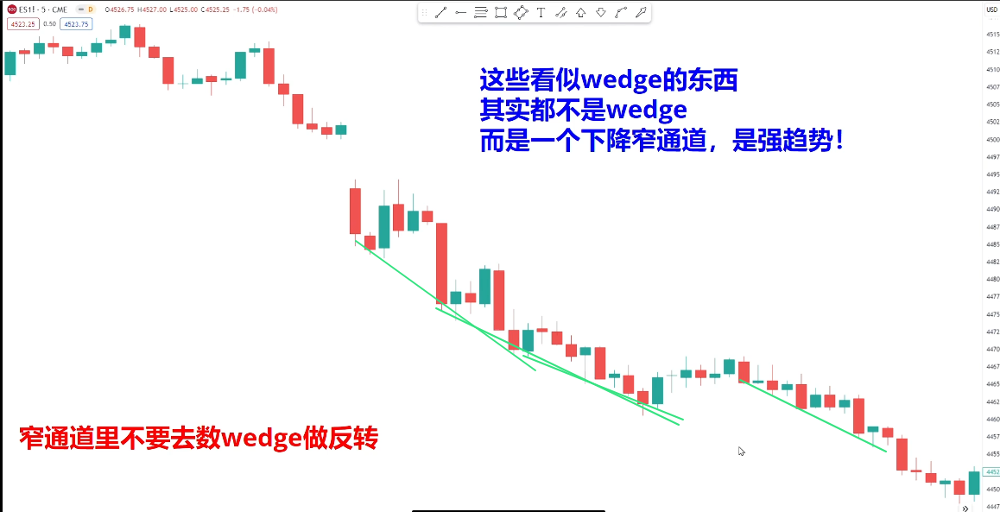

## 交易心理分析

自我表达和社会结构的冲突，导致社会层面上自我表达是被压制的。

市场中，任何起点和终点都是由我们自己决定，因此有着无限大的自我表达空间。

这种社会上的自我表达压抑，和市场上自我表达不受控制，会导致冲突。由社会层面的自我表达压抑，会导致我们对
童年时被拒绝的自我表达行为上瘾。这种持续的累积会导致行为上的强迫和上瘾。

在交易层面，这些没有实现的动力，同样会对我们制定一致性的交易行为产生影响，搞清楚为什么，是非常重要的。

---

在交易中，无限的市场不会提供任何原则指导我们如何操作。它只会提供买卖机会，这只是行为模式。

要想持续有效的交易，就必须制定自己的原则，培养特殊的思维模式，并永远以这种方式指导我们交易。

在交易中，没有人会迫使你在入场前衡量风险（除了你自己）。持续的赢家，会在入场前就接受这次交易可能失败的事实，并接受风险。
而持续的输家，在入场前就会迫使自己避免亏损，不愿意承认交易可能失败的事实。这导致他们认为提前衡量风险是没有必要的，并且
他们会收到各种分析，解释和歪曲的逻辑影响，去做绝对不会亏损的交易。

---

市场是无限的，交易者可以在任何位置入场出场。无论你如何计划或者怎么想，任何在这个过程中的心理因素，都可能影响交易结果，让
你分心，过分自信或者害怕，也就是让你变得没有原则，没有意识。

与赌博不同，交易没有明确的退出点。对赌徒而言，他可以在输了一局以后，掏出更多钱参加下一局，但对交易者而言，何时入场结束，
都由自己决定。当你发现市场走向开始对你不利时，应该按照计划体面的退出，不需要再观察市场后续，你只需要忽略环境，避免由于
在交易过程中打乱交易计划。这可以让你成为积极的输家，让你有机会再次参加交易。

---

为什么不愿意制定交易原则？因为从社会层面，我们被压抑行为，累计起来让我们产生了厌恶，害怕，逃避的心理。我们可以轻松的制定
一个原则，却不一定能遵守它。当我们大部分时间都在逃避原则时，制定原则的动力也就少了很多，也就没有遵守原则的能力了。想要突破
拒绝，需要付出大量的努力，甚至是一个痛苦折磨的过程。这并不意味着我们可以向以前的失败妥协，也不代表经历了足够多的失败就能
遵循我们的原则，只是让我们不要丧失学习的动力。

---

每一次交易，都可以认为是一次纯粹的个人行为。这让我们有推卸责任的方式。例如花长时间分析市场，最后却通过经纪人，其他人的只言片语，
而按照他们的分析交易。为什么？因为这样失败了，可以轻松的将责任归咎于他们的分析有误，从而避免担起自己失败了的责任。如果你想建立
可持续的交易原则，就必须从这一步开始。

对于不负责任的交易，我们认为是任意的交易。任意交易就是不负责任的结构变体。当我们面对无限的交易选择时，任意交易，就是将交易变成了
我们的喜好，如果交易结果不是预期的那样，我们能非常轻松的逃避责任。

还有一些东西能让你产生任意交易的想法：每一笔交易，都可能是赚大钱的机会。

---

随机回报上瘾：每一笔交易，我们都有50%的几率赚或者赔。这种行为就和赌博押大小一样，随机的获利，会让我们产生成瘾性，我们会将焦点
全部放在随机的收益上，这会让我们放弃遵守一致性的交易原则。

---

市场与社会不同，市场并没有社会的高度共识，不存在人人为我的情况。市场上每个人都是为了自己获利而进行交易，因此不要指望市场按照自己
希望的方向发展，也不要期望控制市场，市场不会理会你的控制和应付。

我们控制不了市场，但是可以控制自己对市场信息的理解和认知。不要控制周围的信息使其满足我们的理解，而是客观的理解市场信息，这样才能
用最有利的方式操作。

---

### 第一章 “成功之路：基本面，技术面或思想分析面？”

#### 1. 从基本面分析到技术分析的演变

*   **基本面分析的局限性：** 1978年作者开始交易时，基本面分析曾被认为是唯一真实或合理的交易决定方法。基本面分析综合考虑影响供需平衡的所有变量，并利用数学模型来预测未来价格。然而，纯粹的基本面分析**难以长期持续一致地赚钱**。
    *   **问题所在：** 基本面模型**从未将其他交易者纳入变量**。价格是由大众（交易者）推动的，他们通过行动表达自己的信念和期望。如果交易者不知道或不相信该模型，那么模型所依据的变量和预测就没有价值。
    *   **情绪因素：** 情绪因素会快速推动交易行为，而基本面模型根本没有考虑情绪因素，因为参与交易的大众并不总是理性操作。
    *   **现实差距：** 搞基本面分析的人虽然可能预测对价格最终会达到的点位，但价格波动过于剧烈，很难持续持有仓位以实现目标。基本面分析在“应该”和“现实”之间制造了**“现实差距”**。
*   **技术分析的兴起：** 技术分析将市场大众的集体行为模式组织成可确认的模式，这些模式在统计可靠的基础上会重复出现。
    *   **技术分析的优势：** 技术分析**弥补了“现实差距”**，它让交易者将市场的现在与过去联系起来，提供了一定的**概率**，让交易者可以利用。
    *   **无限的机会：** 技术分析确认了在任何时间内重复的行为模式，将市场变成了**无穷的机会**，可以丰富一个人的机会。

#### 2. 转向思想分析（心理分析）

*   **技术分析的不足：** 尽管技术分析提供了无穷的赚钱机会，但很多交易者发现，**认识市场知识**和**有能力把这些知识转化成持续一致的利润**（或稳定增长的资金曲线）之间存在巨大的差距。
*   **心理落差：** 预测市场要发生什么事（以为自己可以赚到所有的钱）和实际交易结果之间存在很大的差距，这被称为**“心理落差”**。这种落差使得交易成为最困难、最神秘、最不容易掌握的行为。
*   **持续失败的原因：** 统计结果表明，95%的期货交易者会在第一年亏光所有钱，股票交易者通常也有类似结果。这引发了疑问：为什么在其他职业中超级成功的人，做交易时会输得这么惨？
    *   **非智力因素：** 持续一致的赢家与其他人之间的区别**不是智力、努力程度、分析能力或更好的交易系统**。最大的持续一致的输家往往是社会上最聪明和最有成就的人（如医生、律师、工程师、科学家、首席执行官等）。
*   **思想差异是关键：** 作者与最优秀和最差的交易者沟通后得出结论：最优秀的交易者与其他人的区别在于**他们思想不同**。成功的交易者拥有**交易者的思想**。
    *   **独特的态度：** 区别持续一致赢家和其他人的决定特征是：赢家拥有一种思想——**独特的态度**——让他们保持有**纪律、专注、和首要的是在不利状态下的自信**。这种态度使他们不受通常的恐惧和交易错误的影响。

#### 3. 交易的似非而是与风险认知

*   **交易的本质：** 交易充满了**似非而是和矛盾的思想**。我们在日常生活中形成的很多完美的看法、态度和原则，对交易来说是相反的，不起作用的，这是造成金钱和情感灾难的常见原因。
*   **冒险的假定与现实：** 交易者通常认为自己是冒险的人，并接受了风险。但作者指出，这是一种错误的假定。**承担风险**并不等同于**接受风险**。
    *   **完全接受风险：** 最优秀的交易者**不但接受风险，他们还学习承受和拥抱风险**。完全接受风险意味着完全接受每笔交易天生的不确定性结果。
    *   **缺乏接受导致的问题：** 如果交易者没有学会不带情绪（特别是害怕）地交易，那么他们就没有学会接受交易天生的风险。
    *   **典型的交易错误：** 交易者的错误（例如在不当的时机进出场、亏损更多、过早平仓等）**不是市场制造的**，而是“对交易的错误态度和认知”造成的。**恐惧**是滋养这些错误，而不是信任和自信的态度。
*   **解决方案：** 成功的关键是学习如何调整态度和信念，**重新定义交易行为，以让你完全接受风险**。学习接受风险是交易技术中**最重要的技术**。一旦学会接受风险，市场将没有能力让你痛苦，你将能客观地看待概率。

#### 4. 持续一致性：心理的胜利

*   **持续一致性（Consistency）：** 持续一致地赢利才是每个交易者的目标。实现持续一致性的关键在于**思想（心理）**。
*   **分析的陷阱：** 更多或更好的市场分析**不能**解决交易问题，也不能实现持续一致赢利。如果认为通过分析可以消除风险，这只会导致**“分析的黑洞”**，通向最终的挫折。
*   **成为持续一致赢家的思想：** 最优秀的交易者和其他人思想不同的关键在于：**他们不害怕**。他们不害怕是因为他们根据市场提供的机会进出交易，且形成了最大的思想灵活性。他们形成了**赢家思想**，能够用**概率思考**。

### 第二章 问题：不愿意制定原则（源于对限制的排斥）

#### 1. 交易的诱惑与自由的悖论

要理解为什么交易者不愿意制定原则，首先必须理解交易环境的根本吸引力：

*   **无限的自由：** 交易是一种活动，它为个人提供了**无限的自由以自我展示**（或自我表达），这与我们生活中大部分的限制是矛盾的。在交易环境中，我们能够制定所有的原则和限制，表达自己的局限性非常少。
*   **缺乏外部指导：** 这种自由的另一面是，市场本身不提供任何原则或限制来指导个人的行为。虽然市场提供了买卖机会的行为模式，但从个人角度来看，**没有任何规定的原则**来指导你的行为。
*   **内部结构的需求：** 为了在市场中有效操作并避免对金钱和心理的破坏，交易者必须发展一种**内部的心理结构**（思想调整），以在“可以自由做任何事”和这种自由带来的破坏之间创造平衡。

#### 2. 问题：对限制的天然排斥

“不愿意制定原则”正是这种核心矛盾的直接体现：

*   **拒绝的普遍性：** 作者表示，他从未见过对交易感兴趣的人会不拒绝制定原则。
*   **拒绝的本质：** 这种拒绝是微妙的。交易者往往口头上同意原则很有用，但缺乏**意愿**按照建议去做。
*   **排斥的逻辑：** 这种拒绝是强烈的，且有其逻辑原因。吸引交易者来到市场的正是**无限自我表达的自由**。因此，他们自然地拒绝制定和遵守指导其行为的原则和限制。
*   **乌托邦的矛盾：** 对于交易者来说，他们找到了一个充满**绝对自由**的乌托邦。此时，任何要求他们“制定原则，不仅如此，你还要有纪律去遵守它们”的要求，都会让他们感到矛盾和不快。

#### 3. 拒绝的心理根源：被拒绝的学习动力

这种对制定原则的排斥并非偶然，它源于个体在社会化过程中积累的心理冲突：

*   我们从小生活的社会结构（家庭、文化）是通过**灌输**来提供思想结构的，这种结构包含原则、限制和行为规范。
*   在成长过程中，我们内在驱动力（好奇心）产生的自我表达常被拒绝（例如听到几千次“不行”、“你不能那样做”）。
*   这些“被拒绝的学习动力”积累起来，形成受挫、愤怒、失望等**未解的情绪能量**。
*   由于这些积累的负面情绪，交易者倾向于在本应拥有绝对自由的交易领域内，**天然地拒绝给自己加上新的限制**，这使得他们很难发展出持续一致性所需的纪律和专注的能力。

#### 4. 克服障碍与所需的痛苦

正因为这种内在的拒绝，建立原则的道路变得异常艰难：

*   **缺乏动力：** 大多数交易者都在尽力脱离原则，因此他们缺乏制定原则的动力。
*   **所需的转变：** 一般而言，交易者需要承受**巨大的痛苦和折磨**（既是情感上的，也是金钱上的），才能从他们自身的拒绝中突破。他们必须建立起交易王国所需要的条理性、持续一致性，以及反映**审慎的资金管理原则**的内部结构。
   

### 第三章 “自己承担责任”

#### 1. 承担责任的重要性与难度

*   **承担责任是成功的基石：** 在交易中，"自己承担责任"听起来简单，但实际上既难掌握又难执行。成功的交易要求个人对自己的**一丝一毫，一举一动**都要自己承担责任。
*   **持续一致性源于思想：** 持续一致性（稳定的赢利）的关键在于**思想（心理）**，而不在于市场。交易者必须学习如何像持续一致的成功交易者一样思考，核心目标是塑造一个能消除**害怕**和**轻率**的内部思想环境。
*   **态度优于分析：** 总体而言，**态度比分析或技术更能产生比较好的结果**。许多在其他职业中取得超级成功的人，在交易中失败，是因为他们缺乏正确的态度和赢家思想。

#### 2. 亏损的反应与逃避责任的心理根源

交易者未能承担责任主要源于其对亏损和风险的不当反应：

*   **理想与现实的差距：** 理想的交易者相信亏损是交易的自然组成部分（如同做生意的成本）并**完全接受风险**，因此不会因亏损而产生情绪波动。
*   **不当期望导致痛苦：** 大多数交易者没有完全接受风险，如果市场行为与其期望不符，他们会经历**精神痛苦**。
*   **责怪市场：** 典型的反应是责怪市场伤害了他们，剥夺了他们赢家的感觉。这种责怪市场的倾向可以追溯到童年经历，即外部力量（成人、市场）是导致痛苦的原因，从而逃避自身责任。
*   **市场的中立性与责任：** 市场对任何个人交易者不负有任何责任。市场本质上是零和游戏，参与者互相赚取对方的钱。如果交易者责怪市场或感到被背叛，说明他没有接受**市场不欠你任何东西**的现实。
*   **承担责任的必要性：** 承担责任意味着从内心深处确认并接受**你**（而不是市场）对你所有的选择和结果负责。

#### 3. 缺乏责任感的心理障碍

不完全承担责任会导致两个主要的心理障碍，阻碍持续一致的成功：

1.  **与市场建立敌对关系：** 交易者将市场看作对手，导致错失持续一致性的机会。
2.  **分析的陷阱（痛苦回避系统）：** 交易者错误地以为通过获取更多或更好的市场分析可以解决交易问题和失败。他们通过研究市场来试图**征服市场**，避免痛苦。
    *   **认知扭曲：** 这种避免痛苦的意图使得痛苦回避系统启动，它会**自动地阻止、过滤或扭曲**市场信息。
    *   **危险循环：** 交易者越害怕亏损，他们的思想越消极，对可能有利的市场信息忍受能力越差，导致他们能看见的机会越少。学的越多，期望越多，市场不符期望时，他们就越痛苦。

#### 4. 赢家、输家与“暴发和亏损”循环

根据交易结果，交易者被分为三类，其中最大的一类（40%-50%）是“先暴发后亏损者”（Boom and Bust）。

*   **持续一致的赢家：** 仅占不到 10%。他们不但知道如何赚钱，而且不受导致“暴发和亏损”循环的心理力量（过度兴奋和自毁）的影响。
*   **过度兴奋的危害：** 连续赢利导致的过度兴奋会创造**超级自信**，让交易者看不见风险，从而导致**仓位过大**和**违反原则**，最终因市场小幅波动而遭受严重亏损和精神痛苦。
*   **自毁倾向：** 这种倾向源于与赢利相关的冲突信念（如宗教信仰、工作伦理或童年创伤），导致交易行为和渴望的结果直接冲突。
*   **承担责任是成长的前提：** 缺乏责任感的最坏结果是交易者持续在痛苦和不满中循环，因为他们拒绝从经验中学习和改变。**承担责任是赢家态度的基石**。

**核心见解：** 成功的交易者必须像雕塑家一样，在**思想中**建立起纪律和条理性，完全接受风险，并将所有交易结果视为自我学习和发展的完美反映。这种**赢家态度**的基石是**完全承担责任**，从而避免将市场视为敌人或痛苦的来源。